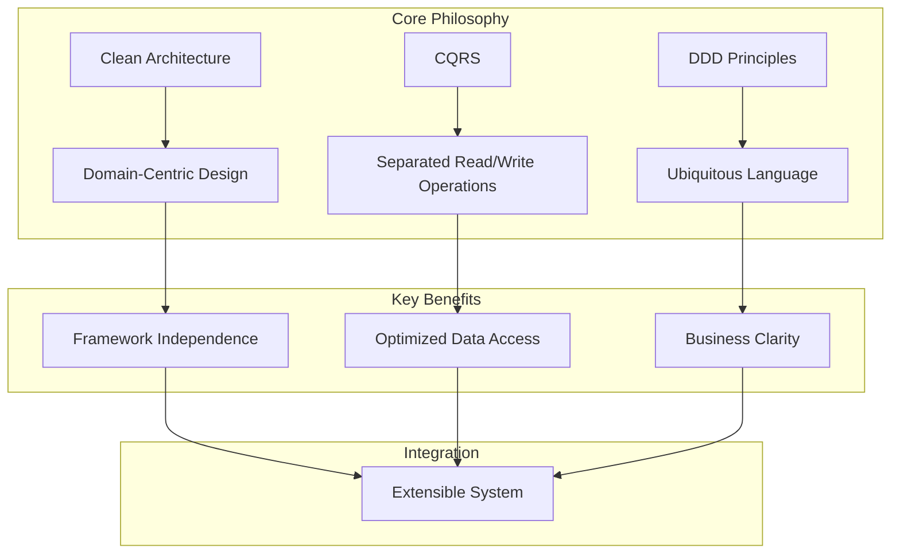
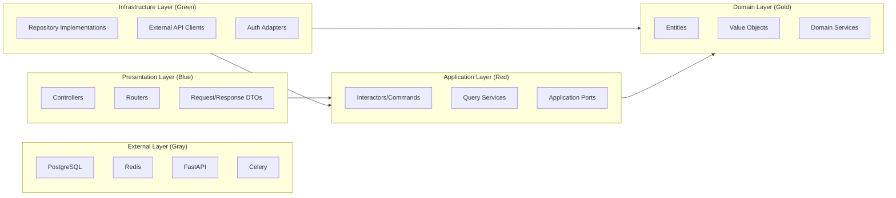
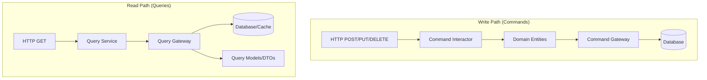

# Introduction to Advanced FastAPI Architecture

## Overview

This documentation provides a comprehensive guide to building production-ready, enterprise-grade FastAPI applications. It combines the practical scaffolding approach of `fastapi-template` with the Clean Architecture principles from `fastapi-clean-example`, and adds async task processing with Celery.



## Architectural Goals

| Goal | Description |
|------|-------------|
| **Testability** | Every layer can be tested in isolation with mocked dependencies |
| **Maintainability** | Changes in one area don't cascade across the system |
| **Scalability** | Easy to add new features, domains, and integrations |
| **Framework Agnosticism** | Core business logic depends on no external frameworks |
| **Performance** | Async-first design with Celery for background tasks |

## Technology Stack

| Layer | Technology | Purpose |
|-------|------------|---------|
| **Web Framework** | FastAPI | API layer, validation, routing |
| **ORM** | SQLAlchemy 2.0 (Async) | Data persistence abstraction |
| **Database** | PostgreSQL | Primary data store |
| **Cache/Broker** | Redis | Caching, Celery message broker |
| **Task Queue** | Celery | Async background job processing |
| **DI Container** | Dishka | Framework-agnostic dependency injection |
| **Migrations** | Alembic | Database schema versioning |
| **Validation** | Pydantic V2 | Request/response schemas |

## Clean Architecture Overview

Clean Architecture, as proposed by Robert C. Martin, organizes software into concentric layers where dependencies point inward toward the most stable, abstract policies.



## The Dependency Rule

> **Dependencies must never point outward within the core.**

This means:
- Domain layer has **zero** external dependencies
- Application layer depends **only** on Domain
- Infrastructure layer implements interfaces defined in Domain/Application
- Presentation layer coordinates everything but contains no business logic

## CQRS Pattern

Command Query Responsibility Segregation separates read and write operations:



| Aspect | Commands | Queries |
|--------|----------|---------|
| **Operations** | Create, Update, Delete | Read |
| **Returns** | Success/Failure + ID | Data payloads |
| **Uses** | Full domain entities | Optimized projections |
| **Consistency** | Strong | Eventually consistent (optional) |

## Document Structure

| Document | Topic |
|----------|-------|
| `01-introduction.md` | Overview and philosophy (this document) |
| `02-project-structure.md` | Folder layout and module organization |
| `03-domain-layer.md` | Entities, Value Objects, Domain Services |
| `04-application-layer.md` | Interactors, CQRS, Application Services |
| `05-infrastructure-layer.md` | Adapters, Repositories, External integrations |
| `06-presentation-layer.md` | API design, Controllers, Error handling |
| `07-database.md` | PostgreSQL setup, migrations, connection pooling |
| `08-orm.md` | SQLAlchemy patterns, imperative mapping |
| `09-dependency-injection.md` | Dishka setup and patterns |
| `10-authentication.md` | JWT, session-based auth, security |
| `11-async-tasks.md` | Celery integration and task patterns |
| `12-redis.md` | Caching strategies, rate limiting |
| `13-testing.md` | Unit, integration, and e2e testing |
| `14-code-quality.md` | Linting, formatting, type checking |
| `15-performance.md` | Optimization strategies |
| `16-deployment.md` | Docker, CI/CD, production setup |

## Quick Start Reference

```python
# Example: Creating a new Use Case (Command)
from dataclasses import dataclass
from typing import TypedDict

@dataclass(frozen=True, slots=True, kw_only=True)
class CreateOrderRequest:
    """Input DTO - plain dataclass for attribute access"""
    customer_id: str
    items: list[str]

class CreateOrderResponse(TypedDict):
    """Output DTO - TypedDict for performance"""
    order_id: str

class CreateOrderInteractor:
    """Application layer - orchestrates domain logic"""
    
    def __init__(
        self,
        order_service: OrderService,  # Domain service
        order_repo: OrderRepository,   # Port (interface)
        transaction: TransactionManager,
    ) -> None:
        self._order_service = order_service
        self._order_repo = order_repo
        self._transaction = transaction
    
    async def execute(self, request: CreateOrderRequest) -> CreateOrderResponse:
        # 1. Create domain entity
        order = self._order_service.create_order(
            customer_id=CustomerId(request.customer_id),
            items=[ItemId(i) for i in request.items],
        )
        # 2. Persist via repository
        self._order_repo.add(order)
        # 3. Commit transaction
        await self._transaction.commit()
        # 4. Return response DTO
        return CreateOrderResponse(order_id=str(order.id_.value))
```

## Key Principles Summary

> [!IMPORTANT]
> **Core Stability**: Domain and Application layers must remain stable and framework-independent.

> [!TIP]
> **Rich Value Objects**: Implement validation and business rules inside Value Objects early to keep Entities clean.

> [!WARNING]
> **Avoid Business Logic Leakage**: Never put domain rules in Controllers or Infrastructure adapters.

---

**Next**: [Project Structure](02-project-structure.md)
