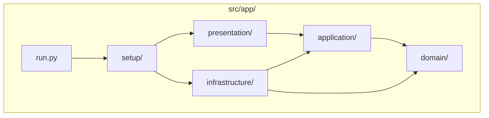
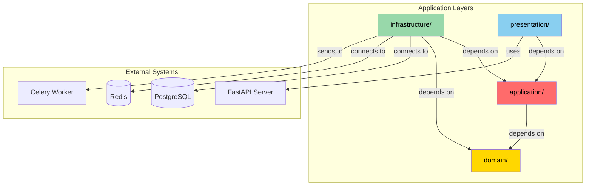

# Project Structure

## Overview

This document outlines the recommended project structure that combines the deployment-ready scaffolding of `fastapi-template` with the Clean Architecture principles from `fastapi-clean-example`.

## Top-Level Layout

```
my-project/
├── .github/                     # GitHub Actions CI/CD workflows
│   └── workflows/
│       ├── test.yml
│       └── deploy.yml
├── .vscode/                     # Editor configuration
├── config/                      # Environment configurations
│   ├── local/
│   │   ├── config.toml
│   │   ├── .secrets.toml
│   │   └── export.toml
│   ├── dev/
│   └── prod/
├── docker/                      # Docker-related files
│   ├── Dockerfile
│   └── docker-compose.yml
├── scripts/                     # Helper scripts
│   ├── start.sh
│   ├── test.sh
│   └── lint.sh
├── src/                         # Application source code
│   └── app/                     # Main application package
├── tests/                       # Test suite
│   ├── unit/
│   ├── integration/
│   └── e2e/
├── alembic.ini                  # Alembic configuration
├── pyproject.toml               # Project dependencies (uv/poetry)
├── Makefile                     # Common task shortcuts
├── .pre-commit-config.yaml      # Pre-commit hooks
└── README.md
```

## Source Code Structure (`src/app/`)



### Complete Structure

```
src/app/
├── __init__.py
├── run.py                           # Application entry point
│
├── domain/                          # DOMAIN LAYER (Gold)
│   ├── __init__.py
│   ├── entities/                    # Business entities with identity
│   │   ├── __init__.py
│   │   ├── base.py                  # Base Entity class
│   │   ├── user.py
│   │   ├── order.py
│   │   └── product.py
│   ├── value_objects/               # Immutable value types
│   │   ├── __init__.py
│   │   ├── base.py                  # Base ValueObject class
│   │   ├── user_id.py
│   │   ├── email.py
│   │   ├── money.py
│   │   └── raw_password.py
│   ├── services/                    # Domain services
│   │   ├── __init__.py
│   │   ├── user_service.py
│   │   └── order_service.py
│   ├── ports/                       # Domain interfaces (optional)
│   │   ├── __init__.py
│   │   └── password_hasher.py
│   ├── enums/                       # Domain enumerations
│   │   ├── __init__.py
│   │   ├── user_role.py
│   │   └── order_status.py
│   └── exceptions/                  # Domain-specific errors
│       ├── __init__.py
│       ├── base.py
│       └── user.py
│
├── application/                     # APPLICATION LAYER (Red)
│   ├── __init__.py
│   ├── commands/                    # Write operations (CQRS)
│   │   ├── __init__.py
│   │   ├── create_user.py
│   │   ├── update_user.py
│   │   └── create_order.py
│   ├── queries/                     # Read operations (CQRS)
│   │   ├── __init__.py
│   │   ├── get_user.py
│   │   ├── list_users.py
│   │   └── get_order_details.py
│   └── common/                      # Shared application components
│       ├── __init__.py
│       ├── ports/                   # Application interfaces
│       │   ├── __init__.py
│       │   ├── unit_of_work.py
│       │   ├── user_repository.py
│       │   └── event_publisher.py
│       ├── services/                # Application services
│       │   ├── __init__.py
│       │   ├── authorization.py
│       │   └── current_user.py
│       └── exceptions/              # Application errors
│           ├── __init__.py
│           └── auth.py
│
├── infrastructure/                  # INFRASTRUCTURE LAYER (Green)
│   ├── __init__.py
│   ├── adapters/                    # Port implementations
│   │   ├── __init__.py
│   │   ├── bcrypt_hasher.py
│   │   └── smtp_email_sender.py
│   ├── persistence/                 # Database layer
│   │   ├── __init__.py
│   │   ├── connection.py
│   │   ├── unit_of_work.py
│   │   ├── repositories/
│   │   │   ├── __init__.py
│   │   │   ├── base.py
│   │   │   ├── user_repository.py
│   │   │   └── order_repository.py
│   │   └── mappings/                # ORM mappings
│   │       ├── __init__.py
│   │       ├── registry.py
│   │       ├── user.py
│   │       └── order.py
│   ├── auth/                        # Authentication context
│   │   ├── __init__.py
│   │   ├── jwt_handler.py
│   │   ├── session_manager.py
│   │   └── identity_provider.py
│   ├── cache/                       # Caching layer
│   │   ├── __init__.py
│   │   └── redis_cache.py
│   ├── tasks/                       # Celery tasks
│   │   ├── __init__.py
│   │   ├── celery_app.py
│   │   ├── email_tasks.py
│   │   └── report_tasks.py
│   └── exceptions/                  # Infrastructure errors
│       ├── __init__.py
│       └── database.py
│
├── presentation/                    # PRESENTATION LAYER (Blue)
│   ├── __init__.py
│   └── http/                        # HTTP interface
│       ├── __init__.py
│       ├── app.py                   # FastAPI app factory
│       ├── controllers/             # API controllers
│       │   ├── __init__.py
│       │   ├── health.py
│       │   ├── auth.py
│       │   ├── users.py
│       │   └── orders.py
│       ├── schemas/                 # Pydantic request/response
│       │   ├── __init__.py
│       │   ├── base.py
│       │   ├── user.py
│       │   └── order.py
│       ├── middleware/              # HTTP middleware
│       │   ├── __init__.py
│       │   ├── cors.py
│       │   └── request_id.py
│       └── errors/                  # Error handling
│           ├── __init__.py
│           └── handlers.py
│
└── setup/                           # Application bootstrap
    ├── __init__.py
    ├── app_factory.py               # Main app builder
    ├── config/                      # Settings management
    │   ├── __init__.py
    │   ├── settings.py
    │   └── environments.py
    └── ioc/                         # Dependency injection
        ├── __init__.py
        ├── container.py
        └── providers/
            ├── __init__.py
            ├── database.py
            ├── services.py
            └── repositories.py
```

## Layer Dependencies



## Module Naming Conventions

| Pattern | Example | Purpose |
|---------|---------|---------|
| `*_service.py` | `user_service.py` | Domain/Application services |
| `*_repository.py` | `user_repository.py` | Repository interfaces/implementations |
| `*_handler.py` | `token_handler.py` | Infrastructure handlers |
| `*_controller.py` | `users_controller.py` | HTTP controllers |
| `*_interactor.py` | `create_user.py` | Command interactors (can omit suffix) |
| `*_query.py` | `list_users.py` | Query services (can omit suffix) |
| `*_tasks.py` | `email_tasks.py` | Celery task modules |

## Key Files

### Entry Point (`src/app/run.py`)

```python
import uvicorn

from app.setup.app_factory import create_app


def main() -> None:
    """Application entry point."""
    app = create_app()
    uvicorn.run(
        app,
        host="0.0.0.0",
        port=8000,
        log_level="info",
    )


if __name__ == "__main__":
    main()
```

### App Factory (`src/app/setup/app_factory.py`)

```python
from fastapi import FastAPI
from dishka.integrations.fastapi import setup_dishka

from app.presentation.http.app import create_fastapi_app
from app.setup.ioc.container import create_container
from app.setup.config.settings import Settings


def create_app() -> FastAPI:
    """Create and configure the FastAPI application."""
    settings = Settings()
    
    # Create FastAPI instance
    app = create_fastapi_app(settings)
    
    # Setup dependency injection
    container = create_container(settings)
    setup_dishka(container, app)
    
    return app
```

## Configuration Structure

```
config/
├── local/
│   ├── config.toml          # Main settings (non-sensitive)
│   ├── .secrets.toml        # Sensitive settings (git-ignored)
│   └── export.toml          # Fields to export to .env
├── dev/
│   ├── config.toml
│   ├── .secrets.toml
│   └── export.toml
└── prod/
    ├── config.toml
    ├── .secrets.toml
    └── export.toml
```

### Sample `config.toml`

```toml
[app]
name = "MyAPI"
debug = true
version = "1.0.0"

[postgres]
host = "localhost"
port = 5432
database = "myapp"

[redis]
host = "localhost"
port = 6379
db = 0

[celery]
broker_url = "redis://localhost:6379/1"
result_backend = "redis://localhost:6379/2"

[auth]
jwt_algorithm = "HS256"
access_token_expire_minutes = 30
```

## Import Rules

> [!IMPORTANT]
> **Domain layer**: Can only import from standard library and domain itself.

> [!WARNING]
> **Application layer**: Can only import from Domain layer.

> [!TIP]
> **Infrastructure/Presentation**: Can import from any layer, but should respect the dependency rule.

### Valid Import Examples

```python
# ✅ Domain importing only from domain
# src/app/domain/services/user_service.py
from app.domain.entities.user import User
from app.domain.value_objects.email import Email

# ✅ Application importing from domain
# src/app/application/commands/create_user.py
from app.domain.entities.user import User
from app.domain.services.user_service import UserService
from app.application.common.ports.user_repository import UserRepository

# ✅ Infrastructure implementing application ports
# src/app/infrastructure/persistence/repositories/user_repository.py
from app.application.common.ports.user_repository import UserRepository
from app.domain.entities.user import User
```

### Invalid Import Examples

```python
# ❌ Domain importing from application
from app.application.commands.create_user import CreateUserInteractor

# ❌ Application importing from infrastructure
from app.infrastructure.persistence.connection import get_session

# ❌ Domain importing from FastAPI
from fastapi import HTTPException
```

---

**Previous**: [Introduction](01-introduction.md) | **Next**: [Domain Layer](03-domain-layer.md)
