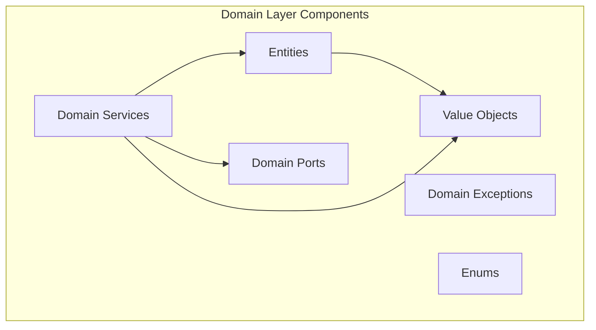

# Domain Layer

## Overview

The Domain layer represents the **core business logic** of your application. It contains entities, value objects, domain services, and domain events. This layer has **zero external dependencies** and is completely framework-agnostic.



## Entities

Entities are objects defined primarily by their **identity** rather than their attributes. Two entities are equal if they have the same ID, regardless of other attribute values.

### Base Entity Class

```python
# src/app/domain/entities/base.py
from typing import Any, Self, cast

from app.domain.value_objects.base import ValueObject


class Entity[T: ValueObject]:
    """
    Base class for domain entities, defined by a unique identity (`id`).
    
    Key characteristics:
    - `id`: Identity that remains constant throughout the entity's lifecycle.
    - Entities are mutable, but are compared solely by their `id`.
    - ID cannot be modified after creation.
    """

    def __new__(cls, *_args: Any, **_kwargs: Any) -> Self:
        if cls is Entity:
            raise TypeError("Base Entity cannot be instantiated directly.")
        return object.__new__(cls)

    def __init__(self, *, id_: T) -> None:
        self.id_ = id_

    def __setattr__(self, name: str, value: Any) -> None:
        """Prevents modifying the `id` after it's set."""
        if name == "id_" and getattr(self, "id_", None) is not None:
            raise AttributeError("Changing entity ID is not permitted.")
        object.__setattr__(self, name, value)

    def __eq__(self, other: object) -> bool:
        """Two entities are equal if they have the same `id`."""
        return type(self) is type(other) and cast(Self, other).id_ == self.id_

    def __hash__(self) -> int:
        """Hash based on entity type and the immutable `id`."""
        return hash((type(self), self.id_))

    def __repr__(self) -> str:
        return f"{type(self).__name__}(id_={self.id_!r})"
```

### User Entity Example

```python
# src/app/domain/entities/user.py
from app.domain.entities.base import Entity
from app.domain.enums.user_role import UserRole
from app.domain.value_objects.user_id import UserId
from app.domain.value_objects.username import Username
from app.domain.value_objects.password_hash import PasswordHash


class User(Entity[UserId]):
    """
    User entity representing a registered user in the system.
    
    This is an anemic entity - it holds data but delegates
    business logic to domain services for simplicity in early development.
    """
    
    def __init__(
        self,
        *,
        id_: UserId,
        username: Username,
        password_hash: PasswordHash,
        role: UserRole = UserRole.USER,
        is_active: bool = True,
    ) -> None:
        super().__init__(id_=id_)
        self.username = username
        self.password_hash = password_hash
        self.role = role
        self.is_active = is_active

    def deactivate(self) -> None:
        """Mark user as inactive (soft delete)."""
        self.is_active = False
    
    def activate(self) -> None:
        """Reactivate a deactivated user."""
        self.is_active = True
    
    def promote_to_admin(self) -> None:
        """Grant admin privileges."""
        self.role = UserRole.ADMIN

    def is_admin(self) -> bool:
        """Check if user has admin privileges."""
        return self.role in (UserRole.ADMIN, UserRole.SUPER_ADMIN)
```

## Value Objects

Value Objects are immutable objects that are defined by their **attributes** rather than identity. They are compared by value, not by reference.

### Base Value Object Class

```python
# src/app/domain/value_objects/base.py
from dataclasses import dataclass, fields
from typing import Any, Self


@dataclass(frozen=True, slots=True, repr=False)
class ValueObject:
    """
    Base class for immutable value objects in domain.
    
    Key characteristics:
    - Immutable (frozen dataclass)
    - Compared by value (all field values must match)
    - Self-validating (via __post_init__)
    - No identity
    
    For simple type tagging, consider `typing.NewType` instead.
    """

    def __new__(cls, *_args: Any, **_kwargs: Any) -> Self:
        if cls is ValueObject:
            raise TypeError("Base ValueObject cannot be instantiated directly.")
        if not fields(cls):
            raise TypeError(f"{cls.__name__} must have at least one field!")
        return object.__new__(cls)

    def __post_init__(self) -> None:
        """Hook for additional initialization and ensuring invariants."""
        pass

    def __repr__(self) -> str:
        items = [f for f in fields(self) if f.repr]
        if not items:
            return f"{type(self).__name__}(<hidden>)"
        if len(items) == 1:
            return f"{type(self).__name__}({getattr(self, items[0].name)!r})"
        pairs = ", ".join(f"{f.name}={getattr(self, f.name)!r}" for f in items)
        return f"{type(self).__name__}({pairs})"
```

### Value Object Examples

```python
# src/app/domain/value_objects/user_id.py
from dataclasses import dataclass, field
from uuid import UUID

from uuid_utils import uuid7

from app.domain.value_objects.base import ValueObject


@dataclass(frozen=True, slots=True)
class UserId(ValueObject):
    """Unique identifier for a User entity."""
    
    value: UUID = field(default_factory=uuid7)

    def __post_init__(self) -> None:
        if not isinstance(self.value, UUID):
            object.__setattr__(self, "value", UUID(str(self.value)))
```

```python
# src/app/domain/value_objects/email.py
import re
from dataclasses import dataclass

from app.domain.value_objects.base import ValueObject
from app.domain.exceptions.validation import InvalidEmailError


@dataclass(frozen=True, slots=True)
class Email(ValueObject):
    """Email address value object with validation."""
    
    value: str

    # Simple regex - use a library for production
    EMAIL_PATTERN = re.compile(r"^[a-zA-Z0-9_.+-]+@[a-zA-Z0-9-]+\.[a-zA-Z0-9-.]+$")

    def __post_init__(self) -> None:
        if not self.EMAIL_PATTERN.match(self.value):
            raise InvalidEmailError(f"Invalid email format: {self.value}")
        # Normalize to lowercase
        object.__setattr__(self, "value", self.value.lower())
```

```python
# src/app/domain/value_objects/money.py
from dataclasses import dataclass
from decimal import Decimal
from typing import ClassVar

from app.domain.value_objects.base import ValueObject
from app.domain.exceptions.validation import InvalidMoneyError


@dataclass(frozen=True, slots=True)
class Money(ValueObject):
    """
    Money value object with currency.
    
    Example of a value object with multiple fields.
    """
    
    amount: Decimal
    currency: str
    
    VALID_CURRENCIES: ClassVar[frozenset[str]] = frozenset({"USD", "EUR", "GBP", "MYR"})

    def __post_init__(self) -> None:
        if self.amount < 0:
            raise InvalidMoneyError("Amount cannot be negative")
        if self.currency not in self.VALID_CURRENCIES:
            raise InvalidMoneyError(f"Invalid currency: {self.currency}")

    def add(self, other: "Money") -> "Money":
        """Add two money values (must have same currency)."""
        if self.currency != other.currency:
            raise InvalidMoneyError("Cannot add different currencies")
        return Money(amount=self.amount + other.amount, currency=self.currency)

    def multiply(self, factor: Decimal) -> "Money":
        """Multiply money by a factor."""
        return Money(amount=self.amount * factor, currency=self.currency)
```

```python
# src/app/domain/value_objects/username.py
import re
from dataclasses import dataclass
from typing import ClassVar, Final

from app.domain.value_objects.base import ValueObject
from app.domain.exceptions.user import InvalidUsernameError


@dataclass(frozen=True, slots=True)
class Username(ValueObject):
    """Username value object with validation rules."""
    
    value: str
    
    MIN_LEN: ClassVar[Final[int]] = 3
    MAX_LEN: ClassVar[Final[int]] = 32
    PATTERN: ClassVar[re.Pattern[str]] = re.compile(r"^[a-zA-Z][a-zA-Z0-9_-]*$")

    def __post_init__(self) -> None:
        if len(self.value) < self.MIN_LEN:
            raise InvalidUsernameError(
                f"Username must be at least {self.MIN_LEN} characters"
            )
        if len(self.value) > self.MAX_LEN:
            raise InvalidUsernameError(
                f"Username must be at most {self.MAX_LEN} characters"
            )
        if not self.PATTERN.match(self.value):
            raise InvalidUsernameError(
                "Username must start with a letter and contain only "
                "letters, numbers, underscores, and hyphens"
            )
```

## Domain Services

Domain services contain business logic that doesn't naturally fit within a single entity or value object.

```python
# src/app/domain/services/user_service.py
from app.domain.entities.user import User
from app.domain.enums.user_role import UserRole
from app.domain.ports.password_hasher import PasswordHasher
from app.domain.value_objects.user_id import UserId
from app.domain.value_objects.username import Username
from app.domain.value_objects.raw_password import RawPassword
from app.domain.value_objects.password_hash import PasswordHash


class UserService:
    """
    Domain service for user-related operations.
    
    Contains logic that spans multiple entities/value objects
    or requires external collaborators (like password hasher).
    """
    
    def __init__(self, password_hasher: PasswordHasher) -> None:
        self._password_hasher = password_hasher
    
    async def create_user(
        self,
        username: Username,
        password: RawPassword,
        role: UserRole = UserRole.USER,
    ) -> User:
        """Create a new user with hashed password."""
        password_hash = await self._password_hasher.hash(password)
        
        return User(
            id_=UserId(),
            username=username,
            password_hash=PasswordHash(password_hash),
            role=role,
            is_active=True,
        )
    
    async def verify_password(
        self,
        user: User,
        password: RawPassword,
    ) -> bool:
        """Verify a password against user's stored hash."""
        return await self._password_hasher.verify(
            password,
            user.password_hash.value,
        )
    
    async def change_password(
        self,
        user: User,
        new_password: RawPassword,
    ) -> None:
        """Change user's password."""
        new_hash = await self._password_hasher.hash(new_password)
        user.password_hash = PasswordHash(new_hash)
```

## Domain Ports (Interfaces)

Ports define interfaces for external dependencies that the domain needs. These are implemented in the Infrastructure layer.

```python
# src/app/domain/ports/password_hasher.py
from abc import ABC, abstractmethod

from app.domain.value_objects.raw_password import RawPassword


class PasswordHasher(ABC):
    """Port for password hashing operations."""
    
    @abstractmethod
    async def hash(self, password: RawPassword) -> bytes:
        """Hash a raw password."""
        ...
    
    @abstractmethod
    async def verify(self, password: RawPassword, hash_: bytes) -> bool:
        """Verify a password against a hash."""
        ...
```

## Domain Enums

```python
# src/app/domain/enums/user_role.py
from enum import Enum, auto


class UserRole(Enum):
    """User role enumeration."""
    
    USER = auto()
    ADMIN = auto()
    SUPER_ADMIN = auto()
```

```python
# src/app/domain/enums/order_status.py
from enum import Enum, auto


class OrderStatus(Enum):
    """Order status enumeration with workflow rules."""
    
    PENDING = auto()
    CONFIRMED = auto()
    PROCESSING = auto()
    SHIPPED = auto()
    DELIVERED = auto()
    CANCELLED = auto()
    
    def can_transition_to(self, new_status: "OrderStatus") -> bool:
        """Check if transition to new status is valid."""
        valid_transitions = {
            OrderStatus.PENDING: {OrderStatus.CONFIRMED, OrderStatus.CANCELLED},
            OrderStatus.CONFIRMED: {OrderStatus.PROCESSING, OrderStatus.CANCELLED},
            OrderStatus.PROCESSING: {OrderStatus.SHIPPED, OrderStatus.CANCELLED},
            OrderStatus.SHIPPED: {OrderStatus.DELIVERED},
            OrderStatus.DELIVERED: set(),
            OrderStatus.CANCELLED: set(),
        }
        return new_status in valid_transitions.get(self, set())
```

## Domain Exceptions

```python
# src/app/domain/exceptions/base.py
class DomainError(Exception):
    """Base exception for all domain errors."""
    pass


class ValidationError(DomainError):
    """Base exception for validation errors."""
    pass


class BusinessRuleViolationError(DomainError):
    """Exception for business rule violations."""
    pass
```

```python
# src/app/domain/exceptions/user.py
from app.domain.exceptions.base import ValidationError, BusinessRuleViolationError


class InvalidUsernameError(ValidationError):
    """Raised when username doesn't meet requirements."""
    pass


class InvalidEmailError(ValidationError):
    """Raised when email format is invalid."""
    pass


class UsernameAlreadyExistsError(BusinessRuleViolationError):
    """Raised when username is already taken."""
    pass


class UserNotActiveError(BusinessRuleViolationError):
    """Raised when operation requires active user."""
    pass
```

## Anemic vs Rich Domain Models

| Aspect | Anemic | Rich |
|--------|--------|------|
| **Entity behavior** | Data holder only | Contains business logic |
| **Validation** | External (services) | Internal (self-validating) |
| **Invariants** | Enforced externally | Enforced by entity |
| **Complexity** | Lower | Higher |
| **Recommendation** | Early development | Mature, stable domains |

> [!TIP]
> Start with **anemic entities** and **rich value objects**. As the domain becomes clearer, gradually enrich entities with behavior.

---

**Previous**: [Project Structure](02-project-structure.md) | **Next**: [Application Layer](04-application-layer.md)
