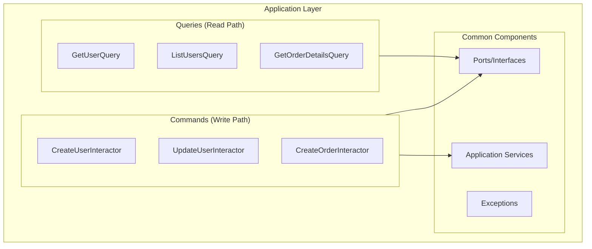
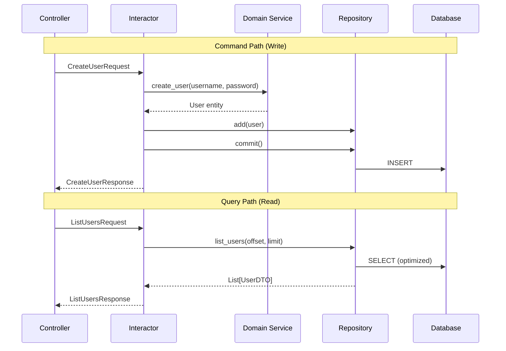

# Application Layer

## Overview

The Application layer orchestrates the domain logic to fulfill use cases. It contains **interactors** (for commands) and **query services** (for queries), implementing the CQRS pattern.



## Interactors (Commands)

Interactors handle write operations and business-critical reads. Each interactor represents a single business operation.

### Structure Pattern

```python
# src/app/application/commands/create_user.py
import logging
from dataclasses import dataclass
from typing import TypedDict
from uuid import UUID

from app.application.common.ports.unit_of_work import UnitOfWork
from app.application.common.ports.user_repository import UserRepository
from app.application.common.services.authorization import authorize
from app.application.common.services.current_user import CurrentUserService
from app.domain.entities.user import User
from app.domain.enums.user_role import UserRole
from app.domain.services.user_service import UserService
from app.domain.value_objects.raw_password import RawPassword
from app.domain.value_objects.username import Username

log = logging.getLogger(__name__)


# Input DTO - Use dataclass for attribute access
@dataclass(frozen=True, slots=True, kw_only=True)
class CreateUserRequest:
    """Request DTO for creating a user."""
    username: str
    password: str
    role: UserRole


# Output DTO - Use TypedDict for performance
class CreateUserResponse(TypedDict):
    """Response DTO for created user."""
    id: UUID
    username: str


class CreateUserInteractor:
    """
    Creates a new user in the system.
    
    Responsibilities:
    - Validate authorization
    - Orchestrate domain logic
    - Coordinate with repositories
    - Manage transaction
    """
    
    def __init__(
        self,
        current_user_service: CurrentUserService,
        user_service: UserService,
        user_repository: UserRepository,
        unit_of_work: UnitOfWork,
    ) -> None:
        self._current_user_service = current_user_service
        self._user_service = user_service
        self._user_repository = user_repository
        self._uow = unit_of_work

    async def execute(self, request: CreateUserRequest) -> CreateUserResponse:
        """
        Execute the create user command.
        
        Raises:
            AuthenticationError: If user is not authenticated
            AuthorizationError: If user lacks permission
            UsernameAlreadyExistsError: If username is taken
        """
        log.info("Creating user: %s", request.username)
        
        # 1. Get current user for authorization
        current_user = await self._current_user_service.get_current_user()
        
        # 2. Authorize the operation
        authorize(
            permission="users:create",
            subject=current_user,
            context={"target_role": request.role},
        )
        
        # 3. Create domain objects (validation happens here)
        username = Username(request.username)
        password = RawPassword(request.password)
        
        # 4. Use domain service to create user
        user = await self._user_service.create_user(
            username=username,
            password=password,
            role=request.role,
        )
        
        # 5. Persist via repository
        self._user_repository.add(user)
        
        # 6. Commit transaction
        await self._uow.commit()
        
        log.info("User created: %s (id=%s)", user.username.value, user.id_.value)
        
        return CreateUserResponse(
            id=user.id_.value,
            username=user.username.value,
        )
```

### Update Interactor Example

```python
# src/app/application/commands/change_password.py
from dataclasses import dataclass

from app.application.common.ports.unit_of_work import UnitOfWork
from app.application.common.ports.user_repository import UserRepository
from app.application.common.services.current_user import CurrentUserService
from app.domain.exceptions.auth import InvalidPasswordError
from app.domain.services.user_service import UserService
from app.domain.value_objects.raw_password import RawPassword


@dataclass(frozen=True, slots=True, kw_only=True)
class ChangePasswordRequest:
    current_password: str
    new_password: str


class ChangePasswordInteractor:
    """Change the current user's password."""
    
    def __init__(
        self,
        current_user_service: CurrentUserService,
        user_service: UserService,
        user_repository: UserRepository,
        unit_of_work: UnitOfWork,
    ) -> None:
        self._current_user_service = current_user_service
        self._user_service = user_service
        self._user_repository = user_repository
        self._uow = unit_of_work

    async def execute(self, request: ChangePasswordRequest) -> None:
        """
        Execute password change.
        
        Raises:
            AuthenticationError: If not authenticated
            InvalidPasswordError: If current password is wrong
        """
        user = await self._current_user_service.get_current_user()
        
        # Verify current password
        current = RawPassword(request.current_password)
        is_valid = await self._user_service.verify_password(user, current)
        if not is_valid:
            raise InvalidPasswordError("Current password is incorrect")
        
        # Change password
        new_password = RawPassword(request.new_password)
        await self._user_service.change_password(user, new_password)
        
        # Persist changes
        self._user_repository.update(user)
        await self._uow.commit()
```

## Query Services

Query services handle read operations, optimized for performance. They bypass domain entities for simple data retrieval.

```python
# src/app/application/queries/list_users.py
from dataclasses import dataclass
from typing import TypedDict
from uuid import UUID

from app.application.common.ports.user_query_gateway import UserQueryGateway
from app.application.common.services.authorization import authorize
from app.application.common.services.current_user import CurrentUserService


@dataclass(frozen=True, slots=True, kw_only=True)
class ListUsersRequest:
    """Request parameters for listing users."""
    page: int = 1
    page_size: int = 20
    is_active: bool | None = None


class UserListItem(TypedDict):
    """Single user item in list response."""
    id: UUID
    username: str
    role: str
    is_active: bool


class ListUsersResponse(TypedDict):
    """Response for user list query."""
    users: list[UserListItem]
    total: int
    page: int
    page_size: int


class ListUsersQuery:
    """
    Query service for listing users.
    
    Uses read-optimized gateway instead of full entities.
    """
    
    def __init__(
        self,
        current_user_service: CurrentUserService,
        user_query_gateway: UserQueryGateway,
    ) -> None:
        self._current_user_service = current_user_service
        self._query_gateway = user_query_gateway

    async def execute(self, request: ListUsersRequest) -> ListUsersResponse:
        """Execute the list users query."""
        current_user = await self._current_user_service.get_current_user()
        authorize(permission="users:read", subject=current_user)
        
        # Use optimized query - no domain entities loaded
        users, total = await self._query_gateway.list_users(
            offset=(request.page - 1) * request.page_size,
            limit=request.page_size,
            is_active=request.is_active,
        )
        
        return ListUsersResponse(
            users=users,
            total=total,
            page=request.page,
            page_size=request.page_size,
        )
```

## Application Ports

Ports define interfaces that the Application layer requires from the Infrastructure layer.

```python
# src/app/application/common/ports/user_repository.py
from abc import ABC, abstractmethod
from uuid import UUID

from app.domain.entities.user import User
from app.domain.value_objects.user_id import UserId
from app.domain.value_objects.username import Username


class UserRepository(ABC):
    """Port for user persistence operations (command side)."""
    
    @abstractmethod
    def add(self, user: User) -> None:
        """Add a new user to the repository."""
        ...
    
    @abstractmethod
    def update(self, user: User) -> None:
        """Update an existing user."""
        ...
    
    @abstractmethod
    async def get_by_id(self, user_id: UserId) -> User | None:
        """Get user by ID."""
        ...
    
    @abstractmethod
    async def get_by_username(self, username: Username) -> User | None:
        """Get user by username."""
        ...
    
    @abstractmethod
    async def exists_by_username(self, username: Username) -> bool:
        """Check if username exists."""
        ...
```

```python
# src/app/application/common/ports/user_query_gateway.py
from abc import ABC, abstractmethod
from typing import TypedDict
from uuid import UUID


class UserListItem(TypedDict):
    id: UUID
    username: str
    role: str
    is_active: bool


class UserQueryGateway(ABC):
    """Port for optimized user read operations (query side)."""
    
    @abstractmethod
    async def list_users(
        self,
        offset: int,
        limit: int,
        is_active: bool | None = None,
    ) -> tuple[list[UserListItem], int]:
        """List users with pagination. Returns (users, total_count)."""
        ...
    
    @abstractmethod
    async def get_user_details(self, user_id: UUID) -> dict | None:
        """Get detailed user information."""
        ...
```

```python
# src/app/application/common/ports/unit_of_work.py
from abc import ABC, abstractmethod
from typing import Self


class UnitOfWork(ABC):
    """Port for transaction management."""
    
    @abstractmethod
    async def commit(self) -> None:
        """Commit the current transaction."""
        ...
    
    @abstractmethod
    async def rollback(self) -> None:
        """Rollback the current transaction."""
        ...
    
    @abstractmethod
    async def __aenter__(self) -> Self:
        """Enter transaction context."""
        ...
    
    @abstractmethod
    async def __aexit__(self, exc_type, exc_val, exc_tb) -> None:
        """Exit transaction context with automatic rollback on error."""
        ...
```

```python
# src/app/application/common/ports/task_queue.py
from abc import ABC, abstractmethod
from typing import Any


class TaskQueue(ABC):
    """Port for async task scheduling (Celery)."""
    
    @abstractmethod
    def enqueue(
        self,
        task_name: str,
        *args: Any,
        countdown: int | None = None,
        **kwargs: Any,
    ) -> str:
        """
        Enqueue a task for async execution.
        
        Returns:
            Task ID for tracking.
        """
        ...
    
    @abstractmethod
    async def get_result(self, task_id: str, timeout: float = 10.0) -> Any:
        """Get the result of a completed task."""
        ...
```

## Application Services

Shared services used across multiple interactors.

```python
# src/app/application/common/services/current_user.py
from abc import ABC, abstractmethod

from app.domain.entities.user import User


class CurrentUserService(ABC):
    """Service for accessing the current authenticated user."""
    
    @abstractmethod
    async def get_current_user(self) -> User:
        """
        Get the current authenticated user.
        
        Raises:
            AuthenticationError: If no user is authenticated.
        """
        ...
    
    @abstractmethod
    async def get_current_user_or_none(self) -> User | None:
        """Get current user or None if not authenticated."""
        ...
```

```python
# src/app/application/common/services/authorization.py
from dataclasses import dataclass
from typing import Any

from app.application.common.exceptions.auth import AuthorizationError
from app.domain.entities.user import User
from app.domain.enums.user_role import UserRole


@dataclass
class Permission:
    """Permission definition."""
    name: str
    required_roles: frozenset[UserRole]


# Permission registry
PERMISSIONS: dict[str, Permission] = {
    "users:create": Permission(
        name="users:create",
        required_roles=frozenset({UserRole.ADMIN, UserRole.SUPER_ADMIN}),
    ),
    "users:read": Permission(
        name="users:read",
        required_roles=frozenset({UserRole.ADMIN, UserRole.SUPER_ADMIN}),
    ),
    "users:delete": Permission(
        name="users:delete",
        required_roles=frozenset({UserRole.SUPER_ADMIN}),
    ),
}


def authorize(
    permission: str,
    subject: User,
    context: dict[str, Any] | None = None,
) -> None:
    """
    Check if subject has the required permission.
    
    Raises:
        AuthorizationError: If permission is denied.
    """
    perm = PERMISSIONS.get(permission)
    if not perm:
        raise AuthorizationError(f"Unknown permission: {permission}")
    
    if subject.role not in perm.required_roles:
        raise AuthorizationError(
            f"Permission denied: {permission} requires one of {perm.required_roles}"
        )
    
    # Context-specific checks
    if context:
        _check_context_rules(permission, subject, context)


def _check_context_rules(
    permission: str,
    subject: User,
    context: dict[str, Any],
) -> None:
    """Additional context-based authorization rules."""
    if permission == "users:create":
        target_role = context.get("target_role")
        if target_role == UserRole.ADMIN and subject.role != UserRole.SUPER_ADMIN:
            raise AuthorizationError("Only super admins can create admin users")
```

## Application Exceptions

```python
# src/app/application/common/exceptions/base.py
class ApplicationError(Exception):
    """Base exception for application layer errors."""
    pass


class AuthenticationError(ApplicationError):
    """Raised when authentication fails."""
    pass


class AuthorizationError(ApplicationError):
    """Raised when authorization fails."""
    pass


class NotFoundError(ApplicationError):
    """Raised when a requested resource is not found."""
    pass
```

## CQRS Flow Diagram



---

**Previous**: [Domain Layer](03-domain-layer.md) | **Next**: [Infrastructure Layer](05-infrastructure-layer.md)
