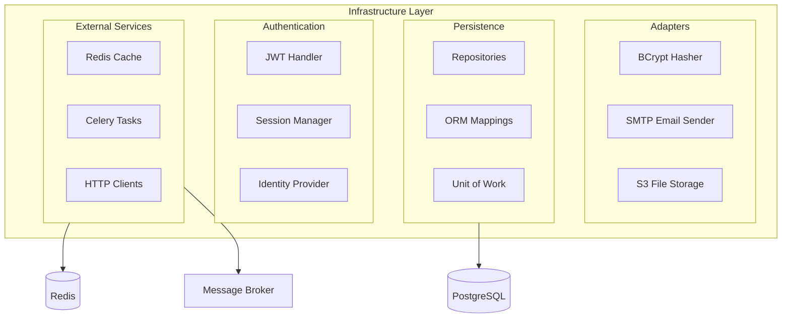

# Infrastructure Layer

## Overview

The Infrastructure layer implements the ports defined in the Domain and Application layers. It handles all external concerns: databases, caching, external APIs, authentication, and background tasks.



## Repository Implementations

Repositories implement the persistence ports defined in the Application layer.

### Base Repository Pattern

```python
# src/app/infrastructure/persistence/repositories/base.py
from typing import Generic, TypeVar
from uuid import UUID

from sqlalchemy import select
from sqlalchemy.ext.asyncio import AsyncSession

from app.domain.entities.base import Entity
from app.domain.value_objects.base import ValueObject

T = TypeVar("T", bound=Entity)
ID = TypeVar("ID", bound=ValueObject)


class SQLAlchemyRepository(Generic[T, ID]):
    """Base repository using SQLAlchemy async session."""
    
    def __init__(self, session: AsyncSession) -> None:
        self._session = session
    
    def add(self, entity: T) -> None:
        """Add entity to session (will be persisted on flush/commit)."""
        self._session.add(entity)
    
    def update(self, entity: T) -> None:
        """Mark entity for update (SQLAlchemy tracks changes automatically)."""
        # With imperative mapping, changes are tracked automatically
        pass
    
    def remove(self, entity: T) -> None:
        """Mark entity for deletion."""
        self._session.delete(entity)
```

### User Repository Implementation

```python
# src/app/infrastructure/persistence/repositories/user_repository.py
from sqlalchemy import select, exists

from app.application.common.ports.user_repository import UserRepository
from app.domain.entities.user import User
from app.domain.value_objects.user_id import UserId
from app.domain.value_objects.username import Username
from app.infrastructure.persistence.repositories.base import SQLAlchemyRepository
from app.infrastructure.persistence.mappings.user import users_table


class SQLAlchemyUserRepository(SQLAlchemyRepository[User, UserId], UserRepository):
    """SQLAlchemy implementation of UserRepository."""
    
    async def get_by_id(self, user_id: UserId) -> User | None:
        """Get user by ID."""
        return await self._session.get(User, user_id.value)
    
    async def get_by_username(self, username: Username) -> User | None:
        """Get user by username."""
        stmt = select(User).where(users_table.c.username == username.value)
        result = await self._session.execute(stmt)
        return result.scalar_one_or_none()
    
    async def exists_by_username(self, username: Username) -> bool:
        """Check if username exists."""
        stmt = select(
            exists().where(users_table.c.username == username.value)
        )
        result = await self._session.execute(stmt)
        return result.scalar() or False
```

### Query Gateway Implementation

```python
# src/app/infrastructure/persistence/repositories/user_query_gateway.py
from uuid import UUID

from sqlalchemy import select, func

from app.application.common.ports.user_query_gateway import (
    UserQueryGateway,
    UserListItem,
)
from app.infrastructure.persistence.mappings.user import users_table


class SQLAlchemyUserQueryGateway(UserQueryGateway):
    """
    Optimized read-only gateway for user queries.
    
    Returns lightweight DTOs instead of full domain entities.
    """
    
    def __init__(self, session) -> None:
        self._session = session
    
    async def list_users(
        self,
        offset: int,
        limit: int,
        is_active: bool | None = None,
    ) -> tuple[list[UserListItem], int]:
        """List users with pagination."""
        # Build base query
        query = select(
            users_table.c.id,
            users_table.c.username,
            users_table.c.role,
            users_table.c.is_active,
        )
        
        # Apply filters
        if is_active is not None:
            query = query.where(users_table.c.is_active == is_active)
        
        # Get total count
        count_query = select(func.count()).select_from(users_table)
        if is_active is not None:
            count_query = count_query.where(users_table.c.is_active == is_active)
        total = (await self._session.execute(count_query)).scalar() or 0
        
        # Apply pagination
        query = query.offset(offset).limit(limit)
        
        # Execute and map to DTOs
        result = await self._session.execute(query)
        users = [
            UserListItem(
                id=row.id,
                username=row.username,
                role=row.role.name,
                is_active=row.is_active,
            )
            for row in result
        ]
        
        return users, total
```

## Unit of Work

```python
# src/app/infrastructure/persistence/unit_of_work.py
from typing import Self

from sqlalchemy.ext.asyncio import AsyncSession

from app.application.common.ports.unit_of_work import UnitOfWork


class SQLAlchemyUnitOfWork(UnitOfWork):
    """SQLAlchemy implementation of Unit of Work pattern."""
    
    def __init__(self, session: AsyncSession) -> None:
        self._session = session
    
    async def commit(self) -> None:
        """Commit the current transaction."""
        await self._session.commit()
    
    async def rollback(self) -> None:
        """Rollback the current transaction."""
        await self._session.rollback()
    
    async def __aenter__(self) -> Self:
        """Begin a new transaction."""
        return self
    
    async def __aexit__(self, exc_type, exc_val, exc_tb) -> None:
        """Rollback on exception, otherwise do nothing (explicit commit required)."""
        if exc_type is not None:
            await self.rollback()
```

## Adapter Implementations

### Password Hasher Adapter

```python
# src/app/infrastructure/adapters/bcrypt_hasher.py
import asyncio
from concurrent.futures import ThreadPoolExecutor

import bcrypt

from app.domain.ports.password_hasher import PasswordHasher
from app.domain.value_objects.raw_password import RawPassword


class BCryptPasswordHasher(PasswordHasher):
    """BCrypt implementation of password hashing."""
    
    def __init__(
        self,
        pepper: bytes,
        rounds: int = 12,
        executor: ThreadPoolExecutor | None = None,
    ) -> None:
        self._pepper = pepper
        self._rounds = rounds
        self._executor = executor or ThreadPoolExecutor(max_workers=4)
    
    async def hash(self, password: RawPassword) -> bytes:
        """Hash password with pepper and salt."""
        peppered = password.value.encode() + self._pepper
        
        # Run CPU-intensive bcrypt in thread pool
        loop = asyncio.get_running_loop()
        return await loop.run_in_executor(
            self._executor,
            lambda: bcrypt.hashpw(peppered, bcrypt.gensalt(self._rounds)),
        )
    
    async def verify(self, password: RawPassword, hash_: bytes) -> bool:
        """Verify password against stored hash."""
        peppered = password.value.encode() + self._pepper
        
        loop = asyncio.get_running_loop()
        return await loop.run_in_executor(
            self._executor,
            lambda: bcrypt.checkpw(peppered, hash_),
        )
```

### Email Sender Adapter

```python
# src/app/infrastructure/adapters/email_sender.py
import smtplib
from email.mime.text import MIMEText
from email.mime.multipart import MIMEMultipart

from app.application.common.ports.email_sender import EmailSender, EmailMessage


class SMTPEmailSender(EmailSender):
    """SMTP implementation of email sending."""
    
    def __init__(
        self,
        host: str,
        port: int,
        username: str,
        password: str,
        from_address: str,
        use_tls: bool = True,
    ) -> None:
        self._host = host
        self._port = port
        self._username = username
        self._password = password
        self._from_address = from_address
        self._use_tls = use_tls
    
    async def send(self, message: EmailMessage) -> None:
        """Send an email message."""
        msg = MIMEMultipart("alternative")
        msg["Subject"] = message.subject
        msg["From"] = self._from_address
        msg["To"] = message.to
        
        if message.body_text:
            msg.attach(MIMEText(message.body_text, "plain"))
        if message.body_html:
            msg.attach(MIMEText(message.body_html, "html"))
        
        # Use thread pool for blocking SMTP operations
        import asyncio
        loop = asyncio.get_running_loop()
        await loop.run_in_executor(None, self._send_sync, msg)
    
    def _send_sync(self, msg: MIMEMultipart) -> None:
        """Synchronous send operation."""
        with smtplib.SMTP(self._host, self._port) as server:
            if self._use_tls:
                server.starttls()
            server.login(self._username, self._password)
            server.send_message(msg)
```

## Authentication Infrastructure

### JWT Handler

```python
# src/app/infrastructure/auth/jwt_handler.py
from datetime import datetime, timedelta, timezone
from typing import Any
from uuid import UUID

import jwt
from pydantic import BaseModel


class TokenPayload(BaseModel):
    """JWT token payload structure."""
    sub: str  # Subject (user ID)
    exp: datetime  # Expiration
    iat: datetime  # Issued at
    jti: str | None = None  # JWT ID (for session tracking)


class JWTHandler:
    """Handle JWT token creation and validation."""
    
    def __init__(
        self,
        secret_key: str,
        algorithm: str = "HS256",
        access_token_expire_minutes: int = 30,
    ) -> None:
        self._secret_key = secret_key
        self._algorithm = algorithm
        self._expire_minutes = access_token_expire_minutes
    
    def create_access_token(
        self,
        user_id: UUID,
        session_id: str | None = None,
        extra_claims: dict[str, Any] | None = None,
    ) -> str:
        """Create a new access token."""
        now = datetime.now(timezone.utc)
        expire = now + timedelta(minutes=self._expire_minutes)
        
        payload = {
            "sub": str(user_id),
            "exp": expire,
            "iat": now,
            "jti": session_id,
            **(extra_claims or {}),
        }
        
        return jwt.encode(payload, self._secret_key, algorithm=self._algorithm)
    
    def decode_token(self, token: str) -> TokenPayload:
        """
        Decode and validate a token.
        
        Raises:
            jwt.InvalidTokenError: If token is invalid or expired.
        """
        payload = jwt.decode(
            token,
            self._secret_key,
            algorithms=[self._algorithm],
        )
        return TokenPayload(**payload)
```

### Identity Provider

```python
# src/app/infrastructure/auth/identity_provider.py
from uuid import UUID

from app.application.common.exceptions.auth import AuthenticationError
from app.application.common.ports.user_repository import UserRepository
from app.application.common.services.current_user import CurrentUserService
from app.domain.entities.user import User
from app.domain.value_objects.user_id import UserId
from app.infrastructure.auth.jwt_handler import JWTHandler, TokenPayload


class TokenIdentityProvider(CurrentUserService):
    """
    Identity provider that extracts current user from JWT token.
    
    Bridges the auth context with the main application context.
    """
    
    def __init__(
        self,
        jwt_handler: JWTHandler,
        user_repository: UserRepository,
        token: str | None,
    ) -> None:
        self._jwt_handler = jwt_handler
        self._user_repository = user_repository
        self._token = token
        self._cached_user: User | None = None
    
    async def get_current_user(self) -> User:
        """Get authenticated user or raise."""
        user = await self.get_current_user_or_none()
        if not user:
            raise AuthenticationError("Not authenticated")
        return user
    
    async def get_current_user_or_none(self) -> User | None:
        """Get authenticated user or None."""
        if self._cached_user:
            return self._cached_user
        
        if not self._token:
            return None
        
        try:
            payload = self._jwt_handler.decode_token(self._token)
            user_id = UserId(UUID(payload.sub))
            user = await self._user_repository.get_by_id(user_id)
            
            if user and user.is_active:
                self._cached_user = user
                return user
                
        except Exception:
            return None
        
        return None
```

## Database Connection

```python
# src/app/infrastructure/persistence/connection.py
from sqlalchemy.ext.asyncio import (
    AsyncEngine,
    AsyncSession,
    async_sessionmaker,
    create_async_engine,
)

from app.setup.config.settings import DatabaseSettings


def create_engine(settings: DatabaseSettings) -> AsyncEngine:
    """Create SQLAlchemy async engine."""
    return create_async_engine(
        settings.url,
        echo=settings.echo,
        pool_size=settings.pool_size,
        max_overflow=settings.max_overflow,
        pool_pre_ping=True,
    )


def create_session_factory(engine: AsyncEngine) -> async_sessionmaker[AsyncSession]:
    """Create session factory."""
    return async_sessionmaker(
        engine,
        class_=AsyncSession,
        expire_on_commit=False,
        autoflush=False,
    )
```

## Infrastructure Exceptions

```python
# src/app/infrastructure/exceptions/database.py
from app.domain.exceptions.base import DomainError


class DatabaseError(Exception):
    """Base exception for database errors."""
    pass


class ConnectionError(DatabaseError):
    """Database connection failed."""
    pass


class IntegrityError(DatabaseError):
    """Database integrity constraint violation."""
    pass


def handle_db_exception(exc: Exception, context: str = "") -> None:
    """
    Convert database exceptions to domain exceptions.
    
    This allows infrastructure errors to be re-raised as domain errors
    when they represent business rule violations.
    """
    from sqlalchemy.exc import IntegrityError as SQLAIntegrityError
    
    if isinstance(exc, SQLAIntegrityError):
        error_str = str(exc.orig)
        
        # Map constraint violations to domain exceptions
        if "unique constraint" in error_str.lower():
            if "username" in error_str.lower():
                from app.domain.exceptions.user import UsernameAlreadyExistsError
                raise UsernameAlreadyExistsError(context) from exc
        
        raise IntegrityError(str(exc)) from exc
    
    raise exc
```

## Celery Task Queue Adapter

```python
# src/app/infrastructure/tasks/task_queue.py
from typing import Any

from celery import Celery
from celery.result import AsyncResult

from app.application.common.ports.task_queue import TaskQueue


class CeleryTaskQueue(TaskQueue):
    """Celery implementation of task queue."""
    
    def __init__(self, celery_app: Celery) -> None:
        self._app = celery_app
    
    def enqueue(
        self,
        task_name: str,
        *args: Any,
        countdown: int | None = None,
        **kwargs: Any,
    ) -> str:
        """Enqueue a task for async execution."""
        task = self._app.send_task(
            task_name,
            args=args,
            kwargs=kwargs,
            countdown=countdown,
        )
        return task.id
    
    async def get_result(self, task_id: str, timeout: float = 10.0) -> Any:
        """Get the result of a completed task."""
        import asyncio
        
        result = AsyncResult(task_id, app=self._app)
        
        # Poll for result with timeout
        start = asyncio.get_event_loop().time()
        while (asyncio.get_event_loop().time() - start) < timeout:
            if result.ready():
                return result.get()
            await asyncio.sleep(0.1)
        
        raise TimeoutError(f"Task {task_id} did not complete within {timeout}s")
```

---

**Previous**: [Application Layer](04-application-layer.md) | **Next**: [Presentation Layer](06-presentation-layer.md)
