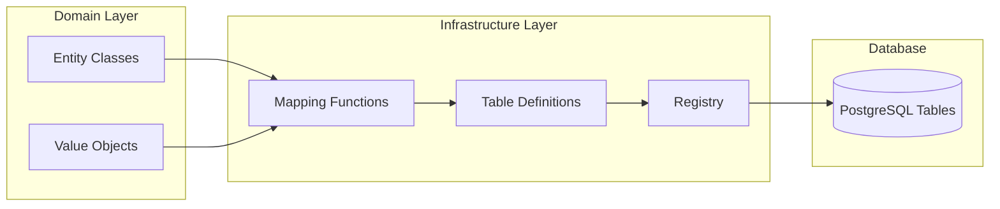

# ORM - SQLAlchemy Patterns

## Overview

This architecture uses SQLAlchemy 2.0 with **imperative mapping** to keep domain entities clean and framework-agnostic.



## Why Imperative Mapping?

| Declarative Mapping | Imperative Mapping |
|---------------------|-------------------|
| Entity inherits from `Base` | Entity is a plain Python class |
| Columns defined on class | Tables defined separately |
| Coupled to SQLAlchemy | Domain stays clean |
| Easier for simple cases | Better for Clean Architecture |

## Mapper Registry

```python
# src/app/infrastructure/persistence/mappings/registry.py
from sqlalchemy.orm import registry

# Single registry for all mappings
mapper_registry = registry()
```

## Table Definitions

```python
# src/app/infrastructure/persistence/mappings/user.py
from sqlalchemy import (
    UUID,
    Boolean,
    Column,
    DateTime,
    Enum,
    LargeBinary,
    String,
    Table,
    func,
)
from sqlalchemy.orm import composite

from app.domain.entities.user import User
from app.domain.enums.user_role import UserRole
from app.domain.value_objects.user_id import UserId
from app.domain.value_objects.username import Username
from app.domain.value_objects.password_hash import PasswordHash
from app.infrastructure.persistence.mappings.registry import mapper_registry


# Define the table schema
users_table = Table(
    "users",
    mapper_registry.metadata,
    Column("id", UUID(as_uuid=True), primary_key=True),
    Column("username", String(32), nullable=False, unique=True),
    Column("password_hash", LargeBinary, nullable=False),
    Column(
        "role",
        Enum(UserRole, name="userrole"),
        default=UserRole.USER,
        nullable=False,
    ),
    Column("is_active", Boolean, default=True, nullable=False),
    Column(
        "created_at",
        DateTime(timezone=True),
        server_default=func.now(),
        nullable=False,
    ),
    Column(
        "updated_at",
        DateTime(timezone=True),
        onupdate=func.now(),
    ),
)


def map_users_table() -> None:
    """Map User entity to users table."""
    mapper_registry.map_imperatively(
        User,
        users_table,
        properties={
            # Map value objects using composite
            "id_": composite(UserId, users_table.c.id),
            "username": composite(Username, users_table.c.username),
            "password_hash": composite(PasswordHash, users_table.c.password_hash),
            # Direct mapping for simple types
            "role": users_table.c.role,
            "is_active": users_table.c.is_active,
        },
        column_prefix="_",  # Private column access
    )
```

### Order Entity Mapping

```python
# src/app/infrastructure/persistence/mappings/order.py
from sqlalchemy import (
    UUID,
    Column,
    DateTime,
    Enum,
    ForeignKey,
    Numeric,
    String,
    Table,
    func,
)
from sqlalchemy.orm import relationship, composite

from app.domain.entities.order import Order, OrderItem
from app.domain.enums.order_status import OrderStatus
from app.domain.value_objects.order_id import OrderId
from app.domain.value_objects.money import Money
from app.infrastructure.persistence.mappings.registry import mapper_registry


orders_table = Table(
    "orders",
    mapper_registry.metadata,
    Column("id", UUID(as_uuid=True), primary_key=True),
    Column("customer_id", UUID(as_uuid=True), ForeignKey("users.id"), nullable=False),
    Column("status", Enum(OrderStatus, name="orderstatus"), nullable=False),
    Column("total_amount", Numeric(10, 2), nullable=False),
    Column("currency", String(3), nullable=False, default="USD"),
    Column("created_at", DateTime(timezone=True), server_default=func.now()),
    Column("updated_at", DateTime(timezone=True), onupdate=func.now()),
)

order_items_table = Table(
    "order_items",
    mapper_registry.metadata,
    Column("id", UUID(as_uuid=True), primary_key=True),
    Column("order_id", UUID(as_uuid=True), ForeignKey("orders.id"), nullable=False),
    Column("product_id", UUID(as_uuid=True), nullable=False),
    Column("quantity", Integer, nullable=False),
    Column("unit_price", Numeric(10, 2), nullable=False),
)


def map_orders_table() -> None:
    """Map Order and OrderItem entities."""
    mapper_registry.map_imperatively(
        OrderItem,
        order_items_table,
        properties={
            "id_": composite(OrderItemId, order_items_table.c.id),
            "product_id": composite(ProductId, order_items_table.c.product_id),
            "quantity": order_items_table.c.quantity,
            "unit_price": order_items_table.c.unit_price,
        },
    )
    
    mapper_registry.map_imperatively(
        Order,
        orders_table,
        properties={
            "id_": composite(OrderId, orders_table.c.id),
            "customer_id": composite(UserId, orders_table.c.customer_id),
            "status": orders_table.c.status,
            "total": composite(
                Money,
                orders_table.c.total_amount,
                orders_table.c.currency,
            ),
            # Relationship mapping
            "items": relationship(
                OrderItem,
                cascade="all, delete-orphan",
                lazy="selectin",  # Eager load
            ),
        },
    )
```

## Mapping All Tables

```python
# src/app/infrastructure/persistence/mappings/all.py
_mapped = False


def map_all_tables() -> None:
    """Map all tables. Call once at application startup."""
    global _mapped
    
    if _mapped:
        return
    
    from app.infrastructure.persistence.mappings.user import map_users_table
    from app.infrastructure.persistence.mappings.order import map_orders_table
    from app.infrastructure.persistence.mappings.session import map_sessions_table
    
    map_users_table()
    map_orders_table()
    map_sessions_table()
    
    _mapped = True
```

## Composite Value Objects

For value objects with multiple fields:

```python
# src/app/domain/value_objects/money.py
from dataclasses import dataclass
from decimal import Decimal

from app.domain.value_objects.base import ValueObject


@dataclass(frozen=True, slots=True)
class Money(ValueObject):
    """Money value object for use with SQLAlchemy composite."""
    
    amount: Decimal
    currency: str
    
    def __composite_values__(self) -> tuple:
        """Return values for SQLAlchemy composite mapping."""
        return self.amount, self.currency
```

Then in the mapping:

```python
"total": composite(
    Money,
    orders_table.c.total_amount,
    orders_table.c.currency,
)
```

## Query Patterns

### Basic Queries

```python
# Get by ID
user = await session.get(User, user_id.value)

# Query with filter
from sqlalchemy import select

stmt = select(User).where(users_table.c.is_active == True)
result = await session.execute(stmt)
users = result.scalars().all()

# Query with join
stmt = (
    select(Order)
    .join(users_table, orders_table.c.customer_id == users_table.c.id)
    .where(users_table.c.username == "john")
)
```

### Pagination

```python
from sqlalchemy import select, func

async def paginated_query(
    session: AsyncSession,
    page: int,
    page_size: int,
) -> tuple[list[User], int]:
    # Count total
    count_stmt = select(func.count()).select_from(users_table)
    total = (await session.execute(count_stmt)).scalar() or 0
    
    # Get page
    offset = (page - 1) * page_size
    stmt = select(User).offset(offset).limit(page_size)
    result = await session.execute(stmt)
    items = list(result.scalars().all())
    
    return items, total
```

### Eager Loading

```python
from sqlalchemy.orm import selectinload, joinedload

# Eager load relationships
stmt = (
    select(Order)
    .options(selectinload(Order.items))
    .where(orders_table.c.customer_id == customer_id)
)
```

## Session Lifecycle

```mermaid
sequenceDiagram
    participant C as Controller
    participant DI as DI Container
    participant S as Session
    participant DB as Database

    C->>DI: Request Session
    DI->>S: Create Session
    S-->>C: Return Session
    
    C->>S: add(entity)
    Note over S: Tracks changes
    
    C->>S: Execute query
    S->>DB: SQL Query
    DB-->>S: Results
    
    C->>S: commit()
    S->>DB: BEGIN; INSERT/UPDATE; COMMIT
    
    C->>S: close()
    Note over S: Release connection
```

## Type Coercion for Value Objects

```python
# src/app/infrastructure/persistence/type_coercion.py
from sqlalchemy import TypeDecorator, UUID as SAUUID
from uuid import UUID


class UUIDType(TypeDecorator):
    """Handle UUID value objects."""
    
    impl = SAUUID(as_uuid=True)
    cache_ok = True
    
    def process_bind_param(self, value, dialect):
        if value is None:
            return None
        if hasattr(value, 'value'):
            return value.value
        return value
    
    def process_result_value(self, value, dialect):
        return value
```

---

**Previous**: [Database](07-database.md) | **Next**: [Dependency Injection](09-dependency-injection.md)
