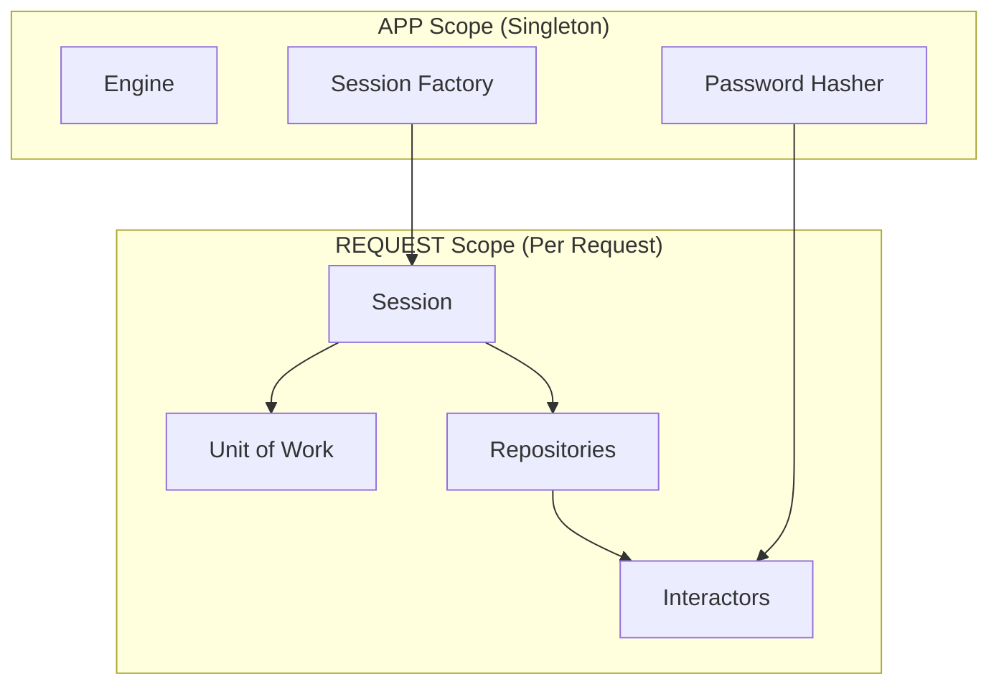

# Dependency Injection

## Overview

This architecture uses **Dishka** for dependency injection, a framework-agnostic DI container that avoids FastAPI's `Depends` leaking into business logic.

## Why Dishka over FastAPI Depends?

| FastAPI Depends | Dishka |
|-----------------|--------|
| Tied to FastAPI | Framework-agnostic |
| Leaks into all layers | Contained to setup layer |
| Hard to test in isolation | Easy mocking |
| Limited scopes | Request, session, app scopes |

## Container Setup

```python
# src/app/setup/ioc/container.py
from dishka import make_async_container, AsyncContainer

from app.setup.config.settings import Settings
from app.setup.ioc.providers.database import DatabaseProvider
from app.setup.ioc.providers.services import ServicesProvider
from app.setup.ioc.providers.repositories import RepositoriesProvider
from app.setup.ioc.providers.auth import AuthProvider


def create_container(settings: Settings) -> AsyncContainer:
    """Create the DI container with all providers."""
    return make_async_container(
        DatabaseProvider(),
        ServicesProvider(),
        RepositoriesProvider(),
        AuthProvider(),
        context={Settings: settings},
    )
```

## Providers

### Database Provider

```python
# src/app/setup/ioc/providers/database.py
from dishka import Provider, Scope, provide
from sqlalchemy.ext.asyncio import AsyncEngine, AsyncSession, async_sessionmaker

from app.infrastructure.persistence.connection import (
    create_engine,
    create_session_factory,
)
from app.infrastructure.persistence.unit_of_work import SQLAlchemyUnitOfWork
from app.application.common.ports.unit_of_work import UnitOfWork
from app.setup.config.settings import Settings


class DatabaseProvider(Provider):
    """Database-related dependencies."""
    
    @provide(scope=Scope.APP)
    def get_engine(self, settings: Settings) -> AsyncEngine:
        """Create engine once per application."""
        return create_engine(settings.database)
    
    @provide(scope=Scope.APP)
    def get_session_factory(
        self,
        engine: AsyncEngine,
    ) -> async_sessionmaker[AsyncSession]:
        """Create session factory once per application."""
        return create_session_factory(engine)
    
    @provide(scope=Scope.REQUEST)
    async def get_session(
        self,
        factory: async_sessionmaker[AsyncSession],
    ) -> AsyncSession:
        """Create session per request."""
        return factory()
    
    @provide(scope=Scope.REQUEST)
    def get_unit_of_work(self, session: AsyncSession) -> UnitOfWork:
        """Create UoW per request."""
        return SQLAlchemyUnitOfWork(session)
```

### Repository Provider

```python
# src/app/setup/ioc/providers/repositories.py
from dishka import Provider, Scope, provide
from sqlalchemy.ext.asyncio import AsyncSession

from app.application.common.ports.user_repository import UserRepository
from app.application.common.ports.user_query_gateway import UserQueryGateway
from app.infrastructure.persistence.repositories.user_repository import (
    SQLAlchemyUserRepository,
)
from app.infrastructure.persistence.repositories.user_query_gateway import (
    SQLAlchemyUserQueryGateway,
)


class RepositoriesProvider(Provider):
    """Repository dependencies."""
    
    @provide(scope=Scope.REQUEST)
    def get_user_repository(self, session: AsyncSession) -> UserRepository:
        return SQLAlchemyUserRepository(session)
    
    @provide(scope=Scope.REQUEST)
    def get_user_query_gateway(self, session: AsyncSession) -> UserQueryGateway:
        return SQLAlchemyUserQueryGateway(session)
```

### Services Provider

```python
# src/app/setup/ioc/providers/services.py
from dishka import Provider, Scope, provide

from app.domain.ports.password_hasher import PasswordHasher
from app.domain.services.user_service import UserService
from app.infrastructure.adapters.bcrypt_hasher import BCryptPasswordHasher
from app.setup.config.settings import Settings


class ServicesProvider(Provider):
    """Service dependencies."""
    
    @provide(scope=Scope.APP)
    def get_password_hasher(self, settings: Settings) -> PasswordHasher:
        return BCryptPasswordHasher(
            pepper=settings.auth.password_pepper.encode(),
            rounds=settings.auth.bcrypt_rounds,
        )
    
    @provide(scope=Scope.REQUEST)
    def get_user_service(self, hasher: PasswordHasher) -> UserService:
        return UserService(hasher)
```

### Interactor Provider

```python
# src/app/setup/ioc/providers/interactors.py
from dishka import Provider, Scope, provide

from app.application.commands.create_user import CreateUserInteractor
from app.application.queries.list_users import ListUsersQuery
from app.application.common.ports.unit_of_work import UnitOfWork
from app.application.common.ports.user_repository import UserRepository
from app.application.common.ports.user_query_gateway import UserQueryGateway
from app.application.common.services.current_user import CurrentUserService
from app.domain.services.user_service import UserService


class InteractorsProvider(Provider):
    """Interactor/Use Case dependencies."""
    
    @provide(scope=Scope.REQUEST)
    def get_create_user_interactor(
        self,
        current_user: CurrentUserService,
        user_service: UserService,
        user_repo: UserRepository,
        uow: UnitOfWork,
    ) -> CreateUserInteractor:
        return CreateUserInteractor(
            current_user_service=current_user,
            user_service=user_service,
            user_repository=user_repo,
            unit_of_work=uow,
        )
    
    @provide(scope=Scope.REQUEST)
    def get_list_users_query(
        self,
        current_user: CurrentUserService,
        gateway: UserQueryGateway,
    ) -> ListUsersQuery:
        return ListUsersQuery(
            current_user_service=current_user,
            user_query_gateway=gateway,
        )
```

## FastAPI Integration

```python
# src/app/setup/app_factory.py
from fastapi import FastAPI
from dishka.integrations.fastapi import setup_dishka

from app.presentation.http.app import create_fastapi_app
from app.setup.ioc.container import create_container
from app.setup.config.settings import Settings


def create_app() -> FastAPI:
    """Create application with DI container."""
    settings = Settings()
    app = create_fastapi_app(settings)
    container = create_container(settings)
    setup_dishka(container, app)
    return app
```

## Using in Controllers

```python
# src/app/presentation/http/controllers/users.py
from dishka.integrations.fastapi import DishkaRoute, FromDishka
from fastapi import APIRouter

from app.application.commands.create_user import CreateUserInteractor

router = APIRouter(route_class=DishkaRoute)


@router.post("/users")
async def create_user(
    body: UserCreateSchema,
    interactor: FromDishka[CreateUserInteractor],  # Injected by Dishka
) -> UserPublicSchema:
    result = await interactor.execute(...)
    return UserPublicSchema(**result)
```

## Scopes



| Scope | Lifetime | Use For |
|-------|----------|---------|
| `Scope.APP` | Application lifetime | Singletons (engine, config) |
| `Scope.REQUEST` | Single HTTP request | Sessions, repos, interactors |
| `Scope.SESSION` | Session lifetime | WebSocket connections |

## Testing with DI

```python
# tests/unit/test_create_user.py
import pytest
from unittest.mock import AsyncMock, Mock

from app.application.commands.create_user import (
    CreateUserInteractor,
    CreateUserRequest,
)
from app.domain.enums.user_role import UserRole


@pytest.fixture
def mock_deps():
    return {
        "current_user_service": AsyncMock(),
        "user_service": AsyncMock(),
        "user_repository": Mock(),
        "unit_of_work": AsyncMock(),
    }


async def test_create_user_success(mock_deps):
    # Arrange
    mock_deps["current_user_service"].get_current_user.return_value = Mock(
        role=UserRole.ADMIN
    )
    mock_deps["user_service"].create_user.return_value = Mock(
        id_=Mock(value=uuid.uuid4()),
        username=Mock(value="testuser"),
    )
    
    interactor = CreateUserInteractor(**mock_deps)
    request = CreateUserRequest(
        username="testuser",
        password="password123",
        role=UserRole.USER,
    )
    
    # Act
    result = await interactor.execute(request)
    
    # Assert
    assert result["username"] == "testuser"
    mock_deps["user_repository"].add.assert_called_once()
    mock_deps["unit_of_work"].commit.assert_called_once()
```

---

**Previous**: [ORM](08-orm.md) | **Next**: [Authentication](10-authentication.md)
