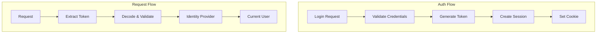

# Authentication

## Overview

This architecture supports both **JWT token-based** and **session-based** authentication, with the authentication context treated as a separate bounded context from the main application.



## JWT Configuration

```python
# src/app/setup/config/settings.py
from pydantic import Field, SecretStr
from pydantic_settings import BaseSettings


class AuthSettings(BaseSettings):
    """Authentication configuration."""
    
    secret_key: SecretStr = Field(..., description="JWT signing key")
    algorithm: str = Field(default="HS256")
    access_token_expire_minutes: int = Field(default=30)
    refresh_token_expire_days: int = Field(default=7)
    
    # Password hashing
    password_pepper: SecretStr = Field(..., description="Password pepper")
    bcrypt_rounds: int = Field(default=12)
    
    # Session (optional)
    session_lifetime_minutes: int = Field(default=30)
```

## JWT Handler

```python
# src/app/infrastructure/auth/jwt_handler.py
from datetime import datetime, timedelta, timezone
from typing import Any
from uuid import UUID

import jwt
from pydantic import BaseModel


class TokenPayload(BaseModel):
    """JWT payload structure."""
    sub: str  # Subject (user ID)
    exp: datetime
    iat: datetime
    jti: str | None = None  # Session ID
    type: str = "access"


class JWTHandler:
    """Handle JWT creation and validation."""
    
    def __init__(
        self,
        secret_key: str,
        algorithm: str = "HS256",
        access_expire_minutes: int = 30,
        refresh_expire_days: int = 7,
    ) -> None:
        self._secret = secret_key
        self._algorithm = algorithm
        self._access_expire = access_expire_minutes
        self._refresh_expire = refresh_expire_days
    
    def create_access_token(
        self,
        user_id: UUID,
        session_id: str | None = None,
    ) -> tuple[str, datetime]:
        """Create access token. Returns (token, expiry)."""
        now = datetime.now(timezone.utc)
        expire = now + timedelta(minutes=self._access_expire)
        
        payload = {
            "sub": str(user_id),
            "exp": expire,
            "iat": now,
            "jti": session_id,
            "type": "access",
        }
        
        token = jwt.encode(payload, self._secret, algorithm=self._algorithm)
        return token, expire
    
    def create_refresh_token(
        self,
        user_id: UUID,
        session_id: str | None = None,
    ) -> tuple[str, datetime]:
        """Create refresh token."""
        now = datetime.now(timezone.utc)
        expire = now + timedelta(days=self._refresh_expire)
        
        payload = {
            "sub": str(user_id),
            "exp": expire,
            "iat": now,
            "jti": session_id,
            "type": "refresh",
        }
        
        token = jwt.encode(payload, self._secret, algorithm=self._algorithm)
        return token, expire
    
    def decode(self, token: str) -> TokenPayload:
        """
        Decode and validate token.
        
        Raises:
            jwt.InvalidTokenError: If token is invalid
            jwt.ExpiredSignatureError: If token is expired
        """
        payload = jwt.decode(
            token,
            self._secret,
            algorithms=[self._algorithm],
        )
        return TokenPayload(**payload)
```

## Login Handler

```python
# src/app/infrastructure/auth/handlers/login.py
from dataclasses import dataclass
from typing import NamedTuple

from app.domain.value_objects.username import Username
from app.domain.value_objects.raw_password import RawPassword
from app.infrastructure.auth.jwt_handler import JWTHandler
from app.infrastructure.auth.session_manager import SessionManager
from app.infrastructure.auth.ports.user_auth_gateway import UserAuthGateway
from app.infrastructure.auth.exceptions import InvalidCredentialsError


@dataclass(frozen=True, slots=True)
class LoginRequest:
    username: str
    password: str


class LoginResult(NamedTuple):
    token: str
    refresh_token: str
    expires_in: int
    user_id: str


class LoginHandler:
    """Handle user login."""
    
    def __init__(
        self,
        jwt_handler: JWTHandler,
        session_manager: SessionManager,
        user_gateway: UserAuthGateway,
    ) -> None:
        self._jwt = jwt_handler
        self._sessions = session_manager
        self._users = user_gateway
    
    async def execute(self, request: LoginRequest) -> LoginResult:
        """
        Authenticate user and create session.
        
        Raises:
            InvalidCredentialsError: If credentials are invalid
        """
        # Find user
        user = await self._users.get_by_username(Username(request.username))
        if not user or not user.is_active:
            raise InvalidCredentialsError("Invalid username or password")
        
        # Verify password
        is_valid = await self._users.verify_password(
            user,
            RawPassword(request.password),
        )
        if not is_valid:
            raise InvalidCredentialsError("Invalid username or password")
        
        # Create session
        session = await self._sessions.create(user.id_.value)
        
        # Generate tokens
        access_token, access_exp = self._jwt.create_access_token(
            user_id=user.id_.value,
            session_id=session.id,
        )
        refresh_token, _ = self._jwt.create_refresh_token(
            user_id=user.id_.value,
            session_id=session.id,
        )
        
        return LoginResult(
            token=access_token,
            refresh_token=refresh_token,
            expires_in=int((access_exp - datetime.now(timezone.utc)).total_seconds()),
            user_id=str(user.id_.value),
        )
```

## Session Management

```python
# src/app/infrastructure/auth/session_manager.py
from datetime import datetime, timedelta, timezone
from uuid import UUID, uuid4

from app.infrastructure.auth.session_repository import SessionRepository


class Session:
    """User session."""
    
    def __init__(
        self,
        id: str,
        user_id: UUID,
        created_at: datetime,
        expires_at: datetime,
    ) -> None:
        self.id = id
        self.user_id = user_id
        self.created_at = created_at
        self.expires_at = expires_at
    
    @property
    def is_expired(self) -> bool:
        return datetime.now(timezone.utc) > self.expires_at


class SessionManager:
    """Manage user sessions."""
    
    def __init__(
        self,
        repository: SessionRepository,
        lifetime_minutes: int = 30,
    ) -> None:
        self._repo = repository
        self._lifetime = timedelta(minutes=lifetime_minutes)
    
    async def create(self, user_id: UUID) -> Session:
        """Create a new session."""
        now = datetime.now(timezone.utc)
        session = Session(
            id=str(uuid4()),
            user_id=user_id,
            created_at=now,
            expires_at=now + self._lifetime,
        )
        await self._repo.save(session)
        return session
    
    async def get(self, session_id: str) -> Session | None:
        """Get session by ID."""
        session = await self._repo.get(session_id)
        if session and not session.is_expired:
            return session
        return None
    
    async def invalidate(self, session_id: str) -> None:
        """Invalidate/delete a session."""
        await self._repo.delete(session_id)
    
    async def invalidate_user_sessions(self, user_id: UUID) -> None:
        """Invalidate all sessions for a user."""
        await self._repo.delete_by_user(user_id)
```

## Token Extraction Middleware

```python
# src/app/presentation/http/auth/token_extractor.py
from fastapi import Request
from fastapi.security import HTTPBearer, HTTPAuthorizationCredentials


class TokenExtractor:
    """Extract JWT token from request."""
    
    def __init__(self, cookie_name: str = "access_token") -> None:
        self._cookie_name = cookie_name
        self._bearer = HTTPBearer(auto_error=False)
    
    async def extract(self, request: Request) -> str | None:
        """Extract token from cookie or Authorization header."""
        # Try cookie first
        token = request.cookies.get(self._cookie_name)
        if token:
            return token
        
        # Try Authorization header
        credentials: HTTPAuthorizationCredentials | None = await self._bearer(request)
        if credentials:
            return credentials.credentials
        
        return None
```

## Identity Provider Integration

```python
# src/app/infrastructure/auth/identity_provider.py
from uuid import UUID

from app.application.common.exceptions.auth import AuthenticationError
from app.application.common.services.current_user import CurrentUserService
from app.application.common.ports.user_repository import UserRepository
from app.domain.entities.user import User
from app.domain.value_objects.user_id import UserId
from app.infrastructure.auth.jwt_handler import JWTHandler
from app.infrastructure.auth.session_manager import SessionManager


class TokenIdentityProvider(CurrentUserService):
    """
    Provides current user from JWT token.
    
    This bridges the auth context with the main app context.
    """
    
    def __init__(
        self,
        token: str | None,
        jwt_handler: JWTHandler,
        session_manager: SessionManager,
        user_repository: UserRepository,
    ) -> None:
        self._token = token
        self._jwt = jwt_handler
        self._sessions = session_manager
        self._users = user_repository
        self._user: User | None = None
    
    async def get_current_user(self) -> User:
        """Get current user or raise."""
        user = await self.get_current_user_or_none()
        if not user:
            raise AuthenticationError("Not authenticated")
        return user
    
    async def get_current_user_or_none(self) -> User | None:
        """Get current user or None."""
        if self._user:
            return self._user
        
        if not self._token:
            return None
        
        try:
            # Decode token
            payload = self._jwt.decode(self._token)
            
            # Validate session if present
            if payload.jti:
                session = await self._sessions.get(payload.jti)
                if not session:
                    return None
            
            # Get user
            user_id = UserId(UUID(payload.sub))
            user = await self._users.get_by_id(user_id)
            
            if user and user.is_active:
                self._user = user
                return user
                
        except Exception:
            return None
        
        return None
```

## OAuth2 Password Flow (Alternative)

```python
# src/app/presentation/http/controllers/auth.py
from fastapi import APIRouter, Depends
from fastapi.security import OAuth2PasswordRequestForm

router = APIRouter()


@router.post("/token")
async def login_for_access_token(
    form_data: OAuth2PasswordRequestForm = Depends(),
    handler: FromDishka[LoginHandler],
):
    """OAuth2 compatible token endpoint."""
    request = LoginRequest(
        username=form_data.username,
        password=form_data.password,
    )
    result = await handler.execute(request)
    return {
        "access_token": result.token,
        "token_type": "bearer",
    }
```

## Security Best Practices

| Practice | Implementation |
|----------|----------------|
| **Password Hashing** | BCrypt with pepper and salt |
| **Token Storage** | HTTP-only, Secure cookies |
| **Token Expiry** | Short-lived access tokens (30 min) |
| **Refresh Tokens** | Longer lived, one-time use |
| **Session Validation** | Verify session exists in DB |
| **Constant-Time Compare** | Use `secrets.compare_digest` |

---

**Previous**: [Dependency Injection](09-dependency-injection.md) | **Next**: [Async Tasks](11-async-tasks.md)
