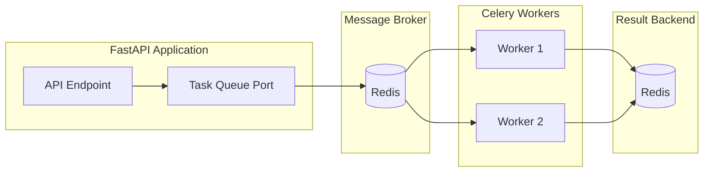

# Async Tasks with Celery

## Overview

Celery provides robust background task processing for long-running or scheduled operations. This integrates Celery while maintaining Clean Architecture principles.



## Celery Configuration

```python
# src/app/infrastructure/tasks/celery_app.py
from celery import Celery

from app.setup.config.settings import Settings


def create_celery_app(settings: Settings) -> Celery:
    """Create and configure Celery application."""
    app = Celery(
        "app",
        broker=settings.celery.broker_url,
        backend=settings.celery.result_backend,
    )
    
    app.conf.update(
        # Task settings
        task_serializer="json",
        accept_content=["json"],
        result_serializer="json",
        timezone="UTC",
        enable_utc=True,
        
        # Result settings
        result_expires=3600,  # 1 hour
        
        # Worker settings
        worker_prefetch_multiplier=1,
        worker_concurrency=4,
        
        # Task discovery
        imports=[
            "app.infrastructure.tasks.email_tasks",
            "app.infrastructure.tasks.report_tasks",
            "app.infrastructure.tasks.cleanup_tasks",
        ],
        
        # Beat schedule (for periodic tasks)
        beat_schedule={
            "cleanup-expired-sessions": {
                "task": "app.infrastructure.tasks.cleanup_tasks.cleanup_sessions",
                "schedule": 3600.0,  # Every hour
            },
        },
    )
    
    return app


# Global instance
celery_app = create_celery_app(Settings())
```

## Settings

```python
# src/app/setup/config/settings.py
from pydantic import Field
from pydantic_settings import BaseSettings


class CelerySettings(BaseSettings):
    """Celery configuration."""
    
    broker_url: str = Field(default="redis://localhost:6379/1")
    result_backend: str = Field(default="redis://localhost:6379/2")
    
    task_default_queue: str = Field(default="default")
    task_default_retry_delay: int = Field(default=60)
    task_max_retries: int = Field(default=3)
```

## Task Queue Port

```python
# src/app/application/common/ports/task_queue.py
from abc import ABC, abstractmethod
from typing import Any


class TaskQueue(ABC):
    """Port for async task scheduling."""
    
    @abstractmethod
    def enqueue(
        self,
        task_name: str,
        *args: Any,
        countdown: int | None = None,
        queue: str | None = None,
        **kwargs: Any,
    ) -> str:
        """
        Enqueue a task.
        
        Returns:
            Task ID for tracking.
        """
        ...
    
    @abstractmethod
    def enqueue_at(
        self,
        task_name: str,
        eta: datetime,
        *args: Any,
        **kwargs: Any,
    ) -> str:
        """Enqueue a task to run at a specific time."""
        ...
```

## Celery Adapter

```python
# src/app/infrastructure/tasks/task_queue.py
from datetime import datetime
from typing import Any

from celery import Celery

from app.application.common.ports.task_queue import TaskQueue


class CeleryTaskQueue(TaskQueue):
    """Celery implementation of TaskQueue port."""
    
    def __init__(self, celery_app: Celery) -> None:
        self._app = celery_app
    
    def enqueue(
        self,
        task_name: str,
        *args: Any,
        countdown: int | None = None,
        queue: str | None = None,
        **kwargs: Any,
    ) -> str:
        task = self._app.send_task(
            task_name,
            args=args,
            kwargs=kwargs,
            countdown=countdown,
            queue=queue or "default",
        )
        return task.id
    
    def enqueue_at(
        self,
        task_name: str,
        eta: datetime,
        *args: Any,
        **kwargs: Any,
    ) -> str:
        task = self._app.send_task(
            task_name,
            args=args,
            kwargs=kwargs,
            eta=eta,
        )
        return task.id
```

## Task Definitions

### Email Tasks

```python
# src/app/infrastructure/tasks/email_tasks.py
from celery import shared_task

from app.infrastructure.tasks.celery_app import celery_app
from app.setup.config.settings import Settings


@celery_app.task(
    bind=True,
    max_retries=3,
    default_retry_delay=60,
    autoretry_for=(Exception,),
)
def send_email(
    self,
    to: str,
    subject: str,
    body_html: str,
    body_text: str | None = None,
) -> dict:
    """Send an email asynchronously."""
    import smtplib
    from email.mime.text import MIMEText
    from email.mime.multipart import MIMEMultipart
    
    settings = Settings()
    
    msg = MIMEMultipart("alternative")
    msg["Subject"] = subject
    msg["From"] = settings.email.from_address
    msg["To"] = to
    
    if body_text:
        msg.attach(MIMEText(body_text, "plain"))
    msg.attach(MIMEText(body_html, "html"))
    
    try:
        with smtplib.SMTP(settings.email.host, settings.email.port) as server:
            if settings.email.use_tls:
                server.starttls()
            server.login(settings.email.username, settings.email.password)
            server.send_message(msg)
        
        return {"status": "sent", "to": to}
    
    except Exception as exc:
        # Celery will auto-retry due to autoretry_for
        raise


@celery_app.task
def send_welcome_email(user_id: str, email: str, username: str) -> dict:
    """Send welcome email to new user."""
    return send_email.delay(
        to=email,
        subject="Welcome to Our Platform!",
        body_html=f"<h1>Welcome, {username}!</h1><p>Your account is ready.</p>",
        body_text=f"Welcome, {username}! Your account is ready.",
    ).id
```

### Report Tasks

```python
# src/app/infrastructure/tasks/report_tasks.py
import csv
import io
from datetime import datetime
from uuid import UUID

from app.infrastructure.tasks.celery_app import celery_app
from app.setup.config.settings import Settings


@celery_app.task(bind=True, time_limit=300)  # 5 minute timeout
def generate_user_report(self, admin_id: str, filters: dict) -> dict:
    """Generate CSV report of users."""
    import asyncio
    from sqlalchemy import select
    
    from app.infrastructure.persistence.connection import (
        create_engine,
        create_session_factory,
    )
    from app.infrastructure.persistence.mappings.user import users_table
    
    settings = Settings()
    
    async def _generate():
        engine = create_engine(settings.database)
        session_factory = create_session_factory(engine)
        
        async with session_factory() as session:
            # Build query
            stmt = select(
                users_table.c.id,
                users_table.c.username,
                users_table.c.role,
                users_table.c.is_active,
                users_table.c.created_at,
            )
            
            if filters.get("is_active") is not None:
                stmt = stmt.where(users_table.c.is_active == filters["is_active"])
            
            result = await session.execute(stmt)
            rows = result.fetchall()
        
        await engine.dispose()
        
        # Generate CSV
        output = io.StringIO()
        writer = csv.writer(output)
        writer.writerow(["ID", "Username", "Role", "Active", "Created At"])
        
        for row in rows:
            writer.writerow([
                str(row.id),
                row.username,
                row.role.name,
                row.is_active,
                row.created_at.isoformat(),
            ])
        
        return output.getvalue()
    
    csv_content = asyncio.run(_generate())
    
    # Store result (could upload to S3 in production)
    return {
        "status": "completed",
        "rows": len(csv_content.splitlines()) - 1,
        "content": csv_content,
        "generated_at": datetime.utcnow().isoformat(),
    }
```

### Cleanup Tasks

```python
# src/app/infrastructure/tasks/cleanup_tasks.py
from datetime import datetime, timedelta, timezone

from app.infrastructure.tasks.celery_app import celery_app


@celery_app.task
def cleanup_sessions() -> dict:
    """Clean up expired sessions."""
    import asyncio
    from sqlalchemy import delete
    
    from app.infrastructure.persistence.connection import (
        create_engine,
        create_session_factory,
    )
    from app.infrastructure.auth.session_repository import sessions_table
    from app.setup.config.settings import Settings
    
    settings = Settings()
    
    async def _cleanup():
        engine = create_engine(settings.database)
        session_factory = create_session_factory(engine)
        
        async with session_factory() as session:
            stmt = delete(sessions_table).where(
                sessions_table.c.expires_at < datetime.now(timezone.utc)
            )
            result = await session.execute(stmt)
            await session.commit()
            deleted = result.rowcount
        
        await engine.dispose()
        return deleted
    
    deleted = asyncio.run(_cleanup())
    
    return {
        "status": "completed",
        "deleted_sessions": deleted,
        "run_at": datetime.utcnow().isoformat(),
    }
```

## Using Tasks from Application Layer

```python
# src/app/application/commands/create_user.py
from app.application.common.ports.task_queue import TaskQueue


class CreateUserInteractor:
    def __init__(
        self,
        # ... other deps
        task_queue: TaskQueue,
    ) -> None:
        # ...
        self._tasks = task_queue

    async def execute(self, request: CreateUserRequest) -> CreateUserResponse:
        # ... create user logic
        
        # Queue welcome email asynchronously
        self._tasks.enqueue(
            "app.infrastructure.tasks.email_tasks.send_welcome_email",
            str(user.id_.value),
            user.email.value,
            user.username.value,
        )
        
        return CreateUserResponse(...)
```

## Docker Setup

```yaml
# docker-compose.yml
services:
  app:
    build: ./backend
    depends_on:
      - postgres
      - redis

  celery-worker:
    build: ./backend
    command: celery -A app.infrastructure.tasks.celery_app worker --loglevel=info
    depends_on:
      - redis
      - postgres
    environment:
      - DATABASE_URL=${DATABASE_URL}
      - CELERY_BROKER_URL=redis://redis:6379/1

  celery-beat:
    build: ./backend
    command: celery -A app.infrastructure.tasks.celery_app beat --loglevel=info
    depends_on:
      - redis
    environment:
      - CELERY_BROKER_URL=redis://redis:6379/1

  redis:
    image: redis:7-alpine
    ports:
      - "6379:6379"
```

## Monitoring with Flower

```yaml
# docker-compose.yml (add to services)
  flower:
    image: mher/flower
    command: celery --broker=redis://redis:6379/1 flower --port=5555
    ports:
      - "5555:5555"
    depends_on:
      - redis
```

---

**Previous**: [Authentication](10-authentication.md) | **Next**: [Redis](12-redis.md)
