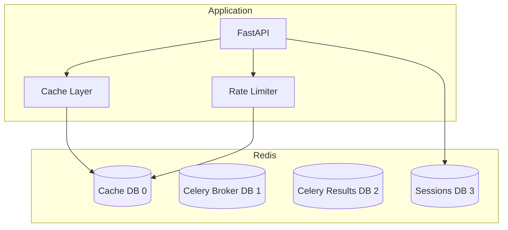

# Redis

## Overview

Redis serves multiple purposes in this architecture: Celery message broker, result backend, caching, session storage, and rate limiting.



## Configuration

```python
# src/app/setup/config/settings.py
from pydantic import Field
from pydantic_settings import BaseSettings


class RedisSettings(BaseSettings):
    """Redis configuration."""
    
    host: str = Field(default="localhost")
    port: int = Field(default=6379)
    password: str | None = Field(default=None)
    
    # Database numbers
    cache_db: int = Field(default=0)
    celery_broker_db: int = Field(default=1)
    celery_result_db: int = Field(default=2)
    session_db: int = Field(default=3)
    
    # Pool settings
    max_connections: int = Field(default=10)
    
    # Cache defaults
    default_ttl: int = Field(default=300)  # 5 minutes
    
    def get_url(self, db: int | None = None) -> str:
        """Build Redis URL."""
        auth = f":{self.password}@" if self.password else ""
        db_num = db if db is not None else self.cache_db
        return f"redis://{auth}{self.host}:{self.port}/{db_num}"
```

## Redis Client

```python
# src/app/infrastructure/cache/redis_client.py
from typing import Any
import json

import redis.asyncio as redis
from redis.asyncio.connection import ConnectionPool

from app.setup.config.settings import RedisSettings


class RedisClient:
    """Async Redis client wrapper."""
    
    def __init__(self, settings: RedisSettings, db: int | None = None) -> None:
        self._settings = settings
        self._db = db or settings.cache_db
        self._pool: ConnectionPool | None = None
        self._client: redis.Redis | None = None
    
    async def connect(self) -> None:
        """Initialize connection pool."""
        self._pool = ConnectionPool.from_url(
            self._settings.get_url(self._db),
            max_connections=self._settings.max_connections,
        )
        self._client = redis.Redis(connection_pool=self._pool)
    
    async def disconnect(self) -> None:
        """Close connection pool."""
        if self._client:
            await self._client.close()
        if self._pool:
            await self._pool.disconnect()
    
    @property
    def client(self) -> redis.Redis:
        if not self._client:
            raise RuntimeError("Redis client not connected")
        return self._client
    
    # Basic operations
    async def get(self, key: str) -> str | None:
        return await self.client.get(key)
    
    async def set(
        self,
        key: str,
        value: str,
        ttl: int | None = None,
    ) -> bool:
        return await self.client.set(key, value, ex=ttl)
    
    async def delete(self, key: str) -> int:
        return await self.client.delete(key)
    
    async def exists(self, key: str) -> bool:
        return await self.client.exists(key) > 0
    
    # JSON operations
    async def get_json(self, key: str) -> Any:
        value = await self.get(key)
        return json.loads(value) if value else None
    
    async def set_json(
        self,
        key: str,
        value: Any,
        ttl: int | None = None,
    ) -> bool:
        return await self.set(key, json.dumps(value), ttl=ttl)
```

## Caching Layer

```python
# src/app/infrastructure/cache/cache_service.py
from typing import Any, Callable, TypeVar
from functools import wraps
import hashlib
import json

from app.infrastructure.cache.redis_client import RedisClient

T = TypeVar("T")


class CacheService:
    """Application caching service."""
    
    def __init__(self, client: RedisClient, default_ttl: int = 300) -> None:
        self._client = client
        self._default_ttl = default_ttl
    
    def _make_key(self, prefix: str, *args: Any, **kwargs: Any) -> str:
        """Generate cache key from arguments."""
        parts = [prefix]
        if args:
            parts.append(hashlib.md5(str(args).encode()).hexdigest()[:8])
        if kwargs:
            parts.append(hashlib.md5(str(sorted(kwargs.items())).encode()).hexdigest()[:8])
        return ":".join(parts)
    
    async def get(self, key: str) -> Any:
        """Get cached value."""
        return await self._client.get_json(key)
    
    async def set(self, key: str, value: Any, ttl: int | None = None) -> None:
        """Set cached value."""
        await self._client.set_json(key, value, ttl=ttl or self._default_ttl)
    
    async def delete(self, key: str) -> None:
        """Delete cached value."""
        await self._client.delete(key)
    
    async def delete_pattern(self, pattern: str) -> int:
        """Delete all keys matching pattern."""
        keys = await self._client.client.keys(pattern)
        if keys:
            return await self._client.client.delete(*keys)
        return 0


# Decorator for caching
def cached(
    prefix: str,
    ttl: int = 300,
):
    """Cache decorator for async functions."""
    def decorator(func: Callable[..., T]) -> Callable[..., T]:
        @wraps(func)
        async def wrapper(self, *args: Any, **kwargs: Any) -> T:
            cache: CacheService = getattr(self, "_cache", None)
            if not cache:
                return await func(self, *args, **kwargs)
            
            key = cache._make_key(prefix, *args, **kwargs)
            cached = await cache.get(key)
            if cached is not None:
                return cached
            
            result = await func(self, *args, **kwargs)
            await cache.set(key, result, ttl=ttl)
            return result
        return wrapper
    return decorator
```

## Cache Usage in Query Services

```python
# src/app/application/queries/get_user.py
from app.infrastructure.cache.cache_service import CacheService, cached


class GetUserQuery:
    """Get user details with caching."""
    
    def __init__(
        self,
        user_gateway: UserQueryGateway,
        cache: CacheService,
    ) -> None:
        self._gateway = user_gateway
        self._cache = cache
    
    @cached(prefix="user", ttl=600)  # 10 minutes
    async def execute(self, user_id: UUID) -> dict | None:
        return await self._gateway.get_user_details(user_id)
```

## Cache Invalidation

```python
# src/app/application/commands/update_user.py
class UpdateUserInteractor:
    """Update user with cache invalidation."""
    
    def __init__(
        self,
        # ... other deps
        cache: CacheService,
    ) -> None:
        self._cache = cache

    async def execute(self, request: UpdateUserRequest) -> None:
        # ... update logic
        
        # Invalidate cache
        await self._cache.delete(f"user:{request.user_id}")
        await self._cache.delete_pattern(f"user_list:*")
```

## Rate Limiting

```python
# src/app/infrastructure/cache/rate_limiter.py
from datetime import datetime
from typing import NamedTuple

from app.infrastructure.cache.redis_client import RedisClient


class RateLimitResult(NamedTuple):
    allowed: bool
    remaining: int
    reset_at: datetime


class RateLimiter:
    """Token bucket rate limiter using Redis."""
    
    def __init__(self, client: RedisClient) -> None:
        self._client = client
    
    async def check(
        self,
        key: str,
        limit: int = 100,
        window_seconds: int = 60,
    ) -> RateLimitResult:
        """
        Check if request is allowed under rate limit.
        
        Uses sliding window counter algorithm.
        """
        now = datetime.utcnow()
        window_key = f"ratelimit:{key}:{int(now.timestamp()) // window_seconds}"
        
        pipe = self._client.client.pipeline()
        pipe.incr(window_key)
        pipe.expire(window_key, window_seconds)
        results = await pipe.execute()
        
        current = results[0]
        remaining = max(0, limit - current)
        reset_at = datetime.fromtimestamp(
            ((int(now.timestamp()) // window_seconds) + 1) * window_seconds
        )
        
        return RateLimitResult(
            allowed=current <= limit,
            remaining=remaining,
            reset_at=reset_at,
        )
```

### Rate Limit Middleware

```python
# src/app/presentation/http/middleware/rate_limit.py
from fastapi import Request, HTTPException, status
from starlette.middleware.base import BaseHTTPMiddleware

from app.infrastructure.cache.rate_limiter import RateLimiter


class RateLimitMiddleware(BaseHTTPMiddleware):
    """Apply rate limiting to requests."""
    
    def __init__(
        self,
        app,
        rate_limiter: RateLimiter,
        limit: int = 100,
        window: int = 60,
    ) -> None:
        super().__init__(app)
        self._limiter = rate_limiter
        self._limit = limit
        self._window = window
    
    async def dispatch(self, request: Request, call_next):
        # Use IP as rate limit key
        client_ip = request.client.host if request.client else "unknown"
        key = f"ip:{client_ip}"
        
        result = await self._limiter.check(
            key=key,
            limit=self._limit,
            window_seconds=self._window,
        )
        
        if not result.allowed:
            raise HTTPException(
                status_code=status.HTTP_429_TOO_MANY_REQUESTS,
                detail="Rate limit exceeded",
                headers={
                    "X-RateLimit-Limit": str(self._limit),
                    "X-RateLimit-Remaining": str(result.remaining),
                    "X-RateLimit-Reset": str(int(result.reset_at.timestamp())),
                },
            )
        
        response = await call_next(request)
        response.headers["X-RateLimit-Remaining"] = str(result.remaining)
        return response
```

## Session Storage in Redis

```python
# src/app/infrastructure/auth/redis_session_repository.py
from datetime import datetime, timezone
from uuid import UUID

from app.infrastructure.cache.redis_client import RedisClient
from app.infrastructure.auth.session_manager import Session


class RedisSessionRepository:
    """Store sessions in Redis."""
    
    def __init__(self, client: RedisClient) -> None:
        self._client = client
    
    def _key(self, session_id: str) -> str:
        return f"session:{session_id}"
    
    async def save(self, session: Session) -> None:
        ttl = int((session.expires_at - datetime.now(timezone.utc)).total_seconds())
        await self._client.set_json(
            self._key(session.id),
            {
                "id": session.id,
                "user_id": str(session.user_id),
                "created_at": session.created_at.isoformat(),
                "expires_at": session.expires_at.isoformat(),
            },
            ttl=max(ttl, 1),
        )
    
    async def get(self, session_id: str) -> Session | None:
        data = await self._client.get_json(self._key(session_id))
        if not data:
            return None
        return Session(
            id=data["id"],
            user_id=UUID(data["user_id"]),
            created_at=datetime.fromisoformat(data["created_at"]),
            expires_at=datetime.fromisoformat(data["expires_at"]),
        )
    
    async def delete(self, session_id: str) -> None:
        await self._client.delete(self._key(session_id))
```

---

**Previous**: [Async Tasks](11-async-tasks.md) | **Next**: [Testing](13-testing.md)
