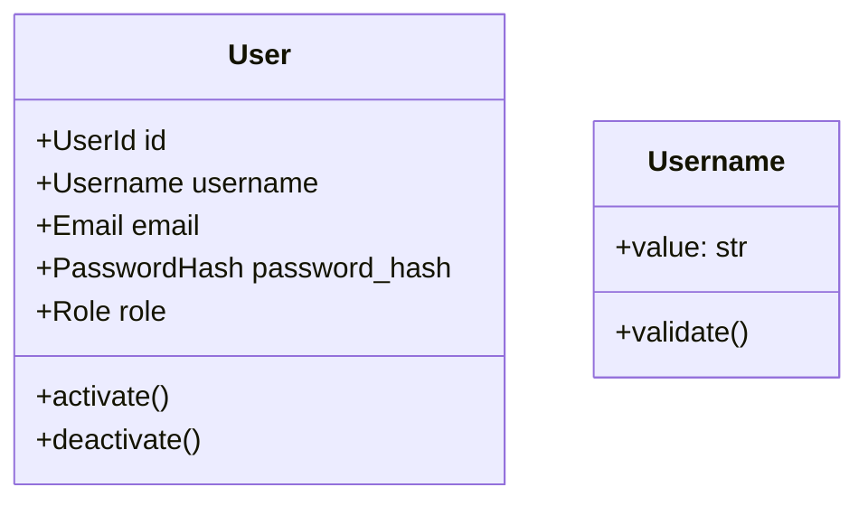

# Ticket: BE-003 - User Domain Entity and Value Objects

**Epic**: Identity & Access Management
**Type**: Story
**Priority**: High
**Dependencies**: BE-001

## 📝 Story
As a system architect, I need the `User` domain entity defined with strict invariants so that we can guarantee valid user data throughout the application.

## ✅ Acceptance Criteria
- [ ] `User` entity created in `domain/entities/user.py`.
- [ ] Value Objects created: `UserId`, `Email`, `Username`, `PasswordHash`.
- [ ] Domain Service `UserService` created for password logic.
- [ ] Unit tests for `User` entity and Value Objects (100% coverage).

## 🛠️ Solution Approach

### Domain Modeling
The `User` entity should be **Rich**, but start with basic invariants.

### Value Objects
- **Email**: Must match regex. Raise `InvalidEmailError` if not.
- **Username**: Alphanumeric, 3-20 chars. Raise `InvalidUsernameError`.

### Best Practices Explained
> **Primitive Obsession**: Avoid using raw `str` or `int` for domain concepts. Use Value Objects (`Email` vs `str`) to encapsulate validation logic and make signatures self-documenting.
> **No ORM**: This file should NOT import SQLAlchemy or Pydantic. It is pure Python.

## 🔗 References
- [Domain Layer](../docs/backend/03-domain-layer.md)
