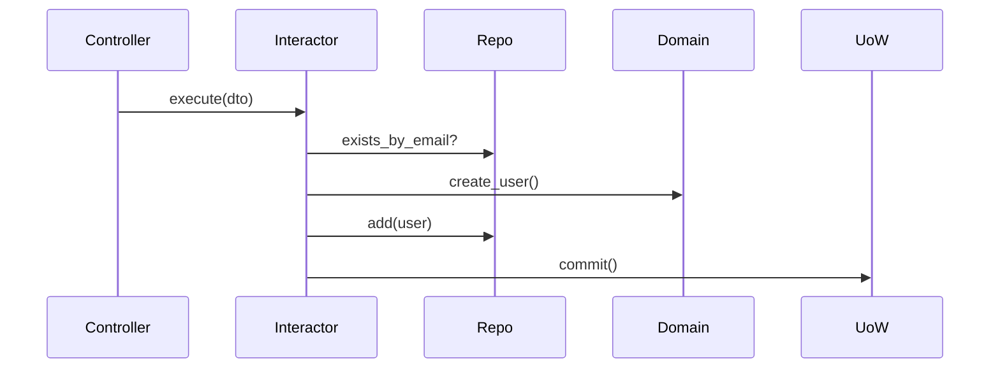

# Ticket: BE-004 - User Registration API (Interactors & Controller)

**Epic**: Identity & Access Management
**Type**: Story
**Priority**: High
**Dependencies**: BE-003, BE-002

## 📝 Story
As a new user, I want to register an account so that I can access the system.

## ✅ Acceptance Criteria
- [ ] `CreateUserInteractor` implemented in Application layer.
- [ ] `UserRepository` interface (port) defined.
- [ ] SQLAlchemy implementation of `UserRepository`.
- [ ] POST `/api/v1/auth/register` endpoint implemented.
- [ ] Integration test: Register fails if email already exists.

## 🛠️ Solution Approach

### CQRS Pattern - Command Side
We are implementing the **Write** side.

1. **Presentation**: `AuthController` receives `RegisterRequest` (Pydantic).
2. **Application**: `CreateUserInteractor` orchestrates:
    - Checks if email exists (via Repo).
    - Hashing password (via Domain Service).
    - Creating `User` entity.
    - Saving to Repo.
    - Committing Unit of Work.
3. **Infrastructure**: Implement `SqlAlchemyUserRepository` and `BcryptPasswordHasher`.

### Best Practices Explained
> **Dependency Injection**: The Controller does not know about the SQL Repo. It gets the Interactor, which gets the Repo interface. We wire this with **Dishka**.
> **DTOs**: Use separate classes for API requests (Pydantic) and Internal Interactor inputs (Dataclasses).

## 🔗 References
- [Application Layer](../docs/backend/04-application-layer.md)
