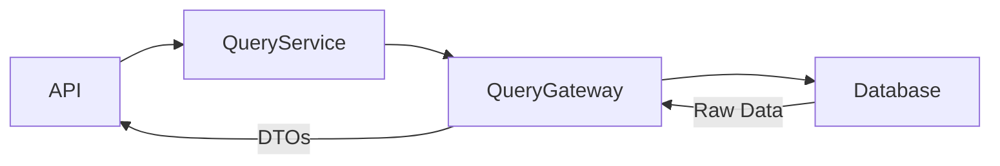

# Ticket: BE-007 - List Project Tasks (CQRS Read Side)

**Epic**: Project & Task Domain
**Type**: Story
**Priority**: Medium
**Dependencies**: BE-006

## 📝 Story
As a user, I want to view all tasks in a project so that I can see what needs to be done.

## ✅ Acceptance Criteria
- [ ] `TaskQueryGateway` interface defined (Read Model).
- [ ] SQL implementation returning raw Dictionaries/DTOs (NOT Entities).
- [ ] `ListTasksQuery` service implemented.
- [ ] API Endpoint `GET /api/v1/projects/{id}/tasks`.
- [ ] Support pagination (`page`, `size`) and filtering (`priority`).

## 🛠️ Solution Approach

### CQRS Query
This is a **Read** operation. We **bypass the Domain Layer** for performance.

### Best Practices Explained
> **Read Model**: Do not load full `Task` entities here. It's slow and unnecessary. Write a custom SQL query that selects only needed columns and returns a lightweight `TypedDict` or Pydantic model.

## 🔗 References
- [Application Layer (Queries)](../docs/backend/04-application-layer.md)
