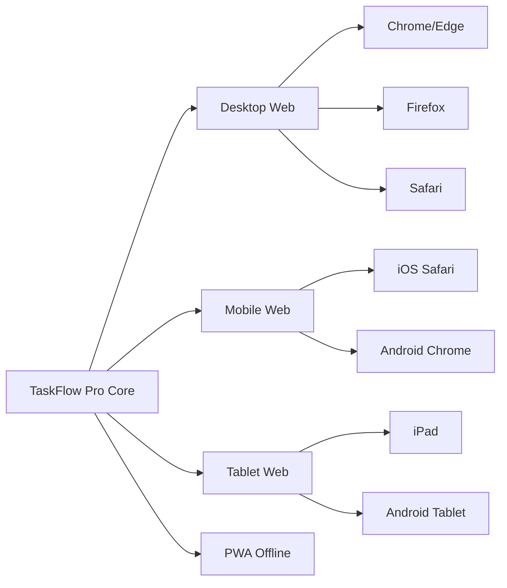
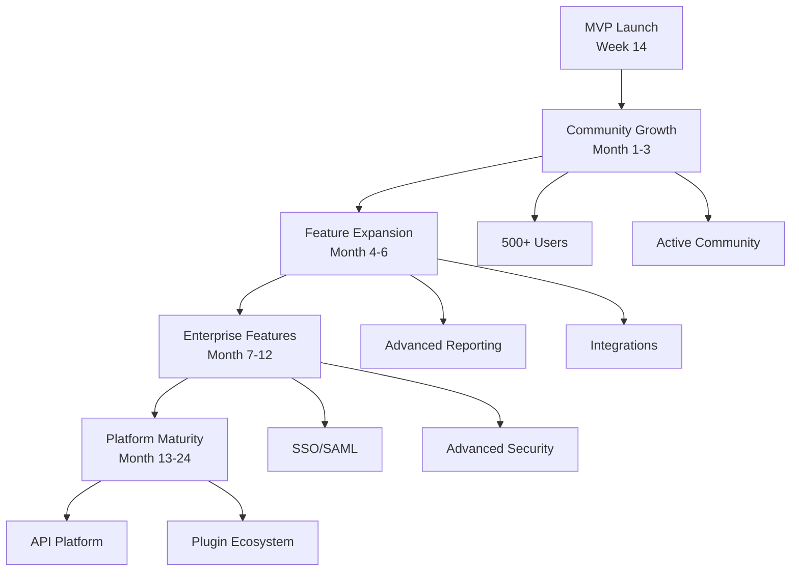

# Product Vision & Goals

## Product Vision Statement

> **"Empower teams to achieve extraordinary results through intuitive, collaborative, and intelligent project management."**

TaskFlow Pro envisions a world where project management tools enhance rather than hinder productivity. By combining modern technology (Nuxt 4 + Vuetify 3) with thoughtful UX design, we create an experience that teams actually enjoy using while demonstrating architectural excellence in web application development.

---

## Mission Statement

To provide teams with a **beautiful, fast, and accessible** project management platform that:

- **Simplifies Complexity**: Make project management intuitive, not overwhelming
- **Enables Collaboration**: Foster seamless communication and teamwork
- **Provides Clarity**: Give real-time visibility into project status and progress
- **Drives Results**: Help teams ship better products, faster
- **Demonstrates Excellence**: Showcase production-ready Nuxt + Vuetify patterns

---

## Strategic Goals

### 1. Technical Excellence Goals

#### Architecture Demonstration (Primary)

| Goal                                  | Success Metric                         | Priority |
| ------------------------------------- | -------------------------------------- | -------- |
| Demonstrate all 15 blueprint patterns | 100% pattern coverage                  | P0       |
| Achieve production-ready code quality | 80%+ test coverage, zero critical bugs | P0       |
| Showcase Vuetify 3 capabilities       | Use 50+ Vuetify components effectively | P0       |
| Implement comprehensive testing       | All three tiers functioning            | P0       |
| Document architectural decisions      | ADR for each major decision            | P1       |

#### Technology Stack Validation

- **Nuxt 4 Features**: Demonstrate latest capabilities (typed pages, view transitions, payload extraction)
- **Vue 3.5 Patterns**: Composition API, `<script setup>`, reactivity transform
- **Vuetify 3 Implementation**: Material Design 3, theming, component customization
- **TypeScript Strictness**: 100% type coverage, no `any` types
- **Modern Build Tools**: Vite 6, optimized bundling, tree-shaking

#### Code Quality Standards

```yaml
Targets:
  Test Coverage:
    Lines: > 80%
    Branches: > 80%
    Functions: > 80%
    Statements: > 80%

  Performance:
    FCP: < 1.8s
    TTI: < 3.5s
    Lighthouse: > 85

  Accessibility:
    WCAG: AA compliance
    Lighthouse: > 95

  Bundle Size:
    Initial: < 250KB gzipped
    Route Chunks: < 100KB each
```

---

### 2. Product Goals

#### User Experience Goals

| Goal                        | Description                           | Success Metric                     |
| --------------------------- | ------------------------------------- | ---------------------------------- |
| **Intuitive Onboarding**    | New users productive within 5 minutes | 80% complete first task in < 5 min |
| **Fast Task Creation**      | Quick capture of tasks                | Average task creation < 10 seconds |
| **Responsive Design**       | Seamless on all devices               | 100% feature parity mobile/desktop |
| **Delightful Interactions** | Smooth, enjoyable UI                  | NPS score 50+                      |
| **Accessible to All**       | WCAG AA compliant                     | Zero critical a11y issues          |

#### Feature Completeness Goals

- **Authentication**: Secure login, OAuth, 2FA, password management
- **Project Management**: CRUD operations, templates, archiving, permissions
- **Task Management**: Kanban, lists, calendar, dependencies, subtasks
- **Collaboration**: Comments, mentions, notifications, file sharing
- **Reporting**: Dashboards, charts, exports, time tracking
- **Settings**: Profile, workspace, appearance, security, i18n

#### Multi-platform Goals



---

### 3. Business Goals

#### Market Positioning

**Primary Position**: Best-in-class Nuxt + Vuetify reference implementation  
**Secondary Position**: Competitive project management tool for small-to-medium teams

| Goal                          | Target          | Timeline  |
| ----------------------------- | --------------- | --------- |
| GitHub stars (if open-source) | 1,000+          | 6 months  |
| Active installations          | 100+ workspaces | 3 months  |
| Developer community size      | 500+ members    | 12 months |
| Case studies published        | 5+              | 6 months  |
| Conference presentations      | 3+              | 12 months |

#### Revenue Goals (If Commercial)

- **Month 1-3**: Free tier focus, build user base (500+ users)
- **Month 4-6**: Introduce paid plans, 50 paid customers ($25K ARR)
- **Month 7-12**: Scale to 200 paid customers ($100K ARR)
- **Year 2**: Reach $500K ARR with 1,000 paid customers

#### Community Goals (If Open-Source)

- **Active Contributors**: 20+ regular contributors
- **Issue Resolution**: < 48-hour response time
- **Documentation Quality**: Comprehensive guides and examples
- **Community Support**: Active Discord/Slack channel
- **Plugin Ecosystem**: 10+ community plugins

---

### 4. Learning & Education Goals

#### Documentation Objectives

| Document Type           | Target         | Purpose                         |
| ----------------------- | -------------- | ------------------------------- |
| **Architecture Guides** | 15+ docs       | Explain all patterns in context |
| **Component Storybook** | 60+ components | Visual component documentation  |
| **API Documentation**   | 100% coverage  | Complete API reference          |
| **Tutorial Series**     | 10+ tutorials  | Step-by-step learning           |
| **Video Walkthroughs**  | 5+ videos      | Visual learning resource        |

#### Developer Enablement

- **Learning Path**: Beginner → Intermediate → Advanced
- **Code Examples**: Real-world patterns with explanations
- **Best Practices**: Documented with reasoning
- **Anti-patterns**: What to avoid and why
- **Migration Guides**: From other stacks to Nuxt + Vuetify

---

## Success Criteria by Phase

### Phase 1: Foundation (Week 1-2)

#### Must Have (P0)

- ✅ Project initialized with Nuxt 4 + Vuetify 3
- ✅ TypeScript configured in strict mode
- ✅ ESLint + git hooks working
- ✅ Authentication flow functional
- ✅ Basic layouts (default, auth, dashboard)
- ✅ Theme system operational (light/dark)
- ✅ Pinia stores setup
- ✅ CI/CD pipeline configured

#### Success Metrics

- 100% of infrastructure checklist complete
- Zero TypeScript errors
- All linting rules passing
- Basic authentication working end-to-end

---

### Phase 2: Core Features (Week 3-5)

#### Must Have (P0)

- ✅ Projects CRUD operations
- ✅ Tasks CRUD operations
- ✅ Kanban board with drag-and-drop
- ✅ Task list view with filters
- ✅ Basic task details (title, description, assignee, due date)
- ✅ Form validation with VeeValidate
- ✅ API integration composables
- ✅ Unit tests for stores and composables

#### Should Have (P1)

- ✅ Task labels and priorities
- ✅ File attachments
- ✅ Task comments (basic)
- ✅ Search functionality

#### Success Metrics

- All CRUD operations functional
- 60%+ test coverage
- < 3s page load time
- Zero critical bugs

---

### Phase 3: Collaboration (Week 6-8)

#### Must Have (P0)

- ✅ Team member management
- ✅ Role-based permissions
- ✅ Notification system
- ✅ @mentions in comments
- ✅ Activity feed
- ✅ Real-time updates (polling)

#### Should Have (P1)

- ✅ Email notifications
- ✅ User profiles
- ✅ Team invitations
- ✅ Task watchers

#### Success Metrics

- Real-time collaboration working
- Notification delivery < 5 seconds
- 70%+ test coverage
- Positive user feedback on collaboration

---

### Phase 4: Advanced Features (Week 9-11)

#### Must Have (P0)

- ✅ Dashboard with statistics
- ✅ Basic reports (project progress)
- ✅ Settings pages (profile, account, workspace)
- ✅ Internationalization (4 languages)

#### Should Have (P1)

- ✅ Time tracking
- ✅ Task dependencies
- ✅ Subtasks
- ✅ Advanced reports (burn-down, velocity)
- ✅ Export functionality

#### Nice to Have (P2)

- ✅ Project templates
- ✅ Recurring tasks
- ✅ Task labels with colors
- ✅ Calendar view

#### Success Metrics

- All P0 features complete
- 4 languages fully translated
- Reports generating correctly
- Settings persisting properly

---

### Phase 5: Testing & Polish (Week 12-13)

#### Must Have (P0)

- ✅ 80%+ test coverage (unit + integration)
- ✅ E2E tests for critical paths
- ✅ Accessibility audit passing
- ✅ Performance optimization complete
- ✅ Security audit passing
- ✅ Cross-browser testing complete

#### Should Have (P1)

- ✅ Visual regression tests
- ✅ Load testing (100 concurrent users)
- ✅ Mobile testing on real devices
- ✅ Documentation complete

#### Success Metrics

- 80%+ test coverage achieved
- Lighthouse scores: 85+ performance, 95+ accessibility
- Zero critical/high security issues
- All P0 features fully tested

---

### Phase 6: Deployment (Week 14)

#### Must Have (P0)

- ✅ Production deployment (SPA mode)
- ✅ SSR deployment configuration
- ✅ Monitoring and logging setup
- ✅ Error tracking (Sentry)
- ✅ Analytics integration
- ✅ Health checks operational

#### Should Have (P1)

- ✅ CDN configuration
- ✅ Database backups automated
- ✅ Deployment documentation
- ✅ Rollback procedures

#### Success Metrics

- 99.9% uptime
- < 200ms API response time (P95)
- Successful deployments for SPA and SSR
- Monitoring dashboards operational

---

## Product Principles

### 1. Simplicity Over Complexity

**Principle**: Make common tasks effortless, advanced features discoverable

**Application**:

- Quick task creation with minimal required fields
- Smart defaults reduce user input
- Progressive disclosure for advanced options
- One-click actions where possible
- Clear visual hierarchy guides users

**Blueprint Alignment**: Component architecture focuses on single responsibility and clear interfaces

---

### 2. Collaboration by Default

**Principle**: Enable team collaboration with minimal friction

**Application**:

- Real-time updates visible to all team members
- @mentions for direct communication
- Activity feeds show what's happening
- Shared context reduces duplicate work
- Easy team member onboarding

**Blueprint Alignment**: State management patterns enable reactive, multi-user experiences

---

### 3. Performance as a Feature

**Principle**: Fast, responsive experience delights users

**Application**:

- < 1.8s First Contentful Paint
- Instant feedback on all interactions
- Optimistic UI updates
- Efficient data loading (pagination, virtual scrolling)
- Minimal bundle size (<250KB gzipped initial)

**Blueprint Alignment**: Performance optimization built into architecture (tree-shaking, lazy loading, code splitting)

---

### 4. Accessibility for Everyone

**Principle**: Usable by all people, regardless of ability

**Application**:

- WCAG AA compliance minimum
- Keyboard navigation for all features
- Screen reader support
- High contrast themes available
- Focus indicators visible
- Alternative text for images

**Blueprint Alignment**: Vuetify 3 provides accessibility features out-of-the-box (ARIA, keyboard nav, focus management)

---

### 5. Internationalization First

**Principle**: Support global teams from day one

**Application**:

- 4+ language support (EN, ES, FR, DE)
- RTL language support prepared
- Locale-specific formatting (dates, numbers, currency)
- Cultural considerations in UX
- Easy language switching

**Blueprint Alignment**: i18n architecture with lazy-loaded translations and Vuetify locale integration

---

### 6. Secure by Design

**Principle**: Security is not an afterthought

**Application**:

- Role-based access control
- Encrypted data transmission (HTTPS only)
- CSP headers configured
- XSS/CSRF protection
- Regular security audits
- Audit logging for compliance

**Blueprint Alignment**: Security and performance patterns integrated from project start

---

### 7. Mobile-First Responsive

**Principle**: Equal experience across all device sizes

**Application**:

- Mobile-first CSS approach
- Touch-friendly interface elements
- Responsive Vuetify grids
- Adaptive navigation (drawer on mobile)
- Optimized for 3G networks
- PWA capabilities for offline access

**Blueprint Alignment**: Vuetify's responsive system with breakpoint management

---

## Design Philosophy

### Material Design 3 Principles

TaskFlow Pro implements Material Design 3 through Vuetify 3:

| Principle                      | Implementation                                |
| ------------------------------ | --------------------------------------------- |
| **Adaptive Design**            | Dynamic color system, theme customization     |
| **Expressive Personalization** | User-selectable themes, customizable views    |
| **Accessible by Default**      | High contrast, focus states, semantic HTML    |
| **Motion & Transitions**       | Smooth page transitions, component animations |
| **Elevation & Shadow**         | Consistent depth hierarchy                    |
| **Typography Scale**           | Clear content hierarchy                       |

### Component Design Patterns

Following the blueprint's component architecture:

```
components/
├── common/              # Reusable generic components (App* prefix)
├── layout/              # Layout components (Layout* prefix)
├── vuetify/             # Custom Vuetify wrappers (V* prefix)
├── project/             # Project domain components
├── task/                # Task domain components
├── team/                # Team domain components
├── notification/        # Notification domain components
└── dashboard/           # Dashboard domain components
```

**Component Philosophy**:

- Single responsibility per component
- Props down, events up
- TypeScript for all props and emits
- Comprehensive unit and integration tests
- Documented with JSDoc comments
- Accessibility attributes included

---

## Measurable Outcomes

### Technical Outcomes

| Outcome                      | Baseline | Target      | Measurement Method               |
| ---------------------------- | -------- | ----------- | -------------------------------- |
| **Code Coverage**            | 0%       | 80%+        | Vitest coverage reports          |
| **Type Safety**              | 0%       | 100%        | TypeScript strict mode, no `any` |
| **Lighthouse Performance**   | N/A      | 85+         | Automated Lighthouse CI          |
| **Lighthouse Accessibility** | N/A      | 95+         | Automated Lighthouse CI          |
| **Build Time**               | N/A      | < 2 minutes | CI/CD pipeline metrics           |
| **Bundle Size**              | N/A      | < 250KB     | Bundle analyzer reports          |

### User Experience Outcomes

| Outcome                     | Target       | Measurement Method              |
| --------------------------- | ------------ | ------------------------------- |
| **Time to First Task**      | < 5 minutes  | User onboarding analytics       |
| **Task Creation Time**      | < 10 seconds | Feature usage analytics         |
| **Daily Active Usage**      | 40%+         | DAU/MAU ratio                   |
| **Feature Discovery**       | 70%+         | Feature adoption tracking       |
| **User Satisfaction (NPS)** | 50+          | In-app surveys                  |
| **Task Completion Rate**    | 65%+         | Completed tasks / created tasks |

### Business Outcomes

| Outcome                    | 3 Months | 6 Months | 12 Months |
| -------------------------- | -------- | -------- | --------- |
| **Registered Users**       | 500      | 2,000    | 10,000    |
| **Active Workspaces**      | 100      | 400      | 2,000     |
| **Tasks Created**          | 5,000    | 25,000   | 200,000   |
| **Monthly Retention**      | 60%      | 70%      | 75%       |
| **Community Contributors** | 5        | 20       | 50        |

---

## Target Audience

### Primary Audience

**Software Development Teams**

- **Size**: 5-30 members
- **Need**: Agile task management, sprint planning, technical workflows
- **Value**: Customizable workflows, developer-friendly features
- **Tech Savvy**: High - comfortable with modern web apps
- **Pain Points**: Generic tools don't fit development workflows

**Digital Agencies**

- **Size**: 10-50 members
- **Need**: Client project tracking, time billing, resource management
- **Value**: Multi-project management, client collaboration, reporting
- **Tech Savvy**: Medium-High
- **Pain Points**: Expensive enterprise tools, complex setup

**Startups & Scale-ups**

- **Size**: 5-100 members
- **Need**: Fast-moving task management, growing team coordination
- **Value**: Quick setup, scales with growth, modern UX
- **Tech Savvy**: High
- **Pain Points**: Rigid tools that don't adapt to rapid changes

### Secondary Audience

**Non-Profit Organizations**

- Need affordable, feature-rich project management
- Value community, transparency, collaboration

**Educational Institutions**

- Need tools for student project management
- Value learning-friendly interfaces, free tiers

**Remote-First Companies**

- Need async collaboration tools
- Value transparency, communication, visibility

---

## Product Differentiation

### Unique Value Propositions

#### 1. Architecture Excellence

**Differentiation**: Built on production-proven Nuxt 4 + Vuetify 3 patterns

**Benefits**:

- Extremely maintainable codebase
- Easy to customize and extend
- Well-documented architectural decisions
- Comprehensive test coverage
- Modern developer experience

**Target**: Technical teams, open-source community, enterprise IT

---

#### 2. Modern Technology Stack

**Differentiation**: Latest frameworks with TypeScript throughout

**Benefits**:

- Type safety prevents bugs
- Excellent IDE support
- Future-proof technology choices
- Performance optimized by default
- Active ecosystem and community

**Target**: Forward-thinking teams, tech-savvy organizations

---

#### 3. Beautiful Material Design 3

**Differentiation**: Comprehensive Vuetify 3 implementation

**Benefits**:

- Consistent, professional design system
- Dark mode included
- Customizable themes
- Accessible by default
- Familiar Material Design patterns

**Target**: Design-conscious teams, users who value aesthetics

---

#### 4. International by Design

**Differentiation**: Multi-language support from day one

**Benefits**:

- 4+ languages included
- RTL language support
- Locale-specific formatting
- Easy to add new languages
- Global team support

**Target**: International teams, distributed workforces

---

#### 5. Comprehensive Testing & Quality

**Differentiation**: Production-ready quality standards

**Benefits**:

- 80%+ test coverage
- Three-tier testing architecture
- Cross-browser E2E tests
- Accessibility audits
- Performance monitoring

**Target**: Enterprise customers, quality-focused teams

---

## Non-Goals (Out of Scope for MVP)

### Explicitly Not Included

| Feature                            | Reason                        | Future Consideration     |
| ---------------------------------- | ----------------------------- | ------------------------ |
| **Mobile Native Apps**             | Focus on web platform first   | Phase 2 (post-MVP)       |
| **Real-time Video Chat**           | Complexity, not core value    | Use integrations instead |
| **Built-in Time Tracking Reports** | Basic time tracking included  | Advanced in Phase 2      |
| **Resource Management**            | Complex, enterprise feature   | Enterprise tier only     |
| **Gantt Charts**                   | Niche need for MVP            | Phase 2 enhancement      |
| **Budget Tracking**                | Finance features out of scope | Future consideration     |
| **AI/ML Features**                 | Too complex for MVP           | Phase 3 exploration      |
| **Custom Integrations API**        | Beyond MVP scope              | Enterprise feature       |

### Intentionally Simplified

- **Workflow Automation**: Basic status transitions only (no custom automation)
- **Advanced Permissions**: Role-based only (no field-level permissions)
- **Reporting**: Pre-built reports only (no custom report builder)
- **File Management**: Attachments only (not full document management)
- **Communication**: Comments only (no built-in chat)

---

## Competitive Positioning

### Market Comparison

| Feature                | TaskFlow Pro      | Asana      | Trello     | Jira       | Linear     |
| ---------------------- | ----------------- | ---------- | ---------- | ---------- | ---------- |
| **Modern Stack**       | ✅ Nuxt 4 + Vue 3 | ❌ Legacy  | ❌ Legacy  | ❌ Java    | ✅ Modern  |
| **Open Source Option** | ✅ Possible       | ❌ No      | ❌ No      | ❌ No      | ❌ No      |
| **Material Design 3**  | ✅ Vuetify 3      | ❌ Custom  | ✅ Partial | ❌ Custom  | ❌ Custom  |
| **TypeScript**         | ✅ 100%           | ⚠️ Partial | ⚠️ Partial | ❌ Java    | ✅ Yes     |
| **Free Tier**          | ✅ Full features  | ⚠️ Limited | ✅ Basic   | ⚠️ Limited | ⚠️ Limited |
| **Self-Hosting**       | ✅ Possible       | ❌ No      | ❌ No      | ⚠️ Complex | ❌ No      |
| **Customization**      | ✅ Full access    | ❌ Limited | ❌ Limited | ⚠️ Complex | ❌ Limited |

### Competitive Advantages

1. **Architecture Quality**: Production-ready patterns, comprehensive testing
2. **Technology Leadership**: Latest Nuxt/Vue/Vuetify versions
3. **Developer-Friendly**: Full source access, clear documentation
4. **Performance**: Optimized bundle size, fast page loads
5. **Accessibility**: WCAG AA compliance out-of-box
6. **Customization**: Flexible themes, extendable components
7. **Cost**: Potentially free/open-source option

---

## Vision Alignment with Blueprint

### How TaskFlow Pro Demonstrates Each Blueprint Section

| Blueprint Document            | TaskFlow Pro Implementation                                 |
| ----------------------------- | ----------------------------------------------------------- |
| **01-Introduction**           | Full tech stack alignment, rendering mode support           |
| **02-Project Structure**      | Domain-driven folder organization, 150+ files               |
| **03-Nuxt Configuration**     | Both SPA and SSR configs, route rules, Vuetify plugin setup |
| **04-Component Architecture** | 60+ components with Vuetify wrappers, custom extensions     |
| **05-Composables Patterns**   | 28+ composables for API, UI, forms, utilities               |
| **06-State Management**       | 6 Pinia stores with TypeScript, SSR-safe patterns           |
| **07-Routing & Navigation**   | 30+ pages, middleware guards, authentication flow           |
| **08-Vuetify Theming**        | Custom themes, dark mode, dynamic color switching           |
| **09-Form Validation**        | VeeValidate + Yup/Zod for complex forms                     |
| **10-i18n Architecture**      | 4 languages, lazy loading, Vuetify integration              |
| **11-Testing Strategy**       | Vitest unit tests, @nuxt/test-utils integration             |
| **12-E2E Testing**            | Playwright with page objects, cross-browser                 |
| **13-Code Quality**           | ESLint, TypeScript strict, git hooks                        |
| **14-Security & Performance** | CSP headers, XSS protection, optimization                   |
| **15-Deployment Guide**       | SPA + SSR deployment configs                                |

**Coverage**: **100% of blueprint patterns** are demonstrated in TaskFlow Pro

---

## Long-Term Vision (12-24 Months)

### Evolution Path



### Future Capabilities

#### Near-term (3-6 months)

- Advanced automation workflows
- Custom fields and properties
- Deeper integrations (Slack, GitHub, GitLab)
- Advanced reporting and analytics
- Mobile app (React Native/Flutter)

#### Mid-term (6-12 months)

- Enterprise SSO (SAML, LDAP)
- Advanced audit logging
- Resource capacity planning
- Portfolio management
- White-labeling options

#### Long-term (12-24 months)

- AI-powered task suggestions
- Predictive analytics
- Plugin/extension marketplace
- Public API for integrations
- Multi-workspace support

---

## Success Definition

TaskFlow Pro will be considered **successful** when it achieves:

### Technical Success ✅

- All 15 blueprint patterns demonstrated with working code
- 80%+ test coverage across all three tiers
- 100% TypeScript coverage with strict mode
- Zero critical security vulnerabilities
- Lighthouse scores: 85+ performance, 95+ accessibility
- Both SPA and SSR deployment modes validated

### Product Success ✅

- 500+ registered users within 3 months
- 60%+ monthly retention rate
- NPS score 50+
- 70%+ feature adoption across core modules
- Positive feedback from beta users
- Case studies from real teams

### Community Success ✅ (if open-source)

- 1,000+ GitHub stars
- 20+ active contributors
- 100+ forks
- Active Discord/Slack community
- Conference talks and blog posts
- Published case studies

### Business Success ✅ (if commercial)

- 100 paid customers within 6 months
- $100K ARR within 12 months
- 65%+ conversion from free to paid
- < $100 customer acquisition cost
- > 12 month average retention
- Profitable by month 18

---

## Conclusion

TaskFlow Pro represents a **strategic investment** in:

1. **Blueprint Validation**: Proving the Nuxt + Vuetify architecture in production
2. **Developer Education**: Creating comprehensive learning resource
3. **Market Opportunity**: Addressing real project management needs
4. **Technical Leadership**: Showcasing modern web development practices
5. **Community Building**: Fostering Nuxt/Vuetify ecosystem growth

With clear goals, measurable outcomes, and alignment with proven architectural patterns, TaskFlow Pro positions itself as both an exceptional reference implementation and a competitive product in the project management space.

**Recommendation**: Proceed to detailed planning and development.

---

**Next Document**: [User Personas & Journeys](./03-user-personas-journeys.md) →
