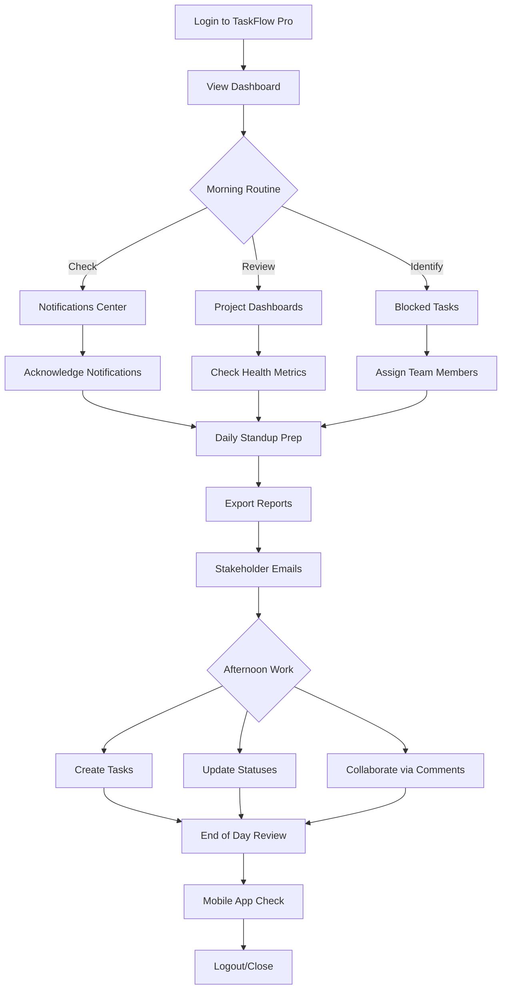
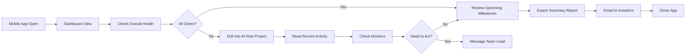
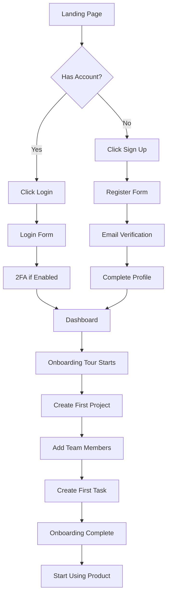
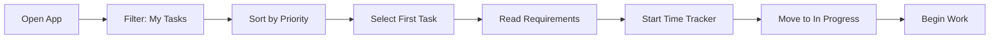
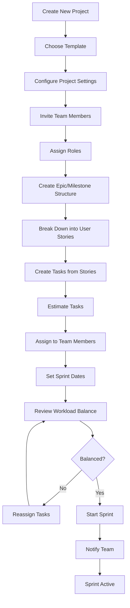
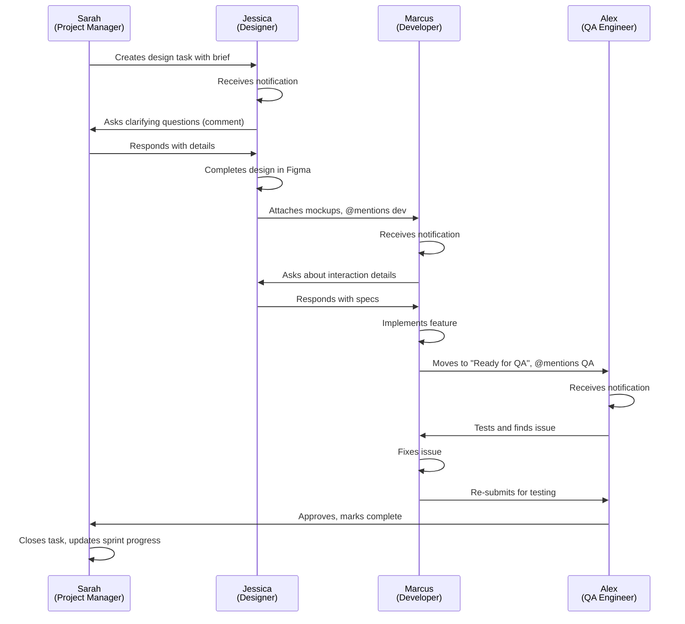
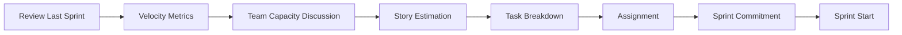

# User Personas & Journeys

## Overview

This document defines detailed user personas for TaskFlow Pro, including demographics, goals, pain points, technical proficiency, and complete user journey maps. Each persona represents a key user segment with specific needs and workflows that the application must support.

---

## Primary Personas

### Persona 1: Sarah Chen - Project Manager


#### Demographics

- **Age**: 32
- **Role**: Senior Project Manager
- **Company**: Mid-size software company (150 employees)
- **Team Size**: Manages 3 projects with 12-15 people total
- **Location**: San Francisco, CA
- **Education**: BS in Computer Science, MBA

#### Technical Proficiency

- **Overall**: Advanced
- **Project Tools**: Expert (Jira, Asana, Monday.com)
- **Software**: Daily user of Slack, Notion, Figma, Google Workspace
- **Coding**: Basic (can read code, write simple scripts)
- **Device Usage**: 60% laptop, 30% mobile, 10% tablet

#### Goals & Motivations

**Primary Goals**:

1. Keep multiple projects on track and within deadlines
2. Maintain clear visibility of team progress
3. Identify and resolve blockers quickly
4. Generate reports for stakeholder updates
5. Optimize team productivity and resource allocation

**Motivations**:

- Career advancement through successful project delivery
- Team satisfaction and low burnout rates
- Data-driven decision making
- Professional reputation for on-time, high-quality deliverables

#### Pain Points & Frustrations

| Pain Point                    | Current Impact                                         | Severity |
| ----------------------------- | ------------------------------------------------------ | -------- |
| **Context Switching**         | Uses 5+ different tools daily                          | High     |
| **Status Updates**            | Manually compiles weekly reports (2-3 hours)           | High     |
| **Team Visibility**           | Can't see real-time progress without interrupting team | Medium   |
| **Bottleneck Identification** | Blocked tasks discovered too late                      | High     |
| **Resource Planning**         | No clear view of team capacity                         | Medium   |
| **Meeting Overhead**          | Too many status meetings (10+ hours/week)              | High     |

#### Needs from TaskFlow Pro

**Must Have**:

- ✅ Real-time project dashboards
- ✅ Quick task creation and updates
- ✅ Automatic progress tracking
- ✅ Export reports for stakeholders
- ✅ Team capacity overview
- ✅ Critical path visibility

**Nice to Have**:

- ⚠️ Resource allocation planning
- ⚠️ Automated status reports
- ⚠️ Integration with Slack/Teams
- ⚠️ Predictive analytics

#### Typical Day with TaskFlow Pro

**Morning (8:00 AM - 12:00 PM)**:

1. Open TaskFlow Pro dashboard (on laptop)
2. Review overnight activity and notifications (5 min)
3. Check project health indicators (2 min)
4. Identify blocked tasks and assign resolutions (10 min)
5. Update sprint board for daily standup (5 min)
6. Export weekly report for exec team (3 min with one-click)

**Afternoon (1:00 PM - 5:00 PM)**: 7. Mobile check-in during lunch (notifications review) 8. Create tasks from stakeholder meeting notes (Quick entry) 9. Reassign tasks based on team capacity (drag-and-drop) 10. Add comments with @mentions for clarification 11. Review team activity feed (ongoing awareness)

**Evening (Optional)**: 12. Mobile app check before end of day 13. Acknowledge important notifications 14. Quick status check of critical path items

#### User Journey Map



---

### Persona 2: Marcus Rodriguez - Software Developer


#### Demographics

- **Age**: 28
- **Role**: Full-Stack Developer
- **Company**: Digital agency (40 employees)
- **Team**: Part of 8-person development team
- **Location**: Austin, TX (Remote)
- **Education**: BS in Software Engineering

#### Technical Proficiency

- **Overall**: Expert
- **Development**: Full-stack (React, Vue, Node.js, Python)
- **Project Tools**: Advanced (GitHub, Linear, Jira)
- **DevOps**: Intermediate (Docker, CI/CD basics)
- **Device Usage**: 85% laptop, 15% mobile

#### Goals & Motivations

**Primary Goals**:

1. Focus on coding with minimal administrative overhead
2. Clearly understand task requirements and priorities
3. Track time spent on tasks for billing/reporting
4. Collaborate efficiently with teammates
5. Visibility into upcoming work and dependencies

**Motivations**:

- Ship high-quality code
- Learn and grow technical skills
- Work-life balance (no after-hours surprises)
- Clear expectations and deadlines
- Autonomy and trust from management

#### Pain Points & Frustrations

| Pain Point               | Current Impact                                | Severity |
| ------------------------ | --------------------------------------------- | -------- |
| **Unclear Requirements** | Rework and wasted development time            | High     |
| **Tool Complexity**      | Spends 30+ min/day on project management tool | Medium   |
| **Context Switching**    | Between 3+ tools (Jira, GitHub, Slack)        | High     |
| **Update Burden**        | Expected to update status constantly          | Medium   |
| **Meeting Overload**     | Interruptions break focus time                | High     |
| **Scope Changes**        | Requirements change mid-development           | High     |

#### Needs from TaskFlow Pro

**Must Have**:

- ✅ Quick task status updates (one-click)
- ✅ Clear task descriptions with acceptance criteria
- ✅ Time tracking built-in
- ✅ File attachments for designs/specs
- ✅ Fast keyboard navigation
- ✅ Minimal loading times

**Nice to Have**:

- ⚠️ GitHub commit integration
- ⚠️ Markdown support in descriptions
- ⚠️ Code snippet formatting
- ⚠️ API for custom integrations

#### User Journey: Completing a Sprint Task

```mermaid
graph LR
    A[Start Day] --> B[Open TaskFlow Pro]
    B --> C[Filter: Assigned to Me]
    C --> D[Select Today's Task]
    D --> E{Task Clear?}

    E -->|Yes| F[Start Timer]
    E -->|No| G[Add Comment with Question]

    G --> H[Wait for Response]
    H --> I[Receive Notification]
    I --> F

    F --> J[Move to In Progress]
    J --> K[Code Implementation]
    K --> L[Attach Screenshots]
    L --> M[Stop Timer]
    M --> N[Move to In Review]
    N --> O[Request Code Review]
    O --> P[End of Day]
```



---

### Persona 3: Emily Watson - Team Lead


#### Demographics

- **Age**: 36
- **Role**: Engineering Team Lead
- **Company**: Tech startup (25 employees)
- **Team**: Leads 6 engineers
- **Location**: London, UK (Remote team across 3 timezones)
- **Education**: MS in Computer Science

#### Technical Proficiency

- **Overall**: Expert
- **Development**: Expert (15 years experience)
- **Project Tools**: Advanced (experienced with most PM tools)
- **Leadership**: Advanced (managed teams for 5 years)
- **Device Usage**: 70% laptop, 25% mobile, 5% tablet

#### Goals & Motivations

**Primary Goals**:

1. Unblock team members quickly
2. Maintain team morale and productivity
3. Balance hands-on coding with leadership responsibilities
4. Provide meaningful feedback and mentorship
5. Protect team from excessive meetings and interruptions

**Motivations**:

- Team success and growth
- Building high-performing, autonomous teams
- Technical excellence without sacrificing speed
- Work-life balance for entire team
- Recognition as effective technical leader

#### Pain Points & Frustrations

| Pain Point               | Current Impact                         | Severity |
| ------------------------ | -------------------------------------- | -------- |
| **Visibility Gap**       | Can't see who's blocked without asking | High     |
| **Async Communication**  | Team across 3 timezones                | High     |
| **Decision Bottleneck**  | Team waits for approvals               | Medium   |
| **Context Loss**         | Hard to catch up after time off        | Medium   |
| **Performance Tracking** | Hard to measure team velocity          | Medium   |
| **1:1 Preparation**      | No data on individual contributions    | Low      |

#### Needs from TaskFlow Pro

**Must Have**:

- ✅ Team activity feed (real-time awareness)
- ✅ Blocked task highlighting
- ✅ @mentions for quick questions
- ✅ Team performance metrics
- ✅ Individual contribution visibility
- ✅ Mobile app for on-the-go access

#### User Journey: Monday Morning Team Sync

```mermaid
graph TD
    A[Open TaskFlow Pro] --> B[Check Weekend Activity]
    B --> C[Review Blocked Tasks]
    C --> D{Any Blockers?}

    D -->|Yes| E[Reassign or Assist]
    D -->|No| F[Check Sprint Progress]

    E --> G[Add Comments with Solutions]
    G --> H[@Mention Team Members]
    H --> F

    F --> I{Behind Schedule?}
    I -->|Yes| J[Reprioritize Tasks]
    I -->|No| K[Review This Week's Goals]

    J --> L[Update Sprint Board]
    L --> K

    K --> M[Daily Standup]
    M --> N[Share Screen: TaskFlow Dashboard]
    N --> O[Team Discusses Updates]
    O --> P[Continue Work Day]
```

---

### Persona 4: David Kim - Startup Founder/CEO


#### Demographics

- **Age**: 41
- **Role**: CEO & Co-founder
- **Company**: SaaS startup (15 employees)
- **Involvement**: Strategic oversight, occasional hands-on
- **Location**: New York, NY
- **Education**: MBA, previous engineering background

#### Technical Proficiency

- **Overall**: Intermediate
- **Development**: Intermediate (former developer, now rusty)
- **Project Tools**: Intermediate (uses for oversight only)
- **Business Tools**: Expert (analytics, CRM, finance)
- **Device Usage**: 40% laptop, 50% mobile, 10% tablet

#### Goals & Motivations

**Primary Goals**:

1. High-level visibility into product development
2. Understand team productivity and velocity
3. Make data-driven resource decisions
4. Communicate progress to investors/board
5. Identify risks early

**Motivations**:

- Company success and growth
- Investor confidence
- Product-market fit achievement
- Team efficiency
- Resource optimization

#### Pain Points & Frustrations

| Pain Point               | Current Impact                             | Severity |
| ------------------------ | ------------------------------------------ | -------- |
| **Information Overload** | Too much detail in current tools           | Medium   |
| **Unclear Status**       | Hard to get simple "on-track" vs "at-risk" | High     |
| **Reporting Burden**     | Team spends too much time on reports       | Medium   |
| **Mobile Limitations**   | Can't check status easily while traveling  | Medium   |
| **Meeting Overhead**     | Requires weekly status meetings            | Medium   |

#### Needs from TaskFlow Pro

**Must Have**:

- ✅ Executive dashboard with key metrics
- ✅ Simple health indicators (green/yellow/red)
- ✅ One-click report generation
- ✅ Mobile-first design for travel
- ✅ Minimal team overhead for updates

#### User Journey: Weekly Board Update



---

## Secondary Personas

### Persona 5: Jessica Martinez - UX Designer

#### Quick Profile

- **Age**: 29
- **Role**: Senior UX/UI Designer
- **Tech Proficiency**: Intermediate
- **Primary Need**: Clear task handoffs from product to design to engineering
- **Key Use Case**: Receive design tasks, attach Figma links, collaborate with feedback

#### Journey Highlights

1. Receives task assignment notification
2. Reviews requirements and asks clarifying questions
3. Works in Figma, periodically updates task status
4. Uploads design mockups as attachments
5. @mentions developer for handoff
6. Monitors implementation and provides feedback

---

### Persona 6: Alex Thompson - QA Engineer

#### Quick Profile

- **Age**: 31
- **Role**: QA Automation Engineer
- **Tech Proficiency**: Advanced
- **Primary Need**: Clear testing requirements, bug tracking, test case management
- **Key Use Case**: Create test plans, log bugs with reproduction steps, track fixes

#### Journey Highlights

1. Creates testing tasks from requirements
2. Logs bugs with detailed repro steps and screenshots
3. Links bugs to related feature tasks
4. Tracks bug fix status and regression tests
5. Reviews completed tasks before sprint close

---

### Persona 7: Mike Anderson - Contractor/Freelancer

#### Quick Profile

- **Age**: 34
- **Role**: Freelance Full-Stack Developer
- **Tech Proficiency**: Expert
- **Primary Need**: Time tracking for billing, clear task specs, async collaboration
- **Key Use Case**: Work on assigned tasks, track billable hours, minimal meetings

#### Journey Highlights

1. Views assigned tasks for the week
2. Selects task and starts time tracker
3. Completes work, logs time, marks complete
4. Submits weekly timesheet export (CSV/PDF)
5. Limited interaction with main team (async-first)

---

## Detailed User Journeys

### Journey 1: New User Onboarding

**Persona**: Any first-time user  
**Goal**: Get started with TaskFlow Pro and create first project  
**Duration**: 5-10 minutes

#### Flow Steps



#### Detailed Steps with UI

| Step | Screen         | User Action                        | System Response                           | Blueprint Pattern                                                               |
| ---- | -------------- | ---------------------------------- | ----------------------------------------- | ------------------------------------------------------------------------------- |
| 1    | Landing        | Clicks "Get Started" button        | Navigate to /register                     | [`navigateTo()`](../frontend-arch/nuxt-vuetify/07-routing-and-navigation.md)    |
| 2    | Register       | Fills form (name, email, password) | Validates with VeeValidate                | [`useForm()`](../frontend-arch/nuxt-vuetify/09-form-validation.md)              |
| 3    | Register       | Submits form                       | Creates account, sends verification email | [`useAuth()`](../frontend-arch/nuxt-vuetify/06-state-management.md) composable  |
| 4    | Email          | Clicks verification link           | Verifies account, auto-login              | auth middleware                                                                 |
| 5    | Onboarding     | Views welcome dialog               | Shows product tour (v-dialog)             | [`VDialog`](../frontend-arch/nuxt-vuetify/04-component-architecture.md) wrapper |
| 6    | Onboarding     | Clicks "Create Project"            | Opens project creation form               | Form validation with Yup                                                        |
| 7    | Create Project | Fills project details              | Validates fields in real-time             | [`useValidation()`](../frontend-arch/nuxt-vuetify/05-composables-patterns.md)   |
| 8    | Create Project | Submits form                       | Creates project, redirects to board       | Pinia [`projectsStore`](../frontend-arch/nuxt-vuetify/06-state-management.md)   |
| 9    | Project Board  | Views empty kanban board           | Shows "Add first task" prompt             | Kanban component                                                                |
| 10   | Add Task       | Clicks "+" FAB                     | Opens quick task dialog                   | v-dialog with v-form                                                            |
| 11   | Add Task       | Enters task title                  | Auto-saves on blur                        | Debounced API call                                                              |
| 12   | Project Board  | Views first task on board          | Confetti animation, tour complete         | Success feedback                                                                |

#### Success Criteria

- **GIVEN** a new user visits TaskFlow Pro  
  **WHEN** they complete registration  
  **THEN** they should have a working project with their first task within 5 minutes

- **GIVEN** user completes onboarding  
  **WHEN** they return next day  
  **THEN** they should remember how to create tasks without help

---

### Journey 2: Daily Task Management

**Persona**: Marcus (Developer)  
**Goal**: Complete 3-4 tasks during workday  
**Duration**: Throughout 8-hour workday

#### Morning Routine (15 minutes)



#### Task Completion Cycle (Per Task)

| Phase          | Actions                                      | Time      | Blueprint Component              |
| -------------- | -------------------------------------------- | --------- | -------------------------------- |
| **Setup**      | Open task, read details, clarify in comments | 5 min     | Task detail page, comment system |
| **Work**       | Code implementation with timer running       | 2-4 hours | Time tracking composable         |
| **Update**     | Add screenshots, update description          | 5 min     | File upload, rich text editor    |
| **Transition** | Move to "In Review", @mention reviewer       | 2 min     | Kanban drag-drop, mentions       |
| **Completion** | Mark complete after approval                 | 1 min     | Status update API                |

#### Success Criteria

- **GIVEN** developer starts their day  
  **WHEN** they open TaskFlow Pro  
  **THEN** they should see exactly which tasks to work on, prioritized

- **GIVEN** developer completes a task  
  **WHEN** they move it to "Done"  
  **THEN** time should be automatically logged and team should be notified

---

### Journey 3: Project Setup & Planning

**Persona**: Sarah (Project Manager)  
**Goal**: Set up new client project with full sprint planning  
**Duration**: 45-60 minutes

#### Flow Diagram



#### Detailed Step-by-Step

**Step 1: Project Creation (5 minutes)**

```typescript
// User fills form with VeeValidate + Yup validation
interface ProjectForm {
  name: string; // Required, max 100 chars
  description: string; // Optional, max 500 chars
  startDate: Date; // Required, cannot be past
  endDate: Date; // Required, > startDate
  template: string; // Optional, dropdown selection
  visibility: "private" | "team" | "public";
  color: string; // Hex color picker
}
```

**Components Used**:

- `VTextField` for name/description
- `VDatePicker` for dates
- `VSelect` for template selection
- `VColorPicker` for project color
- `AppButton` for submission

**Step 2: Team Management (10 minutes)**

- Add team members via email (v-combobox with async validation)
- Assign roles (v-select: Admin, Manager, Member, Guest)
- Set project-level permissions (v-checkbox-group)
- Send invitations (batch email via API)

**Step 3: Sprint Planning (30 minutes)**

- Create milestone structure (tree view with v-treeview)
- Add user stories (card-based creation with v-card-list)
- Break into tasks (nested task creation)
- Drag tasks to kanban columns (v-data-table with drag/drop)
- Assign team members (v-avatar selector)
- Set estimates (v-slider for story points)

**Step 4: Review & Launch (5 minutes)**

- Review automated workload chart (data visualization)
- Get warnings if anyone overallocated (v-alert)
- Adjust if needed
- Click "Start Sprint" (confirmation dialog)
- Team receives notifications

#### Success Criteria

- **GIVEN** PM has project requirements  
  **WHEN** they use TaskFlow Pro  
  **THEN** project setup should take < 1 hour with 30+ tasks created

---

### Journey 4: Cross-Team Collaboration

**Persona**: Multi-role collaboration  
**Goal**: Design → Development → QA handoff  
**Duration**: 2-day cycle

#### Collaboration Flow



#### Touch Points with TaskFlow Pro

| Touchpoint              | Feature Used          | Notification Trigger  |
| ----------------------- | --------------------- | --------------------- |
| Task Assignment         | Auto-assign or manual | Email + in-app        |
| Questions/Clarification | Comment thread        | @mention notification |
| Design Handoff          | File attachment       | Task status change    |
| Implementation Complete | Status update         | Watchers notified     |
| QA Review               | @mention + status     | Assignee notified     |
| Bug Found               | New linked task       | Creator notified      |
| Bug Fixed               | Status update         | QA notified           |
| Task Completed          | Final status          | All watchers notified |

---

## User Scenarios

### Scenario 1: Emergency Bug Fix

**Context**: Production bug discovered on Friday evening  
**Personas Involved**: Team Lead (Emily), Developer (Marcus)  
**Duration**: 30 minutes to coordinate

#### Workflow

1. **Emily** (mobile app while commuting home):

   - Creates urgent bug task in "Critical Bugs" project
   - Sets priority to "Critical"
   - @mentions Marcus in description
   - Adds error logs as attachment

2. **Marcus** (receives push notification):

   - Opens task on mobile app
   - Reads description and logs
   - Adds comment: "Can reproduce, investigating"
   - Starts timer on task

3. **Marcus** (switches to laptop):

   - Fixes bug in code
   - Attaches screenshot of fix
   - Moves task to "Testing"
   - @mentions Emily and QA

4. **Emily** (mobile app):
   - Receives notification
   - Reviews fix approach in comments
   - Approves deployment
   - Marks task "Done"

**Demonstrated Patterns**:

- Mobile-responsive design (Vuetify breakpoints)
- Real-time notifications (notification store)
- File uploads (attachment composable)
- @mentions system (comment parsing)
- Status workflows (task state machine)

---

### Scenario 2: Sprint Planning Meeting

**Context**: Two-week sprint planning with 8-person team  
**Persona**: Sarah (Project Manager) leading  
**Duration**: 90 minutes

#### Meeting Flow

**Preparation (15 min before meeting)**:

- Sarah exports last sprint's velocity metrics
- Creates new sprint in TaskFlow Pro
- Pre-loads user stories from backlog
- Shares dashboard URL with team

**During Meeting (90 min)**:



1. **Review (15 min)**: Sarah shares screen showing TaskFlow Pro burn-down chart
2. **Planning (45 min)**: Team estimates stories, creates tasks, real-time updates visible to all
3. **Assignment (20 min)**: Drag-and-drop assignment, workload bars show capacity
4. **Clarification (10 min)**: Team adds comments/questions directly on tasks

**Post-Meeting**:

- Sprint board automatically ready
- All team members have assigned tasks
- Notifications sent for assignments
- Calendar events created for due dates

**Demonstrated Patterns**:

- Data visualization (charts and metrics)
- Real-time collaboration (WebSocket or polling)
- Drag-and-drop assignment (Vuetify sortable)
- Export functionality (reports composable)
- Screen sharing friendly (responsive layout)

---

### Scenario 3: Global Team Coordination

**Context**: Team across US/Europe/Asia timezones  
**Personas**: Team members in 3 different timezones  
**Challenge**: Async collaboration without meetings

#### 24-Hour Cycle

**6:00 AM UTC - London (Emily - Team Lead)**

- Reviews overnight activity from Asia team
- Unblocks 2 tasks with comments
- Prioritizes today's work
- Adds tasks for US team to pick up

**2:00 PM UTC - US East Coast (Sarah - PM)**

- Checks progress on London team's work
- Updates client on milestone status
- Creates new tasks based on client feedback
- @mentions Asia team for next cycle

**10:00 PM UTC - Asia/Singapore (Dev Team)**

- Picks up tasks from US team
- Comments with questions (US team answers next day)
- Completes implementations
- Updates status for London team to review

**Demonstrated Patterns**:

- Activity feed (chronological updates)
- Notification system (async communication)
- Time zone aware formatting (i18n)
- Comment threading (nested discussions)
- Mobile-first (different device preferences)

---

## Pain Point → Solution Mapping

### Project Manager Pain Points

| Pain Point                   | TaskFlow Pro Solution                   | Blueprint Pattern                         |
| ---------------------------- | --------------------------------------- | ----------------------------------------- |
| **Manual status reports**    | One-click report generation with charts | Reporting composable + data visualization |
| **Unclear team capacity**    | Visual workload indicators per person   | Computed properties in stores             |
| **Blockers discovered late** | Real-time blocked task highlighting     | Reactive state management                 |
| **Too many tools**           | All-in-one platform                     | Comprehensive feature set                 |
| **Poor mobile experience**   | Responsive design, mobile-first         | Vuetify display breakpoints               |

### Developer Pain Points

| Pain Point               | TaskFlow Pro Solution                            | Blueprint Pattern            |
| ------------------------ | ------------------------------------------------ | ---------------------------- |
| **Unclear requirements** | Structured task templates, acceptance criteria   | Form validation with schemas |
| **Update overhead**      | One-click status changes, automatic activity log | Optimistic UI updates        |
| **Context switching**    | Browser-based, integrated workflows              | SPA navigation               |
| **Tool complexity**      | Keyboard shortcuts, minimal clicks               | Accessibility patterns       |
| **Time tracking hassle** | Built-in timer with one-click start/stop         | Timer composable             |

### Team Lead Pain Points

| Pain Point               | TaskFlow Pro Solution                     | Blueprint Pattern            |
| ------------------------ | ----------------------------------------- | ---------------------------- |
| **Visibility gap**       | Real-time activity feed, team dashboard   | WebSocket or polling updates |
| **Async communication**  | @mentions, notifications across timezones | Notification store           |
| **Performance tracking** | Velocity charts, completed vs. planned    | Data aggregation composables |
| **Meeting preparation**  | Filtered views, export capabilities       | Advanced filtering/sorting   |

---

## Accessibility Considerations

### Persona: Amanda Lee - Visually Impaired User

#### Profile

- Uses screen reader (NVDA on Windows)
- Keyboard-only navigation
- High contrast theme preferred
- Requires alt text for all images
- Needs proper heading hierarchy

#### Accessibility Requirements

| Feature              | Requirement                             | Implementation              |
| -------------------- | --------------------------------------- | --------------------------- |
| **Navigation**       | Full keyboard access                    | Vuetify keyboard handlers   |
| **Screen Reader**    | ARIA labels on all interactive elements | Semantic HTML + ARIA        |
| **Contrast**         | WCAG AA minimum (4.5:1)                 | High contrast theme variant |
| **Focus Indicators** | Visible focus state                     | Vuetify focus styles        |
| **Headings**         | Proper hierarchy (H1 → H6)              | Semantic heading structure  |
| **Forms**            | Associated labels                       | v-text-field with labels    |
| **Images**           | Alt text always                         | All v-img with :alt         |
| **Error Messages**   | Announced to screen reader              | aria-live regions           |

#### User Journey

1. Tab to username field (focus indicator visible)
2. Screen reader announces "Username, required, text field"
3. Enter username
4. Tab to password field
5. Screen reader announces "Password, required, password field"
6. Enter password
7. Tab to submit button
8. Screen reader announces "Sign in, button"
9. Press Space or Enter to submit
10. Screen reader announces "Signing in" (loading state)
11. On success: "Welcome back, Sarah. Dashboard loaded" (live region)

**Demonstrated Patterns**:

- WCAG AA compliance (accessibility testing)
- Keyboard navigation (focus management)
- Screen reader support (ARIA attributes)
- High contrast themes (theming system)

---

## Mobile-Specific Journeys

### Mobile Journey 1: Quick Task Update on Commute

**Persona**: Sarah (PM) on subway  
**Device**: iPhone 13, 4G connection  
**Duration**: 2 minutes

#### Optimized Mobile Flow

```mermaid
graph LR
    A[Open PWA] --> B[Offline Cache Loads]
    B --> C[Dashboard Renders]
    C --> D[Pull to Refresh]
    D --> E[New Tasks Downloaded]
    E --> F[Tap on Urgent Task]
    F --> G[Quick Actions Menu]
    G --> H[Update Status]
    H --> I[Offline Queue]
    I --> J[Sync When Online]
```



**Mobile Optimizations**:

- PWA offline support
- Optimistic UI updates
- Touch-friendly tap targets (44px minimum)
- Bottom sheet for actions (easier thumb reach)
- Reduced data transfer (lazy load images)
- Swipe gestures for quick actions

**Blueprint Patterns**:

- PWA configuration
- Offline-first composables
- Mobile-optimized Vuetify components
- Responsive layouts

---

### Mobile Journey 2: Notification Response

**Persona**: Marcus (Developer)  
**Trigger**: Push notification "@Marcus - Design question on Task #234"  
**Device**: Android phone

#### Interaction Flow

1. **Notification arrives** (system tray)
2. **User taps notification**
3. **App opens** (PWA or web browser)
4. **Deep link to task** #234 (direct navigation)
5. **Task detail opens** with comment scrolled into view
6. **User reads question**
7. **Taps "Reply" button** (bottom sheet appears)
8. **Types response** (mobile keyboard)
9. **Taps "Send"**
10. **Comment posted**, notification sent to asker
11. **Closes app** (swipe-to-close)

**Mobile Components**:

- Push notification handler
- Deep linking (route parameter handling)
- Bottom sheet (v-bottom-sheet)
- Mobile keyboard optimization
- Touch gestures

---

## Edge Cases & Special Scenarios

### Edge Case 1: User Deletes Project by Mistake

**Flow**:

1. User clicks "Delete Project" (confirmation dialog appears)
2. User confirms deletion too quickly
3. Project moved to trash/archive (not hard deleted)
4. Toast notification: "Project archived. Undo?"
5. User clicks "Undo" within 10 seconds
6. Project restored instantly

**Pattern**: Undo functionality with timeout

---

### Edge Case 2: Multiple Users Edit Same Task

**Flow**:

1. User A opens task for editing
2. User B also opens same task
3. User A saves changes (updates version)
4. User B tries to save (version conflict detected)
5. Dialog shows: "Task was updated by User A. Load latest version?"
6. User B reviews changes
7. User B's changes merged or discarded

**Pattern**: Optimistic locking with conflict resolution

---

### Edge Case 3: Network Interruption During Task Creation

**Flow**:

1. User creates task on mobile
2. Network disconnects mid-save
3. Task goes to offline queue
4. Toast shows: "Saved locally, will sync when online"
5. User continues working offline
6. Network reconnects
7. Offline queue syncs automatically
8. Toast confirms: "3 tasks synced"

**Pattern**: Offline-first with sync queue

---

## Persona Usage Patterns

### Time-of-Day Patterns

| Time             | Active Personas       | Primary Activities                              |
| ---------------- | --------------------- | ----------------------------------------------- |
| **6 AM - 9 AM**  | Team Leads, PMs       | Review overnight work, plan day, set priorities |
| **9 AM - 12 PM** | Developers, Designers | Deep work on tasks, focused time                |
| **12 PM - 2 PM** | All                   | Quick mobile checks, light updates              |
| **2 PM - 5 PM**  | PMs, QA               | Meetings, reviews, status updates               |
| **5 PM - 7 PM**  | Developers            | Wrap up tasks, update statuses                  |
| **Evening**      | Executives            | Mobile dashboard reviews                        |

### Device Preferences

| Persona          | Desktop | Mobile | Tablet | Primary Use Case                            |
| ---------------- | ------- | ------ | ------ | ------------------------------------------- |
| **Sarah (PM)**   | 60%     | 30%    | 10%    | Reports on desktop, checks on mobile        |
| **Marcus (Dev)** | 85%     | 15%    | 0%     | Coding on desktop, quick updates mobile     |
| **Emily (Lead)** | 70%     | 25%    | 5%     | Leadership work desktop, team checks mobile |
| **David (CEO)**  | 40%     | 50%    | 10%    | Dashboards on mobile, deep dives desktop    |
| **Jessica (UX)** | 75%     | 20%    | 5%     | Design work desktop, reviews mobile         |

---

## Workflow Complexity Levels

### Level 1: Simple (Single User, Basic Tasks)

**Example**: Freelancer managing personal to-do list

**Features Needed**:

- Task creation
- Simple list view
- Due dates
- Status updates

**Complexity**: Low  
**Target Time**: 5 minutes to master

---

### Level 2: Team (Small Team, Collaboration)

**Example**: 5-person startup team

**Features Needed**:

- Everything in Level 1 +
- Team member assignments
- Comments and @mentions
- Basic kanban board
- File attachments

**Complexity**: Medium  
**Target Time**: 30 minutes to master

---

### Level 3: Organization (Multiple Projects, Complex Workflows)

**Example**: 50-person agency with 10+ projects

**Features Needed**:

- Everything in Level 2 +
- Multiple projects
- Custom workflows
- Role-based permissions
- Time tracking and reporting
- Advanced filtering
- Templates

**Complexity**: Advanced  
**Target Time**: 2-3 hours training

---

## Success Metrics by Persona

### Sarah (Project Manager) - Success Indicators

| Metric                        | Target        | Measurement              |
| ----------------------------- | ------------- | ------------------------ |
| **Report Generation Time**    | < 3 minutes   | Feature timing analytics |
| **Project Health Visibility** | Real-time     | Dashboard load time      |
| **Team Productivity Insight** | Daily metrics | Report accuracy          |
| **Meeting Time Reduction**    | 30% decrease  | Calendar integration     |
| **Confidence in Status**      | 90%+ accuracy | User survey              |

### Marcus (Developer) - Success Indicators

| Metric                      | Target              | Measurement            |
| --------------------------- | ------------------- | ---------------------- |
| **Time to Start Task**      | < 30 seconds        | Task open to progress  |
| **Status Update Time**      | < 5 seconds         | Click to save duration |
| **Clarity of Requirements** | 80%+ tasks clear    | Rework rate            |
| **Interruption Reduction**  | 50% fewer questions | Comment usage          |
| **Satisfaction**            | NPS 60+             | Developer survey       |

### Emily (Team Lead) - Success Indicators

| Metric                     | Target               | Measurement                |
| -------------------------- | -------------------- | -------------------------- |
| **Team Blocker Awareness** | < 1 hour to discover | Blocked task notifications |
| **1:1 Preparation**        | < 10 minutes         | Individual views           |
| **Work Distribution**      | < 15% variance       | Load balancing charts      |
| **Team Morale**            | High satisfaction    | Pulse surveys              |

---

## Conclusion

These detailed personas and journeys provide the foundation for all feature specifications, user stories, and acceptance criteria. Each represents real user needs that TaskFlow Pro must address while demonstrating architectural excellence from the Nuxt + Vuetify blueprint.

**Key Takeaways**:

- **4 primary personas** with distinct needs and workflows
- **Multiple device contexts** (desktop, mobile, tablet)
- **Cross-timezone collaboration** patterns
- **Accessibility requirements** built-in from start
- **Real-world scenarios** mapped to blueprint patterns

---

**Next Document**: [Feature Specifications](./04-feature-specifications.md) →
