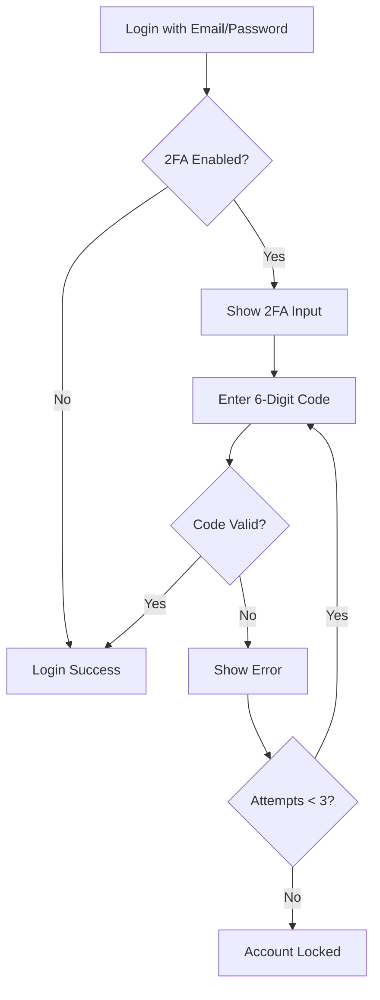
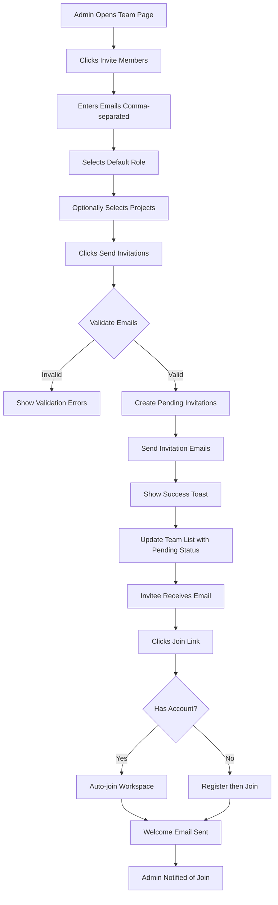

# Feature Specifications

## Overview

This document provides complete feature specifications for TaskFlow Pro, organized by functional module. Each feature includes detailed requirements, acceptance criteria, user interactions, data models, and alignment with the Nuxt + Vuetify architecture blueprint.

---

## Module 1: Authentication & User Management

### 1.1 User Registration

#### Description

New users can create accounts using email/password or OAuth providers (Google, GitHub, Microsoft).

#### Functional

Requirements

| ID          | Requirement                                    | Priority | Blueprint Reference                                                                 |
| ----------- | ---------------------------------------------- | -------- | ----------------------------------------------------------------------------------- |
| AUTH-REG-01 | Email/password registration with validation    | P0       | [`useForm()`](../frontend-arch/nuxt-vuetify/09-form-validation.md) with VeeValidate |
| AUTH-REG-02 | OAuth registration (Google, GitHub, Microsoft) | P1       | OAuth plugin integration                                                            |
| AUTH-REG-03 | Email verification required                    | P0       | Server API + email service                                                          |
| AUTH-REG-04 | Password strength requirements                 | P0       | Custom validation rules                                                             |
| AUTH-REG-05 | Terms of service acceptance                    | P0       | Checkbox with validation                                                            |
| AUTH-REG-06 | Unique email validation                        | P0       | Async validation rule                                                               |
| AUTH-REG-07 | Auto-login after verification                  | P1       | [`authStore`](../frontend-arch/nuxt-vuetify/06-state-management.md) action          |

#### User Interface Components

```vue
<!-- pages/register.vue -->
<template>
  <v-container class="fill-height">
    <v-row justify="center">
      <v-col cols="12" sm="8" md="5" lg="4">
        <v-card elevation="2">
          <v-card-title class="text-h5 text-center py-6">
            Create Your Account
          </v-card-title>

          <v-card-text>
            <!-- Email/Password Form -->
            <v-form @submit.prevent="handleRegister">
              <AppTextField
                name="firstName"
                label="First Name"
                prepend-inner-icon="mdi-account"
                rules="required|max:50"
              />

              <AppTextField
                name="lastName"
                label="Last Name"
                prepend-inner-icon="mdi-account"
                rules="required|max:50"
                class="mt-4"
              />

              <AppTextField
                name="email"
                label="Email Address"
                type="email"
                prepend-inner-icon="mdi-email"
                rules="required|email|uniqueEmail"
                class="mt-4"
              />

              <AppTextField
                name="password"
                label="Password"
                type="password"
                prepend-inner-icon="mdi-lock"
                rules="required|min:8|passwordStrength"
                class="mt-4"
              />

              <AppTextField
                name="confirmPassword"
                label="Confirm Password"
                type="password"
                prepend-inner-icon="mdi-lock-check"
                rules="required|confirmed:password"
                class="mt-4"
              />

              <v-checkbox
                name="acceptTerms"
                rules="required"
                color="primary"
                class="mt-4"
              >
                <template #label>
                  I accept the
                  <NuxtLink to="/terms" class="text-primary">
                    Terms of Service
                  </NuxtLink>
                  and
                  <NuxtLink to="/privacy" class="text-primary">
                    Privacy Policy
                  </NuxtLink>
                </template>
              </v-checkbox>

              <v-btn
                type="submit"
                color="primary"
                size="large"
                block
                :loading="isSubmitting"
                class="mt-6"
              >
                Create Account
              </v-btn>
            </v-form>

            <!-- OAuth Options -->
            <v-divider class="my-6" />

            <div class="d-flex flex-column ga-3">
              <v-btn
                variant="outlined"
                prepend-icon="mdi-google"
                @click="handleOAuthLogin('google')"
              >
                Continue with Google
              </v-btn>

              <v-btn
                variant="outlined"
                prepend-icon="mdi-github"
                @click="handleOAuthLogin('github')"
              >
                Continue with GitHub
              </v-btn>
            </div>
          </v-card-text>

          <v-divider />

          <v-card-text class="text-center">
            Already have an account?
            <NuxtLink to="/login" class="text-primary font-weight-medium">
              Sign In
            </NuxtLink>
          </v-card-text>
        </v-card>
      </v-col>
    </v-row>
  </v-container>
</template>
```

#### Validation Schema (Yup)

```typescript
// schemas/registration.schema.ts
import * as yup from "yup";

export const registrationSchema = yup.object({
  firstName: yup
    .string()
    .required("First name is required")
    .max(50, "First name must not exceed 50 characters"),

  lastName: yup
    .string()
    .required("Last name is required")
    .max(50, "Last name must not exceed 50 characters"),

  email: yup
    .string()
    .required("Email is required")
    .email("Please enter a valid email address")
    .test("unique-email", "This email is already registered", async (value) => {
      if (!value) return true;
      const response = await $fetch("/api/auth/check-email", {
        method: "POST",
        body: { email: value },
      });
      return response.available;
    }),

  password: yup
    .string()
    .required("Password is required")
    .min(8, "Password must be at least 8 characters")
    .matches(/[A-Z]/, "Password must contain an uppercase letter")
    .matches(/[a-z]/, "Password must contain a lowercase letter")
    .matches(/\d/, "Password must contain a number")
    .matches(/[@$!%*?&#]/, "Password must contain a special character"),

  confirmPassword: yup
    .string()
    .required("Please confirm your password")
    .oneOf([yup.ref("password")], "Passwords do not match"),

  acceptTerms: yup
    .boolean()
    .oneOf([true], "You must accept the terms and conditions"),
});
```

#### Acceptance Criteria

```gherkin
# Feature: User Registration

Scenario: Successful email registration
  Given I am on the registration page
  When I fill in valid user details
  And I accept the terms and conditions
  And I click "Create Account"
  Then my account should be created
  And verification email should be sent
  And I should see "Check your email to verify" message

Scenario: Duplicate email prevention
  Given I am on the registration page
  When I enter an email that already exists
  Then the email field should show "This email is already registered" error
  And the submit button should be disabled

Scenario: Password validation enforcement
  Given I am on the registration page
  When I enter a weak password (e.g., "12345")
  Then I should see password strength requirements
  And the submit button should be disabled

Scenario: OAuth registration (Google)
  Given I am on the registration page
  When I click "Continue with Google"
  Then I should be redirected to Google OAuth
  And after successful auth, my account should be created
  And I should be logged in automatically
```

---

### 1.2 User Login

#### Description

Users can sign in using email/password or OAuth providers with optional two-factor authentication.

#### Functional Requirements

| ID            | Requirement                             | Priority | Implementation                                                                         |
| ------------- | --------------------------------------- | -------- | -------------------------------------------------------------------------------------- |
| AUTH-LOGIN-01 | Email/password login                    | P0       | [`useAuthStore().login()`](../frontend-arch/nuxt-vuetify/06-state-management.md)       |
| AUTH-LOGIN-02 | OAuth login (Google, GitHub, Microsoft) | P1       | OAuth middleware                                                                       |
| AUTH-LOGIN-03 | "Remember Me" functionality             | P0       | Cookie with extended expiry                                                            |
| AUTH-LOGIN-04 | Two-factor authentication (2FA)         | P1       | TOTP verification                                                                      |
| AUTH-LOGIN-05 | Error handling for invalid credentials  | P0       | [`useToast()`](../frontend-arch/nuxt-vuetify/05-composables-patterns.md) notifications |
| AUTH-LOGIN-06 | Password visibility toggle              | P0       | v-text-field :append-inner-icon                                                        |
| AUTH-LOGIN-07 | Redirect to intended page after login   | P0       | Middleware with query params                                                           |

#### State Management

```typescript
// stores/auth.ts
import { defineStore } from "pinia";

export const useAuthStore = defineStore("auth", () => {
  // State
  const tokens = ref<AuthTokens | null>(null);
  const isAuthenticated = computed(() => {
    if (!tokens.value) return false;
    return tokens.value.expiresAt > Date.now();
  });

  // Actions
  async function login(credentials: LoginCredentials): Promise<void> {
    const response = await $fetch<AuthResponse>("/api/auth/login", {
      method: "POST",
      body: credentials,
    });

    tokens.value = response.tokens;
    userStore.setUser(response.user);

    // Persist tokens
    const storage = credentials.remember ? localStorage : sessionStorage;
    storage.setItem("auth_tokens", JSON.stringify(response.tokens));
  }

  return {
    tokens: readonly(tokens),
    isAuthenticated,
    login,
    // ... other actions
  };
});
```

---

### 1.3 Two-Factor Authentication (2FA)

#### Description

Optional security layer requiring TOTP code after password verification.

#### Functional Requirements

| ID          | Requirement                               | Priority |
| ----------- | ----------------------------------------- | -------- |
| AUTH-2FA-01 | Enable/disable 2FA in settings            | P1       |
| AUTH-2FA-02 | QR code generation for authenticator apps | P1       |
| AUTH-2FA-03 | 6-digit TOTP code verification            | P1       |
| AUTH-2FA-04 | Backup codes generation (10 codes)        | P1       |
| AUTH-2FA-05 | Recovery process if device lost           | P1       |

#### UI Flow



---

## Module 2: Dashboard & Overview

### 2.1 Main Dashboard

#### Description

Personalized dashboard showing user's tasks, project summaries, recent activity, and quick actions.

#### Layout Structure

```
┌─────────────────────────────────────────────────────────────┐
│  Header: Logo | Search | Notifications | Theme | User Menu  │
├─────────────────────────────────────────────────────────────┤
│ Side │                                                       │
│ bar  │  Dashboard Page                                       │
│      │  ┌─────────────────────────────────────────────┐     │
│ Nav  │  │ Welcome, Sarah! 👋                          │     │
│ Menu │  │ Tuesday, December 17, 2024                  │     │
│      │  └─────────────────────────────────────────────┘     │
│      │                                                       │
│      │  ┌──────┐ ┌──────┐ ┌──────┐ ┌──────┐                │
│      │  │Total │ │Active│ │Over- │ │Done  │   Stats Cards  │
│      │  │Tasks │ │Tasks │ │due   │ │Today │                │
│      │  │  42  │ │  18  │ │  3   │ │  8   │                │
│      │  └──────┘ └──────┘ └──────┘ └──────┘                │
│      │                                                       │
│      │  ┌─────────────────────┐ ┌──────────────────┐        │
│      │  │ My Tasks (Priority) │ │ Recent Activity  │        │
│      │  │ ─────────────────── │ │ ──────────────── │        │
│      │  │ ☐ Fix login bug     │ │ • Marcus com...  │        │
│      │  │ ☐ Review PR #234    │ │ • Emily assi... │        │
│      │  │ ☐ Update docs       │ │ • New task cr...│        │
│      │  └─────────────────────┘ └──────────────────┘        │
│      │                                                       │
│      │  ┌─────────────────────────────────────────────┐     │
│      │  │ Project Progress (Charts)                   │     │
│      │  │ [Burn-down Chart] [Velocity Chart]          │     │
│      │  └─────────────────────────────────────────────┘     │
│      │                                                       │
│      │  + Floating Action Button (Create Task)              │
└─────┴───────────────────────────────────────────────────────┘
```

#### Components Used

| Component                   | Purpose             | Blueprint Pattern                                                              |
| --------------------------- | ------------------- | ------------------------------------------------------------------------------ |
| `LayoutHeader.vue`          | Top navigation bar  | [Layout component](../frontend-arch/nuxt-vuetify/04-component-architecture.md) |
| `LayoutSidebar.vue`         | Navigation drawer   | v-navigation-drawer wrapper                                                    |
| `DashboardStatsCard.vue`    | Metric display card | Domain-specific component                                                      |
| `DashboardTaskList.vue`     | Task list widget    | v-list with custom items                                                       |
| `DashboardActivityFeed.vue` | Activity stream     | Virtual scroll for performance                                                 |
| `DashboardChart.vue`        | Data visualization  | Chart library integration                                                      |

#### State Management

```typescript
// composables/useDashboard.ts
export function useDashboard() {
  const userStore = useUserStore();
  const tasksStore = useTasksStore();
  const projectsStore = useProjectsStore();

  // Reactive state
  const stats = computed(() => ({
    totalTasks: tasksStore.userTasks.length,
    activeTasks: tasksStore.activeTasks.length,
    overdueTasks: tasksStore.overdueTasks.length,
    completedToday: tasksStore.completedToday.length,
  }));

  const recentActivity = computed(() => {
    // Aggregate from multiple stores
    return [...tasksStore.recentUpdates, ...projectsStore.recentUpdates]
      .sort((a, b) => b.timestamp - a.timestamp)
      .slice(0, 10);
  });

  // Methods
  async function refreshDashboard() {
    await Promise.all([
      tasksStore.fetchUserTasks(),
      projectsStore.fetchUserProjects(),
      fetchActivityFeed(),
    ]);
  }

  return {
    stats,
    recentActivity,
    refreshDashboard,
  };
}
```

#### Acceptance Criteria

**AC1: Dashboard Loads on Login**

```
GIVEN an authenticated user
WHEN they log in successfully
THEN dashboard should load within 2 seconds
AND display personalized content
AND show accurate statistics
```

**AC2: Real-Time Updates**

```
GIVEN user is viewing dashboard
WHEN a task assigned to them is updated
THEN dashboard should reflect the change within 5 seconds
AND show a toast notification
```

**AC3: Mobile Responsive**

```
GIVEN user accesses dashboard on mobile (< 600px)
WHEN page loads
THEN stats cards should stack vertically
AND sidebar should be hidden by default
AND all content should be readable
```

---

### 1.4 User Profile Management

#### Description

Users can view and update their profile information, preferences, and account settings.

#### Functional Requirements

| ID           | Requirement                                   | Priority | Form Validation              |
| ------------ | --------------------------------------------- | -------- | ---------------------------- |
| USER-PROF-01 | Update profile information (name, bio, title) | P0       | VeeValidate schema           |
| USER-PROF-02 | Upload and crop profile avatar                | P0       | File upload composable       |
| USER-PROF-03 | Change email address (with verification)      | P1       | Async email validation       |
| USER-PROF-04 | Update password (require current password)    | P0       | Password strength validation |
| USER-PROF-05 | Set notification preferences                  | P0       | Checkbox group               |
| USER-PROF-06 | Set language preference                       | P0       | Language selector            |
| USER-PROF-07 | Set theme preference (light/dark/auto)        | P0       | Theme toggle                 |
| USER-PROF-08 | Configure timezone                            | P1       | Timezone select              |
| USER-PROF-09 | Set default task view (kanban/list)           | P1       | Preference storage           |

#### Profile Settings UI

```vue
<!-- pages/settings/profile.vue -->
<template>
  <v-container>
    <v-row>
      <v-col cols="12" md="3">
        <!-- Settings Sidebar -->
        <v-list nav>
          <v-list-item
            to="/settings/profile"
            prepend-icon="mdi-account"
            title="Profile"
          />
          <v-list-item
            to="/settings/account"
            prepend-icon="mdi-cog"
            title="Account"
          />
          <v-list-item
            to="/settings/security"
            prepend-icon="mdi-shield"
            title="Security"
          />
          <v-list-item
            to="/settings/notifications"
            prepend-icon="mdi-bell"
            title="Notifications"
          />
        </v-list>
      </v-col>

      <v-col cols="12" md="9">
        <v-card>
          <v-card-title>Profile Information</v-card-title>

          <v-card-text>
            <!-- Avatar Upload -->
            <div class="d-flex flex-column align-center mb-6">
              <v-avatar size="120" color="primary">
                <v-img v-if="avatarUrl" :src="avatarUrl" />
                <span v-else class="text-h4">{{ userInitials }}</span>
              </v-avatar>

              <div class="mt-4">
                <v-btn
                  variant="outlined"
                  prepend-icon="mdi-upload"
                  @click="triggerFileUpload"
                >
                  Change Picture
                </v-btn>
                <input
                  ref="fileInput"
                  type="file"
                  accept="image/*"
                  hidden
                  @change="handleFileSelect"
                />
              </div>
            </div>

            <!-- Profile Form -->
            <v-form>
              <v-row>
                <v-col cols="12" md="6">
                  <AppTextField
                    name="firstName"
                    label="First Name"
                    rules="required|max:50"
                  />
                </v-col>
                <v-col cols="12" md="6">
                  <AppTextField
                    name="lastName"
                    label="Last Name"
                    rules="required|max:50"
                  />
                </v-col>
              </v-row>

              <AppTextField
                name="title"
                label="Job Title"
                rules="max:100"
                hint="e.g., Senior Software Engineer"
              />

              <AppTextarea
                name="bio"
                label="Bio"
                rules="max:500"
                counter="500"
                rows="4"
                class="mt-4"
              />

              <AppTextField
                name="email"
                label="Email Address"
                type="email"
                rules="required|email"
                hint="Changing email requires verification"
                class="mt-4"
              />

              <AppSelect
                name="timezone"
                label="Timezone"
                :items="timezones"
                class="mt-4"
              />

              <v-btn
                color="primary"
                :loading="isSaving"
                @click="saveProfile"
                class="mt-6"
              >
                Save Changes
              </v-btn>
            </v-form>
          </v-card-text>
        </v-card>
      </v-col>
    </v-row>
  </v-container>
</template>
```

---

## Module 3: Project Management

### 3.1 Project Creation & Configuration

#### Description

Users can create new projects with customizable settings, workflows, and team assignments.

#### Functional Requirements

| ID             | Requirement                                   | Priority | Data Model           |
| -------------- | --------------------------------------------- | -------- | -------------------- |
| PROJ-CREATE-01 | Create project with name, description, dates  | P0       | `Project` entity     |
| PROJ-CREATE-02 | Set project visibility (private/team/public)  | P0       | Enum field           |
| PROJ-CREATE-03 | Choose color and icon for project             | P1       | Color + icon fields  |
| PROJ-CREATE-04 | Select project template                       | P1       | Template reference   |
| PROJ-CREATE-05 | Configure custom statuses                     | P1       | Status configuration |
| PROJ-CREATE-06 | Set default assignee                          | P2       | User reference       |
| PROJ-CREATE-07 | Enable/disable features (time tracking, etc.) | P2       | Feature flags        |

#### Project Entity Schema

```typescript
// types/project.ts
export interface Project {
  id: string;
  name: string;
  description: string | null;
  color: string;
  icon: string;

  // Dates
  startDate: Date;
  endDate: Date | null;
  createdAt: Date;
  updatedAt: Date;

  // Ownership
  ownerId: string;
  owner: User;

  // Settings
  visibility: "private" | "team" | "public";
  status: "active" | "archived" | "completed";
  templateId: string | null;

  // Features
  features: {
    timeTracking: boolean;
    subtasks: boolean;
    dependencies: boolean;
    customFields: boolean;
  };

  // Workflow
  statuses: ProjectStatus[];
  defaultStatusId: string;

  // Relationships
  members: ProjectMember[];
  tasks: Task[];

  // Metrics (computed)
  taskCount: number;
  completedTaskCount: number;
  progressPercentage: number;
  memberCount: number;
}

export interface ProjectStatus {
  id: string;
  name: string;
  color: string;
  order: number;
  category: "todo" | "in_progress" | "done";
}

export interface ProjectMember {
  id: string;
  userId: string;
  user: User;
  role: "owner" | "admin" | "member" | "guest";
  joinedAt: Date;
}
```

#### Project Store

```typescript
// stores/projects.ts
import { defineStore } from "pinia";

export const useProjectsStore = defineStore("projects", () => {
  const items = ref<Project[]>([]);
  const current = ref<Project | null>(null);
  const loading = ref(false);

  // Computed
  const activeProjects = computed(() =>
    items.value.filter((p) => p.status === "active")
  );

  const archivedProjects = computed(() =>
    items.value.filter((p) => p.status === "archived")
  );

  // Actions
  async function fetchProjects(): Promise<Project[]> {
    loading.value = true;
    try {
      const response = await $fetch<Project[]>("/api/projects");
      items.value = response;
      return response;
    } finally {
      loading.value = false;
    }
  }

  async function createProject(data: CreateProjectInput): Promise<Project> {
    loading.value = true;
    try {
      const project = await $fetch<Project>("/api/projects", {
        method: "POST",
        body: data,
      });
      items.value.push(project);
      return project;
    } finally {
      loading.value = false;
    }
  }

  function getProjectById(id: string): Project | undefined {
    return items.value.find((p) => p.id === id);
  }

  return {
    items: readonly(items),
    current: readonly(current),
    loading: readonly(loading),
    activeProjects,
    archivedProjects,
    fetchProjects,
    createProject,
    getProjectById,
  };
});
```

---

### 3.2 Project Kanban Board

#### Description

Visual kanban board with drag-and-drop task management across customizable columns.

#### Functional Requirements

| ID             | Requirement                               | Priority | Vuetify Component       |
| -------------- | ----------------------------------------- | -------- | ----------------------- |
| PROJ-KANBAN-01 | Display tasks in columns by status        | P0       | v-col with v-card lists |
| PROJ-KANBAN-02 | Drag-and-drop tasks between columns       | P0       | SortableJS integration  |
| PROJ-KANBAN-03 | Create task inline with quick add         | P0       | v-dialog quick form     |
| PROJ-KANBAN-04 | Filter tasks by assignee, label, priority | P0       | Filter composable       |
| PROJ-KANBAN-05 | Search tasks by title/description         | P0       | Debounced search        |
| PROJ-KANBAN-06 | Collapse/expand columns                   | P1       | Column state management |
| PROJ-KANBAN-07 | Customize column order                    | P1       | Draggable columns       |
| PROJ-KANBAN-08 | WIP limits per column                     | P2       | Validation on drop      |
| PROJ-KANBAN-09 | Swimlanes by assignee/priority            | P2       | Grouped rendering       |

#### Kanban Board Component

```vue
<!-- components/project/ProjectKanban.vue -->
<script setup lang="ts">
import { useSortable } from "@vueuse/integrations/useSortable";

interface Props {
  projectId: string;
}

const props = defineProps<Props>();

const tasksStore = useTasksStore();
const projectsStore = useProjectsStore();

// Load project and tasks
const project = computed(() => projectsStore.getProjectById(props.projectId));

const statuses = computed(() => project.value?.statuses || []);

const tasksByStatus = computed(() => {
  const groups = new Map<string, Task[]>();

  statuses.value.forEach((status) => {
    const tasks = tasksStore.items.filter(
      (t) => t.projectId === props.projectId && t.statusId === status.id
    );
    groups.set(status.id, tasks);
  });

  return groups;
});

// Drag and drop
function handleTaskDrop(event: {
  oldIndex: number;
  newIndex: number;
  from: string;
  to: string;
}) {
  const task = tasksByStatus.value.get(event.from)?.[event.oldIndex];
  if (!task) return;

  const newStatus = statuses.value.find((s) => s.id === event.to);
  if (!newStatus) return;

  tasksStore.updateTask(task.id, { statusId: newStatus.id });
}

// Quick task creation
const showQuickAdd = ref(false);
const quickAddStatusId = ref<string | null>(null);

function openQuickAdd(statusId: string) {
  quickAddStatusId.value = statusId;
  showQuickAdd.value = true;
}

async function createQuickTask(title: string) {
  if (!quickAddStatusId.value) return;

  await tasksStore.createTask({
    title,
    projectId: props.projectId,
    statusId: quickAddStatusId.value,
  });

  showQuickAdd.value = false;
}
</script>

<template>
  <div class="kanban-board">
    <!-- Filters and Search -->
    <v-toolbar flat>
      <v-text-field
        v-model="searchQuery"
        prepend-inner-icon="mdi-magnify"
        label="Search tasks"
        variant="outlined"
        density="compact"
        hide-details
        clearable
        style="max-width: 300px"
      />

      <v-spacer />

      <v-select
        v-model="filterAssignee"
        :items="projectMembers"
        label="Assignee"
        variant="outlined"
        density="compact"
        clearable
        hide-details
        style="max-width: 200px"
        class="mx-2"
      />

      <v-select
        v-model="filterPriority"
        :items="priorities"
        label="Priority"
        variant="outlined"
        density="compact"
        clearable
        hide-details
        style="max-width: 150px"
      />

      <v-btn
        icon="mdi-filter-off"
        variant="text"
        @click="clearFilters"
        title="Clear filters"
      />
    </v-toolbar>

    <!-- Kanban Columns -->
    <v-row class="pa-4 kanban-columns" no-gutters>
      <v-col
        v-for="status in statuses"
        :key="status.id"
        cols="12"
        sm="6"
        md="4"
        lg="3"
        class="pa-2"
      >
        <v-card class="kanban-column" :style="{ borderTopColor: status.color }">
          <v-card-title class="d-flex align-center pb-2">
            <span>{{ status.name }}</span>
            <v-spacer />
            <v-chip size="small" variant="tonal">
              {{ tasksByStatus.get(status.id)?.length || 0 }}
            </v-chip>
            <v-btn
              icon="mdi-plus"
              variant="text"
              size="small"
              @click="openQuickAdd(status.id)"
            />
          </v-card-title>

          <v-divider />

          <v-card-text class="pa-2" style="min-height: 500px">
            <draggable
              :list="tasksByStatus.get(status.id) || []"
              :group="{ name: 'tasks', pull: true, put: true }"
              :animation="200"
              ghost-class="ghost-card"
              @change="handleTaskDrop"
              class="task-list"
            >
              <TaskCard
                v-for="task in tasksByStatus.get(status.id)"
                :key="task.id"
                :task="task"
                @click="openTaskDetail(task)"
                class="mb-2"
              />
            </draggable>

            <!-- Empty State -->
            <div
              v-if="!tasksByStatus.get(status.id)?.length"
              class="text-center text-medium-emphasis pa-8"
            >
              <v-icon size="48" class="mb-2">mdi-tray</v-icon>
              <p>No tasks in this column</p>
              <v-btn
                size="small"
                variant="text"
                @click="openQuickAdd(status.id)"
              >
                Add Task
              </v-btn>
            </div>
          </v-card-text>
        </v-card>
      </v-col>
    </v-row>

    <!-- Quick Add Dialog -->
    <v-dialog v-model="showQuickAdd" max-width="500">
      <v-card>
        <v-card-title>Quick Add Task</v-card-title>
        <v-card-text>
          <v-text-field
            v-model="quickTaskTitle"
            label="Task title"
            autofocus
            @keyup.enter="createQuickTask(quickTaskTitle)"
          />
        </v-card-text>
        <v-card-actions>
          <v-spacer />
          <v-btn @click="showQuickAdd = false">Cancel</v-btn>
          <v-btn color="primary" @click="createQuickTask(quickTaskTitle)">
            Create
          </v-btn>
        </v-card-actions>
      </v-card>
    </v-dialog>
  </div>
</template>

<style scoped>
.kanban-board {
  height: calc(100vh - 64px - 48px); /* viewport - header - toolbar */
  overflow-x: auto;
}

.kanban-columns {
  min-width: fit-content;
}

.kanban-column {
  border-top: 4px solid;
  min-width: 280px;
  max-width: 320px;
}

.task-list {
  min-height: 100px;
}

.ghost-card {
  opacity: 0.5;
  background: rgba(var(--v-theme-primary), 0.1);
}
</style>
```

---

## Module 4: Task Management

### 4.1 Task Creation & Editing

#### Description

Comprehensive task management with rich details, assignments, attachments, and relationships.

#### Functional Requirements

| ID             | Requirement                             | Priority | Component                 |
| -------------- | --------------------------------------- | -------- | ------------------------- |
| TASK-CREATE-01 | Create task with title (required only)  | P0       | Quick add dialog          |
| TASK-CREATE-02 | Add rich description with markdown      | P0       | Markdown editor           |
| TASK-CREATE-03 | Assign to one or more users             | P0       | Multi-select autocomplete |
| TASK-CREATE-04 | Set due date and time                   | P0       | Date/time picker          |
| TASK-CREATE-05 | Add labels/tags                         | P0       | Chip input                |
| TASK-CREATE-06 | Set priority (low/medium/high/critical) | P0       | Radio group or select     |
| TASK-CREATE-07 | Attach files (images, docs, etc.)       | P0       | File upload component     |
| TASK-CREATE-08 | Add task dependencies                   | P1       | Task search/select        |
| TASK-CREATE-09 | Create subtasks                         | P1       | Nested task list          |
| TASK-CREATE-10 | Set time estimate                       | P1       | Number input (hours)      |
| TASK-CREATE-11 | Add custom fields                       | P2       | Dynamic form builder      |

#### Task Entity Schema

```typescript
// types/task.ts
export interface Task {
  id: string;
  title: string;
  description: string | null;

  // Ownership
  projectId: string;
  project: Project;
  createdById: string;
  createdBy: User;

  // Assignment
  assigneeIds: string[];
  assignees: User[];

  // Dates
  dueDate: Date | null;
  startDate: Date | null;
  completedAt: Date | null;
  createdAt: Date;
  updatedAt: Date;

  // Status
  statusId: string;
  status: ProjectStatus;

  // Priority
  priority: "low" | "medium" | "high" | "critical";

  // Labels
  labels: Label[];

  // Time
  estimatedHours: number | null;
  trackedHours: number;

  // Relationships
  parentTaskId: string | null;
  parentTask: Task | null;
  subtasks: Task[];
  dependencies: TaskDependency[];

  // Attachments
  attachments: Attachment[];

  // Comments
  comments: Comment[];
  commentCount: number;

  // Metadata
  order: number; // For kanban column ordering
  isBlocked: boolean;
  blockedReason: string | null;
  watchers: User[]; // Users watching for updates
}

export interface TaskDependency {
  id: string;
  taskId: string;
  dependsOnTaskId: string;
  dependsOnTask: Task;
  type: "blocks" | "blocked_by" | "relates_to";
}

export interface Label {
  id: string;
  name: string;
  color: string;
  projectId: string;
}
```

#### Task Detail Dialog

```vue
<!-- components/task/TaskDetailDialog.vue -->
<template>
  <VDialog v-model="isOpen" max-width="900" scrollable>
    <v-card v-if="task">
      <!-- Header -->
      <v-card-title class="d-flex align-center pa-4">
        <v-icon
          :icon="getPriorityIcon(task.priority)"
          :color="getPriorityColor(task.priority)"
          class="mr-2"
        />
        <span class="flex-grow-1">{{ task.title }}</span>
        <v-btn icon="mdi-close" variant="text" @click="close" />
      </v-card-title>

      <v-divider />

      <!-- Content -->
      <v-card-text class="pa-0">
        <v-row no-gutters>
          <!-- Main Content (2/3 width) -->
          <v-col cols="12" md="8" class="pa-4">
            <!-- Description -->
            <div class="mb-6">
              <div class="d-flex align-center mb-2">
                <v-icon>mdi-text</v-icon>
                <span class="text-subtitle-2 ml-2">Description</span>
              </div>
              <MarkdownEditor
                v-model="editableTask.description"
                @blur="saveField('description')"
              />
            </div>

            <!-- Subtasks -->
            <div class="mb-6">
              <div class="d-flex align-center mb-2">
                <v-icon>mdi-format-list-checks</v-icon>
                <span class="text-subtitle-2 ml-2">Subtasks</span>
                <v-spacer />
                <v-btn
                  size="small"
                  variant="text"
                  prepend-icon="mdi-plus"
                  @click="addSubtask"
                >
                  Add Subtask
                </v-btn>
              </div>

              <v-list density="compact">
                <v-list-item v-for="subtask in task.subtasks" :key="subtask.id">
                  <template #prepend>
                    <v-checkbox
                      :model-value="subtask.completedAt !== null"
                      hide-details
                      @change="toggleSubtask(subtask)"
                    />
                  </template>
                  <v-list-item-title>{{ subtask.title }}</v-list-item-title>
                </v-list-item>
              </v-list>
            </div>

            <!-- Attachments -->
            <div class="mb-6">
              <div class="d-flex align-center mb-2">
                <v-icon>mdi-paperclip</v-icon>
                <span class="text-subtitle-2 ml-2">Attachments</span>
                <v-spacer />
                <v-btn
                  size="small"
                  variant="text"
                  prepend-icon="mdi-upload"
                  @click="triggerFileUpload"
                >
                  Upload
                </v-btn>
              </div>

              <AttachmentList
                :attachments="task.attachments"
                @delete="deleteAttachment"
                @download="downloadAttachment"
              />
            </div>

            <!-- Comments -->
            <div class="mb-6">
              <div class="d-flex align-center mb-2">
                <v-icon>mdi-comment-outline</v-icon>
                <span class="text-subtitle-2 ml-2">
                  Comments ({{ task.commentCount }})
                </span>
              </div>

              <CommentThread
                :comments="task.comments"
                @add="addComment"
                @edit="editComment"
                @delete="deleteComment"
              />
            </div>

            <!-- Activity Log -->
            <div>
              <div class="d-flex align-center mb-2">
                <v-icon>mdi-history</v-icon>
                <span class="text-subtitle-2 ml-2">Activity</span>
              </div>

              <ActivityTimeline :task-id="task.id" />
            </div>
          </v-col>

          <!-- Sidebar (1/3 width) -->
          <v-col cols="12" md="4" class="pa-4 bg-grey-lighten-5">
            <!-- Status -->
            <div class="mb-4">
              <label class="text-caption text-medium-emphasis">Status</label>
              <AppSelect
                v-model="editableTask.statusId"
                :items="projectStatuses"
                item-title="name"
                item-value="id"
                @update:model-value="saveField('statusId')"
              >
                <template #item="{ item }">
                  <v-list-item>
                    <template #prepend>
                      <v-icon :color="item.raw.color">mdi-circle</v-icon>
                    </template>
                    <v-list-item-title>{{ item.raw.name }}</v-list-item-title>
                  </v-list-item>
                </template>
              </AppSelect>
            </div>

            <!-- Assignees -->
            <div class="mb-4">
              <label class="text-caption text-medium-emphasis">Assignees</label>
              <v-autocomplete
                v-model="editableTask.assigneeIds"
                :items="projectMembers"
                item-title="name"
                item-value="id"
                multiple
                chips
                closable-chips
                @update:model-value="saveField('assigneeIds')"
              >
                <template #chip="{ item }">
                  <v-chip>
                    <v-avatar start>
                      <v-img :src="item.raw.avatar" />
                    </v-avatar>
                    {{ item.raw.name }}
                  </v-chip>
                </template>
              </v-autocomplete>
            </div>

            <!-- Priority -->
            <div class="mb-4">
              <label class="text-caption text-medium-emphasis">Priority</label>
              <v-btn-toggle
                v-model="editableTask.priority"
                variant="outlined"
                divided
                mandatory
                @update:model-value="saveField('priority')"
              >
                <v-btn value="low" size="small">
                  <v-icon>mdi-arrow-down</v-icon>
                  Low
                </v-btn>
                <v-btn value="medium" size="small">
                  <v-icon>mdi-minus</v-icon>
                  Medium
                </v-btn>
                <v-btn value="high" size="small">
                  <v-icon>mdi-arrow-up</v-icon>
                  High
                </v-btn>
                <v-btn value="critical" size="small">
                  <v-icon>mdi-alert</v-icon>
                  Critical
                </v-btn>
              </v-btn-toggle>
            </div>

            <!-- Due Date -->
            <div class="mb-4">
              <label class="text-caption text-medium-emphasis">Due Date</label>
              <v-menu>
                <template #activator="{ props }">
                  <v-text-field
                    :model-value="formatDate(editableTask.dueDate)"
                    prepend-inner-icon="mdi-calendar"
                    readonly
                    v-bind="props"
                    variant="outlined"
                    density="compact"
                    clearable
                    @click:clear="clearDueDate"
                  />
                </template>
                <v-date-picker
                  v-model="editableTask.dueDate"
                  @update:model-value="saveField('dueDate')"
                />
              </v-menu>
            </div>

            <!-- Labels -->
            <div class="mb-4">
              <label class="text-caption text-medium-emphasis">Labels</label>
              <v-combobox
                v-model="editableTask.labels"
                :items="projectLabels"
                item-title="name"
                item-value="id"
                multiple
                chips
                closable-chips
                @update:model-value="saveField('labels')"
              >
                <template #chip="{ item }">
                  <v-chip :color="item.raw.color">
                    {{ item.raw.name }}
                  </v-chip>
                </template>
              </v-combobox>
            </div>

            <!-- Time Estimate -->
            <div class="mb-4">
              <label class="text-caption text-medium-emphasis">Estimate</label>
              <v-text-field
                v-model.number="editableTask.estimatedHours"
                type="number"
                suffix="hours"
                variant="outlined"
                density="compact"
                min="0"
                step="0.5"
                @blur="saveField('estimatedHours')"
              />
            </div>

            <!-- Created/Updated Info -->
            <v-divider class="my-4" />

            <div class="text-caption text-medium-emphasis">
              <p>Created {{ formatRelativeTime(task.createdAt) }}</p>
              <p>by {{ task.createdBy.name }}</p>
              <p class="mt-2">
                Updated {{ formatRelativeTime(task.updatedAt) }}
              </p>
            </div>

            <!-- Actions -->
            <v-divider class="my-4" />

            <v-btn
              block
              variant="outlined"
              color="error"
              prepend-icon="mdi-delete"
              @click="confirmDelete"
            >
              Delete Task
            </v-btn>
          </v-col>
        </v-row>
      </v-card-text>
    </v-card>
  </VDialog>
</template>
```

---

### 4.2 Task Comments & Collaboration

#### Description

Threaded comments with @mentions, rich formatting, and file attachments.

#### Functional Requirements

| ID              | Requirement                     | Priority | Pattern                        |
| --------------- | ------------------------------- | -------- | ------------------------------ |
| TASK-COMMENT-01 | Add text comments to tasks      | P0       | Comment composable             |
| TASK-COMMENT-02 | @mention team members           | P0       | Mention parser + notifications |
| TASK-COMMENT-03 | Rich text formatting (markdown) | P0       | Markdown editor                |
| TASK-COMMENT-04 | Attach files to comments        | P1       | File upload                    |
| TASK-COMMENT-05 | Edit own comments               | P0       | Optimistic updates             |
| TASK-COMMENT-06 | Delete own comments             | P0       | Soft delete                    |
| TASK-COMMENT-07 | React to comments (emoji)       | P2       | Reaction system                |
| TASK-COMMENT-08 | Resolve comment threads         | P1       | Thread status                  |
| TASK-COMMENT-09 | Real-time comment updates       | P1       | Polling or WebSocket           |

#### Comment Component

```vue
<!-- components/task/CommentThread.vue -->
<script setup lang="ts">
interface Props {
  comments: Comment[];
}

const props = defineProps<Props>();

const emit = defineEmits<{
  add: [text: string];
  edit: [id: string, text: string];
  delete: [id: string];
}>();

const userStore = useUserStore();
const newCommentText = ref("");
const editingCommentId = ref<string | null>(null);

// Parse @mentions
function parseMentions(text: string): { text: string; mentions: string[] } {
  const mentionRegex = /@(\w+)/g;
  const mentions: string[] = [];
  let match;

  while ((match = mentionRegex.exec(text)) !== null) {
    mentions.push(match[1]);
  }

  return { text, mentions };
}

// Add comment
async function addComment() {
  if (!newCommentText.value.trim()) return;

  const { text, mentions } = parseMentions(newCommentText.value);
  emit("add", text);
  newCommentText.value = "";
}

// Format comment text with mention highlighting
function formatCommentText(text: string): string {
  return text.replace(
    /@(\w+)/g,
    '<span class="text-primary font-weight-medium">@$1</span>'
  );
}
</script>

<template>
  <div class="comment-thread">
    <!-- Existing Comments -->
    <v-card
      v-for="comment in comments"
      :key="comment.id"
      variant="outlined"
      class="mb-3"
    >
      <v-card-text>
        <div class="d-flex align-start">
          <v-avatar size="32" class="mr-3">
            <v-img :src="comment.author.avatar" />
          </v-avatar>

          <div class="flex-grow-1">
            <div class="d-flex align-center mb-1">
              <span class="font-weight-medium">{{ comment.author.name }}</span>
              <span class="text-caption text-medium-emphasis ml-2">
                {{ formatRelativeTime(comment.createdAt) }}
              </span>
              <v-chip
                v-if="comment.edited"
                size="x-small"
                variant="text"
                class="ml-2"
              >
                edited
              </v-chip>
            </div>

            <div
              v-html="formatCommentText(comment.text)"
              class="comment-text"
            />

            <!-- Comment Attachments -->
            <div v-if="comment.attachments?.length" class="mt-2">
              <v-chip
                v-for="attachment in comment.attachments"
                :key="attachment.id"
                size="small"
                variant="tonal"
                class="mr-2"
              >
                <v-icon start>mdi-file</v-icon>
                {{ attachment.fileName }}
              </v-chip>
            </div>
          </div>

          <!-- Comment Actions -->
          <v-menu v-if="comment.authorId === userStore.currentUser?.id">
            <template #activator="{ props }">
              <v-btn
                icon="mdi-dots-vertical"
                variant="text"
                size="small"
                v-bind="props"
              />
            </template>
            <v-list density="compact">
              <v-list-item @click="startEdit(comment)">
                <template #prepend>
                  <v-icon>mdi-pencil</v-icon>
                </template>
                <v-list-item-title>Edit</v-list-item-title>
              </v-list-item>
              <v-list-item @click="emit('delete', comment.id)">
                <template #prepend>
                  <v-icon color="error">mdi-delete</v-icon>
                </template>
                <v-list-item-title class="text-error">Delete</v-list-item-title>
              </v-list-item>
            </v-list>
          </v-menu>
        </div>
      </v-card-text>
    </v-card>

    <!-- New Comment Input -->
    <v-card variant="outlined">
      <v-card-text>
        <div class="d-flex align-start">
          <v-avatar size="32" class="mr-3">
            <v-img :src="userStore.avatarUrl" />
          </v-avatar>

          <div class="flex-grow-1">
            <v-textarea
              v-model="newCommentText"
              placeholder="Add a comment... (Use @username to mention)"
              variant="outlined"
              density="compact"
              rows="3"
              auto-grow
              hide-details
            />

            <div class="d-flex align-center mt-2">
              <v-btn size="small" variant="text" prepend-icon="mdi-paperclip">
                Attach File
              </v-btn>

              <v-spacer />

              <v-btn
                color="primary"
                size="small"
                :disabled="!newCommentText.trim()"
                @click="addComment"
              >
                Comment
              </v-btn>
            </div>
          </div>
        </div>
      </v-card-text>
    </v-card>
  </div>
</template>

<style scoped>
.comment-text {
  white-space: pre-wrap;
  word-break: break-word;
}

.comment-text :deep(.text-primary) {
  cursor: pointer;
  text-decoration: underline;
}
</style>
```

---

### 4.3 Time Tracking

#### Description

Built-in time tracking with manual entry and automatic timer functionality.

#### Functional Requirements

| ID           | Requirement                      | Priority | Implementation             |
| ------------ | -------------------------------- | -------- | -------------------------- |
| TASK-TIME-01 | Start/stop timer for active task | P0       | Timer composable           |
| TASK-TIME-02 | Manual time entry                | P0       | Time input form            |
| TASK-TIME-03 | View total time per task         | P0       | Computed from time entries |
| TASK-TIME-04 | Edit/delete time entries         | P0       | Time entry CRUD            |
| TASK-TIME-05 | Export timesheet (CSV/PDF)       | P1       | Report generation          |
| TASK-TIME-06 | Timer auto-pause on idle         | P2       | Idle detection             |
| TASK-TIME-07 | Multi-task time warning          | P1       | Validation check           |

#### Time Tracking Composable

```typescript
// composables/useTimeTracking.ts
export function useTimeTracking() {
  const activeEntry = ref<TimeEntry | null>(null);
  const elapsedTime = ref(0);
  let intervalId: ReturnType<typeof setInterval> | null = null;

  // Start timer
  function startTimer(taskId: string): void {
    if (activeEntry.value) {
      throw new Error("Timer already running");
    }

    activeEntry.value = {
      id: crypto.randomUUID(),
      taskId,
      startTime: new Date(),
      endTime: null,
      duration: 0,
    };

    elapsedTime.value = 0;
    intervalId = setInterval(() => {
      elapsedTime.value++;
    }, 1000);

    // Persist to localStorage
    if (import.meta.client) {
      localStorage.setItem("active_timer", JSON.stringify(activeEntry.value));
    }
  }

  // Stop timer
  async function stopTimer(): Promise<TimeEntry> {
    if (!activeEntry.value) {
      throw new Error("No active timer");
    }

    const entry = {
      ...activeEntry.value,
      endTime: new Date(),
      duration: elapsedTime.value,
    };

    // Save to API
    await $fetch("/api/time-entries", {
      method: "POST",
      body: entry,
    });

    // Clear state
    activeEntry.value = null;
    elapsedTime.value = 0;
    if (intervalId) {
      clearInterval(intervalId);
      intervalId = null;
    }

    if (import.meta.client) {
      localStorage.removeItem("active_timer");
    }

    return entry;
  }

  // Format elapsed time
  const formattedTime = computed(() => {
    const hours = Math.floor(elapsedTime.value / 3600);
    const minutes = Math.floor((elapsedTime.value % 3600) / 60);
    const seconds = elapsedTime.value % 60;

    return `${hours.toString().padStart(2, "0")}:${minutes
      .toString()
      .padStart(2, "0")}:${seconds.toString().padStart(2, "0")}`;
  });

  // Restore timer on page reload
  onMounted(() => {
    if (import.meta.client) {
      const stored = localStorage.getItem("active_timer");
      if (stored) {
        const entry = JSON.parse(stored);
        const startTime = new Date(entry.startTime);
        const now = new Date();
        elapsedTime.value = Math.floor(
          (now.getTime() - startTime.getTime()) / 1000
        );
        activeEntry.value = entry;

        // Restart interval
        intervalId = setInterval(() => {
          elapsedTime.value++;
        }, 1000);
      }
    }
  });

  // Cleanup
  onUnmounted(() => {
    if (intervalId) {
      clearInterval(intervalId);
    }
  });

  return {
    activeEntry: readonly(activeEntry),
    elapsedTime: readonly(elapsedTime),
    formattedTime,
    startTimer,
    stopTimer,
  };
}
```

---

## Module 5: Team Collaboration

### 5.1 Team Member Management

#### Description

Add team members to workspace and projects with role-based permissions.

#### Functional Requirements

| ID             | Requirement                   | Priority | Access Control     |
| -------------- | ----------------------------- | -------- | ------------------ |
| TEAM-MEMBER-01 | Invite users via email        | P0       | Admin/Manager only |
| TEAM-MEMBER-02 | Assign workspace roles        | P0       | Admin only         |
| TEAM-MEMBER-03 | Assign project-specific roles | P0       | Project admin      |
| TEAM-MEMBER-04 | Remove team members           | P0       | Admin only         |
| TEAM-MEMBER-05 | View team member profiles     | P0       | All users          |
| TEAM-MEMBER-06 | Bulk invite via CSV upload    | P2       | Admin only         |
| TEAM-MEMBER-07 | Pending invitation management | P0       | Admin/Manager      |

#### Role Permission Matrix

| Feature                | Admin | Manager              | Member             | Guest      |
| ---------------------- | ----- | -------------------- | ------------------ | ---------- |
| **Create Projects**    | ✅    | ✅                   | ⚠️ With permission | ❌         |
| **Delete Projects**    | ✅    | ⚠️ Own projects      | ❌                 | ❌         |
| **Invite Members**     | ✅    | ✅                   | ❌                 | ❌         |
| **Remove Members**     | ✅    | ⚠️ From own projects | ❌                 | ❌         |
| **Create Tasks**       | ✅    | ✅                   | ✅                 | ❌         |
| **Delete Tasks**       | ✅    | ✅                   | ⚠️ Own tasks       | ❌         |
| **View Reports**       | ✅    | ✅                   | ⚠️ Own data        | ⚠️ Limited |
| **Workspace Settings** | ✅    | ❌                   | ❌                 | ❌         |
| **Billing**            | ✅    | ❌                   | ❌                 | ❌         |

#### Team Invitation Flow



---

## Module 6: Notifications System

### 6.1 In-App Notifications

#### Description

Real-time notification center for all user activities, @mentions, assignments, and updates.

#### Functional Requirements

| ID           | Requirement                                     | Priority | Blueprint Pattern                                                           |
| ------------ | ----------------------------------------------- | -------- | --------------------------------------------------------------------------- |
| NOTIF-APP-01 | Notification center with unread count           | P0       | [`notificationStore`](../frontend-arch/nuxt-vuetify/06-state-management.md) |
| NOTIF-APP-02 | Real-time notification delivery                 | P0       | Polling composable                                                          |
| NOTIF-APP-03 | Notification grouping by type                   | P0       | Computed properties                                                         |
| NOTIF-APP-04 | Mark as read/unread                             | P0       | Store actions                                                               |
| NOTIF-APP-05 | Mark all as read                                | P0       | Batch update                                                                |
| NOTIF-APP-06 | Delete notifications                            | P0       | Soft delete                                                                 |
| NOTIF-APP-07 | Filter by type (mentions, assignments, updates) | P1       | Filter composable                                                           |
| NOTIF-APP-08 | Notification persistence                        | P0       | Database storage                                                            |
| NOTIF-APP-09 | Deep linking to related content                 | P0       | Router navigation                                                           |

#### Notification Types

| Type               | Icon                    | Color     | Description                |
| ------------------ | ----------------------- | --------- | -------------------------- |
| **Mention**        | mdi-at                  | info      | User mentioned in comment  |
| **Assignment**     | mdi-account-arrow-right | primary   | Task assigned to user      |
| **Comment**        | mdi-comment             | secondary | New comment on user's task |
| **Status Change**  | mdi-swap-horizontal     | info      | Task status updated        |
| **Due Date**       | mdi-calendar-alert      | warning   | Task due date approaching  |
| **Completion**     | mdi-check-circle        | success   | Task marked complete       |
| **Project Update** | mdi-folder              | info      | Project changes            |
| **Team Update**    | mdi-account-group       | info      | Team member joined/left    |

#### Notification Store

```typescript
// stores/notification.ts
import { defineStore } from "pinia";

export interface Notification {
  id: string;
  type:
    | "mention"
    | "assignment"
    | "comment"
    | "status_change"
    | "due_date"
    | "completion";
  title: string;
  message: string;
  icon: string;
  color: string;

  // Relationships
  userId: string;
  taskId: string | null;
  projectId: string | null;
  commentId: string | null;

  // State
  read: boolean;
  readAt: Date | null;
  createdAt: Date;

  // Actions
  actionUrl: string | null;
  actionText: string | null;
}

export const useNotificationStore = defineStore("notification", () => {
  const items = ref<Notification[]>([]);
  const loading = ref(false);

  // Computed
  const unreadCount = computed(() => items.value.filter((n) => !n.read).length);

  const unreadNotifications = computed(() =>
    items.value.filter((n) => !n.read)
  );

  const readNotifications = computed(() => items.value.filter((n) => n.read));

  const groupedByDate = computed(() => {
    const groups = new Map<string, Notification[]>();

    items.value.forEach((notification) => {
      const date = formatDate(notification.createdAt, "short");
      if (!groups.has(date)) {
        groups.set(date, []);
      }
      groups.get(date)!.push(notification);
    });

    return groups;
  });

  // Actions
  async function fetchNotifications(): Promise<void> {
    loading.value = true;
    try {
      items.value = await $fetch<Notification[]>("/api/notifications");
    } finally {
      loading.value = false;
    }
  }

  async function markAsRead(id: string): Promise<void> {
    const notification = items.value.find((n) => n.id === id);
    if (!notification) return;

    await $fetch(`/api/notifications/${id}/read`, { method: "POST" });
    notification.read = true;
    notification.readAt = new Date();
  }

  async function markAllAsRead(): Promise<void> {
    await $fetch("/api/notifications/read-all", { method: "POST" });
    items.value.forEach((n) => {
      n.read = true;
      n.readAt = new Date();
    });
  }

  async function deleteNotification(id: string): Promise<void> {
    await $fetch(`/api/notifications/${id}`, { method: "DELETE" });
    items.value = items.value.filter((n) => n.id !== id);
  }

  // Real-time polling
  let pollInterval: ReturnType<typeof setInterval> | null = null;

  function startPolling(intervalMs = 30000) {
    stopPolling();
    pollInterval = setInterval(fetchNotifications, intervalMs);
  }

  function stopPolling() {
    if (pollInterval) {
      clearInterval(pollInterval);
      pollInterval = null;
    }
  }

  return {
    items: readonly(items),
    loading: readonly(loading),
    unreadCount,
    unreadNotifications,
    readNotifications,
    groupedByDate,
    fetchNotifications,
    markAsRead,
    markAllAsRead,
    deleteNotification,
    startPolling,
    stopPolling,
  };
});
```

---

### 6.2 Toast Notifications

#### Description

Temporary toast messages for immediate user feedback on actions.

#### Functional Requirements

| ID             | Requirement                               | Priority |
| -------------- | ----------------------------------------- | -------- |
| NOTIF-TOAST-01 | Success toast for positive actions        | P0       |
| NOTIF-TOAST-02 | Error toast for failed operations         | P0       |
| NOTIF-TOAST-03 | Warning toast for cautionary messages     | P0       |
| NOTIF-TOAST-04 | Info toast for general information        | P0       |
| NOTIF-TOAST-05 | Undo action for destructive operations    | P1       |
| NOTIF-TOAST-06 | Auto-dismiss after timeout (configurable) | P0       |
| NOTIF-TOAST-07 | Manual dismiss with close button          | P0       |
| NOTIF-TOAST-08 | Queue multiple toasts                     | P1       |

#### Toast Composable

```typescript
// composables/ui/useToast.ts
interface ToastOptions {
  type?: "success" | "error" | "warning" | "info";
  timeout?: number;
  action?: {
    text: string;
    handler: () => void;
  };
}

export function useToast() {
  const notificationStore = useNotificationStore();

  function show(message: string, options: ToastOptions = {}) {
    const { type = "info", timeout = 5000, action } = options;

    notificationStore.addToast({
      id: crypto.randomUUID(),
      message,
      type,
      timeout,
      action,
    });
  }

  return {
    success: (message: string, timeout?: number) =>
      show(message, { type: "success", timeout }),
    error: (message: string, timeout?: number) =>
      show(message, { type: "error", timeout: timeout ?? 0 }),
    warning: (message: string, timeout?: number) =>
      show(message, { type: "warning", timeout }),
    info: (message: string, timeout?: number) =>
      show(message, { type: "info", timeout }),
  };
}
```

---

## Module 7: Settings & Preferences

### 7.1 Workspace Settings

#### Description

Workspace-level configuration for admins including name, branding, default settings.

#### Functional Requirements

| ID          | Requirement                          | Priority | Access     |
| ----------- | ------------------------------------ | -------- | ---------- |
| SET-WORK-01 | Update workspace name                | P0       | Admin only |
| SET-WORK-02 | Upload workspace logo                | P1       | Admin only |
| SET-WORK-03 | Set default project template         | P1       | Admin only |
| SET-WORK-04 | Configure allowed domains for signup | P1       | Admin only |
| SET-WORK-05 | Set workspace timezone               | P0       | Admin only |
| SET-WORK-06 | Configure default task statuses      | P1       | Admin only |
| SET-WORK-07 | Enable/disable features              | P1       | Admin only |

---

### 7.2 Appearance Settings

#### Description

User preference for theme, language, density, and layout options.

#### Functional Requirements

| ID         | Requirement                                         | Priority | Vuetify Pattern                                                                |
| ---------- | --------------------------------------------------- | -------- | ------------------------------------------------------------------------------ |
| SET-APP-01 | Select theme (light/dark/auto)                      | P0       | [`useTheme()`](../frontend-arch/nuxt-vuetify/08-vuetify-theming.md) composable |
| SET-APP-02 | Customize primary color                             | P1       | Dynamic theme switching                                                        |
| SET-APP-03 | Select language (EN/ES/FR/DE)                       | P0       | [`useI18n()`](../frontend-arch/nuxt-vuetify/10-i18n-architecture.md)           |
| SET-APP-04 | Set component density (default/comfortable/compact) | P1       | Vuetify defaults                                                               |
| SET-APP-05 | Persist preferences across devices                  | P0       | User preferences API                                                           |

#### Theme Settings Component

```vue
<!-- components/settings/AppearanceSettings.vue -->
<template>
  <v-card>
    <v-card-title>Appearance</v-card-title>

    <v-card-text>
      <!-- Theme Selection -->
      <div class="mb-6">
        <label class="text-subtitle-2 mb-2 d-block">Theme</label>
        <v-btn-toggle
          v-model="themePreference"
          variant="outlined"
          divided
          mandatory
          @update:model-value="updateTheme"
        >
          <v-btn value="light">
            <v-icon start>mdi-weather-sunny</v-icon>
            Light
          </v-btn>
          <v-btn value="dark">
            <v-icon start>mdi-weather-night</v-icon>
            Dark
          </v-btn>
          <v-btn value="auto">
            <v-icon start>mdi-theme-light-dark</v-icon>
            Auto
          </v-btn>
        </v-btn-toggle>
      </div>

      <!-- Color Customization -->
      <div class="mb-6">
        <label class="text-subtitle-2 mb-2 d-block">Primary Color</label>
        <div class="d-flex flex-wrap ga-2">
          <v-btn
            v-for="color in presetColors"
            :key="color.value"
            :color="color.value"
            :variant="primaryColor === color.value ? 'flat' : 'outlined'"
            size="small"
            rounded
            @click="setPrimaryColor(color.value)"
          >
            {{ color.name }}
          </v-btn>
        </div>

        <v-color-picker
          v-model="customColor"
          mode="hex"
          hide-inputs
          class="mt-4"
          @update:model-value="setPrimaryColor"
        />
      </div>

      <!-- Language Selection -->
      <div class="mb-6">
        <label class="text-subtitle-2 mb-2 d-block">Language</label>
        <v-select
          v-model="language"
          :items="languages"
          item-title="name"
          item-value="code"
          variant="outlined"
          @update:model-value="updateLanguage"
        >
          <template #item="{ item, props }">
            <v-list-item v-bind="props">
              <template #prepend>
                <span class="text-h6 mr-2">{{ item.raw.flag }}</span>
              </template>
            </v-list-item>
          </template>
        </v-select>
      </div>

      <!-- Density Setting -->
      <div class="mb-6">
        <label class="text-subtitle-2 mb-2 d-block">Component Density</label>
        <v-btn-toggle v-model="density" variant="outlined" divided mandatory>
          <v-btn value="comfortable">Comfortable</v-btn>
          <v-btn value="default">Default</v-btn>
          <v-btn value="compact">Compact</v-btn>
        </v-btn-toggle>
        <p class="text-caption text-medium-emphasis mt-2">
          Affects spacing and sizing of UI elements
        </p>
      </div>

      <!-- Preview -->
      <div>
        <label class="text-subtitle-2 mb-2 d-block">Preview</label>
        <v-card variant="outlined" class="pa-4">
          <v-btn color="primary" class="mr-2">Primary Button</v-btn>
          <v-btn color="secondary" variant="outlined">Secondary Button</v-btn>

          <v-text-field
            label="Sample Input"
            variant="outlined"
            :density="density"
            class="mt-4"
          />
        </v-card>
      </div>
    </v-card-text>
  </v-card>
</template>
```

---

## Module 8: Reporting & Analytics

### 8.1 Project Reports

#### Description

Visual reports and analytics for project progress, team performance, and time tracking.

#### Functional Requirements

| ID          | Requirement                       | Priority | Visualization             |
| ----------- | --------------------------------- | -------- | ------------------------- |
| REP-PROJ-01 | Project progress overview         | P0       | Progress bar + percentage |
| REP-PROJ-02 | Task completion chart (burn-down) | P0       | Line chart                |
| REP-PROJ-03 | Velocity chart (tasks/sprint)     | P1       | Bar chart                 |
| REP-PROJ-04 | Time tracking summary             | P1       | Pie chart by user/task    |
| REP-PROJ-05 | Overdue tasks report              | P0       | Data table                |
| REP-PROJ-06 | Team workload distribution        | P1       | Stacked bar chart         |
| REP-PROJ-07 | Export reports (PDF/CSV)          | P1       | Export composable         |
| REP-PROJ-08 | Custom date range selection       | P0       | Date range picker         |
| REP-PROJ-09 | Filter by team member             | P1       | Member filter             |

#### Report Dashboard Layout

```vue
<!-- pages/projects/[id]/reports.vue -->
<template>
  <div>
    <!-- Report Filters -->
    <v-card variant="outlined" class="mb-4">
      <v-card-text class="d-flex flex-wrap align-center ga-4">
        <v-select
          v-model="reportType"
          :items="reportTypes"
          label="Report Type"
          variant="outlined"
          density="compact"
          style="min-width: 200px"
        />

        <v-menu>
          <template #activator="{ props }">
            <v-text-field
              :model-value="dateRangeText"
              label="Date Range"
              prepend-inner-icon="mdi-calendar"
              readonly
              variant="outlined"
              density="compact"
              v-bind="props"
            />
          </template>
          <v-date-picker
            v-model="dateRange"
            range
            @update:model-value="loadReportData"
          />
        </v-menu>

        <v-select
          v-model="filterMember"
          :items="projectMembers"
          item-title="name"
          item-value="id"
          label="Team Member"
          variant="outlined"
          density="compact"
          clearable
        />

        <v-spacer />

        <v-btn
          variant="outlined"
          prepend-icon="mdi-download"
          @click="exportReport"
        >
          Export
        </v-btn>
      </v-card-text>
    </v-card>

    <!-- Summary Cards -->
    <v-row>
      <v-col cols="12" sm="6" md="3">
        <v-card>
          <v-card-text>
            <div class="text-overline">Total Tasks</div>
            <div class="text-h4">{{ reportData.totalTasks }}</div>
            <v-progress-linear
              :model-value="reportData.completionPercentage"
              color="primary"
              height="6"
              rounded
              class="mt-2"
            />
          </v-card-text>
        </v-card>
      </v-col>

      <v-col cols="12" sm="6" md="3">
        <v-card>
          <v-card-text>
            <div class="text-overline">Completed</div>
            <div class="text-h4 text-success">
              {{ reportData.completedTasks }}
            </div>
            <div class="text-caption text-medium-emphasis mt-2">
              {{ reportData.completionPercentage }}% of total
            </div>
          </v-card-text>
        </v-card>
      </v-col>

      <v-col cols="12" sm="6" md="3">
        <v-card>
          <v-card-text>
            <div class="text-overline">In Progress</div>
            <div class="text-h4 text-info">
              {{ reportData.inProgressTasks }}
            </div>
            <div class="text-caption text-medium-emphasis mt-2">
              Actively being worked on
            </div>
          </v-card-text>
        </v-card>
      </v-col>

      <v-col cols="12" sm="6" md="3">
        <v-card>
          <v-card-text>
            <div class="text-overline">Overdue</div>
            <div class="text-h4 text-error">{{ reportData.overdueTasks }}</div>
            <div class="text-caption text-medium-emphasis mt-2">
              Past due date
            </div>
          </v-card-text>
        </v-card>
      </v-col>
    </v-row>

    <!-- Charts -->
    <v-row class="mt-4">
      <v-col cols="12" md="6">
        <v-card>
          <v-card-title>Burn-Down Chart</v-card-title>
          <v-card-text>
            <LineChart :data="burnDownData" :options="chartOptions" />
          </v-card-text>
        </v-card>
      </v-col>

      <v-col cols="12" md="6">
        <v-card>
          <v-card-title>Team Velocity</v-card-title>
          <v-card-text>
            <BarChart :data="velocityData" :options="chartOptions" />
          </v-card-text>
        </v-card>
      </v-col>

      <v-col cols="12" md="6">
        <v-card>
          <v-card-title>Time Distribution</v-card-title>
          <v-card-text>
            <PieChart :data="timeDistributionData" :options="chartOptions" />
          </v-card-text>
        </v-card>
      </v-col>

      <v-col cols="12" md="6">
        <v-card>
          <v-card-title>Workload Distribution</v-card-title>
          <v-card-text>
            <BarChart :data="workloadData" :options="chartOptions" />
          </v-card-text>
        </v-card>
      </v-col>
    </v-row>

    <!-- Data Table -->
    <v-card class="mt-4">
      <v-card-title>Task Details</v-card-title>
      <v-card-text>
        <VDataTable
          :items="reportData.tasks"
          :headers="tableHeaders"
          :search="tableSearch"
          :sort-by="[{ key: 'dueDate', order: 'asc' }]"
          density="comfortable"
        >
          <template #item.assignees="{ item }">
            <v-avatar-group :max="3">
              <v-avatar
                v-for="assignee in item.assignees"
                :key="assignee.id"
                size="32"
              >
                <v-img :src="assignee.avatar" />
                <v-tooltip activator="parent">{{ assignee.name }}</v-tooltip>
              </v-avatar>
            </v-avatar-group>
          </template>

          <template #item.status="{ item }">
            <v-chip :color="item.status.color" size="small">
              {{ item.status.name }}
            </v-chip>
          </template>

          <template #item.priority="{ item }">
            <v-icon
              :icon="getPriorityIcon(item.priority)"
              :color="getPriorityColor(item.priority)"
            />
          </template>
        </VDataTable>
      </v-card-text>
    </v-card>
  </div>
</template>
```

---

## Cross-Module Features

### Search & Filtering

#### Global Search

**Functionality**:

- Search across all projects and tasks
- Real-time suggestions as you type
- Keyboard shortcuts (Cmd+K or Ctrl+K)
- Recent searches saved
- Filter by type (projects, tasks, users)

**Components**:

```vue
<!-- components/common/GlobalSearch.vue -->
<template>
  <v-dialog v-model="isOpen" max-width="600" @keydown.esc="close">
    <template #activator="{ props }">
      <v-text-field
        v-bind="props"
        prepend-inner-icon="mdi-magnify"
        placeholder="Search (Cmd+K)"
        variant="outlined"
        density="compact"
        readonly
        hide-details
      />
    </template>

    <v-card>
      <v-card-text class="pa-0">
        <v-text-field
          v-model="searchQuery"
          prepend-inner-icon="mdi-magnify"
          placeholder="Search projects, tasks, or people..."
          variant="plain"
          autofocus
          hide-details
          class="px-4 pt-4"
        />

        <v-divider />

        <v-list v-if="searchResults.length">
          <template v-for="(group, type) in groupedResults" :key="type">
            <v-list-subheader>{{ type }}</v-list-subheader>
            <v-list-item
              v-for="result in group"
              :key="result.id"
              :to="result.path"
              @click="close"
            >
              <template #prepend>
                <v-icon :icon="result.icon" />
              </template>
              <v-list-item-title>{{ result.title }}</v-list-item-title>
              <v-list-item-subtitle>{{ result.subtitle }}</v-list-item-subtitle>
            </v-list-item>
          </template>
        </v-list>

        <div
          v-else-if="searchQuery && !loading"
          class="pa-8 text-center text-medium-emphasis"
        >
          <v-icon size="48" class="mb-2">mdi-magnify</v-icon>
          <p>No results found for "{{ searchQuery }}"</p>
        </div>

        <div v-else class="pa-8 text-center text-medium-emphasis">
          <p>Start typing to search...</p>
        </div>
      </v-card-text>
    </v-card>
  </v-dialog>
</template>
```

---

## Feature Priority Matrix

### MVP Features (P0) - Must Have for Launch

| Module        | Feature              | Effort | Value    | Priority Score |
| ------------- | -------------------- | ------ | -------- | -------------- |
| Auth          | Login/Register       | Medium | Critical | 10             |
| Auth          | Email Verification   | Low    | High     | 9              |
| Projects      | CRUD Operations      | High   | Critical | 10             |
| Tasks         | CRUD Operations      | High   | Critical | 10             |
| Tasks         | Kanban Board         | High   | Critical | 10             |
| Tasks         | Task Details         | Medium | Critical | 10             |
| Tasks         | Comments             | Medium | High     | 9              |
| Team          | Member Management    | Medium | High     | 9              |
| Notifications | In-app Notifications | Medium | High     | 9              |
| Dashboard     | Overview Stats       | Medium | High     | 9              |

### Post-MVP Features (P1) - Important

| Module   | Feature               | Effort | Value  | Priority Score |
| -------- | --------------------- | ------ | ------ | -------------- |
| Auth     | OAuth (Google/GitHub) | Medium | Medium | 7              |
| Auth     | 2FA                   | Medium | Medium | 7              |
| Tasks    | Time Tracking         | Medium | Medium | 7              |
| Tasks    | Subtasks              | Medium | Medium | 7              |
| Tasks    | Dependencies          | High   | Medium | 6              |
| Reports  | Analytics Dashboard   | High   | High   | 8              |
| i18n     | Multi-language (4+)   | Medium | Medium | 7              |
| Settings | Workspace Config      | Low    | Medium | 7              |

### Future Enhancements (P2) - Nice to Have

| Module       | Feature         | Effort    | Value  | Priority Score |
| ------------ | --------------- | --------- | ------ | -------------- |
| Tasks        | Recurring Tasks | High      | Low    | 4              |
| Tasks        | Custom Fields   | High      | Low    | 5              |
| Projects     | Templates       | Medium    | Low    | 5              |
| Reports      | Custom Reports  | Very High | Medium | 5              |
| Integrations | Slack/Teams     | Medium    | Medium | 6              |
| Mobile       | Native Apps     | Very High | Medium | 4              |

---

## Integration with Blueprint Patterns

### Component Architecture Mapping

| Feature            | Components                                           | Blueprint Pattern                |
| ------------------ | ---------------------------------------------------- | -------------------------------- |
| **Authentication** | LoginForm, RegisterForm, OAuthButtons                | Form validation with VeeValidate |
| **Dashboard**      | DashboardStats, ActivityFeed, TaskList               | Domain-specific components       |
| **Kanban Board**   | ProjectKanban, TaskCard, QuickAddDialog              | Sortable lists, drag-and-drop    |
| **Task Details**   | TaskDetailDialog, CommentThread, Attachments         | Modal dialogs, rich forms        |
| **Notifications**  | NotificationCenter, NotificationBadge, ToastManager  | Notification composables         |
| **Settings**       | SettingsSidebar, AppearanceSettings, ProfileSettings | Tabbed interface, nested routes  |
| **Reports**        | ReportDashboard, ChartComponents, DataExport         | Data visualization               |

### State Management Mapping

| Feature                 | Store               | Pattern                                     |
| ----------------------- | ------------------- | ------------------------------------------- |
| **User Authentication** | `authStore`         | Setup store with async actions              |
| **User Profile**        | `userStore`         | Computed getters, local storage persistence |
| **Projects**            | `projectsStore`     | Collection store with CRUD operations       |
| **Tasks**               | `tasksStore`        | Collection store with filtering/sorting     |
| **Notifications**       | `notificationStore` | Real-time updates with polling              |
| **App Settings**        | `appStore`          | Global settings with persistence            |

---

## Acceptance Criteria Summary

### Module-Level Acceptance

**Authentication Module**:

```
✅ Users can register with email and verify account
✅ Users can login with valid credentials
✅ Invalid login shows appropriate error messages
✅ Password reset flow works end-to-end
✅ OAuth registration works for Google and GitHub
✅ 2FA can be enabled and used for login
```

**Project Module**:

```
✅ Users can create, read, update, and delete projects
✅ Project settings persist correctly
✅ Team members can be added to projects
✅ Project list shows accurate statistics
✅ Archived projects don't show in active list
✅ Project templates can be used to create new projects
```

**Task Module**:

```
✅ Tasks can be created via quick add or full form
✅ Tasks display correctly on kanban board
✅ Drag-and-drop updates task status
✅ Task details show all information accurately
✅ Comments can be added and display in chronological order
✅ @mentions send notifications to mentioned users
✅ Attachments can be uploaded and downloaded
✅ Time tracking starts/stops correctly
```

---

**Next Document**: [User Stories & Acceptance Criteria](./05-user-stories-acceptance.md) →
