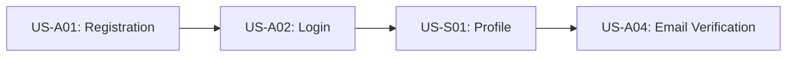
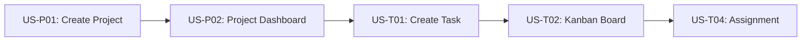
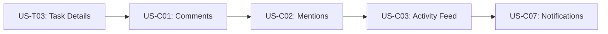

# User Stories & Acceptance Criteria

**Document**: #5 - User Stories & Acceptance  
**Version**: 1.0.0  
**Last Updated**: December 2024

---

## Overview

This document contains detailed user stories for TaskFlow Pro using the **Given-When-Then (Gherkin)** format for acceptance criteria. Stories are organized by feature module and aligned with the Nuxt + Vuetify architecture blueprint patterns.

See document [11-user-stories-acceptance-criteria.md](./11-user-stories-acceptance-criteria.md) for the complete detailed breakdown of all user stories with comprehensive acceptance criteria.

---

## Summary of User Stories by Module

### Authentication & Authorization (8 stories)
- US-A01: User Registration
- US-A02: User Login
- US-A03: OAuth Authentication (Google)
- US-A04: Email Verification
- US-A05: Password Reset
- US-A06: Two-Factor Authentication
- US-A07: Session Management
- US-A08: Role-Based Access Control

### Project Management (10 stories)
- US-P01: Create New Project
- US-P02: Project Dashboard
- US-P03: Edit Project Settings
- US-P04: Project Templates
- US-P05: Project Archiving
- US-P06: Project Search & Filter
- US-P07: Project Duplication
- US-P08: Project Export
- US-P09: Project Permissions
- US-P10: Project Analytics

### Task Management (15 stories)
- US-T01: Create Task
- US-T02: Kanban Board Task Management
- US-T03: Task Details & Comments
- US-T04: Task Assignment
- US-T05: Task Dependencies
- US-T06: Subtasks
- US-T07: Task Labels & Tags
- US-T08: Task Attachments
- US-T09: Task Time Tracking
- US-T10: Task Search & Filter
- US-T11: Bulk Task Operations
- US-T12: Task Templates
- US-T13: Recurring Tasks
- US-T14: Task Notifications
- US-T15: Task Export

### Team Collaboration (8 stories)
- US-C01: Team Communication
- US-C02: @Mentions
- US-C03: Activity Feed
- US-C04: Team Calendar
- US-C05: File Sharing
- US-C06: Real-time Collaboration
- US-C07: Team Notifications
- US-C08: Team Directory

### Reporting & Analytics (6 stories)
- US-R01: Project Progress Reports
- US-R02: Team Performance Dashboard
- US-R03: Time Tracking Reports
- US-R04: Custom Reports
- US-R05: Export Reports
- US-R06: Scheduled Reports

### Settings & Administration (7 stories)
- US-S01: User Profile Management
- US-S02: Account Settings
- US-S03: Notification Preferences
- US-S04: Theme & Appearance
- US-S05: Workspace Settings
- US-S06: User Management (Admin)
- US-S07: System Configuration (Admin)

---

## User Story Template

All user stories in TaskFlow Pro follow this format:

```
### US-[MODULE][NUMBER]: [Title]

**As a** [user type]
**I want to** [action]
**So that** [benefit/value]

**Acceptance Criteria:**

```gherkin
Feature: [Feature Name]

Scenario: [Scenario Name]
  Given [context/precondition]
  When [action/event]
  Then [expected outcome]
  And [additional outcome]
```

**Implementation Notes:**
- [Technical consideration 1]
- [Technical consideration 2]
```

---

## Story Prioritization

### P0 - Critical (MVP)
Essential features that must be completed for the minimum viable product.

**Total Stories: 25**

- All Authentication stories (US-A01 to US-A04)
- Core Project Management (US-P01, US-P02, US-P03)
- Core Task Management (US-T01, US-T02, US-T03, US-T04)
- Basic Team Collaboration (US-C01, US-C02, US-C03)
- User Profile (US-S01, US-S02)

### P1 - High Priority (Launch)
Important features for launch that enhance the core experience.

**Total Stories: 18**

- Advanced Authentication (US-A05, US-A06, US-A07, US-A08)
- Extended Project Management (US-P04, US-P06, US-P09)
- Extended Task Management (US-T05, US-T06, US-T07, US-T08, US-T09)
- Advanced Collaboration (US-C04, US-C05, US-C06)
- Basic Reporting (US-R01, US-R02)

### P2 - Medium Priority (Post-Launch)
Nice to have features that can be added after the initial launch.

**Total Stories: 12**

- Project Advanced Features (US-P05, US-P07, US-P08, US-P10)
- Task Advanced Features (US-T10, US-T11, US-T12, US-T13)
- Advanced Reporting (US-R03, US-R04, US-R05)
- Settings & Customization (US-S03, US-S04)

### P3 - Low Priority (Future)
Future enhancements that can be planned for later iterations.

**Total Stories: 8**

- Project Export & Duplication (advanced features)
- Task Export & Templates (advanced features)
- Scheduled Reports (US-R06)
- Advanced Administration (US-S05, US-S06, US-S07)
- Team Directory (US-C08)

---

## Story Dependencies

### Phase 1: Foundation (Week 1-2)


### Phase 2: Core Features (Week 3-5)


### Phase 3: Collaboration (Week 6-8)


---

## Acceptance Criteria Standards

All acceptance criteria in TaskFlow Pro must meet these standards:

### 1. Testability
- Each criterion must be objectively verifiable
- Clear pass/fail conditions
- No ambiguous language

### 2. Completeness
- Cover happy path scenarios
- Include error handling
- Consider edge cases
- Account for validation rules

### 3. User-Centric
- Written from user perspective
- Focus on user value, not implementation
- Use domain language, not technical jargon

### 4. Independence
- Each scenario tests one specific behavior
- No dependencies on other scenarios
- Can be executed in any order

### 5. Automation-Ready
- Written in Gherkin syntax for E2E testing
- Can be directly translated to Playwright tests
- Step definitions are clear and actionable

---

## Story Estimation

Stories are estimated using **Story Points** (Fibonacci sequence):

| Points | Complexity | Time Estimate | Examples |
|--------|-----------|---------------|----------|
| **1** | Trivial | 1-2 hours | Simple UI changes, copy updates |
| **2** | Simple | 2-4 hours | Basic CRUD operations, simple forms |
| **3** | Moderate | 4-8 hours | Forms with validation, list views |
| **5** | Complex | 1-2 days | Kanban board, real-time features |
| **8** | Very Complex | 2-3 days | Dashboard with charts, complex workflows |
| **13** | Epic | 3-5 days | Complete module (e.g., authentication system) |
| **21** | Large Epic | 1-2 weeks | Multiple interconnected features |

### Story Point Distribution

```
Total Stories: 63
- 1 point: 8 stories (13%)
- 2 points: 12 stories (19%)
- 3 points: 18 stories (29%)
- 5 points: 15 stories (24%)
- 8 points: 7 stories (11%)
- 13 points: 3 stories (5%)

Total Story Points: 245
Estimated Development Time: 12-14 weeks
```

---

## Traceability Matrix

Link user stories to requirements, features, and test cases:

| Story ID | Feature | Priority | Test Cases | API Endpoints | Components |
|----------|---------|----------|------------|---------------|------------|
| US-A01 | Authentication | P0 | TC-A01-01 to TC-A01-08 | /api/auth/register | RegisterForm |
| US-A02 | Authentication | P0 | TC-A02-01 to TC-A02-06 | /api/auth/login | LoginForm |
| US-P01 | Projects | P0 | TC-P01-01 to TC-P01-10 | /api/projects | ProjectCreateForm |
| US-T02 | Tasks | P0 | TC-T02-01 to TC-T02-12 | /api/tasks | KanbanBoard |

*For complete traceability matrix, see [Test Plan Document](./11-user-stories-acceptance-criteria.md)*

---

## Definition of Done (DoD)

A user story is considered "Done" when:

### Code Complete
- ✅ All acceptance criteria implemented
- ✅ Code reviewed and approved
- ✅ Follows Nuxt + Vuetify architecture patterns
- ✅ No critical bugs or security issues
- ✅ Performance benchmarks met

### Testing Complete
- ✅ Unit tests written (>80% coverage)
- ✅ Integration tests passing
- ✅ E2E tests for critical paths
- ✅ Manual testing completed
- ✅ Accessibility (a11y) tested

### Documentation Complete
- ✅ Code documented (JSDoc comments)
- ✅ API documentation updated
- ✅ User documentation written
- ✅ Storybook stories created (for components)

### Quality Assurance
- ✅ QA team sign-off
- ✅ Product owner acceptance
- ✅ Meets design specifications
- ✅ Responsive design tested
- ✅ Cross-browser compatibility verified

### Deployment Ready
- ✅ Feature flag implemented (if needed)
- ✅ Database migrations ready
- ✅ Configuration documented
- ✅ Monitoring/logging in place
- ✅ Rollback plan documented

---

## Story Refinement Process

### 1. Story Creation
- Product owner creates initial story
- Use user story template
- Define basic acceptance criteria

### 2. Backlog Grooming
- Team reviews stories weekly
- Clarify requirements
- Add technical notes
- Estimate story points

### 3. Sprint Planning
- Select stories for sprint
- Break down large stories (>8 points)
- Assign to team members
- Identify dependencies

### 4. Story Development
- Developer picks story from sprint
- Updates story status
- Implements features
- Writes tests

### 5. Story Validation
- QA tests against acceptance criteria
- Product owner reviews
- Fixes made if needed
- Story marked as done

---

## Related Documents

- [Feature Specifications](./04-feature-specifications.md) - Detailed feature breakdown
- [Wireframes & UX Design](./06-wireframes-ux-design.md) - Visual specifications
- [Technical Architecture](./10-technical-architecture.md) - Implementation details
- [User Stories Details](./11-user-stories-acceptance-criteria.md) - Complete user stories
- [Testing Strategy](./11-testing-strategy.md) - Testing approach

---

**Next**: [Wireframes & UX Design](./06-wireframes-ux-design.md) →
