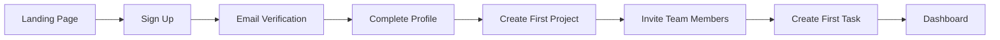
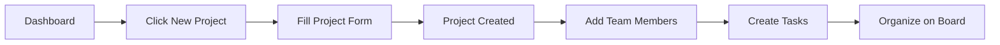
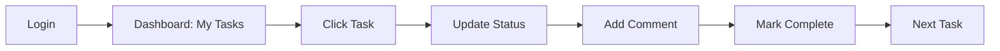

# Wireframes & UX Design

**Document**: #6 - Wireframes & UX Design  
**Version**: 1.0.0  
**Last Updated**: December 2024

---

## Overview

This document contains wireframe descriptions, navigation flows, and UX design specifications for TaskFlow Pro. The design follows **Material Design 3** principles using **Vuetify 3** components.

For detailed wireframe specifications and UI components, see [13-wireframes-ui-specifications.md](./13-wireframes-ui-specifications.md).

---

## Design System Summary

### Visual Design Principles

1. **Clarity First**
   - Clean, uncluttered interfaces
   - Clear visual hierarchy
   - Consistent spacing and alignment
   - Readable typography

2. **Efficiency**
   - Quick access to common actions
   - Keyboard shortcuts for power users
   - Batch operations support
   - Smart defaults and auto-complete

3. **Delight**
   - Smooth animations and transitions
   - Helpful empty states
   - Positive feedback for actions
   - Micro-interactions

4. **Accessibility**
   - WCAG 2.1 AA compliance
   - Keyboard navigation
   - Screen reader support
   - High contrast mode

---

## Color System

### Light Theme

```css
/* Primary Colors */
--primary: #1976D2        /* Material Blue 700 */
--primary-light: #42A5F5  /* Material Blue 400 */
--primary-dark: #1565C0   /* Material Blue 800 */

/* Secondary Colors */
--secondary: #424242      /* Material Grey 800 */
--secondary-light: #616161
--secondary-dark: #212121

/* Accent */
--accent: #FF6F00        /* Material Orange 700 */

/* Status Colors */
--success: #4CAF50       /* Green */
--warning: #FF9800       /* Orange */
--error: #F44336         /* Red */
--info: #2196F3          /* Blue */

/* Neutrals */
--background: #FAFAFA
--surface: #FFFFFF
--text-primary: #212121
--text-secondary: #757575
--divider: #E0E0E0
```

### Dark Theme

```css
/* Primary Colors */
--primary: #90CAF9        /* Material Blue 200 */
--primary-light: #BBDEFB
--primary-dark: #64B5F6

/* Secondary Colors */
--secondary: #BDBDBD      /* Material Grey 400 */
--secondary-light: #EEEEEE
--secondary-dark: #9E9E9E

/* Accent */
--accent: #FFAB40        /* Orange A200 */

/* Status Colors */
--success: #66BB6A
--warning: #FFA726
--error: #EF5350
--info: #42A5F5

/* Neutrals */
--background: #121212
--surface: #1E1E1E
--surface-elevated: #2C2C2C
--text-primary: #FFFFFF
--text-secondary: #B0B0B0
--divider: #424242
```

---

## Typography

### Type Scale

```css
/* Display */
--display-large: 57px / 64px,Weight 400
--display-medium: 45px / 52px, Weight 400
--display-small: 36px / 44px, Weight 400

/* Headlines */
--headline-large: 32px / 40px, Weight 400
--headline-medium: 28px / 36px, Weight 400
--headline-small: 24px / 32px, Weight 400

/* Titles */
--title-large: 22px / 28px, Weight 500
--title-medium: 16px / 24px, Weight 500
--title-small: 14px / 20px, Weight 500

/* Body */
--body-large: 16px / 24px, Weight 400
--body-medium: 14px / 20px, Weight 400
--body-small: 12px / 16px, Weight 400

/* Labels */
--label-large: 14px / 20px, Weight 500
--label-medium: 12px / 16px, Weight 500
--label-small: 11px / 16px, Weight 500
```

### Font Family

```css
--font-family: 'Roboto', 'Helvetica Neue', Arial, sans-serif
--font-family-mono: 'Roboto Mono', 'Courier New', monospace
```

---

## Spacing System

Material Design 3 uses a **4px baseline grid**:

```
--spacing-xs: 4px    (0.5 unit)
--spacing-sm: 8px    (1 unit)
--spacing-md: 16px   (2 units)
--spacing-lg: 24px   (3 units)
--spacing-xl: 32px   (4 units)
--spacing-2xl: 48px  (6 units)
--spacing-3xl: 64px  (8 units)
```

---

## Component Specifications

### Buttons

#### Primary Button
- Height: 40px
- Padding: 0 16px
- Border radius: 4px
- Font: Label Large (14px, Weight 500)
- Elevation: 2dp → 8dp on hover
- Ripple effect on click

#### Secondary Button
- Height: 40px
- Padding: 0 16px
- Border radius: 4px
- Border: 1px solid divider
- No elevation
- Ripple effect on click

#### Icon Button
- Size: 48px × 48px
- Icon size: 24px
- No border
- Ripple effect on click
- 8px margin for touch targets

### Input Fields

#### Text Field (Outlined)
- Height: 56px
- Padding: 16px
- Border radius: 4px
- Border: 1px solid
- Label floats on focus
- Helper text below: 12px
- Error state: red border + message

#### Text Area
- Min height: 120px
- Auto-grow
- Max height: 400px
- Scroll if exceeds max

### Cards

#### Standard Card
- Padding: 16px
- Border radius: 12px
- Elevation: 1dp → 4dp on hover
- Border: 1px solid divider (optional)

#### Task Card (Kanban)
- Padding: 12px
- Border radius: 8px
- Min height: 80px
- Drag handle on left
- Quick actions on hover

---

## Navigation Structure

### Information Architecture

```
TaskFlow Pro
│
├── Dashboard (/)
│   ├── Overview
│   ├── My Tasks
│   ├── Recent Projects
│   └── Activity Feed
│
├── Projects (/projects)
│   ├── All Projects
│   ├── Favorites
│   ├── Archived
│   └── Project Detail (/projects/:id)
│       ├── Overview
│       ├── Board (Kanban)
│       ├── List View
│       ├── Calendar
│       ├── Files
│       ├── Analytics
│       └── Settings
│
├── Tasks (/tasks)
│   ├── My Tasks
│   ├── Assigned to Me
│   ├── Created by Me
│   └── All Tasks
│
├── Team (/team)
│   ├── Team Members
│   ├── Workload
│   └── Calendar
│
├── Reports (/reports)
│   ├── Project Progress
│   ├── Team Performance
│   ├── Time Tracking
│   └── Custom Reports
│
├── Settings (/settings)
│   ├── Profile
│   ├── Account
│   ├── Notifications
│   ├── Appearance
│   └── Workspace (Admin)
│
└── Help (/help)
    ├── Documentation
    ├── Tutorials
    ├── Support
    └── Changelog
```

---

## Key User Flows

### 1. New User Onboarding



**Steps:**
1. User visits landing page
2. Clicks "Get Started" → Registration form
3. Fills email, password, name → Submits
4. Receives verification email → Clicks link
5. Guided onboarding wizard (4 steps):
   - Welcome & profile completion
   - Create first project
   - Invite team members (optional)
   - Create first task
6. Lands on dashboard with tutorial tooltips

---

### 2. Create Project & Add Tasks



**Steps:**
1. From dashboard, click "New Project" button
2. Modal opens with project creation form
3. Fill: Name, Description, Template (optional)
4. Click "Create Project"
5. Redirected to project detail page
6. Welcome modal: "Add team members?"
7. Invite members via email
8. Click "Add Task" or use quick add
9. Tasks appear on kanban board
10. Drag to organize

---

### 3. Daily Task Management



**Steps:**
1. User logs in → Dashboard
2. "My Tasks" widget shows today's tasks
3. Click task card → Detail panel opens
4. Review task details
5. Drag task to "In Progress" on board
6. Add work log comment
7. Upload files if needed
8. Mark task complete when done
9. Task moves to "Done" column
10. Move to next task

---

### 4. Team Collaboration Flow

```mermaid
graph LR
    A[Task Assigned] --> B[Notification]
    B --> C[View Task]
    C --> D[Question in Comments]
    D --> E[@Mention Team Member]
    E --> F[Receive Reply]
    F --> G[Complete Task]
```

**Steps:**
1. Project manager assigns task to developer
2. Developer receives notification
3. Clicks notification → Task details
4. Reads requirements
5. Has question → Adds comment
6. @mentions project manager
7. PM receives notification
8. PM replies to comment
9. Developer gets clarification
10. Completes task
11. PM reviews and approves

---

## Screen Wireframes Summary

### Authentication Screens

1. **Login Page**
   - Logo and tagline
   - Email/password form
   - "Remember me" checkbox
   - "Forgot password?" link
   - Social login buttons (Google, GitHub)
   - "Sign up" link

2. **Registration Page**
   - Full name field
   - Email field
   - Password field with strength indicator
   - Confirm password
   - Terms of service checkbox
   - "Create account" button
   - "Already have account?" link

3. **Password Reset**
   - Email input
   - "Send reset link" button
   - Back to login link
   - Success confirmation

---

### Main Application Screens

4. **Dashboard**
   - Header with search, notifications, profile
   - Sidebar navigation (collapsed/expanded)
   - Quick stats cards (4 metrics)
   - My tasks widget (list view)
   - Recent projects (card grid)
   - Activity feed (timeline)
   - Quick actions FAB

5. **Projects List**
   - Page header with "New Project" button
   - Search and filters
   - View toggle (grid/list)
   - Project cards with:
     - Project name and description
     - Progress bar
     - Team avatars
     - Task count
     - Last activity timestamp
   - Pagination

6. **Project Detail - Board View**
   - Project header (name, description, stats)
   - Tab navigation (Board, List, Calendar, Files, Analytics)
   - Board controls (filters, search, view options)
   - Kanban columns (customizable)
   - Task cards (draggable)
   - "Add task" button per column
   - Team members sidebar (collapsible)

7. **Task Detail Panel**
   - Slide-in panel from right
   - Task header (title, status, priority)
   - Metadata section (assignee, dates, labels)
   - Description with markdown editor
   - Subtasks list
   - Comments thread
   - Attachments
   - Activity log
   - Close button

8. **Task List View**
   - Sortable table with columns:
     - Checkbox (bulk select)
     - Title
     - Assignee (avatar + name)
     - Status (chip)
     - Priority (icon)
     - Due date (color-coded)
     - Actions (menu)
   - Bulk actions toolbar
   - Advanced filters
   - Export button

---

### Settings & Administration

9. **User Profile**
   - Avatar upload
   - Personal info form
   - Connected accounts
   - Activity log
   - Danger zone (delete account)

10. **Project Settings**
    - General tab
    - Members tab (manage team)
    - Permissions tab (roles)
    - Integrations tab
    - Advanced tab (archive/delete)

11. **Workspace Settings** (Admin)
    - Workspace info
    - Billing & subscription
    - User management
    - Security settings
    - Audit logs

---

## Responsive Design

### Breakpoints

```css
/* Vuetify 3 Breakpoints */
xs: 0-599px      /* Mobile portrait */
sm: 600-959px    /* Mobile landscape, small tablet */
md: 960-1263px   /* Tablet, small laptop */
lg: 1264-1903px  /* Desktop */
xl: 1904px+      /* Large desktop */
```

### Mobile Adaptations

#### Navigation
- Desktop: Persistent sidebar
- Tablet: Collapsible sidebar
- Mobile: Bottom navigation bar (4-5 items)

#### Kanban Board
- Desktop: 4-5 columns visible
- Tablet: Horizontal scroll, 2-3 columns visible
- Mobile: Single column view, swipe between columns

#### Task Cards
- Desktop: Full details visible
- Tablet: Condensed view
- Mobile: Title + assignee only, tap for details

#### Forms
- Desktop: Multi-column layouts
- Tablet: 2-column max
- Mobile: Single column, stacked

---

## Accessibility (a11y)

### WCAG 2.1 AA Compliance

1. **Perceivable**
   - Color contrast ratio ≥ 4.5:1
   - Text resize up to 200%
   - Alternative text for images
   - Captions for videos

2. **Operable**
   - Keyboard navigation for all functions
   - Focus indicators visible
   - No keyboard traps
   - Skip navigation links

3. **Understandable**
   - Error messages clear and helpful
   - Labels for all form inputs
   - Consistent navigation
   - Predictable functionality

4. **Robust**
   - Valid semantic HTML
   - ARIA labels where needed
   - Screen reader tested
   - Works with assistive technologies

### Keyboard Shortcuts

```
Global:
Ctrl + K       - Quick search
Ctrl + /       - Show keyboard shortcuts
Esc            - Close modals/panels

Navigation:
G + D          - Go to Dashboard
G + P          - Go to Projects
G + T          - Go to Tasks

Actions:
C              - Create new (context-aware)
N              - New project/task (context-aware)
/              - Focus search
?              - Show help

Task Management:
1-5            - Set priority
S              - Change status
A              - Assign to me
```

---

## Animation & Motion

### Motion Principles

1. **Purposeful**
   - Animations guide user attention
   - Indicate state changes
   - Provide feedback

2. **Responsive**
   - Animations feel instant (<100ms)
   - No lag or jank
   - Respect reduced motion preferences

3. **Consistent**
   - Same elements use same animations
   - Duration and easing consistent
   - Predictable behavior

### Animation Durations

```css
--transition-fast: 150ms
--transition-base: 250ms
--transition-slow: 350ms
--transition-page: 450ms

/* Easing */
--ease-standard: cubic-bezier(0.4, 0.0, 0.2, 1)
--ease-decelerate: cubic-bezier(0.0, 0.0, 0.2, 1)
--ease-accelerate: cubic-bezier(0.4, 0.0, 1, 1)
```

### Common Animations

#### Page Transitions
```css
.page-enter-active, .page-leave-active {
  transition: opacity 250ms, transform 250ms;
}
.page-enter-from {
  opacity: 0;
  transform: translateY(10px);
}
.page-leave-to {
  opacity: 0;
  transform: translateY(-10px);
}
```

#### Slide Panel
```css
.panel-enter-active, .panel-leave-active {
  transition: transform 350ms cubic-bezier(0.4, 0.0, 0.2, 1);
}
.panel-enter-from, .panel-leave-to {
  transform: translateX(100%);
}
```

#### Fade
```css
.fade-enter-active, .fade-leave-active {
  transition: opacity 250ms;
}
.fade-enter-from, .fade-leave-to {
  opacity: 0;
}
```

---

## Empty States

### Guidelines

Empty states should:
- Explain why it's empty
- Guide user on next action
- Include helpful illustration
- Provide clear CTA button

### Examples

#### No Projects
```
[Illustration of empty folder]
No projects yet
Start organizing your work by creating your first project
[Create Project] button
```

#### No Tasks
```
[Illustration of checklist]
No tasks in this view
Add your first task to get started
[Add Task] button
```

#### No Search Results
```
[Illustration of magnifying glass]
No results found for "authentication"
Try different keywords or check spelling
[Clear Search] button
```

---

## Loading States

### Skeleton Screens

Use skeleton screens instead of spinners for:
- Initial page load
- Data tables
- Card grids
- Forms

### Progressive Loading

1. **Structure First** - Layout appears immediately
2. **Critical Content** - Above-the-fold content loads
3. **Secondary Content** - Below-fold lazy loaded
4. **Images** - Low-quality placeholders → high-quality

### Loading Indicators

- **Page Load**: Full-page skeleton
- **Component Load**: Component skeleton
- **Button Action**: Spinner in button
- **Infinite Scroll**: Spinner at bottom
- **File Upload**: Progress bar

---

## Error States

### Error Message Guidelines

1. **Clear & Specific**
   - ❌ "An error occurred"
   - ✅ "Unable to create project. Please try again."

2. **Actionable**
   - ❌ "Network error"
   - ✅ "Connection lost. Check your internet and retry."

3. **Helpful**
   - ❌ "Invalid input"
   - ✅ "Project name must be at least 3 characters"

### Error Types

#### Form Validation Errors
- Inline, below field
- Red text and icon
- Real-time validation
- Summarized at top

#### Network Errors
- Toast notification
- Retry button
- Offline indicator
- Queue failed actions

#### Permission Errors
- Modal dialog
- Explain why access denied
- Link to request access
- Contact admin option

---

## Notifications & Feedback

### Toast Notifications

```
Position: Top-right (desktop), Top-center (mobile)
Duration: 3s (default), 5s (with action), ∞ (error)
Max Visible: 3 (stack vertically)

Types:
- Success: Green, checkmark icon
- Error: Red, error icon, persist until dismissed
- Warning: Orange, warning icon
- Info: Blue, info icon
```

### In-App Notifications

- Bell icon in header
- Badge with count
- Dropdown panel with list
- Mark as read
- Group by type/date
- Real-time updates

---

## Dark Mode Implementation

### Design Tokens

Use CSS variables for theming:

```css
/* Instead of */
color: #1976D2;

/* Use */
color: var(--primary);
```

### Surface Elevation

In dark mode, elevation = lightness:

```css
--surface-0: #121212   /* Base */
--surface-1: #1E1E1E   /* +1dp */
--surface-2: #222222   /* +2dp */
--surface-3: #252525   /* +3dp */
--surface-4: #272727   /* +4dp */
--surface-6: #2C2C2C   /* +6dp */
--surface-8: #2E2E2E   /* +8dp */
--surface-12: #333333  /* +12dp */
--surface-16: #363636  /* +16dp */
--surface-24: #383838  /* +24dp */
```

### Images & Illustrations

- Reduce opacity to 70-80% in dark mode
- Use outlined icons instead of filled
- Invert charts and graphs
- Use darker overlays

---

## Detailed Wireframes

For complete wireframe specifications with detailed layouts, component breakdowns, and interaction patterns, please see:

**[13-wireframes-ui-specifications.md](./13-wireframes-ui-specifications.md)**

That document contains:
- High-fidelity wireframe descriptions
- Component hierarchy for each screen
- Interactive element specifications
- State variations (default, hover, active, disabled)
- Responsive behavior details
- Code examples using Vuetify components

---

## Design Tools & Resources

### Figma Design System
- TaskFlow Pro Component Library
- Design tokens
- Iconography
- Templates

### Vuetify Resources
- [Vuetify 3 Documentation](https://vuetifyjs.com/)
- [Material Design 3 Spec](https://m3.material.io/)
- [Material Icons](https://fonts.google.com/icons)

### Accessibility Tools
- [WAVE Browser Extension](https://wave.webaim.org/)
- [Axe DevTools](https://www.deque.com/axe/devtools/)
- [Lighthouse](https://developers.google.com/web/tools/lighthouse)

---

## Related Documents

- [Feature Specifications](./04-feature-specifications.md)
- [User Stories](./05-user-stories-acceptance.md)
- [Technical Architecture](./10-technical-architecture.md)
- [Wireframes UI Specifications](./13-wireframes-ui-specifications.md)

---

**Next**: [API Specifications](./07-api-specifications.md) →
