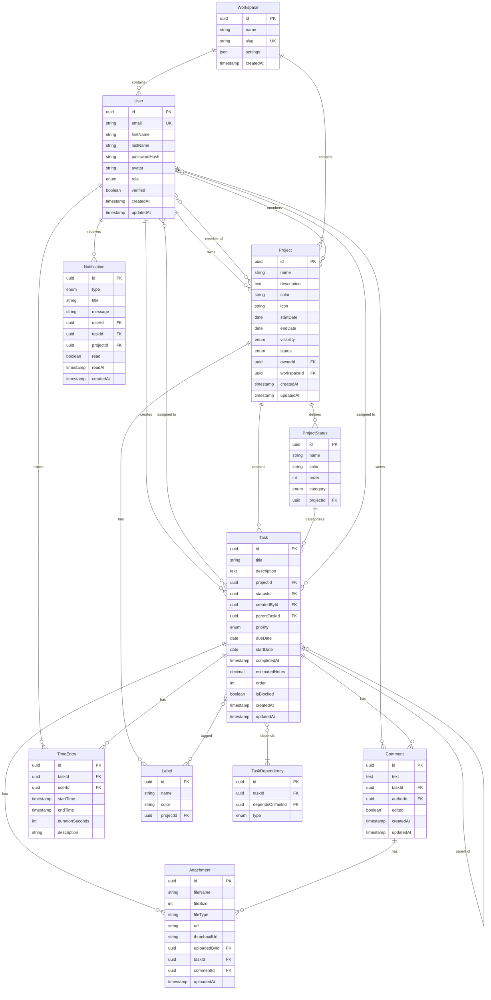

# Data Models & Schema

## Overview

This document defines the complete data model for TaskFlow Pro, including entity relationships, database schema, TypeScript interfaces, and data validation rules. The schema is designed for PostgreSQL but can be adapted for other relational databases.

---

## Entity Relationship Diagram



---

## Core Entities

### User Entity

**Table Name**: `users`

**TypeScript Interface**:

```typescript
// types/user.ts
export interface User {
  id: string;
  email: string;
  firstName: string;
  lastName: string;
  passwordHash: string;
  avatar: string | null;
  title: string | null;
  bio: string | null;

  role: "admin" | "manager" | "member" | "guest";
  verified: boolean;
  verificationToken: string | null;
  verificationTokenExpiresAt: Date | null;

  resetPasswordToken: string | null;
  resetPasswordTokenExpiresAt: Date | null;

  twoFactorEnabled: boolean;
  twoFactorSecret: string | null;

  failedLoginAttempts: number;
  lockedUntil: Date | null;

  lastLoginAt: Date | null;
  lastActivityAt: Date | null;

  preferences: UserPreferences;

  workspaceId: string;
  workspace: Workspace;

  createdAt: Date;
  updatedAt: Date;
  deletedAt: Date | null;
}

export interface UserPreferences {
  theme: "light" | "dark" | "auto";
  language: string;
  timezone: string;
  dateFormat: string;
  timeFormat: "12h" | "24h";
  startOfWeek: 0 | 1 | 6; // 0=Sunday, 1=Monday, 6=Saturday
  density: "comfortable" | "default" | "compact";
  defaultTaskView: "kanban" | "list" | "calendar";

  notifications: {
    email: boolean;
    emailDigest: "realtime" | "daily" | "weekly" | "never";
    inApp: boolean;
    mentions: boolean;
    assignments: boolean;
    comments: boolean;
    dueDates: boolean;
  };
}
```

**Database Schema (SQL)**:

```sql
CREATE TABLE users (
  id UUID PRIMARY KEY DEFAULT gen_random_uuid(),
  email VARCHAR(255) NOT NULL UNIQUE,
  first_name VARCHAR(50) NOT NULL,
  last_name VARCHAR(50) NOT NULL,
  password_hash TEXT NOT NULL,
  avatar TEXT,
  title VARCHAR(100),
  bio TEXT,

  role VARCHAR(20) NOT NULL DEFAULT 'member' CHECK (role IN ('admin', 'manager', 'member', 'guest')),
  verified BOOLEAN NOT NULL DEFAULT false,
  verification_token TEXT,
  verification_token_expires_at TIMESTAMP,

  reset_password_token TEXT,
  reset_password_token_expires_at TIMESTAMP,

  two_factor_enabled BOOLEAN NOT NULL DEFAULT false,
  two_factor_secret TEXT,

  failed_login_attempts INTEGER NOT NULL DEFAULT 0,
  locked_until TIMESTAMP,

  last_login_at TIMESTAMP,
  last_activity_at TIMESTAMP,

  preferences JSONB NOT NULL DEFAULT '{}',

  workspace_id UUID NOT NULL REFERENCES workspaces(id) ON DELETE CASCADE,

  created_at TIMESTAMP NOT NULL DEFAULT NOW(),
  updated_at TIMESTAMP NOT NULL DEFAULT NOW(),
  deleted_at TIMESTAMP
);

CREATE INDEX idx_users_email ON users(email) WHERE deleted_at IS NULL;
CREATE INDEX idx_users_workspace ON users(workspace_id) WHERE deleted_at IS NULL;
CREATE INDEX idx_users_role ON users(role);
```

---

### Workspace Entity

**Table Name**: `workspaces`

**TypeScript Interface**:

```typescript
// types/workspace.ts
export interface Workspace {
  id: string;
  name: string;
  slug: string; // URL-friendly identifier
  logo: string | null;

  settings: WorkspaceSettings;

  ownerId: string;
  owner: User;

  members: User[];
  projects: Project[];

  createdAt: Date;
  updatedAt: Date;
}

export interface WorkspaceSettings {
  allowedEmailDomains: string[]; // For auto-join
  defaultUserRole: "member" | "guest";
  requireEmailVerification: boolean;
  enableGuestAccess: boolean;

  features: {
    timeTracking: boolean;
    fileAttachments: boolean;
    customFields: boolean;
    advancedReports: boolean;
  };

  branding: {
    primaryColor: string;
    logoUrl: string | null;
    faviconUrl: string | null;
  };

  limits: {
    maxProjects: number | null;
    maxMembers: number | null;
    maxStorageBytes: number | null;
  };
}
```

**Database Schema**:

```sql
CREATE TABLE workspaces (
  id UUID PRIMARY KEY DEFAULT gen_random_uuid(),
  name VARCHAR(100) NOT NULL,
  slug VARCHAR(100) NOT NULL UNIQUE,
  logo TEXT,
  settings JSONB NOT NULL DEFAULT '{}',
  owner_id UUID NOT NULL REFERENCES users(id),
  created_at TIMESTAMP NOT NULL DEFAULT NOW(),
  updated_at TIMESTAMP NOT NULL DEFAULT NOW()
);

CREATE INDEX idx_workspaces_slug ON workspaces(slug);
CREATE INDEX idx_workspaces_owner ON workspaces(owner_id);
```

---

### Project Entity

**Table Name**: `projects`

**TypeScript Interface**:

```typescript
// types/project.ts
export interface Project {
  id: string;
  name: string;
  description: string | null;
  color: string;
  icon: string;

  startDate: Date;
  endDate: Date | null;

  ownerId: string;
  owner: User;

  workspaceId: string;
  workspace: Workspace;

  visibility: "private" | "team" | "public";
  status: "active" | "archived" | "completed";

  templateId: string | null;
  template: ProjectTemplate | null;

  features: {
    timeTracking: boolean;
    subtasks: boolean;
    dependencies: boolean;
    customFields: boolean;
  };

  statuses: ProjectStatus[];
  defaultStatusId: string;

  members: ProjectMember[];
  tasks: Task[];
  labels: Label[];

  createdAt: Date;
  updatedAt: Date;
  archivedAt: Date | null;
}

export interface ProjectMember {
  id: string;
  projectId: string;
  userId: string;
  user: User;
  role: "owner" | "admin" | "member" | "guest";
  joinedAt: Date;
}

export interface ProjectStatus {
  id: string;
  projectId: string;
  name: string;
  color: string;
  order: number;
  category: "todo" | "in_progress" | "done";
  isDefault: boolean;
  createdAt: Date;
}

export interface Label {
  id: string;
  projectId: string;
  name: string;
  color: string;
  createdAt: Date;
}
```

**Database Schema**:

```sql
CREATE TABLE projects (
  id UUID PRIMARY KEY DEFAULT gen_random_uuid(),
  name VARCHAR(100) NOT NULL,
  description TEXT,
  color VARCHAR(7) NOT NULL DEFAULT '#6366F1',
  icon VARCHAR(50) NOT NULL DEFAULT 'mdi-folder',

  start_date DATE NOT NULL,
  end_date DATE,

  owner_id UUID NOT NULL REFERENCES users(id),
  workspace_id UUID NOT NULL REFERENCES workspaces(id) ON DELETE CASCADE,

  visibility VARCHAR(20) NOT NULL DEFAULT 'team' CHECK (visibility IN ('private', 'team', 'public')),
  status VARCHAR(20) NOT NULL DEFAULT 'active' CHECK (status IN ('active', 'archived', 'completed')),

  template_id UUID REFERENCES project_templates(id),

  features JSONB NOT NULL DEFAULT '{"timeTracking":true,"subtasks":true,"dependencies":true,"customFields":false}',

  default_status_id UUID,

  created_at TIMESTAMP NOT NULL DEFAULT NOW(),
  updated_at TIMESTAMP NOT NULL DEFAULT NOW(),
  archived_at TIMESTAMP,

  CONSTRAINT end_after_start CHECK (end_date IS NULL OR end_date >= start_date)
);

CREATE INDEX idx_projects_workspace ON projects(workspace_id) WHERE archived_at IS NULL;
CREATE INDEX idx_projects_owner ON projects(owner_id);
CREATE INDEX idx_projects_status ON projects(status);

CREATE TABLE project_members (
  id UUID PRIMARY KEY DEFAULT gen_random_uuid(),
  project_id UUID NOT NULL REFERENCES projects(id) ON DELETE CASCADE,
  user_id UUID NOT NULL REFERENCES users(id) ON DELETE CASCADE,
  role VARCHAR(20) NOT NULL CHECK (role IN ('owner', 'admin', 'member', 'guest')),
  joined_at TIMESTAMP NOT NULL DEFAULT NOW(),

  UNIQUE(project_id, user_id)
);

CREATE INDEX idx_project_members_project ON project_members(project_id);
CREATE INDEX idx_project_members_user ON project_members(user_id);

CREATE TABLE project_statuses (
  id UUID PRIMARY KEY DEFAULT gen_random_uuid(),
  project_id UUID NOT NULL REFERENCES projects(id) ON DELETE CASCADE,
  name VARCHAR(50) NOT NULL,
  color VARCHAR(7) NOT NULL,
  "order" INTEGER NOT NULL,
  category VARCHAR(20) NOT NULL CHECK (category IN ('todo', 'in_progress', 'done')),
  is_default BOOLEAN NOT NULL DEFAULT false,
  created_at TIMESTAMP NOT NULL DEFAULT NOW(),

  UNIQUE(project_id, name),
  UNIQUE(project_id, "order")
);

CREATE INDEX idx_project_statuses_project ON project_statuses(project_id);

CREATE TABLE labels (
  id UUID PRIMARY KEY DEFAULT gen_random_uuid(),
  project_id UUID NOT NULL REFERENCES projects(id) ON DELETE CASCADE,
  name VARCHAR(50) NOT NULL,
  color VARCHAR(7) NOT NULL,
  created_at TIMESTAMP NOT NULL DEFAULT NOW(),

  UNIQUE(project_id, name)
);

CREATE INDEX idx_labels_project ON labels(project_id);
```

---

### Task Entity

**Table Name**: `tasks`

**TypeScript Interface**:

```typescript
// types/task.ts
export interface Task {
  id: string;
  title: string;
  description: string | null;

  projectId: string;
  project: Project;

  statusId: string;
  status: ProjectStatus;

  createdById: string;
  createdBy: User;

  parentTaskId: string | null;
  parentTask: Task | null;
  subtasks: Task[];

  priority: "low" | "medium" | "high" | "critical";

  assignees: User[];
  labels: Label[];

  dueDate: Date | null;
  startDate: Date | null;
  completedAt: Date | null;

  estimatedHours: number | null;
  trackedHours: number; // Computed from time entries

  order: number; // For kanban ordering within status

  isBlocked: boolean;
  blockedReason: string | null;

  watchers: User[];

  dependencies: TaskDependency[];
  dependents: TaskDependency[];

  comments: Comment[];
  attachments: Attachment[];
  timeEntries: TimeEntry[];

  createdAt: Date;
  updatedAt: Date;
  deletedAt: Date | null;
}

export interface TaskDependency {
  id: string;
  taskId: string;
  task: Task;
  dependsOnTaskId: string;
  dependsOnTask: Task;
  type: "blocks" | "blocked_by" | "relates_to" | "duplicates";
  createdAt: Date;
}

// Create task input (for forms and API)
export interface CreateTaskInput {
  title: string;
  description?: string | null;
  projectId: string;
  statusId?: string;
  priority?: "low" | "medium" | "high" | "critical";
  assigneeIds?: string[];
  labelIds?: string[];
  dueDate?: string | null;
  startDate?: string | null;
  estimatedHours?: number | null;
  parentTaskId?: string | null;
}

// Update task input (partial)
export type UpdateTaskInput = Partial<CreateTaskInput> & {
  completedAt?: string | null;
  isBlocked?: boolean;
  blockedReason?: string | null;
};
```

**Database Schema**:

```sql
CREATE TABLE tasks (
  id UUID PRIMARY KEY DEFAULT gen_random_uuid(),
  title VARCHAR(200) NOT NULL,
  description TEXT,

  project_id UUID NOT NULL REFERENCES projects(id) ON DELETE CASCADE,
  status_id UUID NOT NULL REFERENCES project_statuses(id),
  created_by_id UUID NOT NULL REFERENCES users(id),
  parent_task_id UUID REFERENCES tasks(id) ON DELETE CASCADE,

  priority VARCHAR(20) NOT NULL DEFAULT 'medium' CHECK (priority IN ('low', 'medium', 'high', 'critical')),

  due_date TIMESTAMP,
  start_date TIMESTAMP,
  completed_at TIMESTAMP,

  estimated_hours DECIMAL(5,2),

  "order" INTEGER NOT NULL DEFAULT 0,

  is_blocked BOOLEAN NOT NULL DEFAULT false,
  blocked_reason TEXT,

  created_at TIMESTAMP NOT NULL DEFAULT NOW(),
  updated_at TIMESTAMP NOT NULL DEFAULT NOW(),
  deleted_at TIMESTAMP,

  CONSTRAINT due_after_start CHECK (due_date IS NULL OR start_date IS NULL OR due_date >= start_date)
);

CREATE INDEX idx_tasks_project ON tasks(project_id) WHERE deleted_at IS NULL;
CREATE INDEX idx_tasks_status ON tasks(status_id) WHERE deleted_at IS NULL;
CREATE INDEX idx_tasks_created_by ON tasks(created_by_id);
CREATE INDEX idx_tasks_parent ON tasks(parent_task_id) WHERE parent_task_id IS NOT NULL;
CREATE INDEX idx_tasks_priority ON tasks(priority);
CREATE INDEX idx_tasks_due_date ON tasks(due_date) WHERE due_date IS NOT NULL AND completed_at IS NULL;
CREATE INDEX idx_tasks_updated ON tasks(updated_at DESC);

-- Many-to-many: Tasks to Assignees
CREATE TABLE task_assignees (
  task_id UUID NOT NULL REFERENCES tasks(id) ON DELETE CASCADE,
  user_id UUID NOT NULL REFERENCES users(id) ON DELETE CASCADE,
  assigned_at TIMESTAMP NOT NULL DEFAULT NOW(),
  assigned_by_id UUID REFERENCES users(id),

  PRIMARY KEY (task_id, user_id)
);

CREATE INDEX idx_task_assignees_user ON task_assignees(user_id);

-- Many-to-many: Tasks to Labels
CREATE TABLE task_labels (
  task_id UUID NOT NULL REFERENCES tasks(id) ON DELETE CASCADE,
  label_id UUID NOT NULL REFERENCES labels(id) ON DELETE CASCADE,

  PRIMARY KEY (task_id, label_id)
);

CREATE INDEX idx_task_labels_label ON task_labels(label_id);

-- Task watchers (users following a task)
CREATE TABLE task_watchers (
  task_id UUID NOT NULL REFERENCES tasks(id) ON DELETE CASCADE,
  user_id UUID NOT NULL REFERENCES users(id) ON DELETE CASCADE,
  watching_since TIMESTAMP NOT NULL DEFAULT NOW(),

  PRIMARY KEY (task_id, user_id)
);

-- Task dependencies
CREATE TABLE task_dependencies (
  id UUID PRIMARY KEY DEFAULT gen_random_uuid(),
  task_id UUID NOT NULL REFERENCES tasks(id) ON DELETE CASCADE,
  depends_on_task_id UUID NOT NULL REFERENCES tasks(id) ON DELETE CASCADE,
  type VARCHAR(20) NOT NULL DEFAULT 'blocks' CHECK (type IN ('blocks', 'blocked_by', 'relates_to', 'duplicates')),
  created_at TIMESTAMP NOT NULL DEFAULT NOW(),

  CONSTRAINT no_self_dependency CHECK (task_id != depends_on_task_id),
  UNIQUE(task_id, depends_on_task_id, type)
);

CREATE INDEX idx_task_dependencies_task ON task_dependencies(task_id);
CREATE INDEX idx_task_dependencies_depends ON task_dependencies(depends_on_task_id);
```

---

### Comment Entity

**Table Name**: `comments`

**TypeScript Interface**:

```typescript
// types/comment.ts
export interface Comment {
  id: string;
  text: string;

  taskId: string;
  task: Task;

  authorId: string;
  author: User;

  edited: boolean;
  editedAt: Date | null;

  attachments: Attachment[];

  mentions: {
    userId: string;
    user: User;
  }[];

  createdAt: Date;
  updatedAt: Date;
  deletedAt: Date | null;
}

export interface CreateCommentInput {
  text: string;
  taskId: string;
  attachments?: {
    fileName: string;
    fileSize: number;
    fileType: string;
    url: string;
  }[];
}
```

**Database Schema**:

```sql
CREATE TABLE comments (
  id UUID PRIMARY KEY DEFAULT gen_random_uuid(),
  text TEXT NOT NULL,

  task_id UUID NOT NULL REFERENCES tasks(id) ON DELETE CASCADE,
  author_id UUID NOT NULL REFERENCES users(id),

  edited BOOLEAN NOT NULL DEFAULT false,
  edited_at TIMESTAMP,

  created_at TIMESTAMP NOT NULL DEFAULT NOW(),
  updated_at TIMESTAMP NOT NULL DEFAULT NOW(),
  deleted_at TIMESTAMP
);

CREATE INDEX idx_comments_task ON comments(task_id) WHERE deleted_at IS NULL;
CREATE INDEX idx_comments_author ON comments(author_id);
CREATE INDEX idx_comments_created ON comments(created_at DESC);

-- Comment mentions (extracted from comment text)
CREATE TABLE comment_mentions (
  id UUID PRIMARY KEY DEFAULT gen_random_uuid(),
  comment_id UUID NOT NULL REFERENCES comments(id) ON DELETE CASCADE,
  user_id UUID NOT NULL REFERENCES users(id) ON DELETE CASCADE,
  created_at TIMESTAMP NOT NULL DEFAULT NOW(),

  UNIQUE(comment_id, user_id)
);

CREATE INDEX idx_comment_mentions_user ON comment_mentions(user_id);
```

---

### Attachment Entity

**Table Name**: `attachments`

**TypeScript Interface**:

```typescript
// types/attachment.ts
export interface Attachment {
  id: string;
  fileName: string;
  fileSize: number; // bytes
  fileType: string; // MIME type
  url: string;
  thumbnailUrl: string | null;

  uploadedById: string;
  uploadedBy: User;

  taskId: string | null;
  task: Task | null;

  commentId: string | null;
  comment: Comment | null;

  uploadedAt: Date;
  deletedAt: Date | null;
}
```

**Database Schema**:

```sql
CREATE TABLE attachments (
  id UUID PRIMARY KEY DEFAULT gen_random_uuid(),
  file_name VARCHAR(255) NOT NULL,
  file_size INTEGER NOT NULL,
  file_type VARCHAR(100) NOT NULL,
  url TEXT NOT NULL,
  thumbnail_url TEXT,

  uploaded_by_id UUID NOT NULL REFERENCES users(id),

  task_id UUID REFERENCES tasks(id) ON DELETE CASCADE,
  comment_id UUID REFERENCES comments(id) ON DELETE CASCADE,

  uploaded_at TIMESTAMP NOT NULL DEFAULT NOW(),
  deleted_at TIMESTAMP,

  CONSTRAINT attachment_belongs_to_one CHECK (
    (task_id IS NOT NULL AND comment_id IS NULL) OR
    (task_id IS NULL AND comment_id IS NOT NULL)
  )
);

CREATE INDEX idx_attachments_task ON attachments(task_id) WHERE deleted_at IS NULL;
CREATE INDEX idx_attachments_comment ON attachments(comment_id) WHERE deleted_at IS NULL;
CREATE INDEX idx_attachments_uploaded_by ON attachments(uploaded_by_id);
```

---

### Notification Entity

**Table Name**: `notifications`

**TypeScript Interface**:

```typescript
// types/notification.ts
export interface Notification {
  id: string;
  type: NotificationType;
  title: string;
  message: string;
  icon: string;
  color: string;

  userId: string;
  user: User;

  taskId: string | null;
  task: Task | null;

  projectId: string | null;
  project: Project | null;

  commentId: string | null;
  comment: Comment | null;

  read: boolean;
  readAt: Date | null;

  actionUrl: string | null;
  actionText: string | null;

  createdAt: Date;
  deletedAt: Date | null;
}

export type NotificationType =
  | "mention"
  | "assignment"
  | "comment"
  | "status_change"
  | "due_date"
  | "completion"
  | "project_update"
  | "team_update";
```

**Database Schema**:

```sql
CREATE TABLE notifications (
  id UUID PRIMARY KEY DEFAULT gen_random_uuid(),
  type VARCHAR(30) NOT NULL CHECK (type IN (
    'mention', 'assignment', 'comment', 'status_change',
    'due_date', 'completion', 'project_update', 'team_update'
  )),
  title VARCHAR(200) NOT NULL,
  message TEXT NOT NULL,
  icon VARCHAR(50) NOT NULL,
  color VARCHAR(50) NOT NULL,

  user_id UUID NOT NULL REFERENCES users(id) ON DELETE CASCADE,

  task_id UUID REFERENCES tasks(id) ON DELETE CASCADE,
  project_id UUID REFERENCES projects(id) ON DELETE CASCADE,
  comment_id UUID REFERENCES comments(id) ON DELETE CASCADE,

  read BOOLEAN NOT NULL DEFAULT false,
  read_at TIMESTAMP,

  action_url TEXT,
  action_text VARCHAR(100),

  created_at TIMESTAMP NOT NULL DEFAULT NOW(),
  deleted_at TIMESTAMP
);

CREATE INDEX idx_notifications_user ON notifications(user_id) WHERE deleted_at IS NULL AND read = false;
CREATE INDEX idx_notifications_created ON notifications(created_at DESC);
CREATE INDEX idx_notifications_read ON notifications(read, user_id);
```

---

### Time Entry Entity

**Table Name**: `time_entries`

**TypeScript Interface**:

```typescript
// types/time-entry.ts
export interface TimeEntry {
  id: string;

  taskId: string;
  task: Task;

  userId: string;
  user: User;

  startTime: Date;
  endTime: Date | null;
  durationSeconds: number; // Computed or stored

  description: string | null;
  billable: boolean;

  createdAt: Date;
  updatedAt: Date;
}

export interface CreateTimeEntryInput {
  taskId: string;
  startTime: Date;
  endTime?: Date;
  description?: string;
  billable?: boolean;
}
```

**Database Schema**:

```sql
CREATE TABLE time_entries (
  id UUID PRIMARY KEY DEFAULT gen_random_uuid(),

  task_id UUID NOT NULL REFERENCES tasks(id) ON DELETE CASCADE,
  user_id UUID NOT NULL REFERENCES users(id),

  start_time TIMESTAMP NOT NULL,
  end_time TIMESTAMP,
  duration_seconds INTEGER,

  description TEXT,
  billable BOOLEAN NOT NULL DEFAULT true,

  created_at TIMESTAMP NOT NULL DEFAULT NOW(),
  updated_at TIMESTAMP NOT NULL DEFAULT NOW(),

  CONSTRAINT end_after_start CHECK (end_time IS NULL OR end_time > start_time)
);

CREATE INDEX idx_time_entries_task ON time_entries(task_id);
CREATE INDEX idx_time_entries_user ON time_entries(user_id);
CREATE INDEX idx_time_entries_date ON time_entries(start_time);

-- Trigger to calculate duration
CREATE OR REPLACE FUNCTION calculate_duration()
RETURNS TRIGGER AS $$
BEGIN
  IF NEW.end_time IS NOT NULL THEN
    NEW.duration_seconds := EXTRACT(EPOCH FROM (NEW.end_time - NEW.start_time))::INTEGER;
  END IF;
  RETURN NEW;
END;
$$ LANGUAGE plpgsql;

CREATE TRIGGER time_entry_duration
  BEFORE INSERT OR UPDATE ON time_entries
  FOR EACH ROW
  EXECUTE FUNCTION calculate_duration();
```

---

## Supporting Entities

### Activity Log Entity

**Purpose**: Audit trail of all changes for compliance and history.

**TypeScript Interface**:

```typescript
// types/activity.ts
export interface ActivityLog {
  id: string;

  entityType: "task" | "project" | "comment" | "user";
  entityId: string;

  action:
    | "created"
    | "updated"
    | "deleted"
    | "completed"
    | "assigned"
    | "commented";

  userId: string;
  user: User;

  changes: {
    field: string;
    oldValue: any;
    newValue: any;
  }[];

  metadata: Record<string, any>;

  createdAt: Date;
}
```

**Database Schema**:

```sql
CREATE TABLE activity_logs (
  id UUID PRIMARY KEY DEFAULT gen_random_uuid(),

  entity_type VARCHAR(20) NOT NULL,
  entity_id UUID NOT NULL,

  action VARCHAR(20) NOT NULL,

  user_id UUID NOT NULL REFERENCES users(id),

  changes JSONB,
  metadata JSONB,

  created_at TIMESTAMP NOT NULL DEFAULT NOW()
);

CREATE INDEX idx_activity_logs_entity ON activity_logs(entity_type, entity_id);
CREATE INDEX idx_activity_logs_user ON activity_logs(user_id);
CREATE INDEX idx_activity_logs_created ON activity_logs(created_at DESC);

-- Partition by month for performance
CREATE TABLE activity_logs_2024_12 PARTITION OF activity_logs
  FOR VALUES FROM ('2024-12-01') TO ('2025-01-01');
```

---

### Project Template Entity

**Purpose**: Reusable project configurations with predefined statuses, labels, and tasks.

**TypeScript Interface**:

```typescript
// types/project-template.ts
export interface ProjectTemplate {
  id: string;
  name: string;
  description: string | null;
  icon: string;

  isPublic: boolean;
  createdById: string;

  statuses: {
    name: string;
    color: string;
    order: number;
    category: "todo" | "in_progress" | "done";
  }[];

  labels: {
    name: string;
    color: string;
  }[];

  taskTemplates: {
    title: string;
    description: string | null;
    estimatedHours: number | null;
    order: number;
  }[];

  createdAt: Date;
  updatedAt: Date;
}
```

**Database Schema**:

```sql
CREATE TABLE project_templates (
  id UUID PRIMARY KEY DEFAULT gen_random_uuid(),
  name VARCHAR(100) NOT NULL,
  description TEXT,
  icon VARCHAR(50) NOT NULL DEFAULT 'mdi-folder-template',

  is_public BOOLEAN NOT NULL DEFAULT false,
  created_by_id UUID NOT NULL REFERENCES users(id),

  config JSONB NOT NULL DEFAULT '{}',

  created_at TIMESTAMP NOT NULL DEFAULT NOW(),
  updated_at TIMESTAMP NOT NULL DEFAULT NOW()
);

CREATE INDEX idx_project_templates_public ON project_templates(is_public);
```

---

## Data Relationships

### One-to-Many Relationships

| Parent  | Child         | Relationship                                  |
| ------- | ------------- | --------------------------------------------- |
| User    | Project       | User creates multiple projects                |
| User    | Task          | User creates multiple tasks                   |
| User    | Comment       | User writes multiple comments                 |
| User    | TimeEntry     | User logs multiple time entries               |
| Project | Task          | Project contains multiple tasks               |
| Project | ProjectStatus | Project defines multiple statuses             |
| Project | Label         | Project has multiple labels                   |
| Task    | Comment       | Task has multiple comments                    |
| Task    | Attachment    | Task has multiple attachments                 |
| Task    | TimeEntry     | Task has multiple time entries                |
| Task    | Task          | Task has multiple subtasks (self-referential) |

### Many-to-Many Relationships

| Entity 1 | Entity 2 | Join Table        | Description                           |
| -------- | -------- | ----------------- | ------------------------------------- |
| User     | Project  | `project_members` | Users can be members of many projects |
| User     | Task     | `task_assignees`  | Users can be assigned to many tasks   |
| Task     | Label    | `task_labels`     | Tasks can have many labels            |
| Task     | User     | `task_watchers`   | Users can watch many tasks            |

---

## Data Validation Rules

### User Validation

```typescript
// utils/validation/user-validation.ts
export const userValidationRules = {
  email: {
    required: true,
    format: /^[^\s@]+@[^\s@]+\.[^\s@]+$/,
    maxLength: 255,
    unique: true,
  },
  firstName: {
    required: true,
    minLength: 1,
    maxLength: 50,
    pattern: /^[a-zA-Z\s'-]+$/,
  },
  lastName: {
    required: true,
    minLength: 1,
    maxLength: 50,
    pattern: /^[a-zA-Z\s'-]+$/,
  },
  password: {
    required: true,
    minLength: 8,
    maxLength: 128,
    requireUppercase: true,
    requireLowercase: true,
    requireNumber: true,
    requireSpecialChar: true,
    patterns: [
      { regex: /[A-Z]/, message: "Must contain uppercase letter" },
      { regex: /[a-z]/, message: "Must contain lowercase letter" },
      { regex: /\d/, message: "Must contain number" },
      { regex: /[@$!%*?&#]/, message: "Must contain special character" },
    ],
  },
  bio: {
    maxLength: 500,
  },
  title: {
    maxLength: 100,
  },
};
```

### Task Validation

```typescript
// utils/validation/task-validation.ts
export const taskValidationRules = {
  title: {
    required: true,
    minLength: 1,
    maxLength: 200,
  },
  description: {
    maxLength: 10000,
  },
  priority: {
    enum: ["low", "medium", "high", "critical"],
  },
  estimatedHours: {
    min: 0,
    max: 999.99,
    step: 0.25,
  },
  dueDate: {
    format: "ISO8601",
    futureOnly: false, // Can set past dates
    validateAgainst: (task: any) => {
      if (task.startDate && task.dueDate) {
        return new Date(task.dueDate) >= new Date(task.startDate);
      }
      return true;
    },
  },
};
```

---

## Database Indexes Strategy

### Performance-Critical Indexes

```sql
-- User lookups
CREATE INDEX idx_users_email_active ON users(email) WHERE deleted_at IS NULL AND verified = true;

-- Task queries by project and status (most common query)
CREATE INDEX idx_tasks_project_status ON tasks(project_id, status_id)
  WHERE deleted_at IS NULL;

-- Task queries by assignee
CREATE INDEX idx_task_assignees_user_active ON task_assignees(user_id)
  WHERE task_id IN (SELECT id FROM tasks WHERE deleted_at IS NULL);

-- Overdue tasks
CREATE INDEX idx_tasks_overdue ON tasks(due_date)
  WHERE completed_at IS NULL
  AND due_date < NOW()
  AND deleted_at IS NULL;

-- Recent notifications
CREATE INDEX idx_notifications_user_recent ON notifications(user_id, created_at DESC)
  WHERE deleted_at IS NULL;

-- Full-text search on tasks
CREATE INDEX idx_tasks_search ON tasks USING gin(to_tsvector('english', title || ' ' || COALESCE(description, '')))
  WHERE deleted_at IS NULL;
```

---

## Data Migrations

### Initial Schema Migration

```typescript
// migrations/001_initial_schema.ts
export async function up(db: Kysely<Database>) {
  // Create workspaces table
  await db.schema
    .createTable("workspaces")
    .addColumn("id", "uuid", (col) =>
      col.primaryKey().defaultTo(sql`gen_random_uuid()`)
    )
    .addColumn("name", "varchar(100)", (col) => col.notNull())
    .addColumn("slug", "varchar(100)", (col) => col.unique().notNull())
    .addColumn("logo", "text")
    .addColumn("settings", "jsonb", (col) => col.notNull().defaultTo("{}"))
    .addColumn("owner_id", "uuid", (col) => col.notNull())
    .addColumn("created_at", "timestamp", (col) =>
      col.notNull().defaultTo(sql`NOW()`)
    )
    .addColumn("updated_at", "timestamp", (col) =>
      col.notNull().defaultTo(sql`NOW()`)
    )
    .execute();

  // Create users table (depends on workspaces)
  await db.schema
    .createTable("users")
    .addColumn("id", "uuid", (col) =>
      col.primaryKey().defaultTo(sql`gen_random_uuid()`)
    )
    .addColumn("email", "varchar(255)", (col) => col.unique().notNull())
    .addColumn("first_name", "varchar(50)", (col) => col.notNull())
    .addColumn("last_name", "varchar(50)", (col) => col.notNull())
    .addColumn("password_hash", "text", (col) => col.notNull())
    // ... more columns
    .addColumn("workspace_id", "uuid", (col) =>
      col.references("workspaces.id").onDelete("cascade").notNull()
    )
    .execute();

  // Create projects table
  // ... similar pattern for all tables
}

export async function down(db: Kysely<Database>) {
  await db.schema.dropTable("notifications").execute();
  await db.schema.dropTable("attachments").execute();
  // ... drop all tables in reverse order
}
```

---

## Data Seeding

### Seed Data for Development

```typescript
// scripts/seed-dev-data.ts
import { faker } from "@faker-js/faker";
import { hash } from "argon2";

export async function seedDevData() {
  // Create workspace
  const workspace = await db.workspace.create({
    data: {
      name: "Demo Workspace",
      slug: "demo-workspace",
      settings: {},
    },
  });

  // Create admin user
  const admin = await db.user.create({
    data: {
      email: "admin@taskflow.local",
      firstName: "Admin",
      lastName: "User",
      passwordHash: await hash("password123"),
      role: "admin",
      verified: true,
      workspaceId: workspace.id,
      preferences: {
        theme: "light",
        language: "en",
        timezone: "UTC",
      },
    },
  });

  // Create demo users
  const users = await Promise.all(
    Array.from({ length: 10 }, async (_, i) => {
      return db.user.create({
        data: {
          email: faker.internet.email(),
          firstName: faker.person.firstName(),
          lastName: faker.person.lastName(),
          passwordHash: await hash("password123"),
          role: i % 3 === 0 ? "manager" : "member",
          verified: true,
          workspaceId: workspace.id,
          avatar: faker.image.avatar(),
          title: faker.person.jobTitle(),
        },
      });
    })
  );

  // Create demo projects
  const projects = await Promise.all(
    ["Website Redesign", "Mobile App", "API Development"].map(async (name) => {
      const project = await db.project.create({
        data: {
          name,
          description: faker.lorem.paragraph(),
          color: faker.color.rgb(),
          startDate: faker.date.past(),
          endDate: faker.date.future(),
          ownerId: admin.id,
          workspaceId: workspace.id,
          visibility: "team",
          status: "active",
        },
      });

      // Create default statuses
      const statuses = await Promise.all(
        [
          { name: "To Do", color: "#9CA3AF", order: 0, category: "todo" },
          {
            name: "In Progress",
            color: "#3B82F6",
            order: 1,
            category: "in_progress",
          },
          {
            name: "In Review",
            color: "#F59E0B",
            order: 2,
            category: "in_progress",
          },
          { name: "Done", color: "#22C55E", order: 3, category: "done" },
        ].map((status) =>
          db.projectStatus.create({
            data: { ...status, projectId: project.id },
          })
        )
      );

      // Add project members
      await Promise.all(
        users.slice(0, 5).map((user) =>
          db.projectMember.create({
            data: {
              projectId: project.id,
              userId: user.id,
              role: "member",
            },
          })
        )
      );

      // Create demo tasks
      await Promise.all(
        Array.from({ length: 20 }, async () => {
          const status = faker.helpers.arrayElement(statuses);
          const assignees = faker.helpers.arrayElements(users, {
            min: 1,
            max: 2,
          });

          return db.task.create({
            data: {
              title: faker.hacker.phrase(),
              description: faker.lorem.paragraphs(2),
              projectId: project.id,
              statusId: status.id,
              createdById: admin.id,
              priority: faker.helpers.arrayElement([
                "low",
                "medium",
                "high",
                "critical",
              ]),
              dueDate: faker.date.soon(),
              estimatedHours: faker.number.int({ min: 1, max: 16 }),
              assignees: {
                connect: assignees.map((u) => ({ id: u.id })),
              },
            },
          });
        })
      );

      return project;
    })
  );

  console.log("✅ Development data seeded successfully");
  console.log(`   - Workspace: ${workspace.name}`);
  console.log(`   - Users: ${users.length + 1}`);
  console.log(`   - Projects: ${projects.length}`);
  console.log(`   - Tasks: ${projects.length * 20}`);
  console.log(`\n   Admin credentials: admin@taskflow.local / password123`);
}
```

---

## Data Access Patterns

### Optimized Query Examples

#### Get Tasks for Kanban Board

```typescript
// Optimized query with all necessary data in single DB call
async function getKanbanTasks(projectId: string) {
  return db.task.findMany({
    where: {
      projectId,
      deletedAt: null,
    },
    include: {
      status: true,
      assignees: {
        select: {
          id: true,
          firstName: true,
          lastName: true,
          avatar: true,
        },
      },
      labels: true,
      _count: {
        select: {
          comments: true,
          attachments: true,
          subtasks: true,
        },
      },
    },
    orderBy: [{ statusId: "asc" }, { order: "asc" }, { createdAt: "asc" }],
  });
}
```

#### Get Dashboard Statistics

```typescript
// Efficient aggregation query
async function getDashboardStats(userId: string) {
  const [assignedTasks, projectStats] = await Promise.all([
    // User's assigned tasks
    db.task.groupBy({
      by: ["statusId"],
      where: {
        assignees: {
          some: { id: userId },
        },
        deletedAt: null,
      },
      _count: true,
    }),

    // Projects user is member of
    db.project.findMany({
      where: {
        members: {
          some: { userId },
        },
        archivedAt: null,
      },
      include: {
        _count: {
          select: {
            tasks: true,
            members: true,
          },
        },
      },
    }),
  ]);

  return {
    assignedTasks: {
      total: assignedTasks.reduce((sum, g) => sum + g._count, 0),
      byStatus: assignedTasks,
    },
    projects: {
      total: projectStats.length,
      totalTasks: projectStats.reduce((sum, p) => sum + p._count.tasks, 0),
    },
  };
}
```

---

## Data Constraints & Business Rules

### Constraint Definitions

| Constraint                     | Type        | Description                                |
| ------------------------------ | ----------- | ------------------------------------------ |
| **Unique email per workspace** | Database    | Users can't have duplicate emails          |
| **End date after start date**  | Check       | Projects/tasks must have valid date ranges |
| **No self-dependencies**       | Check       | Tasks can't depend on themselves           |
| **No circular dependencies**   | Application | Detect cycles in task dependencies         |
| **Max file size 10MB**         | Application | File upload size limit                     |
| **Max 100 project members**    | Application | Project member limit                       |
| **Max 50 labels per project**  | Application | Label limit                                |
| **Max 10 assignees per task**  | Application | Assignment limit                           |

### Business Rule Implementations

```typescript
// utils/business-rules.ts

// Check for circular task dependencies
export async function validateTaskDependency(
  taskId: string,
  dependsOnTaskId: string
): Promise<boolean> {
  const visited = new Set<string>();

  async function checkCycle(currentId: string): Promise<boolean> {
    if (currentId === taskId) return true; // Cycle detected
    if (visited.has(currentId)) return false;

    visited.add(currentId);

    const dependencies = await db.taskDependency.findMany({
      where: { taskId: currentId },
      select: { dependsOnTaskId: true },
    });

    for (const dep of dependencies) {
      if (await checkCycle(dep.dependsOnTaskId)) {
        return true;
      }
    }

    return false;
  }

  return !(await checkCycle(dependsOnTaskId));
}

// Validate project member limit
export async function canAddProjectMember(projectId: string): Promise<boolean> {
  const memberCount = await db.projectMember.count({
    where: { projectId },
  });

  const project = await db.project.findUnique({
    where: { id: projectId },
    include: { workspace: true },
  });

  const limit = project?.workspace.settings.limits?.maxMembers || 100;

  return memberCount < limit;
}
```

---

## Type Safety Utilities

### Type Guards

```typescript
// utils/type-guards.ts

export function isTask(entity: any): entity is Task {
  return (
    entity && typeof entity.id === "string" && typeof entity.title === "string"
  );
}

export function isProject(entity: any): entity is Project {
  return (
    entity && typeof entity.id === "string" && typeof entity.name === "string"
  );
}

export function isUser(entity: any): entity is User {
  return (
    entity && typeof entity.id === "string" && typeof entity.email === "string"
  );
}

// Validate entity ownership
export function userOwnsProject(user: User, project: Project): boolean {
  return project.ownerId === user.id;
}

export function userIsMemberOfProject(user: User, project: Project): boolean {
  return project.members.some((m) => m.userId === user.id);
}

export function userCanEditTask(user: User, task: Task): boolean {
  return (
    task.createdById === user.id ||
    task.assignees.some((a) => a.id === user.id) ||
    user.role === "admin"
  );
}
```

---

## Data Transformation Utilities

### API Response Transformers

```typescript
// utils/transformers/task-transformer.ts

// Transform database task to API response
export function transformTaskForApi(task: TaskWithRelations): ApiTask {
  return {
    id: task.id,
    title: task.title,
    description: task.description,

    projectId: task.projectId,
    project: task.project
      ? {
          id: task.project.id,
          name: task.project.name,
          color: task.project.color,
        }
      : undefined,

    statusId: task.statusId,
    status: {
      id: task.status.id,
      name: task.status.name,
      color: task.status.color,
      category: task.status.category,
    },

    priority: task.priority,

    assignees: task.assignees.map(transformUserForApi),
    labels: task.labels,

    dueDate: task.dueDate?.toISOString() || null,
    completedAt: task.completedAt?.toISOString() || null,

    estimatedHours: task.estimatedHours,
    trackedHours:
      task.timeEntries?.reduce(
        (sum, entry) => sum + entry.durationSeconds / 3600,
        0
      ) || 0,

    commentCount: task._count?.comments || 0,
    attachmentCount: task._count?.attachments || 0,
    subtaskCount: task._count?.subtasks || 0,

    createdById: task.createdById,
    createdBy: transformUserForApi(task.createdBy),

    createdAt: task.createdAt.toISOString(),
    updatedAt: task.updatedAt.toISOString(),
  };
}

// Transform user for API (exclude sensitive data)
export function transformUserForApi(user: User): ApiUser {
  return {
    id: user.id,
    email: user.email,
    firstName: user.firstName,
    lastName: user.lastName,
    avatar: user.avatar,
    title: user.title,
    role: user.role,
  };
}
```

---

## Data Backup & Recovery

### Backup Strategy

**Automated Backups**:

- **Frequency**: Daily at 2 AM UTC
- **Retention**: 30 days of daily backups, 12 months of weekly backups
- **Location**: AWS S3 or similar object storage
- **Encryption**: AES-256 encryption at rest

**Point-in-Time Recovery**:

- PostgreSQL Write-Ahead Logging (WAL) enabled
- 7-day point-in-time recovery window
- Continuous archiving of WAL files

**Backup Verification**:

- Weekly automated restore testing
- Integrity checks on all backups
- Alerts for failed backups

### Disaster Recovery

```typescript
// scripts/backup-database.ts
import { exec } from "child_process";
import { promisify } from "util";

const execAsync = promisify(exec);

export async function backupDatabase() {
  const timestamp = new Date().toISOString().replace(/[:.]/g, "-");
  const filename = `taskflow-backup-${timestamp}.sql`;

  // Create backup
  await execAsync(`pg_dump ${process.env.DATABASE_URL} > /backups/${filename}`);

  // Compress
  await execAsync(`gzip /backups/${filename}`);

  // Upload to S3
  await uploadToS3(`/backups/${filename}.gz`, `backups/${filename}.gz`);

  // Clean up local file
  await execAsync(`rm /backups/${filename}.gz`);

  console.log(`✅ Backup completed: ${filename}.gz`);
}
```

---

## Data Privacy & Compliance

### GDPR Compliance

**Right to Access**:

```typescript
// Export all user data
export async function exportUserData(userId: string) {
  const data = await db.user.findUnique({
    where: { id: userId },
    include: {
      projects: true,
      createdTasks: true,
      assignedTasks: true,
      comments: true,
      timeEntries: true,
      notifications: true,
    },
  });

  return {
    personal: {
      email: data.email,
      firstName: data.firstName,
      lastName: data.lastName,
      avatar: data.avatar,
    },
    activity: {
      projects: data.projects,
      tasks: [...data.createdTasks, ...data.assignedTasks],
      comments: data.comments,
      timeTracked: data.timeEntries,
    },
    createdAt: data.createdAt,
    lastActivityAt: data.lastActivityAt,
  };
}
```

**Right to Deletion**:

```typescript
// Anonymize user data (soft delete with anonymization)
export async function anonymizeUser(userId: string) {
  await db.user.update({
    where: { id: userId },
    data: {
      email: `deleted_${userId}@taskflow.local`,
      firstName: "Deleted",
      lastName: "User",
      passwordHash: "",
      avatar: null,
      bio: null,
      deletedAt: new Date(),
    },
  });

  // Keep contributions but anonymize
  // Comments, tasks, etc. remain but show "Deleted User"
}
```

### Data Retention Policies

| Data Type             | Retention        | Deletion Policy                   |
| --------------------- | ---------------- | --------------------------------- |
| **Active user data**  | Indefinite       | Until account deleted             |
| **Deleted user data** | 30 days          | Hard delete after 30 days         |
| **Archived projects** | 1 year           | Hard delete after 1 year inactive |
| **Activity logs**     | 90 days          | Partition and archive             |
| **File uploads**      | Linked to entity | Delete with entity deletion       |
| **Backups**           | 12 months        | Rotate out oldest                 |

---

**Next Document**: [Technical Architecture](./10-technical-architecture.md) →
