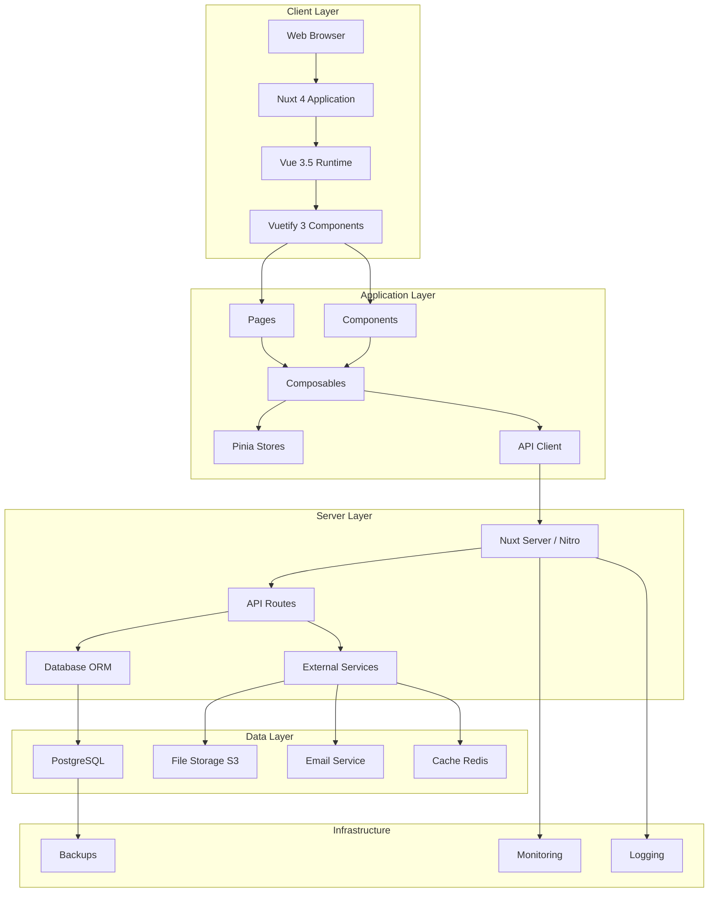
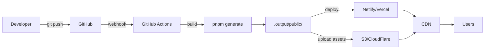
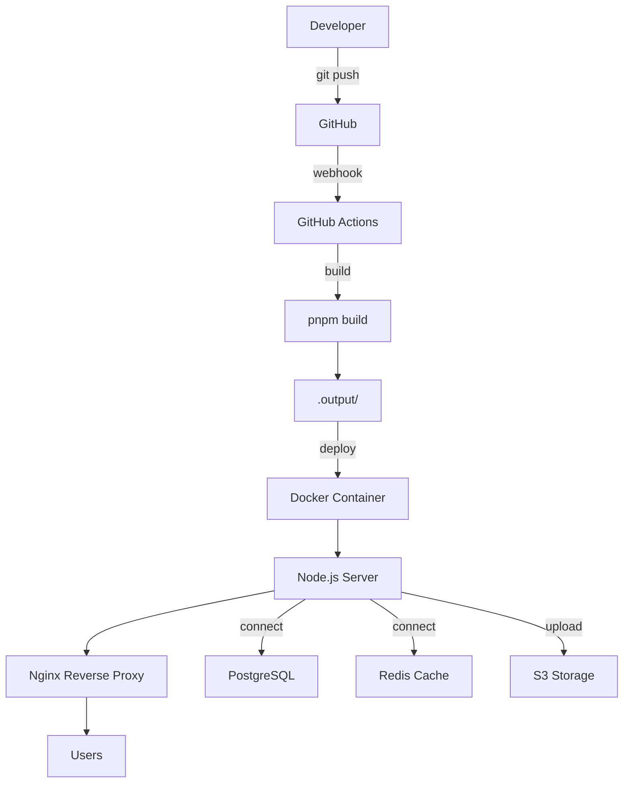
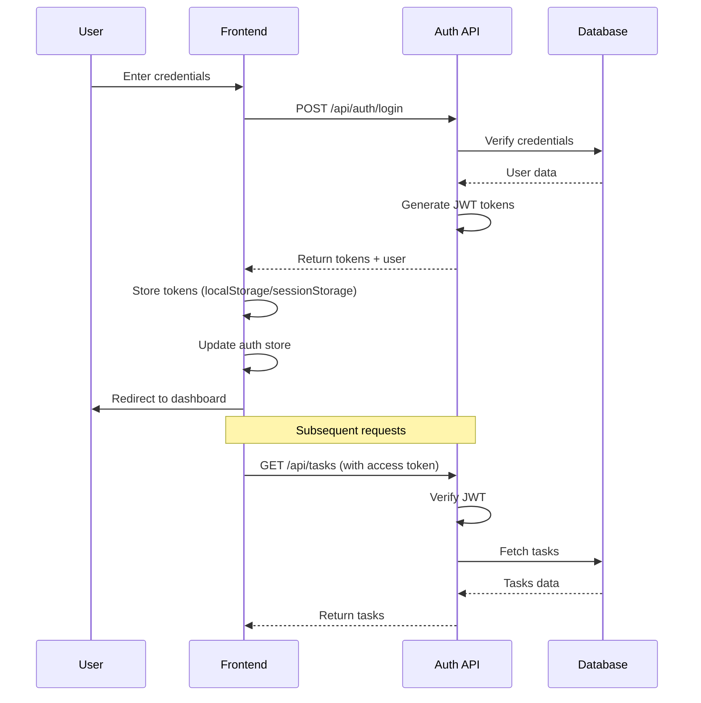

# Technical Architecture

## Overview

This document defines the complete technical architecture for TaskFlow Pro, including frontend structure, component hierarchy, state management design, routing configuration, and deployment architecture. All patterns align with the [Nuxt + Vuetify Architecture Blueprint](../frontend-arch/nuxt-vuetify/).

---

## System Architecture Diagram



---

## Frontend Architecture

### Complete Project Structure

```
taskflow-pro/
├── .github/                        # GitHub Actions workflows
│   └── workflows/
│       ├── ci.yml                  # Continuous integration
│       ├── deploy-staging.yml      # Staging deployment
│       └── deploy-production.yml   # Production deployment
├── .nuxt/                          # Nuxt build output (gitignored)
├── .output/                        # Production build (gitignored)
├── app/                            # Main application source
│   ├── assets/                     # Processed assets
│   │   ├── images/
│   │   │   ├── logo.svg
│   │   │   ├── logo-dark.svg
│   │   │   └── illustrations/
│   │   ├── fonts/
│   │   └── styles/
│   │       ├── main.scss           # Main stylesheet
│   │       ├── _variables.scss     # SCSS variables
│   │       ├── _mixins.scss        # SCSS mixins
│   │       └── vuetify/
│   │           └── settings.scss   # Vuetify SASS variables
│   ├── components/                 # Vue components
│   │   ├── common/                 # Shared components
│   │   │   ├── AppButton.vue
│   │   │   ├── AppTextField.vue
│   │   │   ├── AppSelect.vue
│   │   │   ├── AppTextarea.vue
│   │   │   ├── AppDatePicker.vue
│   │   │   ├── AppConfirmDialog.vue
│   │   │   ├── AppToast.vue
│   │   │   ├── AppErrorBoundary.vue
│   │   │   ├── AppLoadingSkeleton.vue
│   │   │   ├── GlobalSearch.vue
│   │   │   ├── ThemeToggle.vue
│   │   │   ├── LanguageSelector.vue
│   │   │   └── SafeHtml.vue
│   │   ├── layout/                 # Layout components
│   │   │   ├── LayoutHeader.vue
│   │   │   ├── LayoutSidebar.vue
│   │   │   ├── LayoutFooter.vue
│   │   │   ├── LayoutBreadcrumb.vue
│   │   │   ├── NavigationMenu.vue
│   │   │   ├── UserMenu.vue
│   │   │   └── NotificationBadge.vue
│   │   ├── vuetify/                # Vuetify wrappers
│   │   │   ├── VTextField.vue
│   │   │   ├── VSelect.vue
│   │   │   ├── VTextarea.vue
│   │   │   ├── VDataTable.vue
│   │   │   ├── VDialog.vue
│   │   │   ├── VCard.vue
│   │   │   └── VDatePicker.vue
│   │   ├── project/                # Project domain
│   │   │   ├── ProjectCard.vue
│   │   │   ├── ProjectList.vue
│   │   │   ├── ProjectKanban.vue
│   │   │   ├── ProjectSettings.vue
│   │   │   ├── ProjectMemberList.vue
│   │   │   ├── ProjectStatusConfig.vue
│   │   │   └── ProjectTemplateSelector.vue
│   │   ├── task/                   # Task domain
│   │   │   ├── TaskCard.vue
│   │   │   ├── TaskList.vue
│   │   │   ├── TaskDetail.vue
│   │   │   ├── TaskDetailDialog.vue
│   │   │   ├── TaskQuickAdd.vue
│   │   │   ├── TaskPriorityIcon.vue
│   │   │   ├── TaskStatusBadge.vue
│   │   │   ├── TaskAssigneeSelector.vue
│   │   │   ├── CommentThread.vue
│   │   │   ├── CommentItem.vue
│   │   │   ├── AttachmentList.vue
│   │   │   ├── AttachmentCard.vue
│   │   │   ├── TimeTrackerWidget.vue
│   │   │   ├── SubtaskList.vue
│   │   │   └── ActivityTimeline.vue
│   │   ├── team/                   # Team domain
│   │   │   ├── TeamMemberCard.vue
│   │   │   ├── TeamMemberList.vue
│   │   │   ├── TeamInviteDialog.vue
│   │   │   ├── TeamMemberProfile.vue
│   │   │   └── TeamRoleSelector.vue
│   │   ├── notification/           # Notifications
│   │   │   ├── NotificationCenter.vue
│   │   │   ├── NotificationItem.vue
│   │   │   ├── NotificationList.vue
│   │   │   └── NotificationSettings.vue
│   │   ├── dashboard/              # Dashboard
│   │   │   ├── DashboardStatsCard.vue
│   │   │   ├── DashboardTaskList.vue
│   │   │   ├── DashboardActivityFeed.vue
│   │   │   ├── DashboardChart.vue
│   │   │   └── DashboardQuickActions.vue
│   │   └── settings/               # Settings
│   │       ├── SettingsSidebar.vue
│   │       ├── ProfileSettings.vue
│   │       ├── AccountSettings.vue
│   │       ├── SecuritySettings.vue
│   │       ├── AppearanceSettings.vue
│   │       ├── NotificationSettings.vue
│   │       └── WorkspaceSettings.vue
│   ├── composables/                # Vue composables
│   │   ├── api/                    # API integration
│   │   │   ├── useApi.ts
│   │   │   ├── useAuth.ts
│   │   │   ├── useProjects.ts
│   │   │   ├── useTasks.ts
│   │   │   ├── useComments.ts
│   │   │   ├── useNotifications.ts
│   │   │   ├── useUsers.ts
│   │   │   └── useFiles.ts
│   │   ├── ui/                     # UI composables
│   │   │   ├── useToast.ts
│   │   │   ├── useDialog.ts
│   │   │   ├── useDrawer.ts
│   │   │   ├── useTheme.ts
│   │   │   ├── useBreakpoints.ts
│   │   │   └── useDataTable.ts
│   │   ├── form/                   # Form handling
│   │   │   ├── useForm.ts
│   │   │   ├── useValidation.ts
│   │   │   └── useFormField.ts
│   │   ├── utils/                  # Utility composables
│   │   │   ├── useDebounce.ts
│   │   │   ├── useLocalStorage.ts
│   │   │   ├── useClipboard.ts
│   │   │   ├── useInfiniteScroll.ts
│   │   │   └── useTimeTracking.ts
│   │   └── features/               # Feature-specific
│   │       ├── useDashboard.ts
│   │       ├── useKanban.ts
│   │       ├── useSearch.ts
│   │       └── useReports.ts
│   ├── constants/                  # Application constants
│   │   ├── routes.ts
│   │   ├── permissions.ts
│   │   ├── priorities.ts
│   │   └── statuses.ts
│   ├── layouts/                    # Nuxt layouts
│   │   ├── default.vue             # Default layout (navbar + sidebar)
│   │   ├── auth.vue                # Auth pages layout (minimal)
│   │   ├── dashboard.vue           # Dashboard layout (enhanced nav)
│   │   └── blank.vue               # Blank layout (no chrome)
│   ├── middleware/                 # Route middleware
│   │   ├── auth.ts                 # Require authentication
│   │   ├── guest.ts                # Guest-only routes
│   │   ├── admin.ts                # Admin permission check
│   │   ├── verified.ts             # Email verified check
│   │   └── setup.global.ts         # Global app initialization
│   ├── pages/                      # File-based routing
│   │   ├── index.vue               # Landing page (/)
│   │   ├── login.vue               # Login (/login)
│   │   ├── register.vue            # Register (/register)
│   │   ├── forgot-password.vue     # Password reset request
│   │   ├── reset-password.vue      # Password reset form
│   │   ├── verify-email.vue        # Email verification
│   │   ├── dashboard/
│   │   │   └── index.vue           # Dashboard (/dashboard)
│   │   ├── projects/
│   │   │   ├── index.vue           # Project list (/projects)
│   │   │   ├── new.vue             # Create project (/projects/new)
│   │   │   └── [id]/
│   │   │       ├── index.vue       # Project detail (/projects/:id)
│   │   │       ├── board.vue       # Kanban board (/projects/:id/board)
│   │   │       ├── list.vue        # List view (/projects/:id/list)
│   │   │       ├── calendar.vue    # Calendar view (/projects/:id/calendar)
│   │   │       ├── reports.vue     # Project reports  (/projects/:id/reports)
│   │   │       └── settings.vue    # Project settings (/projects/:id/settings)
│   │   ├── tasks/
│   │   │   ├── index.vue           # All tasks view (/tasks)
│   │   │   ├── [id].vue            # Task detail (/tasks/:id)
│   │   │   └── my-tasks.vue        # My assigned tasks (/tasks/my-tasks)
│   │   ├── team/
│   │   │   ├── index.vue           # Team members (/team)
│   │   │   └── [id].vue            # Member profile (/team/:id)
│   │   ├── reports/
│   │   │   └── index.vue           # Reports dashboard (/reports)
│   │   ├── settings/
│   │   │   ├── index.vue           # Settings home (/settings)
│   │   │   ├── profile.vue         # Profile settings (/settings/profile)
│   │   │   ├── account.vue         # Account settings (/settings/account)
│   │   │   ├── security.vue        # Security settings (/settings/security)
│   │   │   ├── notifications.vue   # Notification prefs (/settings/notifications)
│   │   │   ├── appearance.vue      # Theme/language (/settings/appearance)
│   │   │   └── workspace.vue       # Workspace settings (/settings/workspace)
│   │   └── [... slug].vue          # 404 catch-all
│   ├── plugins/                    # Nuxt plugins
│   │   ├── vuetify.ts              # Vuetify initialization
│   │   ├── vee-validate.ts         # Form validation setup
│   │   ├── api-client.ts           # API client configuration
│   │   ├── auth-init.client.ts     # Auth state restoration
│   │   ├── error-handler.ts        # Global error handling
│   │   ├── theme-init.client.ts    # Theme initialization
│   │   └── analytics.client.ts     # Analytics integration
│   ├── stores/                     # Pinia stores
│   │   ├── auth.ts                 # Authentication state
│   │   ├── user.ts                 # User profile state
│   │   ├── projects.ts             # Projects collection
│   │   ├── tasks.ts                # Tasks collection
│   │   ├── notifications.ts        # Notifications state
│   │   └── app.ts                  # App settings/UI state
│   ├── types/                      # TypeScript types
│   │   ├── index.ts                # Type exports
│   │   ├── user.ts
│   │   ├── project.ts
│   │   ├── task.ts
│   │   ├── comment.ts
│   │   ├── notification.ts
│   │   ├── api.ts
│   │   └── vuetify.d.ts            # Vuetify augmentation
│   ├── utils/                      # Utility functions
│   │   ├── format.ts               # Date/number formatting
│   │   ├── validation.ts           # Validation helpers
│   │   ├── permissions.ts          # Permission checks
│   │   ├── transformers.ts         # Data transformers
│   │   └── api-client.ts           # API client class
│   ├── schemas/                    # Validation schemas
│   │   ├── auth.schema.ts          # Auth form schemas
│   │   ├── project.schema.ts       # Project form schemas
│   │   ├── task.schema.ts          # Task form schemas
│   │   └── user.schema.ts          # User form schemas
│   ├── app.config.ts               # App runtime config
│   ├── app.vue                     # Root component
│   └── error.vue                   # Error page
├── server/                         # Server-side code
│   ├── api/                        # API routes
│   │   ├── auth/
│   │   │   ├── register.post.ts
│   │   │   ├── login.post.ts
│   │   │   ├── logout.post.ts
│   │   │   ├── refresh.post.ts
│   │   │   ├── me.get.ts
│   │   │   └── verify-email.post.ts
│   │   ├── projects/
│   │   │   ├── index.get.ts
│   │   │   ├── index.post.ts
│   │   │   ├── [id].get.ts
│   │   │   ├── [id].patch.ts
│   │   │   ├── [id].delete.ts
│   │   │   └── [id]/
│   │   │       ├── members.get.ts
│   │   │       ├── members.post.ts
│   │   │       └── stats.get.ts
│   │   ├── tasks/
│   │   │   ├── index.get.ts
│   │   │   ├── index.post.ts
│   │   │   ├── [id].get.ts
│   │   │   ├── [id].patch.ts
│   │   │   ├── [id].delete.ts
│   │   │   └── [id]/
│   │   │       └── comments.ts
│   │   ├── notifications/
│   │   ├── users/
│   │   ├── upload.post.ts
│   │   └── health.get.ts
│   ├── middleware/                 # Server middleware
│   │   ├── auth.ts
│   │   ├── cors.ts
│   │   ├── csrf.ts
│   │   └── rate-limit.ts
│   ├── utils/                      # Server utilities
│   │   ├── db.ts                   # Database connection
│   │   ├── jwt.ts                  # JWT utilities
│   │   ├── email.ts                # Email service
│   │   └── validation.ts
│   └── plugins/
│       └── database.ts
├── locales/                        # i18n translations
│   ├── en.json
│   ├── es.json
│   ├── fr.json
│   └── de.json
├── public/                         # Static files
│   ├── favicon.ico
│   ├── icon.svg
│   ├── apple-touch-icon.png
│   └── robots.txt
├── tests/                          # Three-tier testing
│   ├── setup.ts
│   ├── fixtures/                   # Test factories
│   │   ├── index.ts
│   │   ├── user.factory.ts
│   │   ├── project.factory.ts
│   │   └── task.factory.ts
│   ├── utils/                      # Test utilities
│   │   ├── index.ts
│   │   ├── mocks.ts
│   │   ├── helpers.ts
│   │   └── vuetify.ts
│   ├── unit/                       # Tier 1: Unit tests
│   │   ├── utils/
│   │   ├── composables/
│   │   └── stores/
│   ├── integration/                # Tier 2: Integration tests
│   │   ├── components/
│   │   └── pages/
│   └── e2e/                        # Tier 3: E2E tests
│       ├── pages/                  # Page objects
│       ├── fixtures/
│       ├── helpers/
│       └── specs/
├── .env.example                    # Environment variables template
├── .gitignore
├── eslint.config.js                # ESLint configuration
├── nuxt.config.ts                  # Nuxt configuration
├── package.json
├── playwright.config.ts            # Playwright configuration
├── pnpm-lock.yaml
├── tsconfig.json                   # TypeScript configuration
├── vitest.config.ts                # Vitest configuration
└── README.md
```

---

## Component Hierarchy

### Authentication Flow Components

```
AuthenticationFlow
├── pages/login.vue
│   └── LoginForm (inline)
│       ├── AppTextField (email)
│       ├── AppTextField (password)
│       ├── AppButton (submit)
│       └── OAuthButtons
│           ├── GoogleOAuthButton
│           ├── GitHubOAuthButton
│           └── MicrosoftOAuthButton
├── pages/register.vue
│   └── RegisterForm (inline)
│       ├── AppTextField (firstName)
│       ├── AppTextField (lastName)
│       ├── AppTextField (email)
│       ├── AppTextField (password)
│       ├── AppTextField (confirmPassword)
│       ├── v-checkbox (acceptTerms)
│       ├── AppButton (submit)
│       └── OAuthButtons
└── pages/forgot-password.vue
    └── ForgotPasswordForm (inline)
        ├── AppTextField (email)
        └── AppButton (submit)
```

### Dashboard Components

```
DashboardPage (pages/dashboard/index.vue)
├── LayoutHeader
├── LayoutSidebar
│   └── NavigationMenu
└── Main Content
    ├── WelcomeSection
    │   └── UserGreeting
    ├── StatsSection
    │   ├── DashboardStatsCard (Total Tasks)
    │   ├── DashboardStatsCard (Active)
    │   ├── DashboardStatsCard (Overdue)
    │   └── DashboardStatsCard (Done Today)
    ├── ContentRow
    │   ├── DashboardTaskList (My Tasks)
    │   └── DashboardActivityFeed (Recent Activity)
    └── ChartsSection
        ├── DashboardChart (Burn-down)
        └── DashboardChart (Velocity)
```

### Project Kanban Components

```
ProjectKanbanPage (pages/projects/[id]/board.vue)
├── LayoutHeader
│   ├── ProjectBreadcrumb
│   └── ProjectActions
│       ├── ProjectSettingsButton
│       └── ProjectMembersButton
├── KanbanFilters
│   ├── SearchInput
│   ├── AssigneeFilter
│   ├── PriorityFilter
│   └── LabelFilter
└── ProjectKanban
    ├── KanbanColumn (for each status)
    │   ├── ColumnHeader
    │   │   ├── StatusName
    │   │   ├── TaskCount
    │   │   └── QuickAddButton
    │   └── TaskList (draggable)
    │       └── TaskCard (for each task)
    │           ├── TaskTitle
    │           ├── TaskPriorityIcon
    │           ├── TaskLabels
    │           ├── TaskAssigneeAvatars
    │           ├── TaskDueDate
    │           └── TaskMetadata (comments, attachments)
    └── FloatingActionButton (Create Task)
```

### Task Detail Components

```
TaskDetailDialog
├── DialogHeader
│   ├── PriorityIcon
│   ├── TaskTitle (editable)
│   └── CloseButton
├── MainContent (2/3 width)
│   ├── DescriptionSection
│   │   └── MarkdownEditor
│   ├── SubtasksSection
│   │   ├── SubtaskList
│   │   │   └── SubtaskItem (for each subtask)
│   │   └── AddSubtaskButton
│   ├── AttachmentsSection
│   │   ├── AttachmentList
│   │   │   └── AttachmentCard (for each file)
│   │   └── UploadButton
│   ├── CommentsSection
│   │   ├── CommentThread
│   │   │   └── CommentItem (for each comment)
│   │   └── CommentInput
│   └── ActivitySection
│       └── ActivityTimeline
└── Sidebar (1/3 width)
    ├── StatusSelect
    ├── AssigneeMultiSelect
    ├── PriorityButtonGroup
    ├── DueDatePicker
    ├── LabelMultiSelect
    ├── EstimateInput
    ├── CreatedInfo
    └── DeleteButton
```

---

## State Management Architecture

### Store Structure

```typescript
// stores/index.ts - Store composition overview

/*
State Management Strategy:
- auth: Global auth state, tokens, login/logout
- user: Current user profile, preferences
- projects: Project collection with active project
- tasks: Task collection with filters/sorting
- notifications: Notification queue and history
- app: Application UI state (sidebar, theme, etc.)
*/
```

### Authentication Store

```typescript
// stores/auth.ts
import { defineStore } from "pinia";

export const useAuthStore = defineStore("auth", () => {
  // State
  const tokens = ref<AuthTokens | null>(null);
  const isInitialized = ref(false);

  // Computed
  const isAuthenticated = computed(() => {
    if (!tokens.value) return false;
    return tokens.value.expiresAt > Date.now();
  });

  const accessToken = computed(() => tokens.value?.accessToken);

  // Actions
  async function login(credentials: LoginCredentials) {
    const response = await $fetch<AuthResponse>("/api/auth/login", {
      method: "POST",
      body: credentials,
    });

    tokens.value = response.tokens;

    const userStore = useUserStore();
    userStore.setUser(response.user);

    // Persist tokens
    const storage = credentials.remember ? localStorage : sessionStorage;
    storage.setItem("auth_tokens", JSON.stringify(response.tokens));
  }

  async function logout() {
    await $fetch("/api/auth/logout", { method: "POST" });

    tokens.value = null;

    const userStore = useUserStore();
    userStore.clearUser();

    localStorage.removeItem("auth_tokens");
    sessionStorage.removeItem("auth_tokens");

    navigateTo("/login");
  }

  async function initialize() {
    if (isInitialized.value) return;

    const stored =
      localStorage.getItem("auth_tokens") ||
      sessionStorage.getItem("auth_tokens");

    if (stored) {
      const parsed = JSON.parse(stored);
      if (parsed.expiresAt > Date.now()) {
        tokens.value = parsed;
        const userStore = useUserStore();
        await userStore.fetchUser();
      }
    }

    isInitialized.value = true;
  }

  return {
    tokens: readonly(tokens),
    isAuthenticated,
    accessToken,
    isInitialized: readonly(isInitialized),
    login,
    logout,
    initialize,
  };
});
```

### Projects Store

```typescript
// stores/projects.ts
import { defineStore } from "pinia";

export const useProjectsStore = defineStore("projects", () => {
  // State
  const items = ref<Project[]>([]);
  const current = ref<Project | null>(null);
  const loading = ref(false);
  const error = ref<Error | null>(null);

  const filters = ref({
    status: "active" as "active" | "archived" | "all",
    search: "",
  });

  // Computed
  const activeProjects = computed(() =>
    items.value.filter((p) => p.status === "active")
  );

  const filteredProjects = computed(() => {
    let result = items.value;

    if (filters.value.status !== "all") {
      result = result.filter((p) => p.status === filters.value.status);
    }

    if (filters.value.search) {
      const search = filters.value.search.toLowerCase();
      result = result.filter(
        (p) =>
          p.name.toLowerCase().includes(search) ||
          p.description?.toLowerCase().includes(search)
      );
    }

    return result;
  });

  // Actions
  async function fetchProjects() {
    loading.value = true;
    error.value = null;

    try {
      const response = await $fetch<{ data: Project[] }>("/api/projects");
      items.value = response.data;
    } catch (err) {
      error.value = err as Error;
      throw err;
    } finally {
      loading.value = false;
    }
  }

  async function fetchProject(id: string) {
    loading.value = true;

    try {
      const project = await $fetch<Project>(`/api/projects/${id}`);
      current.value = project;

      // Update in list if exists
      const index = items.value.findIndex((p) => p.id === id);
      if (index !== -1) {
        items.value[index] = project;
      } else {
        items.value.push(project);
      }

      return project;
    } finally {
      loading.value = false;
    }
  }

  async function createProject(data: CreateProjectInput) {
    loading.value = true;

    try {
      const project = await $fetch<Project>("/api/projects", {
        method: "POST",
        body: data,
      });

      items.value.push(project);
      current.value = project;

      return project;
    } finally {
      loading.value = false;
    }
  }

  async function updateProject(id: string, data: UpdateProjectInput) {
    const project = await $fetch<Project>(`/api/projects/${id}`, {
      method: "PATCH",
      body: data,
    });

    const index = items.value.findIndex((p) => p.id === id);
    if (index !== -1) {
      items.value[index] = project;
    }

    if (current.value?.id === id) {
      current.value = project;
    }

    return project;
  }

  function setCurrentProject(project: Project | null) {
    current.value = project;
  }

  function setFilter(key: keyof typeof filters.value, value: any) {
    filters.value[key] = value;
  }

  return {
    items: readonly(items),
    current: readonly(current),
    loading: readonly(loading),
    error: readonly(error),
    filters,
    activeProjects,
    filteredProjects,
    fetchProjects,
    fetchProject,
    createProject,
    updateProject,
    setCurrentProject,
    setFilter,
  };
});
```

### Tasks Store

```typescript
// stores/tasks.ts
import { defineStore } from "pinia";

export const useTasksStore = defineStore("tasks", () => {
  const items = ref<Task[]>([]);
  const loading = ref(false);

  // Computed - User's tasks
  const userStore = useUserStore();
  const userTasks = computed(() =>
    items.value.filter((t) =>
      t.assignees.some((a) => a.id === userStore.currentUser?.id)
    )
  );

  const activeTasks = computed(() =>
    userTasks.value.filter((t) => t.status.category !== "done")
  );

  const overdueTasks = computed(() =>
    activeTasks.value.filter((t) => {
      if (!t.dueDate) return false;
      return new Date(t.dueDate) < new Date();
    })
  );

  const completedToday = computed(() => {
    const today = new Date().toDateString();
    return items.value.filter((t) => {
      if (!t.completedAt) return false;
      return new Date(t.completedAt).toDateString() === today;
    });
  });

  // Computed - By project
  function getProjectTasks(projectId: string) {
    return computed(() => items.value.filter((t) => t.projectId === projectId));
  }

  function getKanbanTasks(projectId: string) {
    return computed(() => {
      const tasks = items.value.filter((t) => t.projectId === projectId);
      const grouped = new Map<string, Task[]>();

      tasks.forEach((task) => {
        const statusId = task.statusId;
        if (!grouped.has(statusId)) {
          grouped.set(statusId, []);
        }
        grouped.get(statusId)!.push(task);
      });

      // Sort by order within each status
      grouped.forEach((tasks) => {
        tasks.sort((a, b) => a.order - b.order);
      });

      return grouped;
    });
  }

  // Actions
  async function fetchTasks(params?: TaskListParams) {
    loading.value = true;

    try {
      const response = await $fetch<{ data: Task[] }>("/api/tasks", { params });
      items.value = response.data;
    } finally {
      loading.value = false;
    }
  }

  async function createTask(data: CreateTaskInput) {
    const task = await $fetch<Task>("/api/tasks", {
      method: "POST",
      body: data,
    });

    items.value.push(task);

    const notificationStore = useNotificationStore();
    notificationStore.success("Task created successfully");

    return task;
  }

  async function updateTask(id: string, data: UpdateTaskInput) {
    // Optimistic update
    const index = items.value.findIndex((t) => t.id === id);
    if (index !== -1) {
      const original = items.value[index];
      items.value[index] = { ...original, ...data };

      try {
        const updated = await $fetch<Task>(`/api/tasks/${id}`, {
          method: "PATCH",
          body: data,
        });

        items.value[index] = updated;
        return updated;
      } catch (error) {
        // Revert on error
        items.value[index] = original;
        throw error;
      }
    }
  }

  return {
    items: readonly(items),
    loading: readonly(loading),
    userTasks,
    activeTasks,
    overdueTasks,
    completedToday,
    getProjectTasks,
    getKanbanTasks,
    fetchTasks,
    createTask,
    updateTask,
  };
});
```

---

## Routing & Navigation

### Route Structure

```typescript
// All routes with middleware and layouts

const routes = [
  // Public routes
  { path: "/", layout: "default", middleware: [] },
  { path: "/login", layout: "auth", middleware: ["guest"] },
  { path: "/register", layout: "auth", middleware: ["guest"] },
  { path: "/forgot-password", layout: "auth", middleware: ["guest"] },

  // Protected routes
  { path: "/dashboard", layout: "dashboard", middleware: ["auth"] },

  // Projects
  { path: "/projects", layout: "dashboard", middleware: ["auth"] },
  { path: "/projects/new", layout: "dashboard", middleware: ["auth"] },
  { path: "/projects/:id", layout: "dashboard", middleware: ["auth"] },
  { path: "/projects/:id/board", layout: "dashboard", middleware: ["auth"] },
  { path: "/projects/:id/reports", layout: "dashboard", middleware: ["auth"] },

  // Tasks
  { path: "/tasks", layout: "dashboard", middleware: ["auth"] },
  { path: "/tasks/my-tasks", layout: "dashboard", middleware: ["auth"] },

  // Team
  { path: "/team", layout: "dashboard", middleware: ["auth"] },

  // Reports (manager+)
  {
    path: "/reports",
    layout: "dashboard",
    middleware: ["auth", "role:manager"],
  },

  // Settings
  { path: "/settings", layout: "dashboard", middleware: ["auth"] },
  { path: "/settings/profile", layout: "dashboard", middleware: ["auth"] },
  {
    path: "/settings/workspace",
    layout: "dashboard",
    middleware: ["auth", "admin"],
  },
];
```

### Middleware Implementation

```typescript
// middleware/auth.ts
export default defineNuxtRouteMiddleware(async (to, from) => {
  const authStore = useAuthStore();

  if (!authStore.isAuthenticated) {
    return navigateTo({
      path: "/login",
      query: { redirect: to.fullPath },
    });
  }
});

// middleware/role.ts
export default defineNuxtRouteMiddleware((to) => {
  const userStore = useUserStore();
  const requiredRole = to.meta.role as string;

  const roleHierarchy = ["guest", "member", "manager", "admin"];
  const userRoleLevel = roleHierarchy.indexOf(
    userStore.currentUser?.role || "guest"
  );
  const requiredRoleLevel = roleHierarchy.indexOf(requiredRole);

  if (userRoleLevel < requiredRoleLevel) {
    return abortNavigation({
      statusCode: 403,
      message: "Insufficient permissions",
    });
  }
});
```

---

## Deployment Architecture

### SPA Deployment (Static)



**Configuration**:

```typescript
// nuxt.config.ts (SPA mode)
export default defineNuxtConfig({
  ssr: false,

  nitro: {
    preset: "static",
  },

  app: {
    baseURL: "/",
    buildAssetsDir: "/_nuxt/",
  },

  routeRules: {
    "/**": { ssr: false },
  },
});
```

---

### SSR Deployment (Server)



**Configuration**:

```typescript
// nuxt.config.ts (SSR mode)
export default defineNuxtConfig({
  ssr: true,

  nitro: {
    preset: "node-server",
  },

  routeRules: {
    // Pre-render static pages
    "/": { prerender: true },
    "/login": { prerender: true },
    "/register": { prerender: true },

    // SPA pages (dashboard, app)
    "/dashboard/**": { ssr: false },
    "/projects/**": { ssr: false },
    "/tasks/**": { ssr: false },

    // API caching
    "/api/projects": { swr: 60 },
  },
});
```

---

## Performance Optimization

### Bundle Analysis

**Target Metrics**:

- Initial bundle (gzipped): < 250KB
- Route chunks (gzipped): < 100KB each
- Vuetify components: Tree-shaken, only used components included

**Optimization Strategies**:

```typescript
// nuxt.config.ts
export default defineNuxtConfig({
  vite: {
    build: {
      rollupOptions: {
        output: {
          manualChunks: {
            "vue-vendor": ["vue", "vue-router", "pinia"],
            vuetify: ["vuetify"],
            utils: ["@vueuse/core"],
            charts: ["chart.js"],
          },
        },
      },
    },
  },
});
```

### Code Splitting

```vue
<!-- Lazy load heavy components -->
<script setup>
const HeavyChart = defineAsyncComponent(() =>
  import("~/components/dashboard/HeavyChart.vue")
);
</script>

<template>
  <Suspense>
    <HeavyChart :data="chartData" />
    <template #fallback>
      <v-skeleton-loader type="image" />
    </template>
  </Suspense>
</template>
```

### Caching Strategy

```typescript
// composables/api/useProjects.ts with caching
export function useProjects() {
  const cache = new Map<string, { data: Project; timestamp: number }>();
  const CACHE_TTL = 5 * 60 * 1000; // 5 minutes

  async function fetchProject(id: string, useCache = true) {
    if (useCache) {
      const cached = cache.get(id);
      if (cached && Date.now() - cached.timestamp < CACHE_TTL) {
        return cached.data;
      }
    }

    const project = await $fetch<Project>(`/api/projects/${id}`);
    cache.set(id, { data: project, timestamp: Date.now() });

    return project;
  }

  return { fetchProject };
}
```

---

## Security Architecture

### Authentication Flow



### Permission Checking

```typescript
// utils/permissions.ts

export enum Permission {
  // Projects
  PROJECT_CREATE = "project:create",
  PROJECT_READ = "project:read",
  PROJECT_UPDATE = "project:update",
  PROJECT_DELETE = "project:delete",

  // Tasks
  TASK_CREATE = "task:create",
  TASK_UPDATE = "task:update",
  TASK_DELETE = "task:delete",

  // Team
  MEMBER_INVITE = "member:invite",
  MEMBER_REMOVE = "member:remove",

  // Settings
  SETTINGS_WORKSPACE = "settings:workspace",
  SETTINGS_BILLING = "settings:billing",
}

export const rolePermissions: Record<string, Permission[]> = {
  admin: Object.values(Permission), // All permissions

  manager: [
    Permission.PROJECT_CREATE,
    Permission.PROJECT_READ,
    Permission.PROJECT_UPDATE,
    Permission.TASK_CREATE,
    Permission.TASK_UPDATE,
    Permission.TASK_DELETE,
    Permission.MEMBER_INVITE,
  ],

  member: [
    Permission.PROJECT_READ,
    Permission.TASK_CREATE,
    Permission.TASK_UPDATE,
  ],

  guest: [Permission.PROJECT_READ],
};

export function hasPermission(user: User, permission: Permission): boolean {
  const permissions = rolePermissions[user.role] || [];
  return permissions.includes(permission);
}

export function canEditProject(user: User, project: Project): boolean {
  if (user.role === "admin") return true;
  if (project.ownerId === user.id) return true;

  const membership = project.members.find((m) => m.userId === user.id);
  return membership?.role === "admin";
}
```

---

## Testing Architecture

### Test Coverage Targets

| Layer           | Tool             | Coverage Target | Test Count |
| --------------- | ---------------- | --------------- | ---------- |
| **Unit**        | Vitest           | 80%+            | 200+ tests |
| **Integration** | @nuxt/test-utils | 70%+            | 100+ tests |
| **E2E**         | Playwright       | Critical paths  | 50+ tests  |

### Example Test Structure

```typescript
// tests/unit/stores/projects.test.ts
import { setActivePinia, createPinia } from "pinia";
import { describe, it, expect, beforeEach, vi } from "vitest";
import { useProjectsStore } from "~/stores/projects";
import { createProject } from "../../fixtures/project.factory";

vi.stubGlobal("$fetch", vi.fn());

describe("useProjectsStore", () => {
  beforeEach(() => {
    setActivePinia(createPinia());
    vi.clearAllMocks();
  });

  describe("fetchProjects", () => {
    it("loads projects successfully", async () => {
      const mockProjects = [createProject(), createProject()];
      vi.mocked($fetch).mockResolvedValueOnce({ data: mockProjects });

      const store = useProjectsStore();
      await store.fetchProjects();

      expect(store.items).toHaveLength(2);
      expect(store.loading).toBe(false);
    });
  });

  describe("activeProjects", () => {
    it("filters active projects only", () => {
      const store = useProjectsStore();
      store.$patch({
        items: [
          createProject({ status: "active" }),
          createProject({ status: "archived" }),
          createProject({ status: "active" }),
        ],
      });

      expect(store.activeProjects).toHaveLength(2);
    });
  });
});
```

---

## Monitoring & Observability

### Application Monitoring

```typescript
// plugins/monitoring.client.ts
export default defineNuxtPlugin(() => {
  if (process.env.NODE_ENV !== "production") return;

  // Performance monitoring
  const observer = new PerformanceObserver((list) => {
    for (const entry of list.getEntries()) {
      $fetch("/api/metrics", {
        method: "POST",
        body: {
          name: entry.name,
          value: entry.startTime,
          page: window.location.pathname,
        },
      });
    }
  });

  observer.observe({ type: "largest-contentful-paint", buffered: true });
});
```

### Error Tracking

```typescript
// plugins/error-tracking.ts
import * as Sentry from "@sentry/vue";

export default defineNuxtPlugin((nuxtApp) => {
  if (process.env.NODE_ENV !== "production") return;

  Sentry.init({
    app: nuxtApp.vueApp,
    dsn: process.env.NUXT_PUBLIC_SENTRY_DSN,
    environment: process.env.NODE_ENV,
    integrations: [
      new Sentry.BrowserTracing({
        routingInstrumentation: Sentry.vueRouterInstrumentation(
          nuxtApp.$router
        ),
      }),
    ],
    tracesSampleRate: 0.1,
  });
});
```

---

## Technology Stack Summary

### Frontend Stack

```yaml
Framework: Nuxt 4.x
  - Vue: 3.5+
  - Vite: 6+
  - Nitro: Server engine

UI Library: Vuetify 3.x
  - Material Design 3
  - Component library: 50+ components used
  - Icons: @mdi/font (Material Design Icons)

Language: TypeScript 5.5+
  - Strict mode enabled
  - 100% type coverage target

State: Pinia
  - 6 stores (auth, user, projects, tasks, notifications, app)
  - Composition API pattern
  - SSR-safe with useState

Forms: VeeValidate 4
  - Schema validation with Yup
  - Vuetify integration
  - Async validation support

i18n: @nuxtjs/i18n
  - 4 languages (EN, ES, FR, DE)
  - Lazy loading
  - Vuetify locale adapter

Utilities: @vueuse/nuxt
  - Composition utilities
  - SSR-safe helpers
```

### Backend Stack

```yaml
Runtime: Node.js 20 LTS
Server: Nitro (Nuxt's server engine)
API: RESTful with h3 handlers

Database: PostgreSQL 15+
  - UUID primary keys
  - JSONB for flexible data
  - Full-text search
  - Partitioning for scale

ORM: Prisma or Kysely
  - Type-safe queries
  - Migrations
  - Seeding

File Storage: S3-compatible
  - AWS S3 or CloudFlare R2
  - Signed URLs for security
  - Image optimization

Cache: Redis (optional)
  - Session storage
  - API response caching
  - Rate limiting

Email: SendGrid or similar
  - Transactional emails
  - Email templates
```

### DevOps Stack

```yaml
Version Control: Git + GitHub
CI/CD: GitHub Actions
  - Automated testing
  - Type checking
  - Linting
  - Build and deploy

Testing:
  - Vitest (unit/integration)
  - Playwright (E2E)
  - @nuxt/test-utils

Code Quality:
  - ESLint (@antfu/eslint-config)
  - TypeScript strict mode
  - simple-git-hooks
  - lint-staged

Monitoring:
  - Sentry (error tracking)
  - PostHog/Plausible (analytics)
  - Uptime monitoring

Deployment:
  - Vercel/Netlify (SPA)
  - Docker + Nginx (SSR)
  - PM2 (process management)
```

---

## Development Workflow

### Local Development Setup

```bash
# 1. Clone repository
git clone https://github.com/yourusername/taskflow-pro.git
cd taskflow-pro

# 2. Install dependencies
pnpm install

# 3. Set up environment variables
cp .env.example .env
# Edit .env with your configuration

# 4. Set up database
pnpm db:push              # Push schema to database
pnpm db:seed              # Seed with dev data

# 5. Start development server
pnpm dev                  # Runs on http://localhost:3000

# 6. Run tests (in separate terminal)
pnpm test                 # Unit + integration tests
pnpm test:e2e             # E2E tests
```

### Git Branch Strategy

```
main (production)
  └── develop (staging)
      └── feature/auth-improvements
      └── feature/kanban-drag-drop
      └── fix/notification-bug
```

**Branch Naming**:

- `feature/` - New features
- `fix/` - Bug fixes
- `refactor/` - Code refactoring
- `docs/` - Documentation updates
- `test/` - Test additions/fixes

---

## Scalability Considerations

### Horizontal Scaling

- Stateless server design (tokens in client, session in Redis)
- Load balancer distribution (Nginx, AWS ALB)
- Database read replicas for read-heavy operations
- CDN for static assets

### Performance Targets

| Metric             | Target  | At Scale (10K users) |
| ------------------ | ------- | -------------------- |
| Homepage FCP       | < 1.8s  | < 2.0s               |
| Dashboard TTI      | < 3.5s  | < 4.0s               |
| API Response (P95) | < 200ms | < 300ms              |
| DB Query (P95)     | < 100ms | < 150ms              |
| Concurrent Users   | 100+    | 1,000+               |

---

**Next Document**: [Success Metrics & KPIs / Roadmap](./12-roadmap-phasing.md) →
