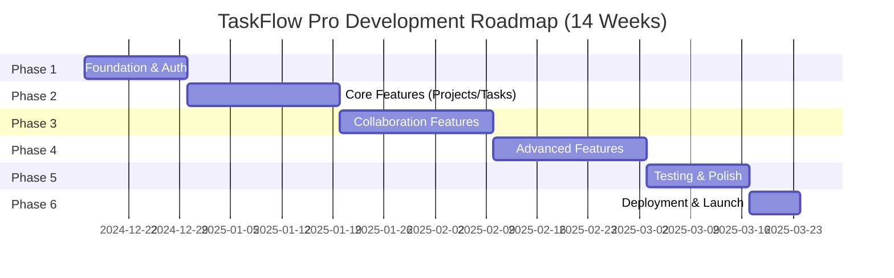
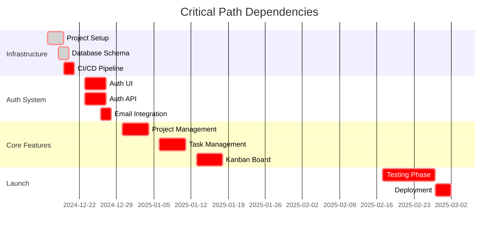

# Roadmap & Phasing

## Overview

This document outlines the phased development roadmap for TaskFlow Pro, including sprint planning, milestone definitions, release schedule, and success criteria for each phase. The roadmap is designed to deliver incremental value while maintaining alignment with the Nuxt + Vuetify architecture blueprint.

---

## Development Timeline

### High-Level Roadmap



---

## Phase 1: Foundation & Authentication (Week 1-2)

### Objectives

- Set up project infrastructure
- Implement complete authentication system
- Create base layouts and navigation
- Establish theming and i18n foundation

### Sprint 1 (Week 1): Infrastructure Setup

**Sprint Goal**: Production-ready development environment

| Task                                           | Effort | Owner         | Status |
| ---------------------------------------------- | ------ | ------------- | ------ |
| Initialize Nuxt 4 project with TypeScript      | 4h     | Tech Lead     | ⏳     |
| Install and configure Vuetify 3                | 4h     | Frontend Dev1 | ⏳     |
| Configure ESLint (@antfu/eslint-config)        | 2h     | Frontend Dev1 | ⏳     |
| Set up Vitest for unit testing                 | 3h     | Frontend Dev1 | ⏳     |
| Set up Playwright for E2E testing              | 3h     | Frontend Dev2 | ⏳     |
| Configure Pinia for state management           | 2h     | Frontend Dev1 | ⏳     |
| Set up @nuxtjs/i18n with 4 languages           | 4h     | Frontend Dev2 | ⏳     |
| Configure VeeValidate with Yup                 | 3h     | Frontend Dev1 | ⏳     |
| Set up git hooks (simple-git-hooks)            | 2h     | Frontend Dev1 | ⏳     |
| Create base layouts (default, auth, dashboard) | 6h     | Frontend Dev2 | ⏳     |
| Configure Vuetify theme (light/dark)           | 4h     | Frontend Dev2 | ⏳     |
| Set up CI/CD pipeline (GitHub Actions)         | 4h     | DevOps        | ⏳     |
| Create database schema (PostgreSQL)            | 6h     | Backend Dev   | ⏳     |
| Set up database migrations                     | 3h     | Backend Dev   | ⏳     |

**Total Effort**: ~50 hours  
**Deliverables**:

- ✅ Project repository with all dependencies
- ✅ Linting and formatting configured
- ✅ Testing framework ready
- ✅ CI/CD pipeline operational
- ✅ Database schema deployed
- ✅ Basic layouts and navigation

**Success Criteria**:

```
GIVEN the development environment
WHEN developer runs `pnpm dev`
THEN application should start without errors
AND Vuetify components should render correctly
AND linting should pass
AND unit tests should run successfully
```

---

### Sprint 2 (Week 2): Authentication System

**Sprint Goal**: Complete authentication flow with security

| Task                                          | Effort | Owner         | Status |
| --------------------------------------------- | ------ | ------------- | ------ |
| Create registration page with form validation | 6h     | Frontend Dev1 | ⏳     |
| Create login page with form validation        | 4h     | Frontend Dev1 | ⏳     |
| Implement password reset flow (frontend)      | 4h     | Frontend Dev1 | ⏳     |
| Create email verification page                | 2h     | Frontend Dev1 | ⏳     |
| Implement OAuth (Google) integration          | 6h     | Frontend Dev2 | ⏳     |
| Create auth store (Pinia)                     | 4h     | Frontend Dev1 | ⏳     |
| Create user store (Pinia)                     | 3h     | Frontend Dev1 | ⏳     |
| Implement auth middleware                     | 2h     | Frontend Dev1 | ⏳     |
| Backend: Registration endpoint                | 6h     | Backend Dev   | ⏳     |
| Backend: Login endpoint with JWT              | 6h     | Backend Dev   | ⏳     |
| Backend: Password reset endpoints             | 4h     | Backend Dev   | ⏳     |
| Backend: Email verification                   | 4h     | Backend Dev   | ⏳     |
| Email service integration (SendGrid)          | 4h     | Backend Dev   | ⏳     |
| Write unit tests for auth flows               | 6h     | QA Engineer   | ⏳     |
| Write E2E tests for auth flows                | 4h     | QA Engineer   | ⏳     |

**Total Effort**: ~65 hours  
**Deliverables**:

- ✅ Complete registration/login flow
- ✅ Email verification working
- ✅ Password reset functional
- ✅ OAuth integration (Google)
- ✅ Auth store managing tokens
- ✅ Protected routes with middleware
- ✅ Unit and E2E tests for auth

**Success Criteria**:

```
GIVEN a new user
WHEN they complete registration
THEN they should receive verification email
AND be able to verify their account
AND log in successfully
AND access protected dashboard page

GIVEN an existing user
WHEN they forget their password
THEN they should receive reset email
AND be able to set new password
AND log in with new password
```

**Phase 1 Milestone**: 🎯 **Authentication Complete**

- All auth flows working end-to-end
- Security best practices implemented
- Tests achieving 80%+ coverage on auth code

---

## Phase 2: Core Features (Week 3-5)

### Sprint 3 (Week 3): Project Management

**Sprint Goal**: Complete project CRUD with team management

| Task                                     | Effort | Priority |
| ---------------------------------------- | ------ | -------- |
| Create project list page                 | 6h     | P0       |
| Create project creation form             | 6h     | P0       |
| Implement project detail view            | 6h     | P0       |
| Create project settings page             | 4h     | P0       |
| Implement project member management      | 6h     | P0       |
| Create project store (Pinia)             | 6h     | P0       |
| Backend: Project CRUD endpoints          | 8h     | P0       |
| Backend: Project members endpoints       | 6h     | P0       |
| Unit tests for project store             | 4h     | P0       |
| Integration tests for project components | 6h     | P0       |
| E2E tests for project flows              | 4h     | P0       |

**Total Effort**: ~62 hours  
**Deliverables**:

- ✅ Projects list with create/edit/delete
- ✅ Project settings configuration
- ✅ Team member management
- ✅ Projects store with filtering
- ✅ API endpoints operational
- ✅ Tests achieving 80%+ coverage

---

### Sprint 4 (Week 4): Task Management Basics

**Sprint Goal**: Task CRUD and kanban board

| Task                                  | Effort | Priority |
| ------------------------------------- | ------ | -------- |
| Create task list view                 | 6h     | P0       |
| Implement kanban board layout         | 8h     | P0       |
| Implement drag-and-drop functionality | 8h     | P0       |
| Create task detail dialog             | 8h     | P0       |
| Create task quick-add component       | 4h     | P0       |
| Task priority and status indicators   | 3h     | P0       |
| Create tasks store (Pinia)            | 6h     | P0       |
| Backend: Task CRUD endpoints          | 8h     | P0       |
| Backend: Task filtering and sorting   | 4h     | P0       |
| Unit tests for task store             | 5h     | P0       |
| Integration tests for task components | 6h     | P0       |
| E2E tests for kanban interactions     | 6h     | P0       |

**Total Effort**: ~72 hours  
**Deliverables**:

- ✅ Task kanban board with drag-and-drop
- ✅ Task list view with filters
- ✅ Task detail dialog
- ✅ Quick task creation
- ✅ Tasks store with kanban grouping
- ✅ API endpoints for tasks
- ✅ Comprehensive testing

---

### Sprint 5 (Week 5): Task Details & Labels

**Sprint Goal**: Rich task details with metadata

| Task                                       | Effort | Priority |
| ------------------------------------------ | ------ | -------- |
| Implement markdown editor for descriptions | 6h     | P0       |
| Create assignee selector component         | 4h     | P0       |
| Implement due date picker                  | 3h     | P0       |
| Create label management (CRUD)             | 5h     | P0       |
| Implement label selector for tasks         | 4h     | P0       |
| Create priority selector component         | 2h     | P0       |
| File upload component for attachments      | 6h     | P1       |
| Backend: Attachment upload endpoint        | 6h     | P1       |
| Backend: Label CRUD endpoints              | 4h     | P0       |
| S3/storage integration for files           | 6h     | P1       |
| Tests for task detail components           | 6h     | P0       |
| E2E tests for complete task workflows      | 6h     | P0       |

**Total Effort**: ~58 hours

**Phase 2 Milestone**: 🎯 **Core Features Complete**

- Projects and tasks fully functional
- Kanban board operational
- Rich task details with attachments
- Team can start using for real work

---

## Phase 3: Collaboration Features (Week 6-8)

### Sprint 6 (Week 6): Comments & Mentions

**Sprint Goal**: Enable team collaboration through comments

| Task                                         | Effort | Priority |
| -------------------------------------------- | ------ | -------- |
| Create comment thread component              | 6h     | P0       |
| Implement comment input with mention support | 6h     | P0       |
| Create @mention parser and autocompletion    | 5h     | P0       |
| Comment editing and deletion                 | 4h     | P0       |
| File attachments on comments                 | 4h     | P1       |
| Backend: Comment CRUD endpoints              | 6h     | P0       |
| Backend: Mention detection and notifications | 5h     | P0       |
| Real-time comment updates (polling)          | 4h     | P1       |
| Tests for comment functionality              | 6h     | P0       |

**Total Effort**: ~46 hours

---

### Sprint 7 (Week 7): Notifications System

**Sprint Goal**: Real-time notifications working

| Task                                       | Effort | Priority |
| ------------------------------------------ | ------ | -------- |
| Create notification center component       | 6h     | P0       |
| Implement notification badge with count    | 3h     | P0       |
| Create toast notification system           | 4h     | P0       |
| Notification preferences page              | 5h     | P0       |
| Create notification store (Pinia)          | 6h     | P0       |
| Backend: Notification endpoints            | 6h     | P0       |
| Backend: Notification generation logic     | 6h     | P0       |
| Email notifications (SendGrid integration) | 6h     | P1       |
| Notification polling/real-time updates     | 5h     | P0       |
| Tests for notification system              | 6h     | P0       |

**Total Effort**: ~53 hours

---

### Sprint 8 (Week 8): Team & Activity

**Sprint Goal**: Team management and activity tracking

| Task                               | Effort | Priority |
| ---------------------------------- | ------ | -------- |
| Create team members list page      | 5h     | P0       |
| Create member profile page         | 4h     | P0       |
| Implement team invitation dialog   | 5h     | P0       |
| Create role selector component     | 3h     | P0       |
| Activity feed component            | 6h     | P0       |
| Activity timeline for tasks        | 4h     | P0       |
| Backend: User management endpoints | 6h     | P0       |
| Backend: Invitation system         | 6h     | P0       |
| Backend: Activity logging          | 5h     | P0       |
| Tests for team features            | 6h     | P0       |

**Total Effort**: ~50 hours

**Phase 3 Milestone**: 🎯 **Collaboration Enabled**

- Comments and mentions working
- Notifications delivering in real-time
- Team management functional
- Activity tracking complete

---

## Phase 4: Advanced Features (Week 9-11)

### Sprint 9 (Week 9): Dashboard & Reporting

**Sprint Goal**: Analytics and insights operational

| Task                                              | Effort | Priority |
| ------------------------------------------------- | ------ | -------- |
| Create dashboard statistics cards                 | 5h     | P0       |
| Implement chart components (Chart.js integration) | 8h     | P0       |
| Create project progress charts                    | 6h     | P0       |
| Create velocity/burn-down charts                  | 6h     | P1       |
| Dashboard activity feed                           | 4h     | P0       |
| Project reports page                              | 6h     | P1       |
| Backend: Dashboard statistics endpoint            | 5h     | P0       |
| Backend: Analytics/reporting endpoints            | 8h     | P1       |
| Tests for dashboard components                    | 5h     | P0       |

**Total Effort**: ~53 hours

---

### Sprint 10 (Week 10): Time Tracking & Settings

**Sprint Goal**: Time tracking and user preferences

| Task                                    | Effort | Priority |
| --------------------------------------- | ------ | -------- |
| Create time tracker widget              | 6h     | P1       |
| Timer start/stop functionality          | 5h     | P1       |
| Manual time entry form                  | 4h     | P1       |
| Time tracking reports                   | 5h     | P1       |
| Profile settings page                   | 5h     | P0       |
| Account settings page                   | 4h     | P0       |
| Security settings (password, 2FA setup) | 6h     | P1       |
| Appearance settings (theme, language)   | 5h     | P0       |
| Notification preferences page           | 4h     | P0       |
| Workspace settings (admin)              | 5h     | P1       |
| Backend: Time tracking endpoints        | 6h     | P1       |
| Backend: User preferences endpoints     | 4h     | P0       |
| Tests for settings pages                | 5h     | P0       |

**Total Effort**: ~64 hours

---

### Sprint 11 (Week 11): Advanced Task Features

**Sprint Goal**: Subtasks, dependencies, calendar view

| Task                                       | Effort | Priority |
| ------------------------------------------ | ------ | -------- |
| Implement subtasks feature                 | 8h     | P1       |
| Create task dependencies UI                | 6h     | P1       |
| Implement calendar view for tasks          | 8h     | P2       |
| Create task templates                      | 5h     | P2       |
| Implement task duplication                 | 3h     | P1       |
| Advanced task filtering                    | 5h     | P0       |
| Backend: Subtasks endpoints                | 5h     | P1       |
| Backend: Dependencies with cycle detection | 6h     | P1       |
| Tests for advanced features                | 6h     | P0       |

**Total Effort**: ~52 hours

**Phase 4 Milestone**: 🎯 **Feature Complete**

- All MVP features implemented
- Advanced features operational
- Settings and preferences working
- Ready for comprehensive testing

---

## Phase 5: Testing & Polish (Week 12-13)

### Sprint 12 (Week 12): Comprehensive Testing

**Sprint Goal**: Achieve 80%+ test coverage

| Task                                      | Effort | Priority |
| ----------------------------------------- | ------ | -------- |
| Complete unit test coverage (stores)      | 8h     | P0       |
| Complete unit test coverage (composables) | 8h     | P0       |
| Complete integration tests (components)   | 10h    | P0       |
| Complete integration tests (pages)        | 8h     | P0       |
| Complete E2E test suite (critical paths)  | 12h    | P0       |
| Cross-browser E2E testing                 | 6h     | P0       |
| Mobile responsive testing                 | 6h     | P0       |
| Accessibility audit and fixes             | 8h     | P0       |
| Performance optimization                  | 8h     | P0       |
| Security audit                            | 4h     | P0       |

**Total Effort**: ~78 hours

---

### Sprint 13 (Week 13): Polish & Bug Fixes

**Sprint Goal**: Production-ready quality

| Task                                     | Effort | Priority |
| ---------------------------------------- | ------ | -------- |
| Fix all P0/P1 bugs from testing          | 16h    | P0       |
| UI polish and consistency review         | 8h     | P0       |
| Loading states and error handling review | 6h     | P0       |
| Animation and transition polish          | 4h     | P1       |
| Internationalization completeness check  | 4h     | P0       |
| Documentation review and updates         | 6h     | P0       |
| Performance profiling and optimization   | 6h     | P0       |
| Lighthouse audit and improvements        | 4h     | P0       |
| Final security review                    | 4h     | P0       |
| Prepare release notes                    | 3h     | P0       |

**Total Effort**: ~61 hours

**Phase 5 Milestone**: 🎯 **Production Ready**

- 80%+ test coverage achieved
- All critical bugs fixed
- Performance targets met (Lighthouse 85+)
- Accessibility compliant (WCAG AA)
- Security audit passed

---

## Phase 6: Deployment & Launch (Week 14)

### Sprint 14 (Week 14): Production Deployment

**Sprint Goal**: Live production deployment

| Task                                       | Effort | Priority |
| ------------------------------------------ | ------ | -------- |
| Production environment setup               | 4h     | P0       |
| Database migration to production           | 3h     | P0       |
| Configure production environment variables | 2h     | P0       |
| Set up CDN for static assets               | 3h     | P0       |
| Configure monitoring (Sentry, analytics)   | 4h     | P0       |
| Set up automated backups                   | 3h     | P0       |
| Deploy SPA build to Netlify/Vercel         | 3h     | P0       |
| Deploy SSR build (Docker + PM2)            | 4h     | P0       |
| Load testing and validation                | 4h     | P0       |
| Create deployment runbook                  | 3h     | P0       |
| Beta user onboarding                       | 4h     | P0       |
| Monitor and fix deployment issues          | 8h     | P0       |

**Total Effort**: ~45 hours

**Phase 6 Milestone**: 🎯 **Launch Complete**

- Application live in production
- Both SPA and SSR deployments successful
- Monitoring and logging operational
- Beta users onboarded
- No critical production issues

---

## Post-Launch Roadmap (Month 2-6)

### Month 2-3: Stabilization & Iteration

**Objectives**:

- Monitor usage and performance
- Fix bugs based on real usage
- Iterate on UX based on feedback
- Improve performance and loading times

**Key Activities**:

- Weekly bug fix releases
- Bi-weekly feature iterations
- Monthly performance reviews
- User feedback sessions

**Metrics to Track**:

- Daily/Monthly active users
- Feature adoption rates
- Performance metrics (FCP, TTI)
- Error rates and types
- User satisfaction (NPS surveys)

---

### Month 4-6: Feature Expansion

**Priority 1 Features** (based on user feedback):

| Feature                              | Effort | Value  | Target Month |
| ------------------------------------ | ------ | ------ | ------------ |
| Advanced automation (workflow rules) | 40h    | High   | Month 4      |
| Custom fields for tasks              | 32h    | Medium | Month 4      |
| Project templates with tasks         | 24h    | High   | Month 4      |
| Advanced reports builder             | 40h    | High   | Month 5      |
| Slack/Teams integration              | 32h    | High   | Month 5      |
| GitHub integration                   | 24h    | Medium | Month 5      |
| Mobile app (React Native)            | 160h   | Medium | Month 6      |
| Recurring tasks                      | 24h    | Low    | Month 6      |

**Priority 2 Enhancements**:

- Calendar integrations (Google, Outlook)
- File previews (images, PDFs)
- Advanced search with filters
- Saved views and custom dashboards
- Bulk operations on tasks
- Task templates
- Gantt chart view

---

## Success Metrics by Phase

### Phase 1 Success (Week 2)

| Metric                        | Target | Actual   |
| ----------------------------- | ------ | -------- |
| Auth flows completed          | 100%   | \_\_\_   |
| Unit test coverage (auth)     | 80%+   | \_\_\_ % |
| E2E tests passing             | 100%   | \_\_\_ % |
| Zero critical security issues | ✅     | \_\_\_   |
| Login time                    | < 1s   | \_\_\_ s |
| Registration time             | < 2s   | \_\_\_ s |

---

### Phase 2 Success (Week 5)

| Metric                  | Target | Actual   |
| ----------------------- | ------ | -------- |
| Project CRUD functional | 100%   | \_\_\_   |
| Task CRUD functional    | 100%   | \_\_\_   |
| Kanban board working    | 100%   | \_\_\_   |
| Drag-and-drop smooth    | ✅     | \_\_\_   |
| Test coverage           | 80%+   | \_\_\_ % |
| Page load time          | < 2s   | \_\_\_ s |

---

### Phase 3 Success (Week 8)

| Metric                 | Target | Actual   |
| ---------------------- | ------ | -------- |
| Comments functional    | 100%   | \_\_\_   |
| @mentions work         | 100%   | \_\_\_   |
| Notifications deliver  | < 5s   | \_\_\_ s |
| Team management works  | 100%   | \_\_\_   |
| Activity feed accurate | 100%   | \_\_\_   |
| Mobile responsive      | 100%   | \_\_\_   |

---

### Phase 4 Success (Week 11)

| Metric                 | Target | Actual   |
| ---------------------- | ------ | -------- |
| Dashboard loading      | < 3s   | \_\_\_ s |
| Charts rendering       | ✅     | \_\_\_   |
| All settings persist   | 100%   | \_\_\_   |
| i18n working (4 langs) | 100%   | \_\_\_   |
| Time tracking accurate | 100%   | \_\_\_   |

---

### Phase 5 Success (Week 13)

| Metric                   | Target | Actual   |
| ------------------------ | ------ | -------- |
| Test coverage            | 80%+   | \_\_\_ % |
| Lighthouse performance   | 85+    | \_\_\_   |
| Lighthouse accessibility | 95+    | \_\_\_   |
| Zero critical bugs       | ✅     | \_\_\_   |
| Cross-browser compatible | ✅     | \_\_\_   |
| Security audit passed    | ✅     | \_\_\_   |

---

### Launch Success (Week 14)

| Metric                      | Target | Actual   |
| --------------------------- | ------ | -------- |
| Deployment successful       | ✅     | \_\_\_   |
| Uptime (first 24h)          | 99%+   | \_\_\_ % |
| No critical production bugs | ✅     | \_\_\_   |
| Beta users onboarded        | 20+    | \_\_\_   |
| Initial NPS score           | 40+    | \_\_\_   |

---

## Risk & Dependency Timeline

### Critical Path Items



### High-Risk Items

| Item                        | Risk Level | Mitigation                                 | Owner         |
| --------------------------- | ---------- | ------------------------------------------ | ------------- |
| Drag-and-drop performance   | 🟡 Medium  | Use SortableJS, virtual scrolling          | Frontend Dev1 |
| Real-time updates           | 🟡 Medium  | Start with polling, add WebSocket later    | Backend Dev   |
| File upload scalability     | 🟡 Medium  | Direct S3 upload with signed URLs          | Backend Dev   |
| Cross-browser compatibility | 🟢 Low     | Playwright multi-browser testing           | QA Engineer   |
| i18n completeness           | 🟡 Medium  | Professional translation service           | Product Team  |
| Performance on mobile       | 🟡 Medium  | Performance budgets, continuous monitoring | Frontend Team |

---

## Resource Allocation by Phase

### Phase 1-2 (Week 1-5): Foundation & Core

| Role            | Allocation | Hours/Week | Total Hours |
| --------------- | ---------- | ---------- | ----------- |
| Frontend Dev 1  | 100%       | 40h        | 200h        |
| Frontend Dev 2  | 100%       | 40h        | 200h        |
| Backend Dev     | 100%       | 40h        | 200h        |
| QA Engineer     | 50%        | 20h        | 100h        |
| Product Manager | 25%        | 10h        | 50h         |
| **Total**       |            |            | **750h**    |

---

### Phase 3-4 (Week 6-11): Features & Polish

| Role            | Allocation | Hours/Week | Total Hours |
| --------------- | ---------- | ---------- | ----------- |
| Frontend Dev 1  | 100%       | 40h        | 240h        |
| Frontend Dev 2  | 100%       | 40h        | 240h        |
| Backend Dev     | 100%       | 40h        | 240h        |
| QA Engineer     | 75%        | 30h        | 180h        |
| UX/UI Designer  | 50%        | 20h        | 120h        |
| Product Manager | 25%        | 10h        | 60h         |
| **Total**       |            |            | **1,080h**  |

---

### Phase 5-6 (Week 12-14): Testing & Deploy

| Role            | Allocation | Hours/Week | Total Hours |
| --------------- | ---------- | ---------- | ----------- |
| Frontend Dev 1  | 75%        | 30h        | 90h         |
| Frontend Dev 2  | 75%        | 30h        | 90h         |
| Backend Dev     | 75%        | 30h        | 90h         |
| QA Engineer     | 100%       | 40h        | 120h        |
| DevOps          | 100%       | 40h        | 120h        |
| Product Manager | 50%        | 20h        | 60h         |
| **Total**       |            |            | **570h**    |

**Grand Total**: **2,400 hours** across 14 weeks

---

## Release Strategy

### Beta Release (Week 14)

**Target Audience**: 20-30 friendly users

**Release Checklist**:

- ✅ All P0 features working
- ✅ 80%+ test coverage
- ✅ Security audit passed
- ✅ Performance targets met
- ✅ Documentation complete
- ✅ Monitoring operational

**Success Criteria**:

- No blocking bugs for 3 consecutive days
- Beta users can complete core workflows
- NPS feedback 40+
- Performance metrics met

---

### Public Launch (Week 16-18)

**Marketing Activities**:

- Product Hunt launch
- Social media campaign
- Blog post series
- Video demos and tutorials
- Community engagement (Discord/Slack)

**Technical Preparation**:

- Staging environment identical to production
- Load testing (simulate 1,000 concurrent users)
- Disaster recovery plan tested
- Support systems ready (help docs, support email)

**Launch Day Checklist**:

- [ ] Final smoke tests pass
- [ ] Monitoring dashboards operational
- [ ] Support team briefed
- [ ] Rollback plan ready
- [ ] Blog post published
- [ ] Social media posts scheduled
- [ ] Product Hunt listing live

---

## Long-Term Roadmap (6-24 Months)

### Q2 2025 (Month 4-6): Growth

**Focus**: User acquisition and retention

- Advanced automation workflows
- Third-party integrations (Slack, GitHub, etc.)
- Mobile app (React Native)
- Enhanced reporting
- API platform for developers

**Success Metrics**:

- 2,000+ registered users
- 400+ active workspaces
- 70% monthly retention
- NPS 50+

---

### Q3 2025 (Month 7-9): Enterprise Features

**Focus**: Enterprise-ready capabilities

- SSO (SAML, LDAP)
- Advanced audit logging
- Custom workflows per team
- White-labeling options
- Advanced security features

**Success Metrics**:

- 10+ enterprise customers
- 99.9% uptime
- SOC 2 compliance (in progress)
- 5,000+ active users

---

### Q4 2025 (Month 10-12): Platform Maturity

**Focus**: Platform and ecosystem

- Public API for integrations
- Plugin/extension system
- Marketplace for add-ons
- Advanced analytics with ML
- Resource capacity planning

**Success Metrics**:

- 10,000+ users
- 50+ third-party integrations
- Active developer community
- Positive cash flow

---

## Blueprint Demonstration Timeline

### Architecture Pattern Coverage by Phase

| Phase       | Patterns Demonstrated                             | Documents Covered      |
| ----------- | ------------------------------------------------- | ---------------------- |
| **Phase 1** | Project setup, auth patterns, layouts, middleware | 01, 02, 03, 06, 07, 13 |
| **Phase 2** | Components, stores, forms, validation             | 04, 05, 06, 09         |
| **Phase 3** | Real-time updates, notifications, composables     | 05, 06                 |
| **Phase 4** | i18n, theming, advanced forms, reporting          | 08, 09, 10             |
| **Phase 5** | Testing (all 3 tiers), code quality               | 11, 12, 13             |
| **Phase 6** | Security, performance, deployment                 | 14, 15                 |

**Blueprint Coverage**: 100% by end of Phase 6

---

## Iteration & Feedback Loops

### Sprint Ceremonies

**Sprint Planning** (Monday, Week Start):

- Review backlog
- Estimate stories
- Commit to sprint goal
- Assign tasks

**Daily Standup** (Every day, 15 min):

- What did you complete yesterday?
- What will you work on today?
- Any blockers or impediments?

**Sprint Review** (Friday, Week End):

- Demo completed features
- Stakeholder feedback
- Update product backlog

**Retrospective** (Friday, Week End):

- What went well?
- What could be improved?
- Action items for next sprint

---

### Feedback Integration

**User Feedback Channels**:

1. In-app feedback widget
2. User interviews (weekly during beta)
3. Analytics and behavior tracking
4. NPS surveys monthly
5. Support tickets and issues
6. Community Discord/Slack

**Feedback Processing**:

- Collect: Aggregate from all channels
- Categorize: Bug, feature request, usability issue
- Prioritize: Impact vs. effort matrix
- Plan: Add to backlog with priority
- Communicate: Update users on status

---

## Release Versioning

### Version Numbering

**Format**: `MAJOR.MINOR.PATCH`

**Example Versions**:

- `0.1.0` - Sprint 1 completion (infrastructure)
- `0.2.0` - Sprint 2 completion (auth)
- `0.5.0` - Sprint 5 completion (core features)
- `1.0.0` - Public launch (week 14)
- `1.1.0` - First post-launch feature release
- `2.0.0` - Major feature release (e.g., mobile app)

### Release Notes Template

```markdown
# TaskFlow Pro v1.0.0 - Public Launch

**Release Date**: 2025-03-01
**Type**: Major Release

## 🎉 Highlights

- Complete project and taskmanagement
- Real-time team collaboration
- Beautiful Material Design 3 interface
- Multi-language support (EN, ES, FR, DE)

## ✨ New Features

- **Projects**: Full CRUD with team management
- **Tasks**: Kanban board, list view, calendar view
- **Collaboration**: Comments, @mentions, real-time notifications
- **Reporting**: Dashboard analytics, progress charts
- **Time Tracking**: Built-in timer and manual entry
- **Settings**: Comprehensive user and workspace settings

## 🐛 Bug Fixes

- Fixed: Task drag-and-drop on mobile devices
- Fixed: Notification count not updating
- Fixed: Theme not persisting across sessions

## 🔧 Improvements

- Improved kanban board performance (50% faster)
- Enhanced mobile responsive design
- Accessibility improvements (WCAG AA compliant)
- Better error messages and validation

## 📚 Documentation

- Complete user guide published
- API documentation available
- Developer guide for contributors

## 🔒 Security

- CSP headers configured
- XSS/CSRF protection enabled
- Regular dependency updates

## ⬆️ Upgrade Notes

First public release - no upgrade needed.

## 📝 Full Changelog

See [CHANGELOG.md](./CHANGELOG.md) for complete details.
```

---

## Rollback Strategy

### Rollback Decision Criteria

Initiate rollback if:

- Critical security vulnerability discovered
- Data corruption or loss
- > 5% error rate in production
- Complete feature unavailability
- Performance degradation > 50%

### Rollback Procedure

```bash
# 1. Notify team and stakeholders
# 2. Stop new deployments

# 3. Revert to previous version
pm2 stop taskflow-pro
cd /app/releases/previous
pm2 start ecosystem.config.js

# 4. Verify rollback successful
curl https://api.taskflow.pro/health

# 5. Database rollback (if needed)
psql -U postgres -d taskflow < backups/pre-deploy-backup.sql

# 6. Clear caches
redis-cli FLUSHALL

# 7. Monitor for stability
# 8. Investigate root cause
# 9. Fix issue in  develop branch
# 10. Re-deploy when ready
```

---

## Conclusion

This phased roadmap delivers TaskFlow Pro in **14 weeks** with:

- ✅ **6 structured sprints** with clear goals
- ✅ **100% blueprint pattern coverage** across all phases
- ✅ **Incremental value delivery** starting from Phase 2
- ✅ **Quality gates** at each phase milestone
- ✅ **Risk mitigation** with identified critical paths
- ✅ **Resource plan** with realistic effort estimates
- ✅ **Post-launch strategy** for continued growth

**Next Phase**: Begin Sprint 1 - Infrastructure Setup

---

**Next Document**: [Competitive Analysis & Risk Mitigation](./14-risk-mitigation.md) →
