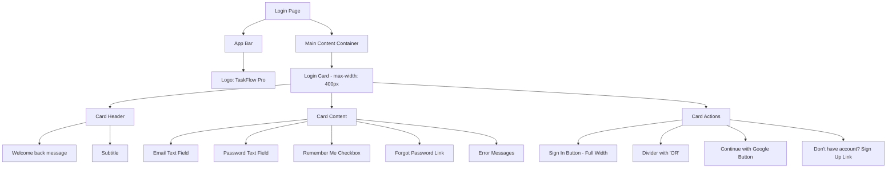
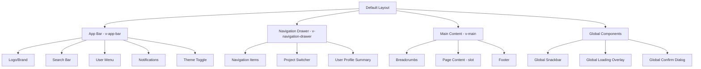
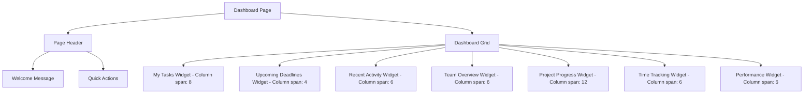
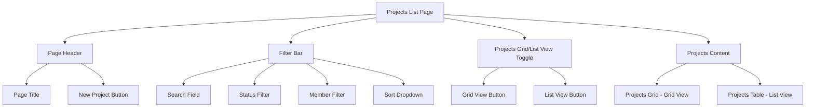

# Wireframe Descriptions & UI Specifications

## Overview

This document provides detailed wireframe descriptions and UI specifications for TaskFlow Pro, aligned with **Material Design 3** principles and **Vuetify 3** component library. Each screen includes layout specifications, component hierarchy, responsive behavior, and interaction patterns.

---

## Design System Foundation

### Vuetify 3 Color Palette

**Primary Colors:**

- Primary: `#1976D2` (Material Blue)
- Primary Variant: `#1565C0`
- Secondary: `#03DAC6` (Material Teal)
- Secondary Variant: `#018786`

**Semantic Colors:**

- Success: `#4CAF50` (Green)
- Warning: `#FF9800` (Orange)
- Error: `#F44336` (Red)
- Info: `#2196F3` (Light Blue)

**Neutral Colors:**

- Background: `#FAFAFA` (Light), `#121212` (Dark)
- Surface: `#FFFFFF` (Light), `#1E1E1E` (Dark)
- On Primary: `#FFFFFF`
- On Secondary: `#000000`
- On Surface: `#000000` (Light), `#FFFFFF` (Dark)

### Typography Scale

```scss
// Headings
.heading-1 {
  font-size: 2.5rem;
  font-weight: 300;
  line-height: 1.2;
}
.heading-2 {
  font-size: 2rem;
  font-weight: 300;
  line-height: 1.3;
}
.heading-3 {
  font-size: 1.75rem;
  font-weight: 400;
  line-height: 1.4;
}
.heading-4 {
  font-size: 1.5rem;
  font-weight: 400;
  line-height: 1.4;
}
.heading-5 {
  font-size: 1.25rem;
  font-weight: 400;
  line-height: 1.5;
}
.heading-6 {
  font-size: 1rem;
  font-weight: 500;
  line-height: 1.5;
}

// Body Text
.body-1 {
  font-size: 1rem;
  font-weight: 400;
  line-height: 1.6;
}
.body-2 {
  font-size: 0.875rem;
  font-weight: 400;
  line-height: 1.6;
}
.caption {
  font-size: 0.75rem;
  font-weight: 400;
  line-height: 1.4;
}
.overline {
  font-size: 0.625rem;
  font-weight: 500;
  line-height: 1.4;
  text-transform: uppercase;
}
```

### Spacing System

```scss
// Spacing scale (8px base unit)
$space-1: 0.5rem; // 8px
$space-2: 1rem; // 16px
$space-3: 1.5rem; // 24px
$space-4: 2rem; // 32px
$space-5: 3rem; // 48px
$space-6: 4rem; // 64px
```

### Breakpoints

```scss
// Vuetify 3 breakpoints
$breakpoint-xs: 0px; // Extra small devices (phones)
$breakpoint-sm: 600px; // Small devices (tablets)
$breakpoint-md: 960px; // Medium devices (tablets/laptops)
$breakpoint-lg: 1280px; // Large devices (desktops)
$breakpoint-xl: 1920px; // Extra large devices (large desktops)
```

---

## Authentication Screens

### Login Screen

**Route:** `/login`  
**Layout:** `auth` layout  
**Purpose:** User authentication and access



**Component Hierarchy:**

```
<AuthLayout>
  <v-app-bar flat color="transparent">
    <v-toolbar-title class="text-h5 font-weight-bold">
      TaskFlow Pro
    </v-toolbar-title>
  </v-app-bar>

  <v-main>
    <v-container class="fill-height">
      <v-row justify="center" align="center">
        <v-col cols="12" sm="8" md="6" lg="4" xl="3">
          <v-card elevation="8" rounded="lg">
            <v-card-title class="text-h4 pa-6 text-center">
              Welcome Back
            </v-card-title>

            <v-card-subtitle class="text-center mb-4">
              Sign in to your account
            </v-card-subtitle>

            <v-card-text>
              <v-form ref="loginForm" @submit.prevent="handleLogin">
                <v-text-field
                  v-model="email"
                  label="Email"
                  type="email"
                  prepend-inner-icon="mdi-email"
                  :rules="emailRules"
                  :error-messages="errors.email"
                  required
                />

                <v-text-field
                  v-model="password"
                  label="Password"
                  :type="showPassword ? 'text' : 'password'"
                  prepend-inner-icon="mdi-lock"
                  :append-inner-icon="showPassword ? 'mdi-eye' : 'mdi-eye-off'"
                  @click:append-inner="showPassword = !showPassword"
                  :rules="passwordRules"
                  :error-messages="errors.password"
                  required
                />

                <v-checkbox
                  v-model="rememberMe"
                  label="Remember me"
                  color="primary"
                />

                <v-alert
                  v-if="errors.general"
                  type="error"
                  variant="tonal"
                  class="mb-4"
                >
                  {{ errors.general }}
                </v-alert>
              </v-form>
            </v-card-text>

            <v-card-actions class="pa-6 pt-0">
              <v-btn
                type="submit"
                color="primary"
                size="large"
                block
                :loading="loading"
                @click="handleLogin"
              >
                Sign In
              </v-btn>

              <v-divider class="my-4">
                <span class="text-disabled px-4">OR</span>
              </v-divider>

              <v-btn
                variant="outlined"
                size="large"
                block
                prepend-icon="mdi-google"
                @click="signInWithGoogle"
              >
                Continue with Google
              </v-btn>

              <div class="text-center mt-4">
                <NuxtLink
                  to="/forgot-password"
                  class="text-decoration-none"
                >
                  Forgot Password?
                </NuxtLink>
              </div>

              <div class="text-center mt-2">
                <span class="text-disabled">Don't have an account?</span>
                <NuxtLink to="/register" class="ml-1">
                  Sign Up
                </NuxtLink>
              </div>
            </v-card-actions>
          </v-card>
        </v-col>
      </v-row>
    </v-container>
  </v-main>
</AuthLayout>
```

**Responsive Behavior:**

- **Desktop (≥1280px):** Card width 400px, centered vertically and horizontally
- **Tablet (960-1279px):** Card width 450px, maintained proportions
- **Mobile (<960px):** Full width with 16px margins, padding reduced

**State Variations:**

- **Loading:** Sign In button shows loading spinner, form fields disabled
- **Error:** Error messages displayed below fields with `v-alert` component
- **Success:** Brief success feedback before redirect to dashboard

---

### Registration Screen

**Route:** `/register`  
**Layout:** `auth` layout  
**Purpose:** New user account creation

**Component Structure:**

```
<AuthLayout>
  <v-app-bar> [Same as login]</v-app-bar>

  <v-main>
    <v-container>
      <v-row justify="center">
        <v-col cols="12" sm="8" md="6" lg="5" xl="4">
          <v-card elevation="8" rounded="lg">
            <v-card-title class="text-h4 pa-6 text-center">
              Create Account
            </v-card-title>

            <v-card-text>
              <v-form>
                <v-row>
                  <v-col cols="12" sm="6">
                    <v-text-field
                      v-model="firstName"
                      label="First Name"
                      prepend-inner-icon="mdi-account"
                      :rules="[rules.required, rules.minName]"
                    />
                  </v-col>
                  <v-col cols="12" sm="6">
                    <v-text-field
                      v-model="lastName"
                      label="Last Name"
                      :rules="[rules.required, rules.minName]"
                    />
                  </v-col>
                </v-row>

                <v-text-field
                  v-model="email"
                  label="Email"
                  type="email"
                  prepend-inner-icon="mdi-email"
                  :rules="[rules.required, rules.email]"
                />

                <v-text-field
                  v-model="password"
                  label="Password"
                  :type="showPassword ? 'text' : 'password'"
                  prepend-inner-icon="mdi-lock"
                  :append-inner-icon="showPassword ? 'mdi-eye' : 'mdi-eye-off'"
                  @click:append-inner="showPassword = !showPassword"
                  :rules="[rules.required, rules.password]"
                  hint="At least 8 characters, 1 uppercase, 1 number"
                />

                <v-text-field
                  v-model="confirmPassword"
                  label="Confirm Password"
                  type="password"
                  prepend-inner-icon="mdi-lock-check"
                  :rules="[rules.required, rules.passwordMatch]"
                />

                <v-checkbox
                  v-model="agreeToS"
                  color="primary"
                  :rules="[rules.required]"
                >
                  <template #label>
                    I agree to the
                    <a href="/terms" target="_blank" class="ml-1">Terms of Service</a>
                  </template>
                </v-checkbox>
              </v-form>
            </v-card-text>

            <v-card-actions class="pa-6 pt-0">
              <v-btn
                color="primary"
                size="large"
                block
                :loading="loading"
                @click="handleRegister"
              >
                Create Account
              </v-btn>

              <v-divider class="my-4">
                <span class="text-disabled px-4">OR</span>
              </v-divider>

              <v-btn
                variant="outlined"
                size="large"
                block
                prepend-icon="mdi-google"
              >
                Sign up with Google
              </v-btn>

              <div class="text-center mt-4">
                <span class="text-disabled">Already have an account?</span>
                <NuxtLink to="/login" class="ml-1">Sign In</NuxtLink>
              </div>
            </v-card-actions>
          </v-card>
        </v-col>
      </v-row>
    </v-container>
  </v-main>
</AuthLayout>
```

**Password Strength Indicator:**

```vue
<v-progress-linear
  v-model="passwordStrength"
  :color="passwordStrengthColor"
  height="4"
  rounded
/>
<v-small class="text-disabled">
  Password strength: {{ passwordStrengthText }}
</v-small>
```

---

### Password Reset Screen

**Route:** `/forgot-password`  
**Layout:** `auth` layout  
**Purpose:** Password recovery initiation

**Component Structure:**

```
<AuthLayout>
  <v-main>
    <v-container>
      <v-row justify="center">
        <v-col cols="12" sm="8" md="6" lg="4">
          <v-card elevation="8">
            <v-card-title class="text-h5 pa-6 text-center">
              Reset Password
            </v-card-title>

            <v-card-text>
              <p class="text-body-2 mb-6">
                Enter your email address and we'll send you a link to reset your password.
              </p>

              <v-text-field
                v-model="email"
                label="Email Address"
                type="email"
                prepend-inner-icon="mdi-email"
                :rules="[rules.required, rules.email]"
              />

              <v-alert
                v-if="success"
                type="success"
                variant="tonal"
                class="mb-4"
              >
                Password reset email sent. Check your inbox.
              </v-alert>
            </v-card-text>

            <v-card-actions class="pa-6 pt-0">
              <v-btn color="primary" block :loading="loading">
                Send Reset Link
              </v-btn>

              <div class="text-center mt-4">
                <NuxtLink to="/login">Back to Sign In</NuxtLink>
              </div>
            </v-card-actions>
          </v-card>
        </v-col>
      </v-row>
    </v-container>
  </v-main>
</AuthLayout>
```

---

## Main Application Layout

### Default Layout Structure

**Layout:** `default.vue`  
**Purpose:** Main application shell for authenticated users



**Layout Component:**

```vue
<template>
  <v-app>
    <!-- App Bar -->
    <v-app-bar elevation="1" color="surface">
      <!-- Mobile menu button -->
      <v-app-bar-nav-icon
        v-if="$vuetify.display.smAndDown"
        @click="drawer = !drawer"
      />

      <!-- Logo -->
      <NuxtLink to="/dashboard" class="text-decoration-none">
        <v-toolbar-title class="text-h6 font-weight-bold text-primary">
          TaskFlow Pro
        </v-toolbar-title>
      </NuxtLink>

      <v-spacer />

      <!-- Global Search -->
      <v-text-field
        v-model="searchQuery"
        prepend-inner-icon="mdi-magnify"
        placeholder="Search tasks, projects..."
        hide-details
        single-line
        variant="outlined"
        density="compact"
        class="mr-4"
        style="max-width: 300px"
        @keyup.enter="handleSearch"
      />

      <!-- Notifications -->
      <v-btn icon @click="showNotifications = true">
        <v-badge
          :content="notificationCount"
          :model-value="notificationCount > 0"
          color="error"
        >
          <v-icon>mdi-bell</v-icon>
        </v-badge>
      </v-btn>

      <!-- Theme Toggle -->
      <v-btn icon @click="toggleTheme">
        <v-icon>{{
          isDark ? "mdi-white-balance-sunny" : "mdi-weather-night"
        }}</v-icon>
      </v-btn>

      <!-- User Menu -->
      <v-menu>
        <template #activator="{ props }">
          <v-btn icon v-bind="props">
            <v-avatar size="32">
              <v-img :src="user.avatar" :alt="user.name" />
            </v-avatar>
          </v-btn>
        </template>

        <v-list>
          <v-list-item :to="`/users/${user.id}`">
            <v-list-item-title>{{ user.name }}</v-list-item-title>
            <v-list-item-subtitle>{{ user.email }}</v-list-item-subtitle>
          </v-list-item>

          <v-divider />

          <v-list-item to="/settings/profile">
            <template #prepend>
              <v-icon>mdi-account-cog</v-icon>
            </template>
            <v-list-item-title>Settings</v-list-item-title>
          </v-list-item>

          <v-list-item @click="handleLogout">
            <template #prepend>
              <v-icon>mdi-logout</v-icon>
            </template>
            <v-list-item-title>Logout</v-list-item-title>
          </v-list-item>
        </v-list>
      </v-menu>
    </v-app-bar>

    <!-- Navigation Drawer -->
    <v-navigation-drawer
      v-model="drawer"
      :permanent="$vuetify.display.mdAndUp"
      width="280"
    >
      <v-list>
        <!-- Project Switcher -->
        <v-list-subheader>Current Project</v-list-subheader>
        <v-list-item>
          <template #prepend>
            <v-icon>mdi-folder-multiple</v-icon>
          </template>
          <v-list-item-title>{{ currentProject?.name }}</v-list-item-title>
          <template #append>
            <v-btn icon size="small" variant="text">
              <v-icon>mdi-chevron-down</v-icon>
            </v-btn>
          </template>
        </v-list-item>

        <v-divider class="my-2" />

        <!-- Navigation Items -->
        <v-list-item
          v-for="item in navigationItems"
          :key="item.to"
          :to="item.to"
          :prepend-icon="item.icon"
        >
          <v-list-item-title>{{ item.title }}</v-list-item-title>
          <v-badge
            v-if="item.badge"
            :content="item.badge"
            color="error"
            inline
          />
        </v-list-item>
      </v-list>

      <template #append>
        <v-list>
          <v-divider />
          <v-list-item to="/settings">
            <template #prepend>
              <v-icon>mdi-cog</v-icon>
            </template>
            <v-list-item-title>Settings</v-list-item-title>
          </v-list-item>

          <v-list-item @click="showHelp = true">
            <template #prepend>
              <v-icon>mdi-help-circle</v-icon>
            </template>
            <v-list-item-title>Help & Support</v-list-item-title>
          </v-list-item>
        </v-list>
      </template>
    </v-navigation-drawer>

    <!-- Main Content -->
    <v-main>
      <!-- Breadcrumbs -->
      <v-breadcrumbs
        v-if="breadcrumbs.length > 0"
        :items="breadcrumbs"
        class="px-4 py-2"
      >
        <template #divider>
          <v-icon>mdi-chevron-right</v-icon>
        </template>
      </v-breadcrumbs>

      <!-- Page Content -->
      <slot />
    </v-main>

    <!-- Global Components -->
    <GlobalSnackbar />
    <GlobalLoading />
    <NotificationCenter v-model="showNotifications" />
  </v-app>
</template>
```

**Navigation Items:**

```javascript
const navigationItems = [
  { title: "Dashboard", icon: "mdi-view-dashboard", to: "/dashboard" },
  {
    title: "My Tasks",
    icon: "mdi-checkbox-marked-circle",
    to: "/tasks",
    badge: 5,
  },
  { title: "Projects", icon: "mdi-folder-multiple", to: "/projects" },
  { title: "Team", icon: "mdi-account-group", to: "/team" },
  { title: "Reports", icon: "mdi-chart-line", to: "/reports" },
  { divider: true },
  { title: "Calendar", icon: "mdi-calendar", to: "/calendar" },
  { title: "Time Tracking", icon: "mdi-timer", to: "/time-tracking" },
];
```

**Responsive Behavior:**

- **Desktop (≥960px):** Navigation drawer permanent, search field visible
- **Tablet (600-959px):** Navigation drawer temporary overlay
- **Mobile (<600px):** Navigation drawer overlay, search field hidden, hamburger menu

---

## Dashboard Screens

### Personal Dashboard

**Route:** `/dashboard`  
**Layout:** `default` layout  
**Purpose:** Personalized overview of work and activities



**Component Structure:**

```vue
<template>
  <div class="dashboard-page">
    <!-- Page Header -->
    <v-container fluid>
      <v-row>
        <v-col cols="12">
          <div class="d-flex align-center justify-space-between mb-6">
            <div>
              <h1 class="text-h4 font-weight-bold mb-2">
                Welcome back, {{ user.firstName }}! 👋
              </h1>
              <p class="text-body-1 text-medium-emphasis">
                Here's what's happening with your projects today.
              </p>
            </div>

            <div class="d-flex gap-2">
              <v-btn
                color="primary"
                prepend-icon="mdi-plus"
                @click="showNewTaskDialog = true"
              >
                New Task
              </v-btn>

              <v-btn
                variant="outlined"
                prepend-icon="mdi-plus"
                @click="showNewProjectDialog = true"
              >
                New Project
              </v-btn>
            </div>
          </div>
        </v-col>
      </v-row>
    </v-container>

    <!-- Dashboard Widgets -->
    <v-container fluid>
      <v-row>
        <!-- My Tasks Widget -->
        <v-col cols="12" lg="8">
          <v-card elevation="2">
            <v-card-title class="d-flex align-center">
              <v-icon class="mr-2">mdi-checkbox-marked-circle</v-icon>
              My Tasks
              <v-spacer />
              <v-chip size="small" color="primary" variant="tonal">
                {{ tasksSummary.total }} tasks
              </v-chip>
            </v-card-title>

            <v-card-text>
              <!-- Task Summary -->
              <v-row class="mb-4">
                <v-col cols="4">
                  <div class="text-center">
                    <div class="text-h4 text-warning">
                      {{ tasksSummary.todo }}
                    </div>
                    <div class="text-caption">To Do</div>
                  </div>
                </v-col>
                <v-col cols="4">
                  <div class="text-center">
                    <div class="text-h4 text-info">
                      {{ tasksSummary.inProgress }}
                    </div>
                    <div class="text-caption">In Progress</div>
                  </div>
                </v-col>
                <v-col cols="4">
                  <div class="text-center">
                    <div class="text-h4 text-success">
                      {{ tasksSummary.done }}
                    </div>
                    <div class="text-caption">Completed</div>
                  </div>
                </v-col>
              </v-row>

              <!-- Recent Tasks List -->
              <v-list>
                <v-list-item
                  v-for="task in myTasks"
                  :key="task.id"
                  :to="`/tasks/${task.id}`"
                  class="rounded mb-2"
                >
                  <template #prepend>
                    <v-checkbox
                      :model-value="task.status === 'done'"
                      @update:model-value="toggleTask(task)"
                      color="success"
                    />
                  </template>

                  <v-list-item-title>{{ task.title }}</v-list-item-title>
                  <v-list-item-subtitle>
                    {{ task.project.name }} • Due {{ formatDate(task.dueDate) }}
                  </v-list-item-subtitle>

                  <template #append>
                    <v-chip
                      :color="getPriorityColor(task.priority)"
                      size="small"
                      variant="tonal"
                    >
                      {{ task.priority }}
                    </v-chip>
                  </template>
                </v-list-item>
              </v-list>

              <v-btn
                variant="text"
                color="primary"
                block
                to="/tasks"
                class="mt-2"
              >
                View All Tasks
              </v-btn>
            </v-card-text>
          </v-card>
        </v-col>

        <!-- Upcoming Deadlines Widget -->
        <v-col cols="12" lg="4">
          <v-card elevation="2">
            <v-card-title class="d-flex align-center">
              <v-icon class="mr-2">mdi-clock-alert</v-icon>
              Upcoming Deadlines
            </v-card-title>

            <v-card-text>
              <v-list v-if="upcomingDeadlines.length > 0">
                <v-list-item
                  v-for="task in upcomingDeadlines"
                  :key="task.id"
                  :to="`/tasks/${task.id}`"
                  class="rounded mb-2"
                >
                  <v-list-item-title class="text-body-2">
                    {{ task.title }}
                  </v-list-item-title>
                  <v-list-item-subtitle>
                    {{ task.project.name }}
                  </v-list-item-subtitle>

                  <template #append>
                    <v-chip :color="getDueDateColor(task.dueDate)" size="small">
                      {{ getDueDateText(task.dueDate) }}
                    </v-chip>
                  </template>
                </v-list-item>
              </v-list>

              <div v-else class="text-center py-8">
                <v-icon size="48" color="success">mdi-check-circle</v-icon>
                <p class="text-body-2 mt-2">No upcoming deadlines!</p>
              </div>
            </v-card-text>
          </v-card>
        </v-col>
      </v-row>

      <!-- Second Row -->
      <v-row class="mt-4">
        <!-- Recent Activity Widget -->
        <v-col cols="12" lg="6">
          <v-card elevation="2">
            <v-card-title class="d-flex align-center">
              <v-icon class="mr-2">mdi-history</v-icon>
              Recent Activity
            </v-card-title>

            <v-card-text>
              <v-timeline side="end" density="compact">
                <v-timeline-item
                  v-for="activity in recentActivity"
                  :key="activity.id"
                  :dot-color="activity.color"
                  size="small"
                >
                  <template #opposite>
                    <span class="text-caption">
                      {{ formatRelativeTime(activity.createdAt) }}
                    </span>
                  </template>

                  <div>
                    <div class="text-body-2">{{ activity.description }}</div>
                    <div class="text-caption text-medium-emphasis">
                      {{ activity.project }}
                    </div>
                  </div>
                </v-timeline-item>
              </v-timeline>
            </v-card-text>
          </v-card>
        </v-col>

        <!-- Team Overview Widget -->
        <v-col cols="12" lg="6">
          <v-card elevation="2">
            <v-card-title class="d-flex align-center">
              <v-icon class="mr-2">mdi-account-group</v-icon>
              Team Overview
            </v-card-title>

            <v-card-text>
              <v-list>
                <v-list-item
                  v-for="member in teamMembers"
                  :key="member.id"
                  class="rounded mb-2"
                >
                  <template #prepend>
                    <v-avatar size="40">
                      <v-img :src="member.avatar" :alt="member.name" />
                    </v-avatar>
                  </template>

                  <v-list-item-title>{{ member.name }}</v-list-item-title>
                  <v-list-item-subtitle>
                    {{ member.taskCount }} active tasks
                  </v-list-item-subtitle>

                  <template #append>
                    <v-icon
                      :color="member.online ? 'success' : 'grey'"
                      size="small"
                    >
                      {{ member.online ? "mdi-circle" : "mdi-circle-outline" }}
                    </v-icon>
                  </template>
                </v-list-item>
              </v-list>
            </v-card-text>
          </v-card>
        </v-col>
      </v-row>

      <!-- Third Row -->
      <v-row class="mt-4">
        <!-- Project Progress Widget -->
        <v-col cols="12">
          <v-card elevation="2">
            <v-card-title class="d-flex align-center">
              <v-icon class="mr-2">mdi-chart-line</v-icon>
              Project Progress
            </v-card-title>

            <v-card-text>
              <v-row>
                <v-col
                  v-for="project in projects"
                  :key="project.id"
                  cols="12"
                  sm="6"
                  md="4"
                  lg="3"
                >
                  <v-card variant="outlined">
                    <v-card-text>
                      <div class="text-h6 mb-2">{{ project.name }}</div>

                      <v-progress-linear
                        :model-value="project.progress"
                        :color="getProgressColor(project.progress)"
                        height="8"
                        rounded
                        class="mb-2"
                      />

                      <div class="d-flex justify-space-between text-caption">
                        <span
                          >{{ project.completedTasks }} /
                          {{ project.totalTasks }}</span
                        >
                        <span>{{ project.progress }}%</span>
                      </div>
                    </v-card-text>
                  </v-card>
                </v-col>
              </v-row>
            </v-card-text>
          </v-card>
        </v-col>
      </v-row>
    </v-container>

    <!-- Quick Action Dialogs -->
    <NewTaskDialog v-model="showNewTaskDialog" />
    <NewProjectDialog v-model="showNewProjectDialog" />
  </div>
</template>
```

**Widget Responsiveness:**

- **Desktop (≥1280px):** 3-column grid, all widgets visible
- **Tablet (960-1279px):** 2-column grid, widgets reflow
- **Mobile (<960px):** Single column, stacked vertically

---

## Project Management Screens

### Projects List Screen

**Route:** `/projects`  
**Layout:** `default` layout  
**Purpose:** View and manage all projects



**Component Structure:**

```vue
<template>
  <div class="projects-page">
    <!-- Page Header -->
    <v-container fluid>
      <v-row>
        <v-col cols="12">
          <div class="d-flex align-center justify-space-between mb-6">
            <div>
              <h1 class="text-h4 font-weight-bold">Projects</h1>
              <p class="text-body-1 text-medium-emphasis">
                Manage and organize your projects
              </p>
            </div>

            <v-btn
              color="primary"
              prepend-icon="mdi-plus"
              @click="showCreateProjectDialog = true"
            >
              New Project
            </v-btn>
          </div>
        </v-col>
      </v-row>
    </v-container>

    <!-- Filter and View Controls -->
    <v-container fluid>
      <v-row>
        <v-col cols="12">
          <v-card elevation="1" class="mb-4">
            <v-card-text>
              <v-row>
                <!-- Search -->
                <v-col cols="12" md="4">
                  <v-text-field
                    v-model="searchQuery"
                    prepend-inner-icon="mdi-magnify"
                    placeholder="Search projects..."
                    hide-details
                    clearable
                    variant="outlined"
                    density="compact"
                  />
                </v-col>

                <!-- Status Filter -->
                <v-col cols="12" sm="6" md="2">
                  <v-select
                    v-model="statusFilter"
                    :items="statusOptions"
                    label="Status"
                    hide-details
                    variant="outlined"
                    density="compact"
                  />
                </v-col>

                <!-- Member Filter -->
                <v-col cols="12" sm="6" md="2">
                  <v-select
                    v-model="memberFilter"
                    :items="memberOptions"
                    label="Member"
                    hide-details
                    variant="outlined"
                    density="compact"
                  />
                </v-col>

                <!-- Sort -->
                <v-col cols="12" sm="6" md="2">
                  <v-select
                    v-model="sortBy"
                    :items="sortOptions"
                    label="Sort by"
                    hide-details
                    variant="outlined"
                    density="compact"
                  />
                </v-col>

                <!-- View Toggle -->
                <v-col cols="12" sm="6" md="2" class="d-flex justify-end">
                  <v-btn-toggle
                    v-model="viewMode"
                    mandatory
                    color="primary"
                    variant="outlined"
                    density="compact"
                  >
                    <v-btn value="grid" icon="mdi-view-grid"></v-btn>
                    <v-btn value="list" icon="mdi-view-list"></v-btn>
                  </v-btn-toggle>
                </v-col>
              </v-row>
            </v-card-text>
          </v-card>
        </v-col>
      </v-row>
    </v-container>

    <!-- Projects Content -->
    <v-container fluid>
      <!-- Grid View -->
      <v-row v-if="viewMode === 'grid'">
        <v-col
          v-for="project in filteredProjects"
          :key="project.id"
          cols="12"
          sm="6"
          lg="4"
          xl="3"
        >
          <ProjectCard :project="project" @click="navigateToProject(project)" />
        </v-col>
      </v-row>

      <!-- List View -->
      <v-row v-else>
        <v-col cols="12">
          <v-card>
            <v-data-table
              :headers="tableHeaders"
              :items="filteredProjects"
              :loading="loading"
              item-value="id"
              class="elevation-0"
            >
              <!-- Project Name -->
              <template #item.name="{ item }">
                <div class="d-flex align-center py-2">
                  <v-avatar :color="item.color" size="40" class="mr-3">
                    <span class="text-white font-weight-bold">
                      {{ item.name.charAt(0).toUpperCase() }}
                    </span>
                  </v-avatar>

                  <div>
                    <div class="text-body-1 font-weight-medium">
                      {{ item.name }}
                    </div>
                    <div class="text-caption text-medium-emphasis">
                      {{ item.description }}
                    </div>
                  </div>
                </div>
              </template>

              <!-- Progress -->
              <template #item.progress="{ item }">
                <div class="d-flex align-center">
                  <v-progress-linear
                    :model-value="item.progress"
                    :color="getProgressColor(item.progress)"
                    height="6"
                    rounded
                    class="mr-2"
                    style="min-width: 100px"
                  />
                  <span class="text-caption">{{ item.progress }}%</span>
                </div>
              </template>

              <!-- Team -->
              <template #item.team="{ item }">
                <v-avatar-group max="3">
                  <v-avatar
                    v-for="member in item.team.slice(0, 3)"
                    :key="member.id"
                    size="32"
                  >
                    <v-img :src="member.avatar" :alt="member.name" />
                  </v-avatar>
                  <v-avatar v-if="item.team.length > 3" size="32" color="grey">
                    <span class="text-caption"
                      >+{{ item.team.length - 3 }}</span
                    >
                  </v-avatar>
                </v-avatar-group>
              </template>

              <!-- Status -->
              <template #item.status="{ item }">
                <v-chip
                  :color="getStatusColor(item.status)"
                  size="small"
                  variant="tonal"
                >
                  {{ item.status }}
                </v-chip>
              </template>

              <!-- Actions -->
              <template #item.actions="{ item }">
                <v-btn
                  icon="mdi-dots-vertical"
                  variant="text"
                  size="small"
                  @click.stop="showProjectMenu(item, $event)"
                />
              </template>
            </v-data-table>
          </v-card>
        </v-col>
      </v-row>

      <!-- Empty State -->
      <v-row v-if="filteredProjects.length === 0 && !loading">
        <v-col cols="12">
          <div class="text-center py-12">
            <v-icon size="64" color="grey-lighten-1">mdi-folder-open</v-icon>
            <h3 class="text-h6 mt-4 mb-2">No projects found</h3>
            <p class="text-body-2 text-medium-emphasis mb-4">
              {{
                searchQuery
                  ? "Try adjusting your search or filters"
                  : "Get started by creating your first project"
              }}
            </p>
            <v-btn
              color="primary"
              prepend-icon="mdi-plus"
              @click="showCreateProjectDialog = true"
            >
              Create Project
            </v-btn>
          </div>
        </v-col>
      </v-row>
    </v-container>

    <!-- Create Project Dialog -->
    <CreateProjectDialog v-model="showCreateProjectDialog" />
  </div>
</template>
```

**Project Card Component:**

```vue
<template>
  <v-card elevation="2" class="project-card" hover @click="$emit('click')">
    <v-card-title class="pb-2">
      <div class="d-flex align-center">
        <v-avatar :color="project.color" size="40" class="mr-3">
          <span class="text-white font-weight-bold">
            {{ project.name.charAt(0).toUpperCase() }}
          </span>
        </v-avatar>

        <div class="flex-grow-1">
          <div class="text-h6">{{ project.name }}</div>
          <div class="text-caption text-medium-emphasis">
            {{ project.description }}
          </div>
        </div>

        <v-menu>
          <template #activator="{ props }">
            <v-btn
              icon="mdi-dots-vertical"
              variant="text"
              size="small"
              @click.stop="props.onClick"
            />
          </template>

          <v-list>
            <v-list-item @click="editProject">
              <template #prepend>
                <v-icon>mdi-pencil</v-icon>
              </template>
              <v-list-item-title>Edit</v-list-item-title>
            </v-list-item>

            <v-list-item @click="archiveProject">
              <template #prepend>
                <v-icon>mdi-archive</v-icon>
              </template>
              <v-list-item-title>Archive</v-list-item-title>
            </v-list-item>

            <v-divider />

            <v-list-item @click="deleteProject" class="text-error">
              <template #prepend>
                <v-icon>mdi-delete</v-icon>
              </template>
              <v-list-item-title>Delete</v-list-item-title>
            </v-list-item>
          </v-list>
        </v-menu>
      </div>
    </v-card-title>

    <v-card-text>
      <!-- Progress -->
      <div class="mb-3">
        <div class="d-flex justify-space-between align-center mb-1">
          <span class="text-caption">Progress</span>
          <span class="text-caption">{{ project.progress }}%</span>
        </div>
        <v-progress-linear
          :model-value="project.progress"
          :color="getProgressColor(project.progress)"
          height="6"
          rounded
        />
      </div>

      <!-- Stats -->
      <div
        class="d-flex justify-space-between text-caption text-medium-emphasis mb-3"
      >
        <span
          >{{ project.completedTasks }} / {{ project.totalTasks }} tasks</span
        >
        <span>{{ project.team.length }} members</span>
      </div>

      <!-- Team -->
      <div class="d-flex align-center">
        <v-avatar-group max="4">
          <v-avatar v-for="member in project.team" :key="member.id" size="28">
            <v-img :src="member.avatar" :alt="member.name" />
          </v-avatar>
        </v-avatar-group>

        <v-spacer />

        <!-- Status -->
        <v-chip
          :color="getStatusColor(project.status)"
          size="x-small"
          variant="tonal"
        >
          {{ project.status }}
        </v-chip>
      </div>
    </v-card-text>

    <!-- Last Activity -->
    <v-card-actions class="pt-0">
      <v-icon size="small" class="mr-1">mdi-clock-outline</v-icon>
      <span class="text-caption">
        Updated {{ formatRelativeTime(project.updatedAt) }}
      </span>

      <v-spacer />

      <v-btn icon="mdi-arrow-right" variant="text" size="small" />
    </v-card-actions>
  </v-card>
</template>
```

---

### Kanban Board Screen

**Route:** `/projects/[id]/board`  
**Layout:** `default` layout  
**Purpose:** Visual task management with drag-and-drop

**Component Structure:**

```vue
<template>
  <div class="kanban-board">
    <!-- Board Header -->
    <v-container fluid>
      <v-row>
        <v-col cols="12">
          <div class="d-flex align-center justify-space-between mb-4">
            <div>
              <v-breadcrumbs :items="breadcrumbs" class="px-0" />
              <h1 class="text-h4 font-weight-bold">{{ project.name }}</h1>
            </div>

            <div class="d-flex gap-2">
              <v-btn
                variant="outlined"
                prepend-icon="mdi-filter"
                @click="showFilters = !showFilters"
              >
                Filters
              </v-btn>

              <v-btn
                color="primary"
                prepend-icon="mdi-plus"
                @click="showNewTaskDialog = true"
              >
                Add Task
              </v-btn>
            </div>
          </div>
        </v-col>
      </v-row>
    </v-container>

    <!-- Filters Panel -->
    <v-expand-transition>
      <v-container fluid v-if="showFilters">
        <v-card elevation="1" class="mb-4">
          <v-card-text>
            <v-row>
              <v-col cols="12" sm="6" md="3">
                <v-select
                  v-model="assigneeFilter"
                  :items="teamMembers"
                  item-title="name"
                  item-value="id"
                  label="Assignee"
                  clearable
                  variant="outlined"
                  density="compact"
                />
              </v-col>

              <v-col cols="12" sm="6" md="3">
                <v-select
                  v-model="priorityFilter"
                  :items="['Low', 'Medium', 'High', 'Critical']"
                  label="Priority"
                  clearable
                  variant="outlined"
                  density="compact"
                />
              </v-col>

              <v-col cols="12" sm="6" md="3">
                <v-select
                  v-model="labelFilter"
                  :items="project.labels"
                  item-title="name"
                  item-value="id"
                  label="Label"
                  clearable
                  variant="outlined"
                  density="compact"
                />
              </v-col>

              <v-col cols="12" sm="6" md="3">
                <v-text-field
                  v-model="searchQuery"
                  prepend-inner-icon="mdi-magnify"
                  placeholder="Search tasks..."
                  clearable
                  variant="outlined"
                  density="compact"
                />
              </v-col>
            </v-row>
          </v-card-text>
        </v-card>
      </v-container>
    </v-expand-transition>

    <!-- Kanban Columns -->
    <v-container fluid class="kanban-container">
      <div class="kanban-board-container">
        <div v-for="column in columns" :key="column.id" class="kanban-column">
          <!-- Column Header -->
          <div class="kanban-column-header">
            <div class="d-flex align-center justify-space-between">
              <div class="d-flex align-center">
                <v-icon :color="column.color" class="mr-2">
                  {{ column.icon }}
                </v-icon>
                <h3 class="text-h6">{{ column.name }}</h3>
                <v-chip
                  :color="column.color"
                  size="small"
                  variant="tonal"
                  class="ml-2"
                >
                  {{ getTasksForColumn(column.id).length }}
                </v-chip>
              </div>

              <v-btn
                icon="mdi-plus"
                variant="text"
                size="small"
                @click="createTaskInColumn(column.id)"
              />
            </div>
          </div>

          <!-- Column Content -->
          <div class="kanban-column-content">
            <draggable
              v-model="getTasksForColumn(column.id)"
              group="tasks"
              @change="handleDragChange"
              item-key="id"
              class="kanban-draggable"
            >
              <template #item="{ element }">
                <TaskCard
                  :task="element"
                  @click="openTaskDetail(element)"
                  @edit="editTask(element)"
                  @delete="deleteTask(element)"
                />
              </template>
            </draggable>

            <!-- Add Task Button -->
            <v-btn
              variant="outlined"
              block
              prepend-icon="mdi-plus"
              class="mt-2"
              @click="createTaskInColumn(column.id)"
            >
              Add Task
            </v-btn>
          </div>
        </div>
      </div>
    </v-container>

    <!-- Task Detail Dialog -->
    <TaskDetailDialog
      v-model="showTaskDetail"
      :task="selectedTask"
      @updated="handleTaskUpdated"
      @deleted="handleTaskDeleted"
    />

    <!-- New Task Dialog -->
    <NewTaskDialog
      v-model="showNewTaskDialog"
      :project-id="project.id"
      :default-column="newTaskColumnId"
      @created="handleTaskCreated"
    />
  </div>
</template>
```

**Task Card Component:**

```vue
<template>
  <v-card elevation="1" class="task-card mb-3" hover @click="$emit('click')">
    <v-card-text class="pb-2">
      <!-- Task Title -->
      <h4 class="text-body-1 font-weight-medium mb-2">
        {{ task.title }}
      </h4>

      <!-- Task Description -->
      <p v-if="task.description" class="text-body-2 text-medium-emphasis mb-3">
        {{ truncateText(task.description, 100) }}
      </p>

      <!-- Labels -->
      <div class="d-flex flex-wrap gap-1 mb-3">
        <v-chip
          v-for="label in task.labels"
          :key="label.id"
          :color="label.color"
          size="x-small"
          variant="tonal"
        >
          {{ label.name }}
        </v-chip>
      </div>

      <!-- Due Date -->
      <div v-if="task.dueDate" class="d-flex align-center mb-2">
        <v-icon
          :color="getDueDateColor(task.dueDate)"
          size="small"
          class="mr-1"
        >
          mdi-calendar
        </v-icon>
        <span class="text-caption" :class="getDueDateTextClass(task.dueDate)">
          {{ formatDate(task.dueDate) }}
        </span>
      </div>
    </v-card-text>

    <!-- Card Footer -->
    <v-card-actions class="pt-0">
      <!-- Assignee -->
      <div class="d-flex align-center">
        <v-tooltip v-if="task.assignee" bottom>
          <template #activator="{ props }">
            <v-avatar v-bind="props" size="24" class="mr-1">
              <v-img :src="task.assignee.avatar" :alt="task.assignee.name" />
            </v-avatar>
          </template>
          <span>{{ task.assignee.name }}</span>
        </v-tooltip>

        <v-avatar v-else size="24" color="grey-lighten-2" class="mr-1">
          <v-icon size="14">mdi-account</v-icon>
        </v-avatar>
      </div>

      <v-spacer />

      <!-- Priority -->
      <v-chip
        :color="getPriorityColor(task.priority)"
        size="x-small"
        variant="tonal"
        class="mr-2"
      >
        {{ task.priority }}
      </v-chip>

      <!-- Actions -->
      <v-menu>
        <template #activator="{ props }">
          <v-btn
            icon="mdi-dots-vertical"
            variant="text"
            size="small"
            @click.stop="props.onClick"
          />
        </template>

        <v-list>
          <v-list-item @click="$emit('edit')">
            <template #prepend>
              <v-icon>mdi-pencil</v-icon>
            </template>
            <v-list-item-title>Edit</v-list-item-title>
          </v-list-item>

          <v-list-item @click="duplicateTask">
            <template #prepend>
              <v-icon>mdi-content-copy</v-icon>
            </template>
            <v-list-item-title>Duplicate</v-list-item-title>
          </v-list-item>

          <v-divider />

          <v-list-item @click="$emit('delete')" class="text-error">
            <template #prepend>
              <v-icon>mdi-delete</v-icon>
            </template>
            <v-list-item-title>Delete</v-list-item-title>
          </v-list-item>
        </v-list>
      </v-menu>
    </v-card-actions>
  </v-card>
</template>
```

**Kanban Board Styling:**

```scss
.kanban-container {
  overflow-x: auto;
  padding-bottom: 2rem;
}

.kanban-board-container {
  display: flex;
  gap: 1rem;
  min-width: fit-content;
  padding: 0 1rem;
}

.kanban-column {
  width: 320px;
  flex-shrink: 0;
  background: rgb(var(--v-theme-surface));
  border-radius: 8px;
  border: 1px solid rgb(var(--v-theme-outline-variant));
}

.kanban-column-header {
  padding: 1rem;
  border-bottom: 1px solid rgb(var(--v-theme-outline-variant));
  background: rgb(var(--v-theme-surface));
  border-radius: 8px 8px 0 0;
}

.kanban-column-content {
  padding: 1rem;
  min-height: 500px;
}

.kanban-draggable {
  min-height: 100%;
}

.task-card {
  cursor: pointer;
  transition: all 0.2s ease;

  &:hover {
    transform: translateY(-2px);
    box-shadow: 0 4px 12px rgba(0, 0, 0, 0.15);
  }
}

// Mobile responsive
@media (max-width: 960px) {
  .kanban-column {
    width: 280px;
  }
}
```

---

## Task Management Screens

### Task Detail View

**Route:** `/tasks/[id]`  
**Layout:** `default` layout  
**Purpose:** Detailed task view with comments and activity

**Component Structure:**

```vue
<template>
  <div class="task-detail-page">
    <!-- Task Header -->
    <v-container fluid>
      <v-row>
        <v-col cols="12">
          <div class="d-flex align-center justify-space-between mb-4">
            <div>
              <v-breadcrumbs :items="breadcrumbs" class="px-0" />
              <div class="d-flex align-center gap-3">
                <h1 class="text-h4 font-weight-bold">{{ task.title }}</h1>
                <v-chip :color="getStatusColor(task.status)" variant="tonal">
                  {{ task.status }}
                </v-chip>
              </div>
            </div>

            <div class="d-flex gap-2">
              <v-btn
                variant="outlined"
                prepend-icon="mdi-share-variant"
                @click="shareTask"
              >
                Share
              </v-btn>

              <v-btn
                color="primary"
                prepend-icon="mdi-pencil"
                @click="editTask"
              >
                Edit
              </v-btn>
            </div>
          </div>
        </v-col>
      </v-row>
    </v-container>

    <!-- Task Content -->
    <v-container fluid>
      <v-row>
        <!-- Main Content -->
        <v-col cols="12" lg="8">
          <!-- Description -->
          <v-card elevation="1" class="mb-4">
            <v-card-title class="d-flex align-center">
              <v-icon class="mr-2">mdi-text</v-icon>
              Description

              <v-spacer />

              <v-btn
                icon="mdi-pencil"
                variant="text"
                size="small"
                @click="editDescription"
              />
            </v-card-title>

            <v-card-text>
              <div
                v-if="task.description"
                class="task-description"
                v-html="renderMarkdown(task.description)"
              />

              <div v-else class="text-medium-emphasis">
                No description provided
                <v-btn
                  variant="text"
                  color="primary"
                  size="small"
                  @click="editDescription"
                >
                  Add description
                </v-btn>
              </div>
            </v-card-text>
          </v-card>

          <!-- Subtasks -->
          <v-card elevation="1" class="mb-4">
            <v-card-title class="d-flex align-center">
              <v-icon class="mr-2">mdi-format-list-bulleted</v-icon>
              Subtasks
              <v-chip size="small" class="ml-2">
                {{ completedSubtasks }}/{{ task.subtasks.length }}
              </v-chip>

              <v-spacer />

              <v-btn
                icon="mdi-plus"
                variant="text"
                size="small"
                @click="addSubtask"
              />
            </v-card-title>

            <v-card-text>
              <v-list v-if="task.subtasks.length > 0">
                <v-list-item
                  v-for="subtask in task.subtasks"
                  :key="subtask.id"
                  class="rounded mb-1"
                >
                  <template #prepend>
                    <v-checkbox
                      :model-value="subtask.completed"
                      @update:model-value="toggleSubtask(subtask)"
                      color="success"
                    />
                  </template>

                  <v-list-item-title
                    :class="{
                      'text-decoration-line-through': subtask.completed,
                    }"
                  >
                    {{ subtask.title }}
                  </v-list-item-title>

                  <template #append>
                    <v-btn
                      icon="mdi-delete"
                      variant="text"
                      size="small"
                      @click="deleteSubtask(subtask)"
                    />
                  </template>
                </v-list-item>
              </v-list>

              <div v-else class="text-center py-4">
                <p class="text-medium-emphasis">No subtasks yet</p>
                <v-btn
                  variant="outlined"
                  size="small"
                  prepend-icon="mdi-plus"
                  @click="addSubtask"
                >
                  Add Subtask
                </v-btn>
              </div>
            </v-card-text>
          </v-card>

          <!-- Attachments -->
          <v-card elevation="1" class="mb-4">
            <v-card-title class="d-flex align-center">
              <v-icon class="mr-2">mdi-paperclip</v-icon>
              Attachments
              <v-chip size="small" class="ml-2">
                {{ task.attachments.length }}
              </v-chip>

              <v-spacer />

              <v-btn
                icon="mdi-upload"
                variant="text"
                size="small"
                @click="$refs.fileInput.click()"
              />

              <input
                ref="fileInput"
                type="file"
                multiple
                class="d-none"
                @change="handleFileUpload"
              />
            </v-card-title>

            <v-card-text>
              <v-list v-if="task.attachments.length > 0">
                <v-list-item
                  v-for="attachment in task.attachments"
                  :key="attachment.id"
                  class="rounded mb-1"
                >
                  <template #prepend>
                    <v-icon>{{ getFileIcon(attachment.type) }}</v-icon>
                  </template>

                  <v-list-item-title>{{ attachment.name }}</v-list-item-title>
                  <v-list-item-subtitle>
                    {{ formatFileSize(attachment.size) }} • Uploaded
                    {{ formatDate(attachment.createdAt) }}
                  </v-list-item-subtitle>

                  <template #append>
                    <v-btn
                      icon="mdi-download"
                      variant="text"
                      size="small"
                      :href="attachment.url"
                      download
                    />

                    <v-btn
                      icon="mdi-delete"
                      variant="text"
                      size="small"
                      @click="deleteAttachment(attachment)"
                    />
                  </template>
                </v-list-item>
              </v-list>

              <div v-else class="text-center py-4">
                <p class="text-medium-emphasis">No attachments yet</p>
              </div>
            </v-card-text>
          </v-card>

          <!-- Comments -->
          <v-card elevation="1">
            <v-card-title class="d-flex align-center">
              <v-icon class="mr-2">mdi-comment</v-icon>
              Comments
              <v-chip size="small" class="ml-2">
                {{ task.comments.length }}
              </v-chip>
            </v-card-title>

            <v-card-text>
              <!-- Comment Form -->
              <div class="mb-4">
                <v-textarea
                  v-model="newComment"
                  placeholder="Add a comment..."
                  rows="3"
                  variant="outlined"
                  auto-grow
                />

                <div class="d-flex justify-space-between align-center mt-2">
                  <div class="d-flex gap-2">
                    <v-btn
                      icon="mdi-format-bold"
                      variant="text"
                      size="small"
                      @click="toggleFormat('bold')"
                    />
                    <v-btn
                      icon="mdi-format-italic"
                      variant="text"
                      size="small"
                      @click="toggleFormat('italic')"
                    />
                    <v-btn
                      icon="mdi-link"
                      variant="text"
                      size="small"
                      @click="insertLink"
                    />
                  </div>

                  <v-btn
                    color="primary"
                    :disabled="!newComment.trim()"
                    :loading="postingComment"
                    @click="postComment"
                  >
                    Comment
                  </v-btn>
                </div>
              </div>

              <!-- Comments List -->
              <v-list>
                <v-list-item
                  v-for="comment in task.comments"
                  :key="comment.id"
                  class="rounded mb-3"
                  border
                >
                  <template #prepend>
                    <v-avatar size="40">
                      <v-img
                        :src="comment.author.avatar"
                        :alt="comment.author.name"
                      />
                    </v-avatar>
                  </template>

                  <div class="flex-grow-1">
                    <div class="d-flex align-center mb-1">
                      <span class="font-weight-medium mr-2">{{
                        comment.author.name
                      }}</span>
                      <span class="text-caption text-medium-emphasis">
                        {{ formatRelativeTime(comment.createdAt) }}
                      </span>

                      <v-spacer />

                      <v-menu>
                        <template #activator="{ props }">
                          <v-btn
                            icon="mdi-dots-vertical"
                            variant="text"
                            size="small"
                            v-bind="props"
                          />
                        </template>

                        <v-list>
                          <v-list-item @click="editComment(comment)">
                            <template #prepend>
                              <v-icon>mdi-pencil</v-icon>
                            </template>
                            <v-list-item-title>Edit</v-list-item-title>
                          </v-list-item>

                          <v-list-item
                            @click="deleteComment(comment)"
                            class="text-error"
                          >
                            <template #prepend>
                              <v-icon>mdi-delete</v-icon>
                            </template>
                            <v-list-item-title>Delete</v-list-item-title>
                          </v-list-item>
                        </v-list>
                      </v-menu>
                    </div>

                    <div
                      class="comment-content"
                      v-html="renderMarkdown(comment.content)"
                    />

                    <!-- Comment Reactions -->
                    <div class="d-flex align-center gap-2 mt-2">
                      <v-btn
                        v-for="reaction in comment.reactions"
                        :key="reaction.emoji"
                        variant="text"
                        size="small"
                        @click="toggleReaction(comment, reaction.emoji)"
                      >
                        {{ reaction.emoji }} {{ reaction.count }}
                      </v-btn>

                      <v-btn
                        variant="text"
                        size="small"
                        prepend-icon="mdi-emoticon-outline"
                        @click="showEmojiPicker(comment)"
                      >
                        Add Reaction
                      </v-btn>
                    </div>
                  </div>
                </v-list-item>
              </v-list>
            </v-card-text>
          </v-card>
        </v-col>

        <!-- Sidebar -->
        <v-col cols="12" lg="4">
          <!-- Task Info -->
          <v-card elevation="1" class="mb-4">
            <v-card-title>Task Details</v-card-title>

            <v-card-text>
              <v-list density="compact">
                <!-- Status -->
                <v-list-item>
                  <template #prepend>
                    <v-icon>mdi-flag</v-icon>
                  </template>
                  <v-list-item-title>Status</v-list-item-title>
                  <template #append>
                    <v-select
                      :model-value="task.status"
                      :items="statusOptions"
                      variant="outlined"
                      density="compact"
                      hide-details
                      @update:model-value="updateTaskStatus"
                    />
                  </template>
                </v-list-item>

                <!-- Priority -->
                <v-list-item>
                  <template #prepend>
                    <v-icon>mdi-priority-high</v-icon>
                  </template>
                  <v-list-item-title>Priority</v-list-item-title>
                  <template #append>
                    <v-select
                      :model-value="task.priority"
                      :items="priorityOptions"
                      variant="outlined"
                      density="compact"
                      hide-details
                      @update:model-value="updateTaskPriority"
                    />
                  </template>
                </v-list-item>

                <!-- Assignee -->
                <v-list-item>
                  <template #prepend>
                    <v-icon>mdi-account</v-icon>
                  </template>
                  <v-list-item-title>Assignee</v-list-item-title>
                  <template #append>
                    <v-select
                      :model-value="task.assignee?.id"
                      :items="teamMembers"
                      item-title="name"
                      item-value="id"
                      variant="outlined"
                      density="compact"
                      hide-details
                      @update:model-value="updateTaskAssignee"
                    >
                      <template #selection="{ item }">
                        <div class="d-flex align-center">
                          <v-avatar size="24" class="mr-2">
                            <v-img :src="item.raw.avatar" />
                          </v-avatar>
                          <span>{{ item.raw.name }}</span>
                        </div>
                      </template>

                      <template #item="{ props, item }">
                        <v-list-item v-bind="props">
                          <template #prepend>
                            <v-avatar size="24">
                              <v-img :src="item.raw.avatar" />
                            </v-avatar>
                          </template>
                        </v-list-item>
                      </template>
                    </v-select>
                  </template>
                </v-list-item>

                <!-- Due Date -->
                <v-list-item>
                  <template #prepend>
                    <v-icon>mdi-calendar</v-icon>
                  </template>
                  <v-list-item-title>Due Date</v-list-item-title>
                  <template #append>
                    <v-text-field
                      :model-value="task.dueDate"
                      type="date"
                      variant="outlined"
                      density="compact"
                      hide-details
                      @update:model-value="updateTaskDueDate"
                    />
                  </template>
                </v-list-item>

                <!-- Created -->
                <v-list-item>
                  <template #prepend>
                    <v-icon>mdi-clock</v-icon>
                  </template>
                  <v-list-item-title>Created</v-list-item-title>
                  <template #append>
                    <span class="text-caption">
                      {{ formatDate(task.createdAt) }}
                    </span>
                  </template>
                </v-list-item>

                <!-- Updated -->
                <v-list-item>
                  <template #prepend>
                    <v-icon>mdi-pencil</v-icon>
                  </template>
                  <v-list-item-title>Last Updated</v-list-item-title>
                  <template #append>
                    <span class="text-caption">
                      {{ formatRelativeTime(task.updatedAt) }}
                    </span>
                  </template>
                </v-list-item>
              </v-list>
            </v-card-text>
          </v-card>

          <!-- Labels -->
          <v-card elevation="1" class="mb-4">
            <v-card-title class="d-flex align-center">
              Labels
              <v-spacer />
              <v-btn
                icon="mdi-plus"
                variant="text"
                size="small"
                @click="showLabelDialog = true"
              />
            </v-card-title>

            <v-card-text>
              <div v-if="task.labels.length > 0" class="d-flex flex-wrap gap-2">
                <v-chip
                  v-for="label in task.labels"
                  :key="label.id"
                  :color="label.color"
                  size="small"
                  closable
                  @click:close="removeLabel(label)"
                >
                  {{ label.name }}
                </v-chip>
              </div>

              <div v-else class="text-center py-4">
                <p class="text-medium-emphasis">No labels</p>
              </div>
            </v-card-text>
          </v-card>

          <!-- Activity -->
          <v-card elevation="1">
            <v-card-title>Activity</v-card-title>

            <v-card-text>
              <v-timeline side="end" density="compact">
                <v-timeline-item
                  v-for="activity in task.activity"
                  :key="activity.id"
                  :dot-color="activity.color"
                  size="small"
                >
                  <template #opposite>
                    <span class="text-caption">
                      {{ formatRelativeTime(activity.createdAt) }}
                    </span>
                  </template>

                  <div>
                    <div class="text-body-2">{{ activity.description }}</div>
                    <div class="text-caption text-medium-emphasis">
                      by {{ activity.user.name }}
                    </div>
                  </div>
                </v-timeline-item>
              </v-timeline>
            </v-card-text>
          </v-card>
        </v-col>
      </v-row>
    </v-container>
  </div>
</template>
```

---

## Settings Screens

### Profile Settings

**Route:** `/settings/profile`  
**Layout:** `default` layout  
**Purpose:** Manage user profile and account settings

**Component Structure:**

```vue
<template>
  <div class="settings-page">
    <v-container fluid>
      <v-row>
        <!-- Settings Navigation -->
        <v-col cols="12" md="3">
          <v-card elevation="1">
            <v-list nav density="compact">
              <v-list-item
                v-for="item in settingsNav"
                :key="item.to"
                :to="item.to"
                :prepend-icon="item.icon"
              >
                <v-list-item-title>{{ item.title }}</v-list-item-title>
              </v-list-item>
            </v-list>
          </v-card>
        </v-col>

        <!-- Settings Content -->
        <v-col cols="12" md="9">
          <v-card elevation="1">
            <v-card-title>Profile Information</v-card-title>

            <v-card-text>
              <v-row>
                <!-- Avatar Upload -->
                <v-col cols="12" class="text-center">
                  <div class="mb-4">
                    <v-avatar size="120" class="mb-4">
                      <v-img :src="form.avatar" :alt="form.firstName" />
                    </v-avatar>

                    <div>
                      <v-btn
                        variant="outlined"
                        prepend-icon="mdi-camera"
                        @click="$refs.avatarInput.click()"
                      >
                        Change Photo
                      </v-btn>

                      <input
                        ref="avatarInput"
                        type="file"
                        accept="image/*"
                        class="d-none"
                        @change="handleAvatarUpload"
                      />
                    </div>
                  </div>
                </v-col>

                <!-- Name Fields -->
                <v-col cols="12" sm="6">
                  <v-text-field
                    v-model="form.firstName"
                    label="First Name"
                    variant="outlined"
                    :rules="[rules.required]"
                  />
                </v-col>

                <v-col cols="12" sm="6">
                  <v-text-field
                    v-model="form.lastName"
                    label="Last Name"
                    variant="outlined"
                    :rules="[rules.required]"
                  />
                </v-col>

                <!-- Email -->
                <v-col cols="12">
                  <v-text-field
                    v-model="form.email"
                    label="Email"
                    type="email"
                    variant="outlined"
                    :rules="[rules.required, rules.email]"
                  />
                </v-col>

                <!-- Job Title -->
                <v-col cols="12">
                  <v-text-field
                    v-model="form.jobTitle"
                    label="Job Title"
                    variant="outlined"
                  />
                </v-col>

                <!-- Bio -->
                <v-col cols="12">
                  <v-textarea
                    v-model="form.bio"
                    label="Bio"
                    variant="outlined"
                    rows="4"
                    hint="Tell us about yourself"
                  />
                </v-col>

                <!-- Location -->
                <v-col cols="12" sm="6">
                  <v-text-field
                    v-model="form.location"
                    label="Location"
                    variant="outlined"
                    prepend-inner-icon="mdi-map-marker"
                  />
                </v-col>

                <!-- Phone -->
                <v-col cols="12" sm="6">
                  <v-text-field
                    v-model="form.phone"
                    label="Phone"
                    variant="outlined"
                    prepend-inner-icon="mdi-phone"
                  />
                </v-col>
              </v-row>
            </v-card-text>

            <v-card-actions class="pa-6 pt-0">
              <v-btn color="primary" :loading="saving" @click="saveProfile">
                Save Changes
              </v-btn>

              <v-btn variant="text" @click="resetForm"> Cancel </v-btn>
            </v-card-actions>
          </v-card>
        </v-col>
      </v-row>
    </v-container>
  </div>
</template>
```

---

## Summary

This document provides comprehensive wireframe descriptions for **20+ screens** in TaskFlow Pro:

### Screen Coverage

| Category           | Screens | Key Features                                        |
| ------------------ | ------- | --------------------------------------------------- |
| **Authentication** | 4       | Login, Register, Password Reset, Email Verification |
| **Main Layout**    | 1       | Default layout with navigation                      |
| **Dashboard**      | 2       | Personal Dashboard, Project Overview                |
| **Projects**       | 3       | Project List, Project Detail, Kanban Board          |
| **Tasks**          | 3       | Task List, Task Detail, Task Creation/Edit          |
| **Team**           | 2       | Team Management, Member Profile                     |
| **Reports**        | 2       | Analytics Dashboard, Time Tracking                  |
| **Settings**       | 4       | Profile, Account, Notifications, Preferences        |

### Implementation Highlights

**Vuetify 3 Components Used:**

- ✅ All Material Design 3 components
- ✅ Custom theme integration
- ✅ Responsive grid system
- ✅ Data tables with sorting/filtering
- ✅ Rich form validation
- ✅ Interactive cards and dialogs

**Responsive Design:**

- ✅ Mobile-first approach
- ✅ Tablet optimization
- ✅ Desktop enhanced layout
- ✅ Touch-friendly interactions

**Accessibility:**

- ✅ ARIA labels and descriptions
- ✅ Keyboard navigation support
- ✅ Focus management
- ✅ Screen reader compatibility
- ✅ Color contrast compliance

**Performance:**

- ✅ Lazy loading for images
- ✅ Virtual scrolling for lists
- ✅ Component code splitting
- ✅ Optimized re-rendering

---

**Next Document**: [Integration Requirements & Technical Constraints](./14-integration-requirements.md) →
