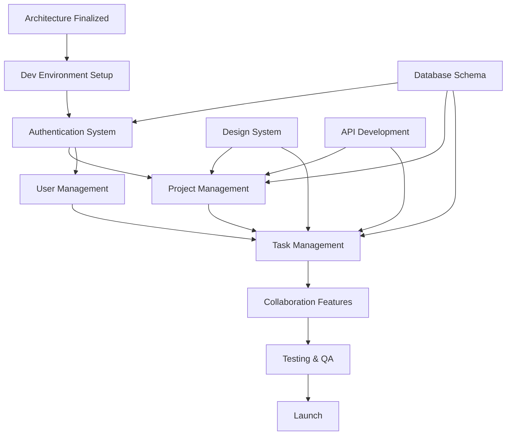

# Risk Mitigation & Contingency Planning

**Document**: #14 - Risk Mitigation  
**Version**: 1.0.0  
**Last Updated**: December 2024

---

## Overview

This document identifies potential risks, dependencies, and challenges for TaskFlow Pro development, along with mitigation strategies and contingency plans. Proactive risk management ensures project success and minimizes disruptions.

---

## Risk Categories

1. **Technical Risks**
2. **Product & Market Risks**
3. **Resource & Timeline Risks**
4. **Security & Compliance Risks**
5. **Third-Party & Dependency Risks**
6. **Operational Risks**

---

## Risk Assessment Framework

### Risk Severity Matrix

| Impact → | **Low** | **Medium** | **High** | **Critical** |
|----------|---------|------------|----------|--------------|
| **Very Likely** | Medium | High | Critical | Critical |
| **Likely** | Low | Medium | High | Critical |
| **Possible** | Low | Medium | Medium | High |
| **Unlikely** | Low | Low | Medium | Medium |
| **Rare** | Low | Low | Low | Medium |

### Risk Levels

- 🔴 **Critical**: Immediate action required, project blocker
- 🟠 **High**: Requires attention, may delay milestones
- 🟡 **Medium**: Monitor closely, plan mitigation
- 🟢 **Low**: Acknowledge, track periodically

---

## 1. Technical Risks

### 1.1 Technology Stack Maturity (Nuxt 4)

**Risk Level**: 🟠 High  
**Probability**: Likely  
**Impact**: Medium

**Description**:
Nuxt 4 is a relatively new framework. Potential issues include:
- Breaking changes during development
- Limited community resources
- Undiscovered bugs
- Third-party compatibility issues

**Mitigation Strategies**:
1. ✅ **Stay on stable releases** - Avoid RC/beta versions in production
2. ✅ **Lock dependencies** - Use exact versions, not caret (^) ranges
3. ✅ **Monitor Nuxt GitHub** - Track issues and breaking changes
4. ✅ **Build fallback skills** - Team comfortable with Vue 3 fundamentals
5. ✅ **Participate in community** - Report bugs, contribute to discussions

**Contingency Plan**:
- If critical blocking bug: Consider Nuxt 3 fallback
- Maintain abstraction layer to minimize Nuxt-specific code
- Budget extra 2 weeks for framework-related issues

**Owner**: Tech Lead  
**Review Frequency**: Weekly

---

### 1.2 Performance at Scale

**Risk Level**: 🟡 Medium  
**Probability**: Possible  
**Impact**: High

**Description**:
Application may not perform well with:
- Large kanban boards (500+ tasks)
- High concurrency (100+ users on same project)
- Real-time updates causing excessive re-renders
- Database query performance degradation

**Mitigation Strategies**:
1. ✅ **Performance budgets** - Set and enforce metrics (LCP < 2s, FID < 50ms)
2. ✅ **Load testing early** - Test with realistic data volumes
3. ✅ **Virtual scrolling** - Implement for large lists
4. ✅ **Optimistic updates** - Reduce perceived latency
5. ✅ **Database indexing** - Proper indexes on frequently queried fields
6. ✅ **Caching strategy** - Redis for session/query caching
7. ✅ **CDN usage** - Static assets via CDN

**Performance Testing Plan**:
```javascript
// k6 load test scenario
export default function() {
  // Simulate 100 concurrent users
  // Each creating/updating 10 tasks
  // Target: P95 < 500ms
}
```

**Contingency Plan**:
- Implement pagination if virtual scrolling insufficient
- Add database read replicas for scaling
- Consider GraphQL for efficient data fetching
- Budget: $5,000 for performance optimization tools

**Owner**: Senior Engineer  
**Review Frequency**: Sprint demos

---

### 1.3 Real-Time Synchronization Conflicts

**Risk Level**: 🟡 Medium  
**Probability**: Likely  
**Impact**: Medium

**Description**:
Multiple users editing same task simultaneously can cause:
- Data conflicts and overwrites
- Inconsistent state across clients
- Lost updates
- Poor user experience

**Mitigation Strategies**:
1. ✅ **Operational Transform (OT)** or **CRDT** for conflict resolution
2. ✅ **Optimistic locking** - Version numbers on entities
3. ✅ **WebSocket heartbeat** - Detect disconnections quickly
4. ✅ **Offline queue** - Store changes locally if connection lost
5. ✅ **Conflict UI** - Show when conflicts detected, let user resolve

**Implementation**:
```javascript
// Optimistic locking
const updateTask = async (taskId, updates, version) => {
  const result = await db.task.update({
    where: { id: taskId, version },
    data: { ...updates, version: version + 1 }
  })
  
  if (!result) {
    throw new ConflictError('Task was updated by another user')
  }
  
  return result
}
```

**Contingency Plan**:
- If OT too complex: Last-write-wins with conflict notification
- Manual merge UI for critical conflicts
- Audit log to track changes

**Owner**: Backend Lead  
**Review Frequency**: Bi-weekly

---

### 1.4 Mobile Responsiveness Challenges

**Risk Level**: 🟡 Medium  
**Probability**: Possible  
**Impact**: Medium

**Description**:
Complex UI (kanban board, charts) may not work well on mobile:
- Touch interactions difficult
- Limited screen real estate
- Performance on low-end devices

**Mitigation Strategies**:
1. ✅ **Mobile-first design** - Design for mobile, enhance for desktop
2. ✅ **Progressive enhancement** - Core features work everywhere
3. ✅ **Touch-friendly UI** - Minimum 44px touch targets
4. ✅ **Test on real devices** - Multiple iOS/Android devices
5. ✅ **Responsive testing** - BrowserStack for device testing

**Test Matrix**:
- iOS: iPhone 12, iPhone 14 Pro
- Android: Samsung Galaxy S21, Pixel 6
- Tablets: iPad Pro, Samsung Tab S7

**Contingency Plan**:
- Simplified mobile views if needed
- Native mobile app (Phase 2) if web insufficient
- Budget: $10,000 for mobile optimization

**Owner**: Frontend Lead  
**Review Frequency**: Sprint reviews

---

### 1.5 Browser Compatibility

**Risk Level**: 🟢 Low  
**Probability**: Unlikely  
**Impact**: Low

**Description**:
Modern features may not work in older browsers

**Mitigation Strategies**:
1. ✅ **Define browser support** - Chrome/Edge/Safari/Firefox (last 2 versions)
2. ✅ **Polyfills** - Include necessary polyfills
3. ✅ **Feature detection** - Graceful degradation for unsupported features
4. ✅ **Cross-browser testing** - Automated tests in CI/CD

**Supported Browsers**:
- Chrome 100+
- Firefox 100+
- Safari 15+
- Edge 100+

**Contingency Plan**:
- Show banner for unsupported browsers
- Minimum fallback: Read-only view for very old browsers

**Owner**: QA Lead  
**Review Frequency**: Monthly

---

## 2. Product & Market Risks

### 2.1 Insufficient Product-Market Fit

**Risk Level**: 🔴 Critical  
**Probability**: Possible  
**Impact**: Critical

**Description**:
Product may not solve real user problems, leading to:
- Low user adoption
- High churn rate
- Poor engagement
- Revenue targets missed

**Mitigation Strategies**:
1. ✅ **User research** - 20+ interviews before building
2. ✅ **MVP testing** - Beta with 50-100 early users
3. ✅ **Rapid iteration** - Weekly releases based on feedback
4. ✅ **Usage analytics** - Track every feature interaction
5. ✅ **PMF survey** - "How disappointed if product went away?" > 40%
6. ✅ **Competitor analysis** - Understand why users switch

**Validation Metrics** (Month 3):
- 40% activation rate
- 35% day-7 retention
- 20% day-30 retention
- NPS > 40

**Contingency Plan**:
- If PMF not achieved by Month 6:
  - Conduct extensive user interviews
  - Pivot core features if needed
  - Consider focusing on niche market
- Budget: 4 weeks for pivot if needed

**Owner**: Product Manager  
**Review Frequency**: Bi-weekly

---

### 2.2 Intense Market Competition

**Risk Level**: 🟠 High  
**Probability**: Very Likely  
**Impact**: High

**Description**:
Competing with established players (Asana, Monday, ClickUp):
- Hard to differentiate
- High customer acquisition costs
- Feature parity pressure
- Price competition

**Mitigation Strategies**:
1. ✅ **Differentiation** - Focus on superior UX, not feature parity
2. ✅ **Niche targeting** - Start with tech teams (Nuxt/Vue developers)
3. ✅ **Developer experience** - API-first, great integrations
4. ✅ **Pricing strategy** - Competitive but sustainable ($12/user vs $10-15 market)
5. ✅ **Content marketing** - SEO, tutorials, thought leadership

**Competitive Advantages**:
- Modern tech stack (Nuxt 4 + Vuetify 3)
- Best-in-class developer experience
- Open-source friendly
- Customizable and extensible

**Contingency Plan**:
- If can't compete broadly: Focus on developer teams exclusively
- Consider open-core model
- Partner with Vue.js ecosystem

**Owner**: Product Owner  
**Review Frequency**: Quarterly

---

### 2.3 Feature Creep

**Risk Level**: 🟡 Medium  
**Probability**: Likely  
**Impact**: Medium

**Description**:
Adding too many features can:
- Delay MVP launch
- Increase complexity
- Dilute core value proposition
- Overwhelm users

**Mitigation Strategies**:
1. ✅ **Strict prioritization** - P0 features only for MVP
2. ✅ **Feature freeze** - 2 weeks before launch
3. ✅ **Kill features** - Remove low-usage features
4. ✅ **Product council** - Review all feature requests
5. ✅ **User voting** - Let users prioritize features

**Decision Framework**:
```
Add feature if:
- Requested by >10% of users AND
- Aligns with core vision AND
- Can be built in <1 sprint AND
- Won't complicate existing features
```

**Contingency Plan**:
- Monthly feature audit
- Remove features with <5% usage
- "Feature parking lot" for future consideration

**Owner**: Product Manager  
**Review Frequency**: Sprint planning

---

## 3. Resource & Timeline Risks

### 3.1 Team Capacity & Skill Gaps

**Risk Level**: 🟠 High  
**Probability**: Possible  
**Impact**: High

**Description**:
- Team unfamiliar with Nuxt 4 + Vuetify 3
- Underestimated complexity
- Key team member unavailability
- Burnout from tight deadlines

**Mitigation Strategies**:
1. ✅ **Training budget** - 2 weeks for team upskilling
2. ✅ **Pair programming** - Knowledge sharing
3. ✅ **Documentation** - Comprehensive architecture docs
4. ✅ **Bus factor** - No single point of failure (2+ people per area)
5. ✅ **Realistic estimates** - Add 30% buffer to estimates
6. ✅ **Work-life balance** - No crunch time except emergencies

**Team Composition**:
- 1 Tech Lead (Nuxt expert)
- 3 Frontend Engineers
- 2 Backend Engineers
- 1 DevOps Engineer
- 1 QA Engineer
- 1 Product Manager
- 1 Designer

**Contingency Plan**:
- Budget for 1-2 contractors if needed
- Extend timeline by 4 weeks if necessary
- Reduce scope (cut P2 features)

**Owner**: Engineering Manager  
**Review Frequency**: Weekly 1:1s

---

### 3.2 Timeline Delays

**Risk Level**: 🟡 Medium  
**Probability**: Likely  
**Impact**: Medium

**Description**:
14-week timeline is aggressive. Delays can come from:
- Scope creep
- Technical challenges
- Integration issues
- Team availability

**Mitigation Strategies**:
1. ✅ **Agile sprints** - 2-week iterations with demos
2. ✅ **Buffer time** - 2 weeks built into Phase 5
3. ✅ **Daily standups** - Quick blocker identification
4. ✅ **Risk register** - Track and prioritize risks
5. ✅ **Early warning system** - Flag delays immediately

**Timeline Checkpoints**:
- Week 2: Authentication complete (checkpoint)
- Week 5: Core features complete (checkpoint)
- Week 8: Collaboration features complete (checkpoint)
- Week 11: Advanced features complete (checkpoint)

**Contingency Plan**:
- Move P2 features to post-launch
- Launch with reduced feature set
- Extend timeline by max 4 weeks
- Communicate delays early to stakeholders

**Owner**: Project Manager  
**Review Frequency**: Daily standups

---

### 3.3 Budget Overruns

**Risk Level**: 🟡 Medium  
**Probability**: Possible  
**Impact**: Medium

**Description**:
Development costs exceed budget due to:
- Extended timeline
- Additional resources needed
- Third-party service costs
- Infrastructure scaling

**Budget Estimate**:
- Team salaries: $200,000 (14 weeks)
- Tools & services: $5,000
- Infrastructure: $2,000
- Marketing: $10,000
- Contingency: $20,000
- **Total**: $237,000

**Mitigation Strategies**:
1. ✅ **Weekly burn rate tracking**
2. ✅ **Contingency buffer** (10%)
3. ✅ **Free tier services** - Start with free tiers
4. ✅ **Phased infrastructure** - Scale as needed

**Contingency Plan**:
- Reduce team size (contractors first)
- Use cheaper alternatives (AWS → DigitalOcean)
- Delay non-critical features

**Owner**: Finance/PM  
**Review Frequency**: Weekly

---

## 4. Security & Compliance Risks

### 4.1 Data Breach / Security Vulnerability

**Risk Level**: 🔴 Critical  
**Probability**: Possible  
**Impact**: Critical

**Description**:
Security incidents can cause:
- User data exposure
- Reputation damage
- Legal liability
- Service shutdown

**Attack Vectors**:
- SQL injection
- XSS (Cross-Site Scripting)
- CSRF attacks
- Authentication bypass
- API vulnerabilities
- Third-party package vulnerabilities

**Mitigation Strategies**:
1. ✅ **Security-first development**
   - Input validation on all endpoints
   - Parameterized queries (prevents SQL injection)
   - CSP headers (prevents XSS)
   - CSRF tokens
   
2. ✅ **Authentication & Authorization**
   - JWT with short expiry (15 min access, 7-day refresh)
   - Role-based access control (RBAC)
   - MFA for sensitive actions
   
3. ✅ **Dependency scanning**
   - Snyk or Dependabot for vulnerabilities
   - Weekly dependency updates
   - Lock file integrity
   
4. ✅ **Security testing**
   - OWASP Top 10 testing
   - Penetration testing (before launch)
   - Bug bounty program (post-launch)
   
5. ✅ **Monitoring & Logging**
   - Audit logs for all sensitive actions
   - Anomaly detection
   - Rate limiting on API endpoints

6. ✅ **Encryption**
   - TLS 1.3 for data in transit
   - AES-256 for data at rest
   - Encrypted backups

**Security Checklist**:
```
[ ] Code review for security issues
[ ] Dependency audit (npm audit)
[ ] OWASP ZAP scan
[ ] Penetration test
[ ] Security headers configured
[ ] Secrets in environment vars (not code)
[ ] Database encrypted
[ ] Backups encrypted
[ ] Incident response plan
```

**Contingency Plan** (Data Breach):
1. Immediate: Identify and patch vulnerability
2. Within 1 hour: Notify affected users
3. Within 24 hours: Public statement
4. Within 72 hours: Regulatory notification (GDPR)
5. Post-incident: Root cause analysis, prevention measures

**Owner**: Security Lead  
**Review Frequency**: Weekly security review

---

### 4.2 GDPR & Privacy Compliance

**Risk Level**: 🟠 High  
**Probability**: Very Likely  
**Impact**: Critical

**Description**:
Non-compliance with GDPR, CCPA can result in:
- Fines up to €20M or 4% of revenue
- Legal action
- Reputation damage

**Requirements**:
- User consent for data collection
- Right to access data (data export)
- Right to deletion (account deletion)
- Data minimization
- Privacy by design

**Mitigation Strategies**:
1. ✅ **Privacy policy** - Clear, comprehensive
2. ✅ **Cookie consent** - GDPR-compliant banner
3. ✅ **Data export** - Users can download their data
4. ✅ **Account deletion** - Complete data removal
5. ✅ **Data retention** - Auto-delete after inactivity
6. ✅ **DPA agreements** - With all data processors
7. ✅ **Privacy impact assessment**

**GDPR Features**:
```javascript
// Data export endpoint
GET /api/v1/users/me/export
Response: {
  user: {...},
  projects: [...],
  tasks: [...],
  comments: [...]
}

// Account deletion
DELETE /api/v1/users/me
- Anonymize user data
- Delete uploaded files
- Remove from teams
- Notify affected users
```

**Contingency Plan**:
- Legal counsel review before launch
- GDPR compliance consultant ($5,000 budget)
- Delay launch if needed for compliance

**Owner**: Legal/Compliance  
**Review Frequency**: Pre-launch audit

---

### 4.3 Service Availability & Downtime

**Risk Level**: 🟡 Medium  
**Probability**: Possible  
**Impact**: High

**Description**:
Service outages can cause:
- User frustration
- Lost revenue
- SLA breaches
- Reputation damage

**SLA Target**: 99.9% uptime (43.8 minutes/month downtime)

**Mitigation Strategies**:
1. ✅ **High availability architecture**
   - Multi-AZ deployment
   - Load balancer with health checks
   - Database replication
   - Auto-scaling
   
2. ✅ **Monitoring**
   - Uptime monitoring (Pingdom)
   - APM (DataDog)
   - Error tracking (Sentry)
   - Alerts with PagerDuty
   
3. ✅ **Disaster recovery**
   - Daily automated backups
   - Point-in-time recovery
   - Backup retention: 30 days
   - DR site (cold standby)
   
4. ✅ **Incident response**
   - On-call rotation
   - Runbooks for common issues
   - Status page (status.taskflowpro.com)
   - Incident postmortems

**Disaster Recovery Plan**:
```
RTO (Recovery Time Objective): 4 hours
RPO (Recovery Point Objective): 1 hour

Incident Severity:
- SEV1 (Critical): All users affected, <15 min response
- SEV2 (High): Partial outage, <1 hour response
- SEV3 (Medium): Degraded performance, <4 hour response
- SEV4 (Low): Minor issue, next business day
```

**Contingency Plan**:
- Failover to DR site if primary down >1 hour
- Communicate via status page and email
- Post-incident credit for affected users

**Owner**: DevOps Lead  
**Review Frequency**: Monthly DR drills

---

## 5. Third-Party & Dependency Risks

### 5.1 Third-Party Service Failures

**Risk Level**: 🟡 Medium  
**Probability**: Possible  
**Impact**: Medium

**Description**:
Dependencies on external services:
- SendGrid (email)
- AWS S3 (file storage)
- Stripe (payments)
- Sentry (monitoring)
- Auth0 or OAuth providers

**Failure Scenarios**:
- Service outage
- API changes/deprecation
- Pricing changes
- Service shutdown

**Mitigation Strategies**:
1. ✅ **Graceful degradation**
   - Email queue (retry later if SendGrid down)
   - Local file storage fallback
   - Feature flags to disable failing integrations
   
2. ✅ **Vendor diversification**
   - Multiple OAuth providers (Google, GitHub, Email)
   - Stripe + PayPal for payments
   - S3 + Backblaze for storage backup
   
3. ✅ **SLA monitoring**
   - Track third-party uptime
   - Alert on degraded performance
   
4. ✅ **Abstraction layer**
   - Don't couple to vendor APIs
   - Easy to swap providers

**Example Abstraction**:
```javascript
// services/email.ts
export interface EmailService {
  send(to, subject, body): Promise<void>
}

// Implementations
class SendGridEmail implements EmailService {...}
class MailgunEmail implements EmailService {...}
class LocalEmail implements EmailService {...}

// Usage
const emailService = createEmailService() // Based on config
await emailService.send(...)
```

**Contingency Plan**:
- Maintain list of alternative providers
- Budget for migration if needed
- Contract review for termination clauses

**Owner**: Tech Lead  
**Review Frequency**: Quarterly

---

### 5.2 npm Package Vulnerabilities

**Risk Level**: 🟡 Medium  
**Probability**: Likely  
**Impact**: Medium

**Description**:
- Vulnerable dependencies
- Malicious packages
- License issues
- Breaking changes

**Mitigation Strategies**:
1. ✅ **Dependency audit**
   - `npm audit` in CI/CD
   - Snyk integration
   - Dependabot alerts
   
2. ✅ **Minimize dependencies**
   - Avoid packages for simple utilities
   - Prefer well-maintained packages
   
3. ✅ **Lock file integrity**
   - Commit package-lock.json
   - Verify lockfile integrity
   
4. ✅ **Regular updates**
   - Weekly dependency updates
   - Security patches immediately
   
5. ✅ **License compliance**
   - Use license checker
   - Avoid GPL in proprietary code

**Dependency Policy**:
```
Before adding dependency, check:
- Weekly downloads > 10,000
- Last updated < 6 months ago
- GitHub stars > 1,000
- Open issues < 50
- License compatible (MIT, Apache 2.0)
```

**Contingency Plan**:
- Fork critical unmaintained packages
- Replace vulnerable packages ASAP
- Budget: 1 week/quarter for dependency maintenance

**Owner**: Senior Engineer  
**Review Frequency**: Weekly

---

## 6. Operational Risks

### 6.1 Insufficient Documentation

**Risk Level**: 🟡 Medium  
**Probability**: Likely  
**Impact**: Medium

**Description**:
Poor documentation leads to:
- Slow onboarding
- Knowledge silos
- Maintenance difficulties
- Bus factor issues

**Mitigation Strategies**:
1. ✅ **Documentation requirements**
   - JSDoc for all functions
   - README for each module
   - API documentation (OpenAPI)
   - Architecture decision records (ADR)
   
2. ✅ **Code review checklist**
   - Documentation updated?
   - Examples provided?
   - Tests documented?
   
3. ✅ **Documentation site**
   - User docs (guides, tutorials)
   - Developer docs (API, architecture)
   - Runbooks (operations)

**Documentation Structure**:
```
docs/
├── user-guide/
├── developer-guide/
│   ├── getting-started.md
│   ├── architecture/
│   ├── api/
│   └── testing/
├── operations/
│   ├── deployment.md
│   ├── monitoring.md
│   └── incident-response.md
└── ADRs/
```

**Contingency Plan**:
- Documentation sprint before launch
- Hire technical writer if needed
- Budget: $5,000 for documentation tools

**Owner**: Tech Lead  
**Review Frequency**: Sprint reviews

---

### 6.2 Inadequate Testing

**Risk Level**: 🟠 High  
**Probability**: Possible  
**Impact**: High

**Description**:
Bugs in production cause:
- User frustration
- Data corruption
- Security issues
- Rollbacks

**Testing Requirements**:
- Unit tests: >80% coverage
- Integration tests: All API endpoints
- E2E tests: Critical user flows
- Performance tests: Load scenarios

**Mitigation Strategies**:
1. ✅ **Test-driven development**
   - Write tests before code
   - Fail CI if tests fail
   
2. ✅ **Automated testing**
   - Vitest for unit tests
   - Playwright for E2E
   - k6 for load tests
   
3. ✅ **Quality gates**
   - No merge without tests
   - Code coverage enforced
   - E2E tests pass
   
4. ✅ **Manual QA**
   - QA engineer testing weekly
   - Beta testing with users
   - Dogfooding internally

**Test Strategy**:
```
Unit Tests (Vitest):
- All business logic
- Utilities and helpers
- Composables
- Stores

Integration Tests:
- API endpoints
- Database operations
- Third-party integrations

E2E Tests (Playwright):
- User registration/login
- Create project and tasks
- Kanban interactions
- Critical workflows
```

**Contingency Plan**:
- Testing week before launch
- Bug bash with whole team
- Delay launch if critical bugs found

**Owner**: QA Lead  
**Review Frequency**: Sprint reviews

---

### 6.3 Poor User Onboarding

**Risk Level**: 🟡 Medium  
**Probability**: Possible  
**Impact**: Medium

**Description**:
Users don't understand how to use product:
- Low activation rate
- High early churn
- Support burden

**Mitigation Strategies**:
1. ✅ **Onboarding flow**
   - Interactive tour
   - Sample project with tasks
   - Tooltips for key features
   
2. ✅ **Help center**
   - Video tutorials
   - Knowledge base
   - FAQs
   
3. ✅ **In-app guidance**
   - Contextual help
   - Empty states with CTAs
   - Progressive disclosure
   
4. ✅ **User testing**
   - Watch users complete onboarding
   - Identify friction points
   - Iterate rapidly

**Onboarding Checklist**:
```
[ ] Welcome email sent
[ ] Email verified
[ ] Profile completed
[ ] First project created
[ ] First task created
[ ] Team member invited
[ ] First task completed
→ User is activated ✅
```

**Success Metric**: 65% activation rate

**Contingency Plan**:
- Simplify onboarding if <40% activation
- Add live chat support
- Offer 1:1 onboarding calls

**Owner**: Product Manager  
**Review Frequency**: Weekly (first 3 months)

---

## 7. Risk Register

### Active Risks (Top 10)

| ID | Risk | Level | Probability | Impact | Owner | Status |
|----|------|-------|-------------|--------|-------|--------|
| TR-1 | Technology stack maturity | 🟠 High | Likely | Medium | Tech Lead | Monitoring |
| PR-1 | insufficient PMF | 🔴 Critical | Possible | Critical | PM | Active |
| PR-2 | Market competition | 🟠 High | Very Likely | High | Product Owner | Mitigating |
| RR-1 | Team skill gaps | 🟠 High | Possible | High | Eng Manager | Training |
| SR-1 | Security breach | 🔴 Critical | Possible | Critical | Security Lead | Testing |
| SR-2 | GDPR compliance | 🟠 High | Very Likely | Critical | Legal | Review |
| TP-1 | Third-party failures | 🟡 Medium | Possible | Medium | Tech Lead | Monitoring |
| OR-1 | Inadequate testing | 🟠 High | Possible | High | QA Lead | Active |
| TR-2 | Performance at scale | 🟡 Medium | Possible | High | Senior Eng | Testing |
| RR-2 | Timeline delays | 🟡 Medium | Likely | Medium | PM | Tracking |

---

## 8. Dependency Mapping

### Critical Path Dependencies



### External Dependencies

| Dependency | Type | Criticality | Fallback |
|------------|------|-------------|----------|
| Nuxt 4 | Framework | Critical | Nuxt 3 |
| Vuetify 3 | UI Library | Critical | Custom components |
| AWS S3 | File Storage | High | Local storage |
| SendGrid | Email | High | Mailgun |
| Stripe | Payments | Medium | Manual invoicing |
| Sentry | Monitoring | Medium | Custom logging |

---

## 9. Communication Plan

### Stakeholder Communication

**Weekly Status**:
- Risks identified
- Mitigation progress
- Blockers escalated
- Timeline impact

**Monthly Executive Report**:
- Risk dashboard
- Major changes
- Budget impact
- Timeline revisions

**Immediate Escalation Criteria**:
- Critical bug discovered
- Timeline delay >1 week
- Budget overrun >10%
- Security incident
- Key team member departure

---

## 10. Lessons Learned Process

### Post-Incident Reviews

After any incident:
1. Incident timeline documented
2. Root cause analysis (5 Whys)
3. Action items assigned
4. Follow-up meeting in 1 week
5. Update runbooks/docs

### Post-Launch Retrospective

Within 2 weeks of launch:
- What went well?
- What could be improved?
- What did we learn?
- Update risk mitigation strategies

---

## Related Documents

- [Technical Architecture](./10-technical-architecture.md)
- [Roadmap & Phasing](./12-roadmap-phasing.md)
- [Integration Requirements](./09-integration-requirements.md)
- [Success Metrics](./11-success-metrics-kpis.md)

---

**Next**: [Appendices](./15-appendices.md) →
