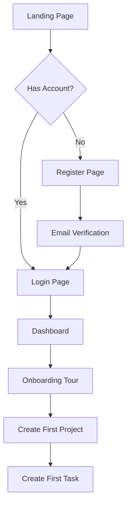
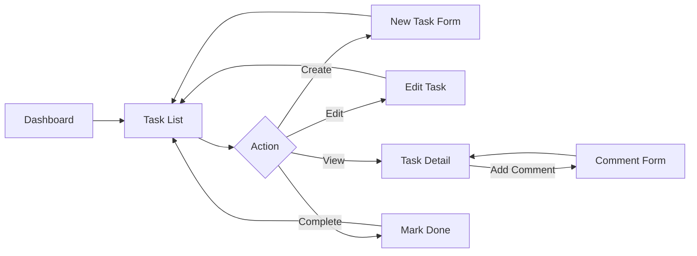
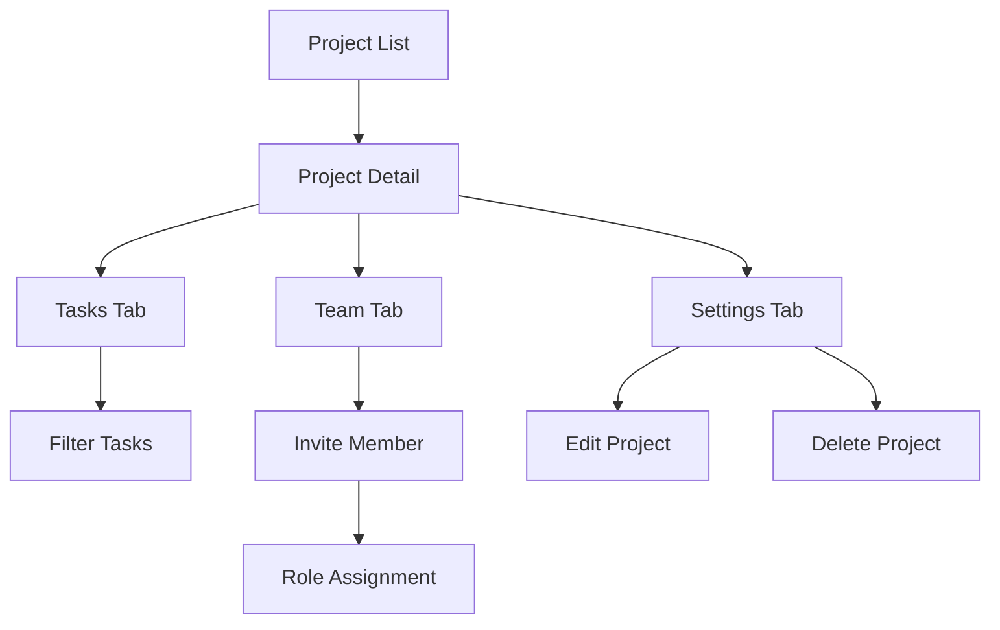

# TaskFlow Pro: Nuxt 3 + Vuetify 3 Reference Application

A comprehensive dummy application specification that demonstrates all architectural patterns and best practices from the Nuxt + Vuetify 3 blueprint.

---

## Application Purpose

**TaskFlow Pro** is a task and project management application designed as a **learning and reference tool** for developers implementing the Nuxt 3 + Vuetify 3 architecture. The application is deliberately structured to showcase every architectural pattern, from simple components to complex state management, while remaining realistic enough to serve as a practical implementation guide.

> [!IMPORTANT]
> This is an **architectural specification document** for reference application design—not production code. The goal is to demonstrate patterns, not to build a production-ready task manager.

---

## Key Concepts Demonstrated

| Blueprint Document | Demonstrated Features |
|---|---|
| **Project Structure** | Domain-driven organization, naming conventions |
| **Nuxt Configuration** | SPA/SSR/Hybrid modes, route rules |
| **Component Architecture** | Vuetify wrappers, common components, domain components |
| **Composables Patterns** | API composables, form composables, UI composables |
| **State Management** | Pinia stores with TypeScript, auth/user/app stores |
| **Routing & Navigation** | File-based routing, middleware, layouts, auth flow |
| **Vuetify Theming** | Theme customization, dark mode, SASS variables |
| **Form Validation** | VeeValidate + Yup/Zod integration |
| **i18n Architecture** | Multi-language support, Vuetify locale integration |
| **Testing Strategy** | Three-tier testing architecture |
| **E2E Testing** | Playwright with Page Object Model |
| **Code Quality** | ESLint, TypeScript strict mode |
| **Security & Performance** | CSP headers, lazy loading, caching |

---

## Feature Set

### 1. Authentication & Authorization

**Demonstrates:** Auth store, middleware, guest routes, role-based access

| Feature | Pattern Showcased |
|---------|-------------------|
| Login | Form validation, auth composable, guest middleware |
| Registration | Multi-step form, password strength validation |
| Forgot Password | API integration, toast notifications |
| Role-based Access | Admin middleware, permission checks |
| Token Management | JWT refresh, session persistence |

---

### 2. Dashboard & Analytics

**Demonstrates:** Protected routes, data visualization, responsive layouts

| Feature | Pattern Showcased |
|---------|-------------------|
| Summary Cards | Statistic components with loading states |
| Recent Activity | Real-time updates, infinite scroll |
| Quick Actions | Command palette-style navigation |
| User Widgets | Personalization, drag-and-drop |

---

### 3. Task Management (Core Domain)

**Demonstrates:** Full CRUD operations, composables, domain components

| Feature | Pattern Showcased |
|---------|-------------------|
| Task List | `VDataTable` wrapper, sorting, filtering, search |
| Task Detail | Dynamic routing `[id].vue`, data fetching |
| Create/Edit Task | Complex form with validation, tags, assignees |
| Task Categories | Select components, hierarchical data |
| Task Comments | Nested components, optimistic updates |
| Task Attachments | File upload, preview |
| Kanban Board | Drag-and-drop, status transitions |

---

### 4. Project Management

**Demonstrates:** Nested routes, complex state, parent-child relationships

| Feature | Pattern Showcased |
|---------|-------------------|
| Project List | Card grid, pagination |
| Project Detail | Nested layout, sub-navigation |
| Project Tasks | Filtered task list, scoped state |
| Team Members | User assignment, avatar components |
| Project Settings | Tabbed forms, danger zone actions |

---

### 5. User Profile & Settings

**Demonstrates:** User store, form handling, preference persistence

| Feature | Pattern Showcased |
|---------|-------------------|
| Profile View | User card, avatar upload |
| Edit Profile | Inline editing, validation |
| Account Settings | Password change, 2FA setup |
| Preferences | Theme toggle, language selector |
| Notification Settings | Toggle groups, subscription management |

---

### 6. Administration (Role-Based)

**Demonstrates:** Admin middleware, protected routes, bulk operations

| Feature | Pattern Showcased |
|---------|-------------------|
| User Management | Data table with actions, role assignment |
| System Settings | Config forms, feature flags |
| Audit Logs | Read-only data table, date filtering |

---

## User Workflows

### Workflow 1: First-Time User Onboarding



**Patterns Demonstrated:**
- Guest middleware on auth pages
- Multi-step registration form with VeeValidate
- Email verification flow
- App store for onboarding state
- User store initialization

---

### Workflow 2: Daily Task Management



**Patterns Demonstrated:**
- useTask composable for CRUD
- Optimistic UI updates
- Form composables
- Toast notifications
- Confirmation dialogs

---

### Workflow 3: Project Collaboration



**Patterns Demonstrated:**
- Nested layouts
- Tabbed navigation
- Multi-user state
- useConfirm composable
- Danger zone UI

---

## Data Models

### User

```typescript
interface User {
  id: string;
  email: string;
  firstName: string;
  lastName: string;
  avatar?: string;
  role: 'admin' | 'manager' | 'member' | 'guest';
  preferences: UserPreferences;
  createdAt: string;
  updatedAt: string;
}

interface UserPreferences {
  theme: 'light' | 'dark' | 'system';
  language: 'en' | 'es' | 'fr' | 'de';
  notifications: {
    email: boolean;
    push: boolean;
    inApp: boolean;
  };
  defaultView: 'list' | 'kanban' | 'calendar';
  itemsPerPage: number;
}
```

---

### Task

```typescript
interface Task {
  id: string;
  title: string;
  description: string;
  status: TaskStatus;
  priority: TaskPriority;
  dueDate?: string;
  projectId: string;
  assigneeId?: string;
  creatorId: string;
  tags: string[];
  attachments: Attachment[];
  comments: Comment[];
  createdAt: string;
  updatedAt: string;
}

type TaskStatus = 'todo' | 'in_progress' | 'review' | 'done';
type TaskPriority = 'low' | 'medium' | 'high' | 'urgent';

interface Comment {
  id: string;
  content: string;
  authorId: string;
  createdAt: string;
}

interface Attachment {
  id: string;
  name: string;
  url: string;
  type: string;
  size: number;
}
```

---

### Project

```typescript
interface Project {
  id: string;
  name: string;
  description?: string;
  color: string;
  icon: string;
  status: 'active' | 'archived' | 'completed';
  ownerId: string;
  members: ProjectMember[];
  settings: ProjectSettings;
  createdAt: string;
  updatedAt: string;
}

interface ProjectMember {
  userId: string;
  role: 'owner' | 'admin' | 'member' | 'viewer';
  joinedAt: string;
}

interface ProjectSettings {
  defaultTaskPriority: TaskPriority;
  allowGuestAccess: boolean;
  notifyOnTaskAssignment: boolean;
}
```

---

## Component Hierarchy

### Vuetify Wrapper Components

```
components/vuetify/
├── VTextField.vue          # Extended with app defaults
├── VSelect.vue             # Extended select with custom styling
├── VDataTable.vue          # Extended with pagination, search
├── VCard.vue               # Consistent card styling
├── VDialog.vue             # Dialog with title, actions, loading
├── VBtn.vue                # Button variants
└── VSnackbar.vue           # Toast wrapper
```

---

### Common Components

```
components/common/
├── AppButton.vue           # Primary button component
├── AppTextField.vue        # Validated text field
├── AppSelect.vue           # Validated select
├── AppTextarea.vue         # Validated textarea
├── AppDatePicker.vue       # Date picker with validation
├── AppModal.vue            # Reusable modal
├── AppConfirmDialog.vue    # Confirmation dialog
├── AppToast.vue            # Toast notification
├── AppPaginator.vue        # Pagination component
├── AppEmptyState.vue       # Empty state illustration
├── AppErrorBoundary.vue    # Error boundary
├── AppLoadingSkeleton.vue  # Loading skeleton
├── AppAvatar.vue           # User avatar
├── AppBadge.vue            # Status badge
├── AppDropdown.vue         # Dropdown menu
└── AppSearchInput.vue      # Search with debounce
```

---

### Layout Components

```
components/layout/
├── LayoutHeader.vue        # App bar with navigation
├── LayoutSidebar.vue       # Navigation drawer
├── LayoutFooter.vue        # Footer
├── LayoutBreadcrumb.vue    # Breadcrumb navigation
├── LayoutNavigation.vue    # Navigation menu
├── LayoutUserMenu.vue      # User dropdown
├── LayoutNotifications.vue # Notification dropdown
└── LayoutThemeToggle.vue   # Dark mode toggle
```

---

### Domain Components

```
components/task/
├── TaskCard.vue            # Task card in kanban
├── TaskList.vue            # Task data table
├── TaskListItem.vue        # Single task row
├── TaskDetail.vue          # Task detail view
├── TaskForm.vue            # Create/edit task form
├── TaskStatus.vue          # Status chip
├── TaskPriority.vue        # Priority indicator
├── TaskTags.vue            # Tag chips
├── TaskComments.vue        # Comments section
├── TaskCommentItem.vue     # Single comment
├── TaskAttachments.vue     # Attachments list
└── TaskKanbanBoard.vue     # Kanban view

components/project/
├── ProjectCard.vue         # Project card
├── ProjectList.vue         # Project grid/list
├── ProjectHeader.vue       # Project detail header
├── ProjectNavigation.vue   # Project tabs
├── ProjectSettings.vue     # Project settings form
├── ProjectMembers.vue      # Team member list
├── ProjectMemberItem.vue   # Single member
└── ProjectInviteDialog.vue # Invite modal

components/user/
├── UserAvatar.vue          # User avatar
├── UserCard.vue            # User info card
├── UserProfile.vue         # Profile component
├── UserSettings.vue        # Settings form
├── UserNotifications.vue   # Notification preferences
└── UserBadge.vue           # Role badge

components/admin/
├── AdminUserTable.vue      # User management table
├── AdminUserDialog.vue     # Edit user dialog
├── AdminSettingsForm.vue   # System settings
└── AdminAuditLog.vue       # Audit log table
```

---

## Store Structure

### Pinia Stores

```
stores/
├── auth.ts                 # Authentication state & actions
├── user.ts                 # Current user profile
├── app.ts                  # Application settings
├── notification.ts         # Toast notifications
├── task.ts                 # Task domain store
├── project.ts              # Project domain store
└── admin.ts                # Admin functionality
```

---

### Auth Store (`auth.ts`)

```typescript
// State
tokens: AuthTokens | null
isInitialized: boolean
loading: boolean
error: string | null

// Getters
isAuthenticated: computed
accessToken: computed
isTokenExpiringSoon: computed

// Actions
login(credentials)
register(data)
logout()
refreshTokens()
forgotPassword(email)
resetPassword(token, password)
initialize()
```

---

### User Store (`user.ts`)

```typescript
// State
currentUser: User | null
preferences: UserPreferences
loading: boolean
error: Error | null

// Getters
isAuthenticated: computed
isAdmin: computed
displayName: computed
userInitials: computed
avatarUrl: computed

// Actions
fetchUser()
updateProfile(updates)
updateAvatar(file)
updatePreferences(updates)
loadPreferences()
clearUser()
```

---

### Task Store (`task.ts`)

```typescript
// State
tasks: Task[]
currentTask: Task | null
filters: TaskFilters
loading: boolean
error: Error | null

// Getters
filteredTasks: computed
tasksByStatus: computed
overdueTasks: computed
myTasks: computed

// Actions
fetchTasks(params)
fetchTask(id)
createTask(input)
updateTask(id, updates)
deleteTask(id)
updateStatus(id, status)
assignTask(id, userId)
addComment(taskId, content)
```

---

### Project Store (`project.ts`)

```typescript
// State
projects: Project[]
currentProject: Project | null
loading: boolean
error: Error | null

// Getters
activeProjects: computed
archivedProjects: computed
myProjects: computed

// Actions
fetchProjects()
fetchProject(id)
createProject(input)
updateProject(id, updates)
deleteProject(id)
inviteMember(projectId, email, role)
removeMember(projectId, userId)
```

---

## Page Structure

```
pages/
├── index.vue                   # Landing page (/)
├── login.vue                   # Login page (/login)
├── register.vue                # Registration (/register)
├── forgot-password.vue         # Forgot password (/forgot-password)
├── reset-password.vue          # Reset password (/reset-password)
├── dashboard/
│   └── index.vue               # Dashboard home (/dashboard)
├── tasks/
│   ├── index.vue               # Task list (/tasks)
│   ├── kanban.vue              # Kanban view (/tasks/kanban)
│   ├── create.vue              # Create task (/tasks/create)
│   └── [id].vue                # Task detail (/tasks/:id)
├── projects/
│   ├── index.vue               # Project list (/projects)
│   ├── create.vue              # Create project (/projects/create)
│   └── [id]/
│       ├── index.vue           # Project overview (/projects/:id)
│       ├── tasks.vue           # Project tasks (/projects/:id/tasks)
│       ├── team.vue            # Team members (/projects/:id/team)
│       └── settings.vue        # Project settings (/projects/:id/settings)
├── settings/
│   ├── index.vue               # Settings home (/settings)
│   ├── profile.vue             # Profile settings (/settings/profile)
│   ├── notifications.vue       # Notification prefs (/settings/notifications)
│   └── security.vue            # Security settings (/settings/security)
├── admin/
│   ├── index.vue               # Admin dashboard (/admin)
│   ├── users.vue               # User management (/admin/users)
│   └── settings.vue            # System settings (/admin/settings)
└── [...slug].vue               # 404 catch-all
```

---

## Layouts

```
layouts/
├── default.vue                 # Public pages layout
├── auth.vue                    # Login/register layout
├── dashboard.vue               # Authenticated pages layout
├── admin.vue                   # Admin pages layout
└── blank.vue                   # Minimal layout
```

---

## Middleware

```
middleware/
├── auth.ts                     # Require authentication
├── guest.ts                    # Guest-only (redirect if logged in)
├── admin.ts                    # Require admin role
├── role.ts                     # Role-based access control
├── project-access.ts           # Project member check
└── setup.global.ts             # Initialize auth on app load
```

---

## Composables

```
composables/
├── api/
│   ├── useApi.ts               # Base API client
│   ├── useFetch.ts             # Data fetching wrapper
│   └── useInfiniteScroll.ts    # Infinite pagination
├── auth/
│   ├── useAuth.ts              # Authentication logic
│   └── usePermissions.ts       # Permission checking
├── ui/
│   ├── useToast.ts             # Toast notifications
│   ├── useConfirm.ts           # Confirmation dialogs
│   ├── useDrawer.ts            # Drawer state
│   └── useTheme.ts             # Theme management
├── form/
│   ├── useForm.ts              # Form state management
│   ├── useValidation.ts        # VeeValidate wrapper
│   └── useFormField.ts         # Field-level validation
├── utils/
│   ├── useDebounce.ts          # Debounce
│   ├── useLocalStorage.ts      # LocalStorage wrapper
│   └── useClipboard.ts         # Clipboard
├── task/
│   └── useTask.ts              # Task operations
├── project/
│   └── useProject.ts           # Project operations
└── user/
    └── useUser.ts              # User operations
```

---

## Plugin Configuration

```
plugins/
├── vuetify.ts                  # Vuetify initialization
├── api.ts                      # API client setup
├── auth.client.ts              # Client-side auth initialization
├── vee-validate.ts             # VeeValidate rules
├── i18n.ts                     # i18n setup
└── error-handler.ts            # Global error handling
```

---

## API Routes (Mock Server)

```
server/api/
├── auth/
│   ├── login.post.ts
│   ├── register.post.ts
│   ├── logout.post.ts
│   ├── me.get.ts
│   └── refresh.post.ts
├── users/
│   ├── index.get.ts            # List users
│   ├── [id].get.ts             # Get user
│   ├── [id].patch.ts           # Update user
│   └── me/
│       ├── profile.patch.ts
│       └── avatar.post.ts
├── tasks/
│   ├── index.get.ts            # List tasks
│   ├── index.post.ts           # Create task
│   ├── [id].get.ts             # Get task
│   ├── [id].patch.ts           # Update task
│   ├── [id].delete.ts          # Delete task
│   └── [id]/comments.post.ts   # Add comment
├── projects/
│   ├── index.get.ts
│   ├── index.post.ts
│   ├── [id].get.ts
│   ├── [id].patch.ts
│   ├── [id].delete.ts
│   └── [id]/
│       ├── tasks.get.ts
│       ├── members.get.ts
│       ├── members.post.ts
│       └── members/[userId].delete.ts
└── health.get.ts               # Health check
```

---

## Internationalization

### Supported Locales

| Code | Language | ISO | Direction |
|------|----------|-----|-----------|
| en | English | en-US | LTR |
| es | Español | es-ES | LTR |
| fr | Français | fr-FR | LTR |
| de | Deutsch | de-DE | LTR |

### Locale File Structure

```
locales/
├── en.json
├── es.json
├── fr.json
└── de.json
```

---

## Technical Patterns Summary

- **Architecture**: Domain-driven organization with Nuxt 3 Composition API
- **UI Framework**: Vuetify 3 with custom wrapper patterns for scalability
- **State**: Pinia for global state with TypeScript interfaces
- **Validation**: VeeValidate + Yup for robust form handling
- **Routing**: File-based routing with robust middleware protection
- **Testing**: 3-tier strategy with Vitest and Playwright
- **Standards**: Strict TypeScript, ESLint config, naming conventions
